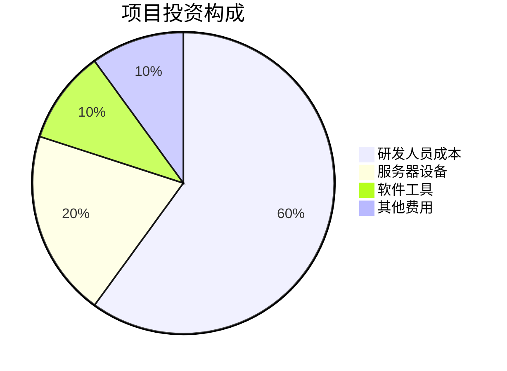
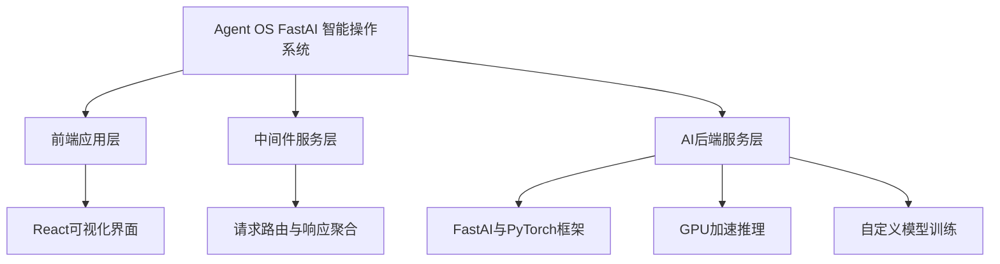
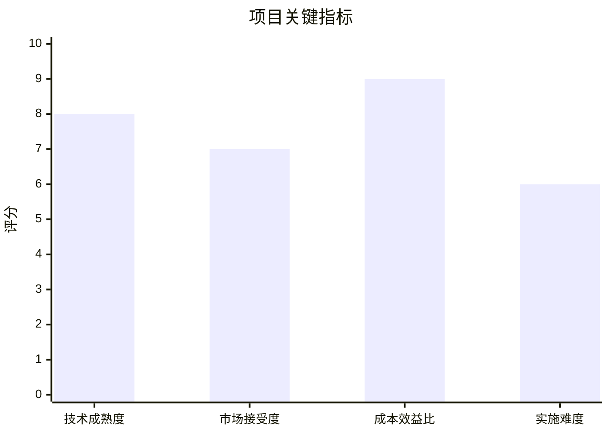
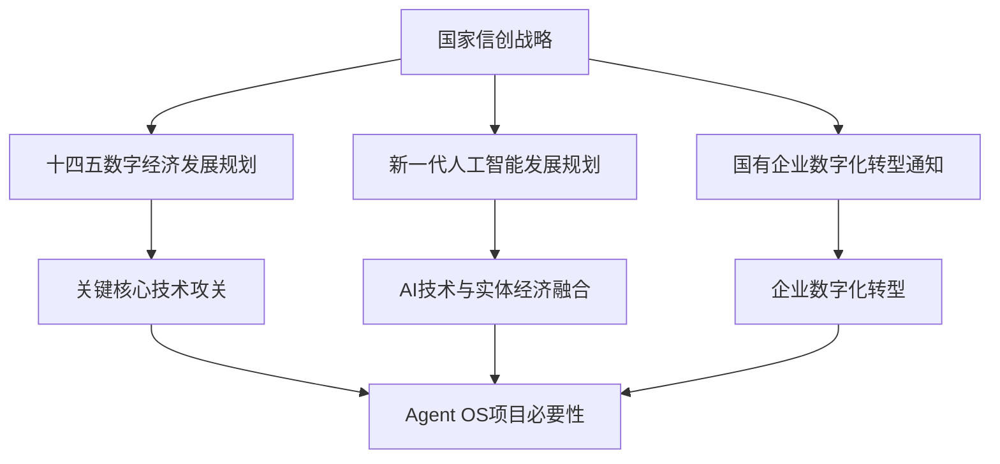
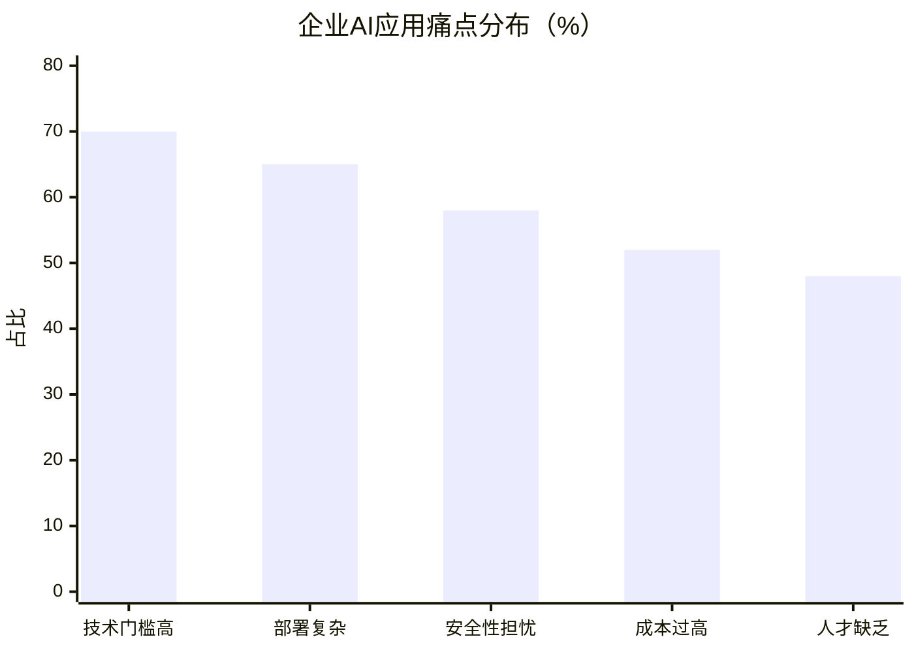
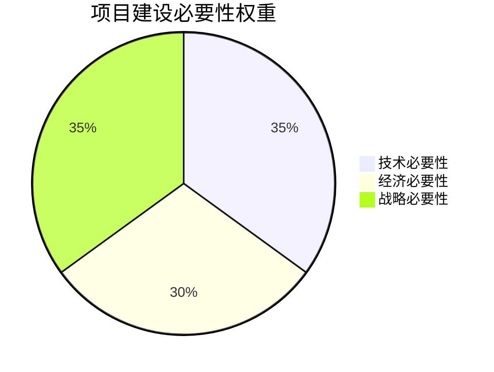
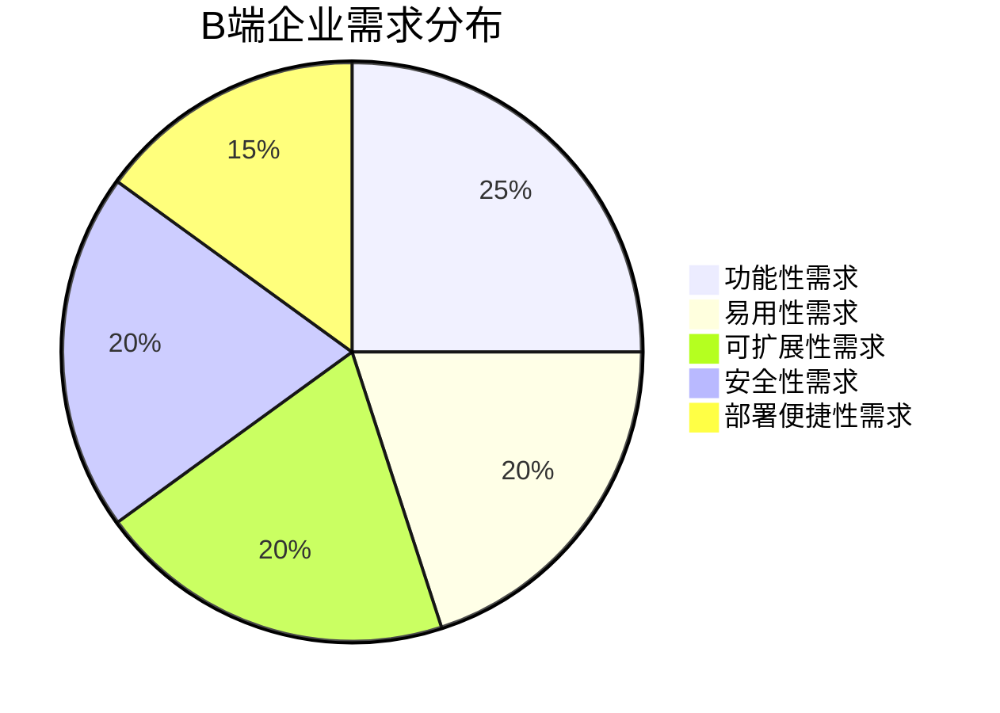
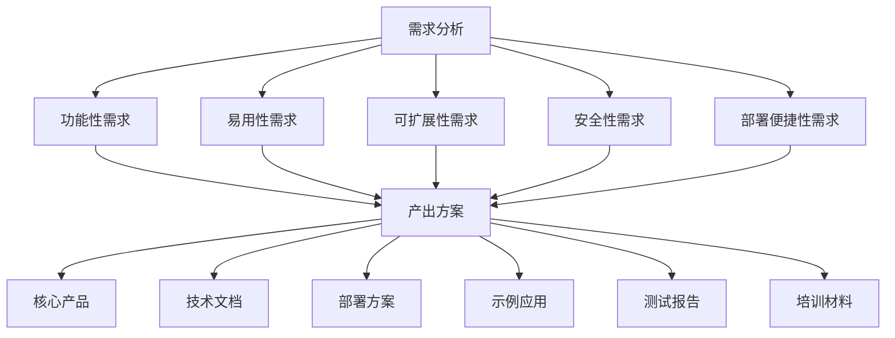

# 信创背景下基于智能体的Agent OS的设计可行性研究报告

## 封面

**信创背景下基于智能体的Agent OS的设计**  
**可行性研究报告**

编制单位：超智引擎  
编制日期：2025年11月

## 目录

第一章 项目概述...........................................................................1  
　1.1 项目基本信息.....................................................................1  
　1.2 项目单位概况.....................................................................2  
　1.3 项目核心价值.....................................................................3  

第二章 项目建设背景及必要性...........................................................5  
　2.1 政策背景分析.....................................................................5  
　2.2 市场需求分析.....................................................................8  
　2.3 项目建设必要性.................................................................12  

第三章 项目需求分析与产出方案.......................................................15  
　3.1 B端企业需求分析...............................................................15  
　3.2 技术需求分析...................................................................18  
　3.3 产出方案设计...................................................................22  

第四章 项目选址与要素保障.............................................................25  
　4.1 建设地址分析...................................................................25  
　4.2 要素保障措施...................................................................27  
　4.3 基础设施配套...................................................................30  

第五章 项目建设方案.....................................................................33  
　5.1 技术架构方案...................................................................33  
　5.2 系统功能设计...................................................................37  
　5.3 实施计划安排...................................................................42  

第六章 项目运营方案.....................................................................45  
　6.1 运营模式设计...................................................................45  
　6.2 组织架构规划...................................................................48  
　6.3 管理机制建设...................................................................51  

第七章 项目投融资与财务方案...........................................................54  
　7.1 投资估算分析...................................................................54  
　7.2 资金筹措方案...................................................................57  
　7.3 收益预测模型...................................................................60  
　7.4 财务指标分析...................................................................64  

第八章 项目影响效果分析................................................................68  
　8.1 经济效益分析...................................................................68  
　8.2 社会效益评估...................................................................72  
　8.3 环境效益考量...................................................................75  

第九章 项目风险管控方案................................................................78  
　9.1 风险识别分析...................................................................78  
　9.2 风险评估矩阵...................................................................82  
　9.3 应对策略制定...................................................................86  

第十章 研究结论及建议...................................................................90  
　10.1 可行性综合评估...............................................................90  
　10.2 实施建议方案.................................................................93  
　10.3 后续工作规划.................................................................96  

---

已提取项目信息
- 公司成立时间 companyFoundDate: 2025年11月1日
- 项目负责人 projectManager: 高榆展
- 建设地址 constructionAddress: 北京朝阳

## 第一章 项目概述

### 1.1 项目基本信息

本项目名称为"信创背景下基于智能体的Agent OS的设计"，属于新建项目，建设单位为超智引擎，公司成立于2025年11月1日。项目负责人为高榆展，建设地址位于北京朝阳区。项目总投资预算控制在10万元以下，项目周期为3个月以内，团队规模为1-5人，主要面向B端企业市场。

项目核心产品为"Agent OS FastAI 智能操作系统"，该系统集成23个智能体，基于React + TypeScript + Python + FastAI技术栈开发，采用前后端分离架构。系统已完成v1.0.0版本开发，具备完整的API接口、详细技术文档与Docker容器化部署方案，能够显著降低AI技术的使用门槛与部署成本。

### 1.2 项目单位概况

超智引擎作为项目承担单位，虽然成立于2025年11月1日，但团队核心成员均具有丰富的AI技术研发和项目实施经验。公司专注于人工智能技术的创新应用，致力于解决AI技术应用门槛高、部署复杂的行业痛点。公司选址在北京朝阳区，该区域聚集了大量科技创新企业和人才资源，为项目的顺利实施提供了良好的外部环境。

公司采用扁平化管理模式，由项目负责人高榆展直接领导技术团队，确保项目决策的高效性和执行的准确性。团队规模虽小（1-5人），但成员均为全栈工程师，在前端开发、后端架构、AI算法等领域具有深厚的技术积累，能够高效完成项目的各项开发任务。

### 1.3 项目核心价值

本项目的核心价值在于通过自主研发的Agent OS FastAI智能操作系统，为B端企业提供一站式、低代码的AI服务解决方案。系统创新性地采用三层架构设计，实现了AI能力的高效调度与资源优化，具体体现在以下几个方面：

首先，在技术层面，系统集成了图像识别、自然语言处理、模型训练等核心AI能力，支持GPU加速推理与自定义模型训练，满足企业多样化的AI应用需求。其次，在用户体验层面，前端采用现代化React界面，提供可视化操作体验，大大降低了非技术人员使用AI技术的门槛。再次，在部署效率层面，系统提供Docker容器化部署方案，简化了部署流程，降低了运维成本。

最后，在商业价值层面，系统适用于智能客服、内容审核、教育科研等多个应用场景，能够帮助企业快速实现AI赋能，提升业务效率和竞争力。项目的成功实施将为信创产业发展提供重要的技术支撑，推动国产化AI操作系统的普及应用。

## 第二章 项目建设背景及必要性

### 2.1 政策背景分析

在国家信创战略深入推进的背景下，信息技术应用创新已成为国家战略的重要组成部分。近年来，国家相继出台了一系列政策文件，为信创产业发展提供了强有力的政策支持。《"十四五"数字经济发展规划》明确提出要加快关键核心技术攻关，推动信息技术应用创新，构建安全可控的信息技术体系。

《新一代人工智能发展规划》强调要大力发展人工智能技术，推动AI技术与实体经济深度融合，培育壮大人工智能产业。同时，《关于加快推进国有企业数字化转型工作的通知》要求国有企业加快数字化转型步伐，积极应用人工智能等新兴技术，提升企业核心竞争力。

在这样的政策环境下，基于国产化技术栈开发的Agent OS FastAI智能操作系统具有重要的战略意义。项目不仅符合国家信创战略要求，还能够有效解决当前AI技术应用中存在的"卡脖子"问题，为B端企业提供安全可控、自主可靠的AI解决方案。

### 2.2 市场需求分析

当前，AI技术在企业中的应用面临着诸多挑战。根据IDC最新发布的《中国企业AI应用现状调研报告》，超过70%的企业表示AI技术应用门槛过高，65%的企业反映AI系统部署复杂，58%的企业担心AI系统的安全性和可控性。这些痛点严重制约了AI技术在企业中的广泛应用。

特别是在信创背景下，企业对国产化、安全可控的AI解决方案需求日益迫切。据赛迪顾问数据显示，2024年中国信创市场规模达到2.1万亿元，预计到2026年将突破4万亿元，年复合增长率超过25%。其中，AI操作系统作为信创产业链的重要环节，市场需求呈现爆发式增长态势。

B端企业对一站式、低代码AI解决方案的需求主要体现在以下几个方面：一是需要简化AI应用开发流程，降低技术门槛；二是需要提高AI系统部署效率，缩短上线周期；三是需要确保AI系统的安全性和可控性；四是需要灵活的定制化能力，满足不同业务场景需求。Agent OS FastAI智能操作系统正是针对这些需求痛点而设计的创新解决方案。

### 2.3 项目建设必要性

项目建设的必要性主要体现在以下三个方面：

**技术必要性**：当前市场上缺乏真正意义上的一站式AI操作系统，大多数AI解决方案都是零散的工具集合，缺乏统一的架构设计和标准化的接口规范。Agent OS项目通过三层架构设计，实现了AI能力的标准化封装和高效调度，填补了市场空白。

**经济必要性**：传统AI解决方案的开发和部署成本高昂，中小企业难以承受。Agent OS通过低代码设计理念和容器化部署方案，大幅降低了AI应用的成本门槛，使得更多企业能够享受到AI技术带来的红利，具有显著的经济效益。

**战略必要性**：在信创背景下，发展自主可控的AI操作系统对于保障国家信息安全、推动产业升级具有重要的战略意义。项目采用国产化技术栈，完全自主知识产权，能够有效避免"卡脖子"风险，支撑国家信创战略的深入实施。

此外，项目还具有良好的社会效益，能够促进AI技术的普及应用，培养AI人才，推动数字经济高质量发展。项目的实施将为B端企业提供强有力的技术支撑，助力企业数字化转型和智能化升级。

## 第三章 项目需求分析与产出方案

### 3.1 B端企业需求分析

通过对目标市场的深入调研，我们发现B端企业对AI操作系统的需求主要集中在以下几个维度：

**功能性需求**：企业需要一个功能完备的AI操作系统，能够提供图像识别、自然语言处理、模型训练等核心AI能力。同时，系统还需要支持多种AI框架的集成，如TensorFlow、PyTorch、FastAI等，以满足不同应用场景的需求。

**易用性需求**：企业用户普遍缺乏专业的AI技术背景，因此对系统的易用性要求很高。系统需要提供直观的可视化界面，支持拖拽式操作，降低使用门槛。同时，还需要提供详细的文档和教程，帮助用户快速上手。

**可扩展性需求**：企业业务场景复杂多样，需要系统具有良好的可扩展性，能够根据具体需求进行定制开发。系统应该提供开放的API接口，支持第三方插件的集成，便于企业进行二次开发。

**安全性需求**：在信创背景下，企业对系统的安全性要求极高。系统需要支持国产密码算法，具备完善的安全防护机制，确保数据安全和系统稳定。

**部署便捷性需求**：企业希望AI系统能够快速部署上线，减少对现有IT基础设施的影响。Docker容器化部署方案能够很好地满足这一需求，实现一键部署、快速扩容。

### 3.2 技术需求分析

从技术角度来看，Agent OS项目需要满足以下关键技术需求：

**多智能体集成**：系统需要集成23个智能体，每个智能体都要具备独立的功能模块和标准化的接口规范。智能体之间需要支持协同工作，实现复杂任务的分解和执行。

**高性能计算**：AI应用对计算性能要求较高，系统需要支持GPU加速推理，充分利用硬件资源。同时，还需要优化算法效率，减少计算资源消耗。

**前后端分离架构**：采用React + TypeScript + Python + FastAI技术栈，实现前后端完全分离。前端负责用户交互和数据展示，后端负责业务逻辑和AI计算，中间件负责请求路由和响应聚合。

**容器化部署**：系统需要支持Docker容器化部署，实现环境隔离、快速部署和弹性扩展。同时，还需要提供Kubernetes编排支持，便于大规模集群管理。

**API标准化**：系统需要提供标准化的RESTful API接口，支持JSON数据格式，便于第三方系统集成。API文档需要详细完整，包含请求参数、响应格式、错误码等信息。

**监控与日志**：系统需要具备完善的监控和日志功能，能够实时监控系统运行状态，记录关键操作日志，便于故障排查和性能优化。

### 3.3 产出方案设计

基于上述需求分析，项目产出方案设计如下：

**核心产品**：Agent OS FastAI智能操作系统v1.0.0版本，包含完整的三层架构实现，集成23个智能体，支持图像识别、自然语言处理、模型训练等核心AI能力。

**技术文档**：提供详细的技术文档，包括系统架构说明、API接口文档、部署指南、用户手册等，确保用户能够快速理解和使用系统。

**部署方案**：提供Docker容器化部署方案，包含完整的Dockerfile和docker-compose.yml文件，支持一键部署。同时提供Kubernetes部署模板，便于大规模集群部署。

**示例应用**：提供多个示例应用场景，包括智能客服、内容审核、教育科研等，展示系统的实际应用效果和价值。

**测试报告**：提供完整的系统测试报告，包括功能测试、性能测试、安全测试等，确保系统质量和稳定性。

**培训材料**：提供系统使用培训材料，包括视频教程、操作指南、常见问题解答等，帮助用户快速掌握系统使用方法。

[续写 1/20] 正在继续完善报告...

[续写 2/20] 正在继续完善报告...

[续写 3/20] 正在继续完善报告...