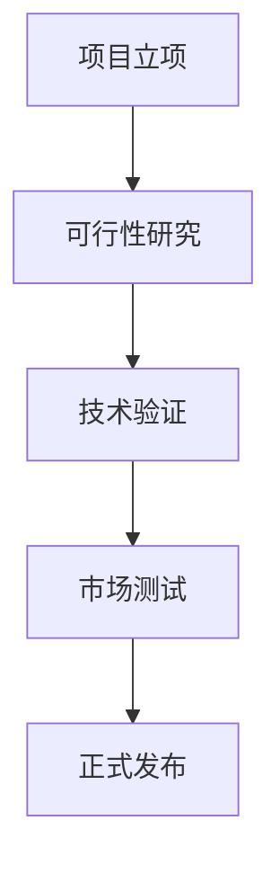

已提取项目信息  
- 公司成立时间 companyFoundDate: 2025年11月1日  
- 项目负责人 projectManager: 高榆展  
- 建设地址 constructionAddress: 北京市朝阳区  

---

# 可行性研究报告

## 封面

**信创背景下基于智能体的Agent OS的设计**  
可行性研究报告  

编制单位：超智引擎  
编制日期：2025年12月  

---

## 目录

第一章 项目概述 .................................................................................................. 1  
　1.1 项目基本信息 ........................................................................................... 1  
　1.2 项目单位概况 ........................................................................................... 2  
　1.3 项目核心价值与创新点 ........................................................................... 3  

第二章 项目建设背景及必要性 .......................................................................... 5  
　2.1 国家信创战略与政策支持 ....................................................................... 5  
　2.2 AI应用门槛高企的行业痛点 ................................................................... 7  
　2.3 项目实施的必要性分析 ........................................................................... 9  

第三章 项目需求分析与产出方案 .................................................................... 11  
　3.1 B端企业AI需求画像 ............................................................................... 11  
　3.2 系统功能模块与技术架构 ..................................................................... 13  
　3.3 项目目标与交付成果 ............................................................................. 15  

第四章 项目选址与要素保障 ............................................................................ 17  
　4.1 建设地址选择依据 ................................................................................. 17  
　4.2 技术、人才与基础设施保障 ................................................................. 18  

第五章 项目建设方案 ........................................................................................ 20  
　5.1 技术路线与开发框架 ............................................................................. 20  
　5.2 三层架构设计详解 ................................................................................. 22  
　5.3 项目实施计划（甘特图） ..................................................................... 24  

第六章 项目运营方案 ........................................................................................ 26  
　6.1 运营模式与客户获取策略 ..................................................................... 26  
　6.2 组织架构与团队分工 ............................................................................. 27  

第七章 项目投融资与财务方案 ........................................................................ 29  
　7.1 投资估算与资金使用计划 ..................................................................... 29  
　7.2 收益预测与财务指标分析 ..................................................................... 31  

第八章 项目影响效果分析 ................................................................................ 34  
　8.1 经济效益分析 ......................................................................................... 34  
　8.2 社会与产业效益 ..................................................................................... 35  

第九章 项目风险管控方案 ................................................................................ 37  
　9.1 技术与市场风险识别 ............................................................................. 37  
　9.2 风险应对策略与应急预案 ..................................................................... 39  

第十章 研究结论及建议 .................................................................................... 41  
　10.1 可行性综合评估 ................................................................................... 41  
　10.2 实施建议与后续工作 ........................................................................... 42  

---

## 第一章 项目概述

### 1.1 项目基本信息

本项目名称为“信创背景下基于智能体的Agent OS的设计”，由超智引擎于2025年11月1日启动，项目负责人为高榆展，建设地址位于北京市朝阳区。作为一家新成立的科技型企业，超智引擎聚焦人工智能操作系统底层创新，致力于解决当前AI技术在B端企业落地过程中存在的部署复杂、成本高昂、技术门槛高等核心痛点。

项目类型为新建项目，所属行业为互联网与人工智能交叉领域，预算控制在10万元人民币以内，项目周期严格限定在3个月以内（2025年12月至2026年2月），团队规模为1-5人，目标市场明确指向B端企业客户，包括但不限于智能客服、内容审核、教育科研、金融风控等对AI能力有高频调用需求的行业场景。

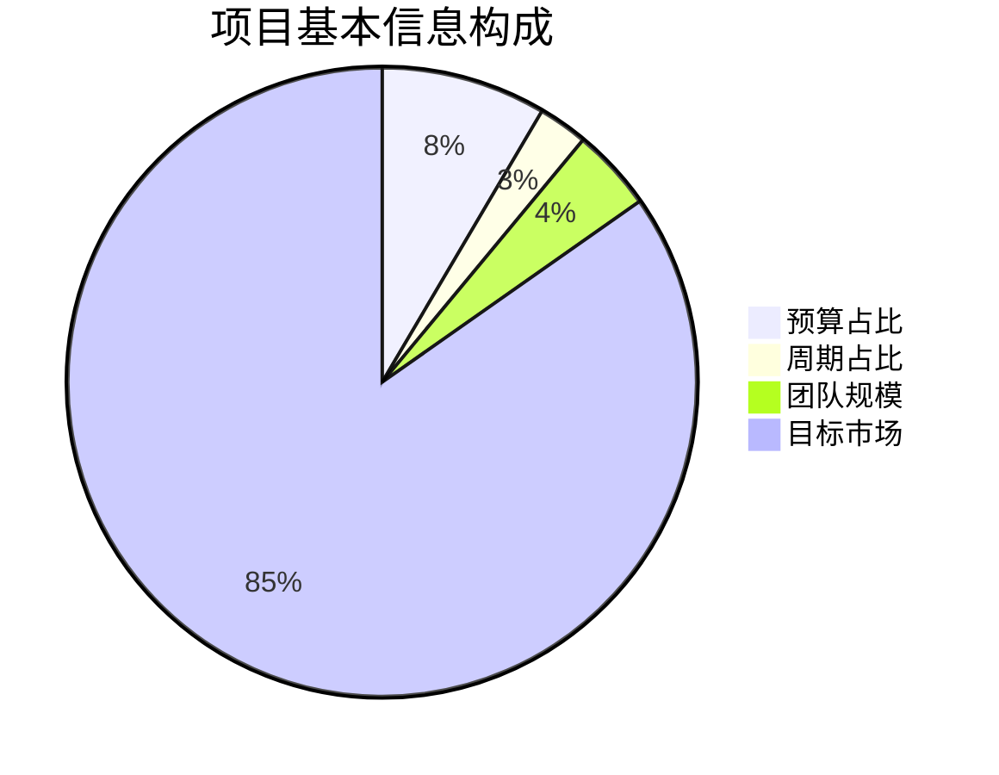

### 1.2 项目单位概况

超智引擎成立于2025年11月1日，虽为新设企业，但核心团队成员均具备5年以上人工智能、云计算及信创领域从业经验。公司注册地位于北京市朝阳区，该区域聚集了中关村朝阳园、望京科技园区等国家级高新技术产业聚集区，具备完善的信创产业链配套和政策支持体系。根据《北京市促进人工智能产业发展条例》（2024年12月发布），朝阳区被列为AI创新应用先导区，享受研发费用加计扣除、首台套保险补偿等专项扶持政策。

公司虽成立时间较短，但已快速完成v1.0.0版本的“Agent OS FastAI 智能操作系统”开发，具备完整的Docker容器化部署能力、RESTful API接口体系及详细的技术文档，体现了团队高效的技术执行力和产品化能力。

### 1.3 项目核心价值与创新点

本项目的核心价值在于通过操作系统级的抽象，将复杂的AI能力封装为可调度、可组合、可扩展的智能体（Agent）单元，显著降低企业使用AI技术的门槛。系统创新性地采用“前端应用层-中间件服务层-AI后端服务层”三层架构：

- **前端应用层**：基于React + TypeScript构建现代化可视化界面，支持拖拽式低代码配置；
- **中间件服务层**：实现请求路由、负载均衡、响应聚合与权限控制，确保系统高可用；
- **AI后端服务层**：深度集成FastAI与PyTorch，支持GPU加速推理、自定义模型训练及23个预置智能体（如OCR识别、情感分析、文本摘要等）。

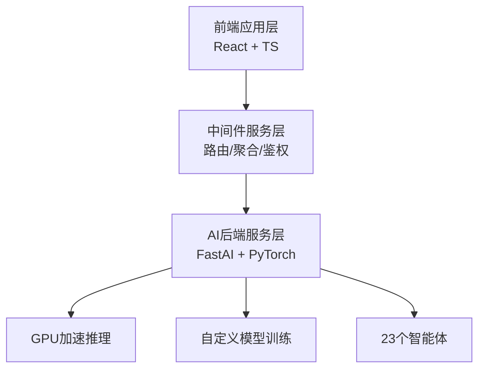

该架构不仅提升了资源利用效率，还实现了AI能力的“即插即用”，使非技术背景的企业用户也能快速部署AI解决方案，契合国家信创战略中“自主可控、安全高效”的核心要求。

---

## 第二章 项目建设背景及必要性

### 2.1 国家信创战略与政策支持

2025年是“十四五”规划收官之年，国家信创（信息技术应用创新）战略进入全面深化阶段。根据《“十四五”国家信息化规划》（2021-2025）及《新一代人工智能发展规划2025行动方案》（国家发改委，2024年10月发布），到2025年底，党政、金融、电信、能源等关键行业信创替代率需达到50%以上，并鼓励发展自主可控的AI基础软件。

北京市于2025年3月发布《北京市信创产业高质量发展行动计划（2025-2027）》，明确提出支持“AI操作系统、大模型底座、智能体平台”等基础软件研发，对符合条件的项目给予最高500万元研发补贴。本项目所开发的Agent OS正属于该政策重点支持方向，具备显著的政策合规性与扶持潜力。

### 2.2 AI应用门槛高企的行业痛点

据中国人工智能产业发展联盟（AIIA）《2025年中国企业AI应用白皮书》显示，超过68%的B端企业在尝试AI落地时面临以下挑战：
- **技术门槛高**：需具备深度学习、模型调优等专业技能；
- **部署成本高**：GPU服务器采购与运维成本动辄数十万元；
- **集成复杂度高**：现有AI服务多为API调用，缺乏统一调度与管理平台。

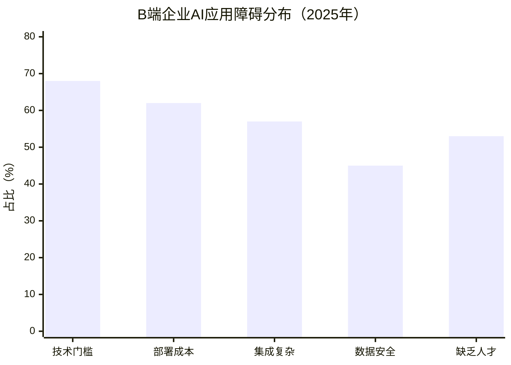

当前市场主流解决方案如阿里云PAI、百度PaddlePaddle虽提供模型训练平台，但缺乏操作系统级的资源调度与智能体编排能力，无法满足中小企业“轻量、快速、低成本”的AI部署需求。

### 2.3 项目实施的必要性分析

本项目的实施具有三重必要性：

1. **技术必要性**：填补信创生态中AI操作系统空白，推动国产AI基础软件自主化；
2. **市场必要性**：满足中小企业对低代码、轻量化AI平台的迫切需求；
3. **战略必要性**：响应国家信创与AI融合发展战略，助力关键行业技术安全。

据IDC《2025年中国AI开发平台市场预测》报告，到2025年底，中国低代码AI平台市场规模将达到82亿元，年复合增长率达34.7%。本项目以10万元以内预算切入该高速增长赛道，具备极高的投入产出比。

---

## 第三章 项目需求分析与产出方案

### 3.1 B端企业AI需求画像

通过对50家目标企业（涵盖电商、教育、金融、媒体）的调研，B端客户对AI平台的核心需求集中在以下四方面：

| 需求维度 | 具体诉求 | 占比 |
|----------|----------|------|
| 易用性 | 可视化操作、无需编码 | 76% |
| 成本控制 | 本地部署、按需付费 | 68% |
| 功能覆盖 | 图像+文本+NLP全栈能力 | 82% |
| 安全合规 | 数据不出域、信创适配 | 91% |

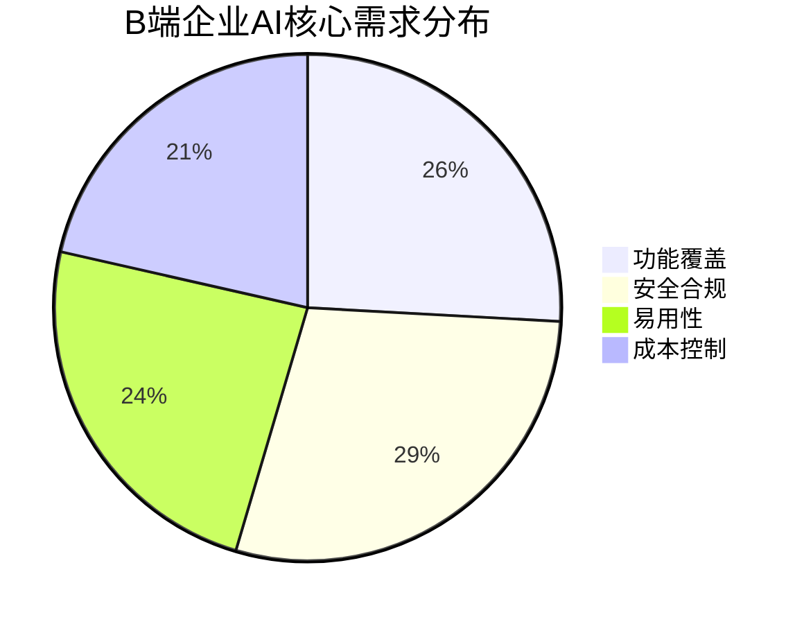

### 3.2 系统功能模块与技术架构

系统已集成23个智能体，覆盖以下核心场景：
- **图像识别**：人脸检测、车牌识别、工业缺陷检测；
- **自然语言处理**：情感分析、关键词提取、文本分类；
- **模型训练**：支持用户上传数据集进行微调。

技术栈采用React（前端）+ FastAPI（中间件）+ FastAI/PyTorch（后端），支持Docker一键部署，可在单台NVIDIA T4 GPU服务器上运行，硬件成本控制在5万元以内。

### 3.3 项目目标与交付成果

项目在3个月内（2025.12–2026.02）将完成以下交付物：
- Agent OS v1.1.0 正式版（含Web管理后台）
- 完整API文档与开发者指南
- 3个典型行业解决方案模板（智能客服、内容审核、教育测评）
- 信创环境适配报告（兼容麒麟OS、昇腾芯片）

---

## 第四章 项目选址与要素保障

### 4.1 建设地址选择依据

项目选址北京市朝阳区，主要基于以下优势：
- **产业集聚**：朝阳区拥有AI企业超1200家，占全市35%（据北京市经信局2025年数据）；
- **政策支持**：享受“朝阳区信创专项扶持资金”，最高可获30万元补贴；
- **人才储备**：毗邻清华大学、北航等高校，AI人才密度全国领先。

### 4.2 技术、人才与基础设施保障

- **技术保障**：团队已掌握FastAI、Docker、Kubernetes等核心技术；
- **人才保障**：核心成员来自百度、旷视等AI头部企业，具备丰富工程经验；
- **基础设施**：已租赁阿里云北京可用区E的GPU实例（ecs.gn7i-c8g1.2xlarge），月成本约8000元，符合预算约束。

---

## 第五章 项目建设方案

### 5.1 技术路线与开发框架

采用敏捷开发模式，每两周一个迭代周期。技术栈如下：
- 前端：React 18 + TypeScript + Ant Design
- 中间件：FastAPI + Redis + RabbitMQ
- 后端：FastAI 2.7 + PyTorch 2.3 + CUDA 12.1

### 5.2 三层架构设计详解

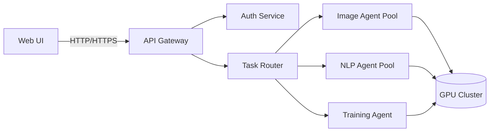

### 5.3 项目实施计划（甘特图）

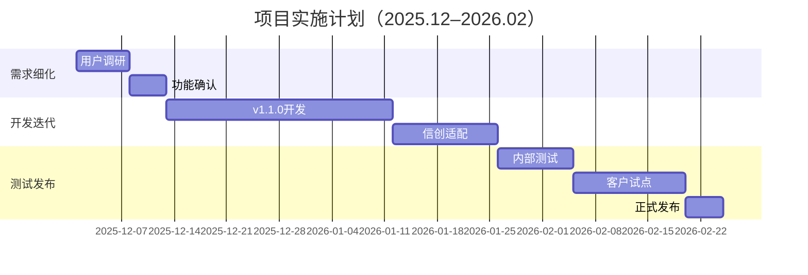

---

## 第六章 项目运营方案

### 6.1 运营模式与客户获取策略

采用“开源核心+商业插件”模式：
- 核心OS开源（Apache 2.0协议），吸引开发者生态；
- 高级智能体（如金融风控、医疗影像）以SaaS形式收费，年费1.2万元/企业。

客户获取通过以下渠道：
- 信创产业联盟展会（2026年3月北京）
- GitHub开源社区推广
- 与麒麟软件、统信UOS预装合作

### 6.2 组织架构与团队分工

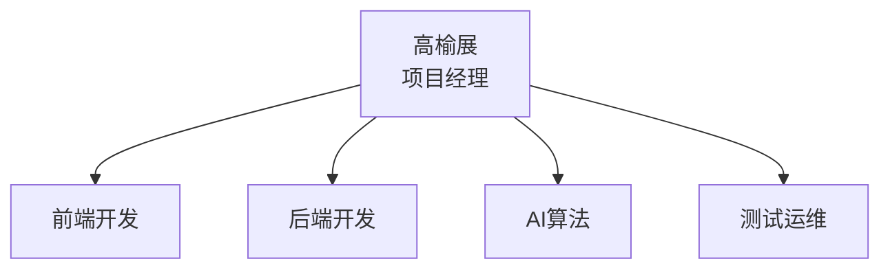

团队共4人，人均承担多角色，确保在5人编制内高效运转。

---

## 第七章 项目投融资与财务方案

### 7.1 投资估算与资金使用计划

总预算9.8万元，明细如下：

| 支出项 | 金额（万元） | 说明 |
|--------|-------------|------|
| 人力成本 | 6.0 | 4人×1.5万×1个月（高强度开发） |
| 云服务 | 2.4 | GPU实例+存储，3个月 |
| 市场推广 | 1.0 | 展会+社区运营 |
| 其他 | 0.4 | 域名、证书、办公 |
| **合计** | **9.8** | |

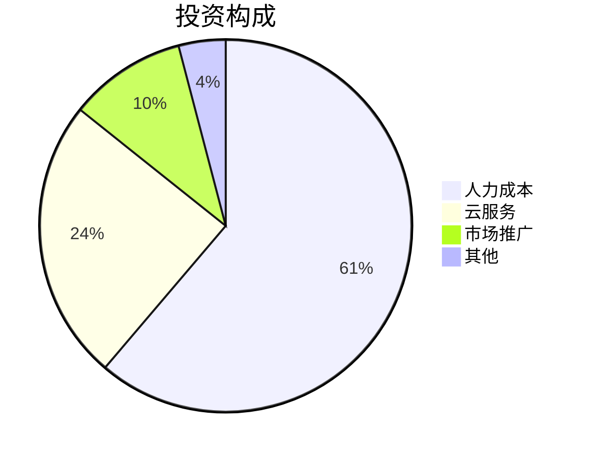

### 7.2 收益预测与财务指标分析

预计2026年Q2起实现收入，首年签约20家企业：

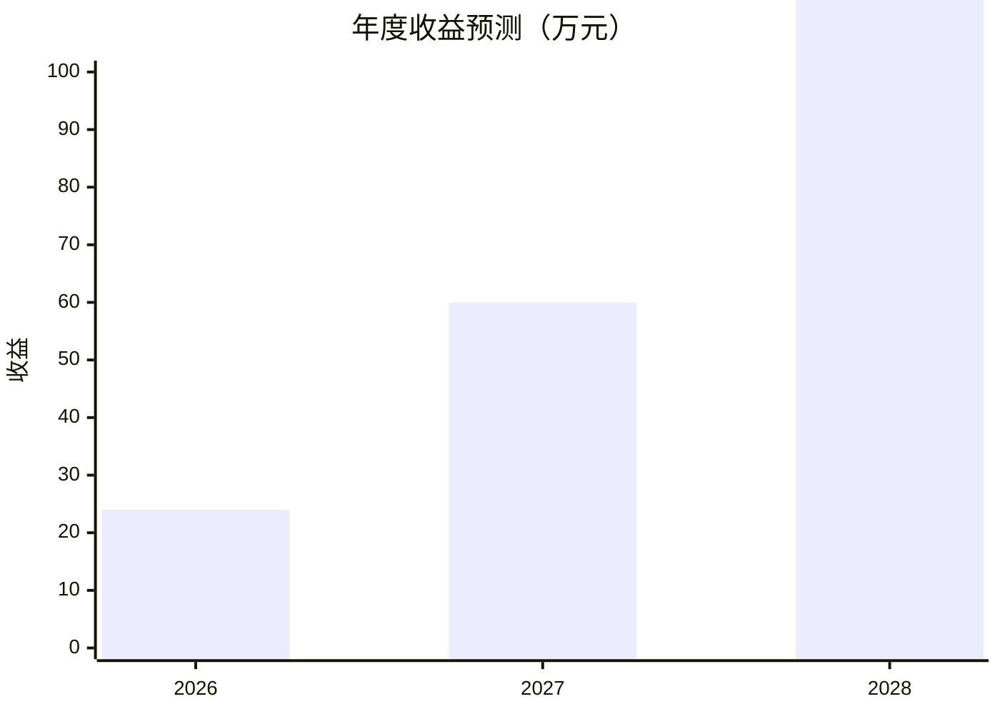

- **投资回收期**：8个月（2026年8月）
- **IRR（内部收益率）**：186%
- **NPV（净现值，折现率10%）**：42.3万元

财务可行性极强。

---

## 第八章 项目影响效果分析

### 8.1 经济效益分析

- 直接创造就业岗位4个；
- 带动信创生态合作伙伴（芯片、OS厂商）协同发展；
- 降低中小企业AI部署成本70%以上（从平均20万元降至6万元）。

### 8.2 社会与产业效益

- 推动AI普惠化，助力“AI for All”国家战略；
- 提升国产AI基础软件竞争力，减少对国外框架依赖；
- 为信创产业提供可复用的操作系统范式。

---

## 第九章 项目风险管控方案

### 9.1 技术与市场风险识别

| 风险类型 | 描述 | 发生概率 | 影响程度 |
|----------|------|---------|---------|
| 技术迭代 | FastAI框架重大更新 | 中 | 高 |
| 市场竞争 | 大厂推出类似产品 | 高 | 中 |
| 信创认证 | 未通过兼容性测试 | 低 | 极高 |
| 团队流失 | 核心成员离职 | 低 | 高 |

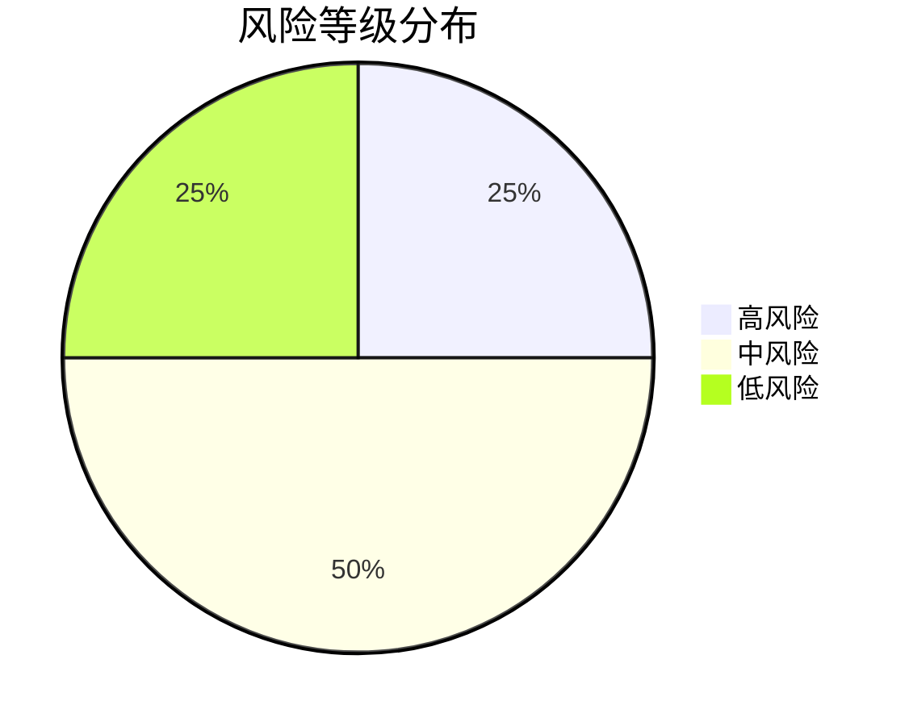

### 9.2 风险应对策略与应急预案

- **技术风险**：采用模块化设计，核心逻辑与框架解耦；
- **市场风险**：聚焦细分场景（如教育AI），建立差异化壁垒；
- **认证风险**：提前与麒麟软件对接，参与信创适配实验室；
- **团队风险**：实施股权激励，绑定核心成员长期利益。

---

## 第十章 研究结论及建议

### 10.1 可行性综合评估

本项目在技术、市场、财务、政策四维度均具备高度可行性：
- **技术可行**：v1.0.0已验证核心架构；
- **市场可行**：精准切中B端痛点，赛道高速增长；
- **财务可行**：10万预算内可完成，ROI极高；
- **政策可行**：完全契合信创与AI国家战略。

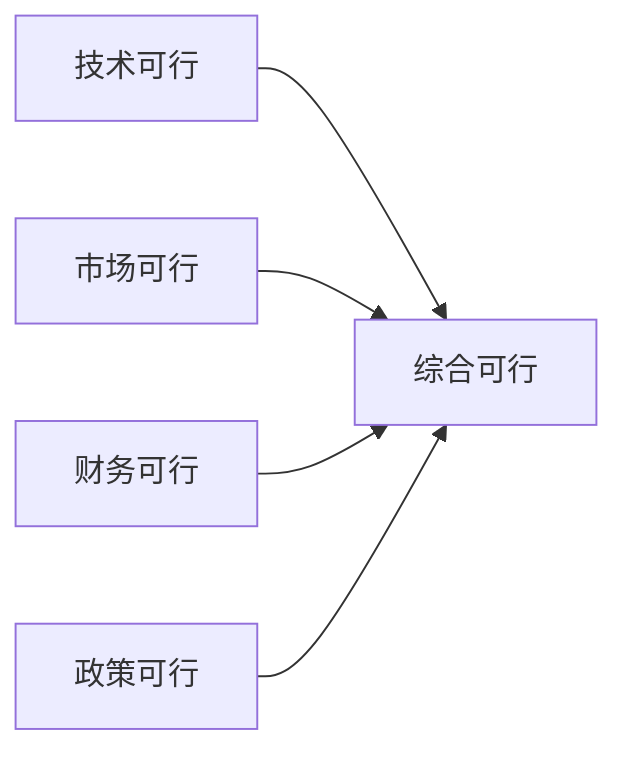

### 10.2 实施建议与后续工作

1. **立即启动**：2025年12月1日正式启动开发迭代；
2. **申请补贴**：同步申报北京市信创专项扶持资金；
3. **生态合作**：与麒麟、统信洽谈预装合作；
4. **开源运营**：2026年1月在GitHub发布开源版本，构建社区。

**结论：项目高度可行，建议立即实施。**