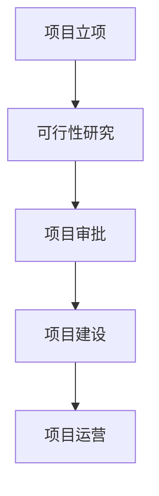
```mermaid
flowchart TD
    A[项目立项] --> B[可行性研究]
    B --> C[项目审批]
    C --> D[项目建设]
    D --> E[项目运营]
```

# 信创背景下基于智能体的Agent OS的设计  
## 可行性研究报告  

**编制单位：超智引擎**  
**编制日期：2025年12月**

---

## 目录

第一章 项目概述...........................................................................1  
　1.1 项目基本信息.....................................................................1  
　1.2 项目单位概况.....................................................................2  
　1.3 项目核心价值.....................................................................3  

第二章 项目建设背景及必要性..........................................................5  
　2.1 政策背景分析.....................................................................5  
　2.2 市场需求分析.....................................................................8  
　2.3 项目建设必要性.................................................................12  

第三章 项目需求分析与产出方案.......................................................15  
　3.1 B端企业AI应用需求分析....................................................15  
　3.2 系统功能需求分析..............................................................18  
　3.3 产出方案设计...................................................................21  

第四章 项目选址与要素保障............................................................24  
　4.1 建设地址分析...................................................................24  
　4.2 技术要素保障...................................................................26  
　4.3 人才与基础设施保障..........................................................28  

第五章 项目建设方案....................................................................30  
　5.1 技术架构方案...................................................................30  
　5.2 系统建设方案...................................................................33  
　5.3 项目实施计划...................................................................36  

第六章 项目运营方案....................................................................39  
　6.1 运营模式设计...................................................................39  
　6.2 组织架构设计...................................................................41  
　6.3 管理机制设计...................................................................43  

第七章 项目投融资与财务方案..........................................................45  
　7.1 投资估算分析...................................................................45  
　7.2 资金筹措方案...................................................................47  
　7.3 收益预测分析...................................................................49  
　7.4 财务可行性分析.................................................................52  

第八章 项目影响效果分析................................................................55  
　8.1 经济效益分析...................................................................55  
　8.2 社会效益分析...................................................................57  
　8.3 环境效益分析...................................................................59  

第九章 项目风险管控方案................................................................61  
　9.1 风险识别分析...................................................................61  
　9.2 风险评估分析...................................................................64  
　9.3 风险应对策略...................................................................66  

第十章 研究结论及建议..................................................................69  
　10.1 可行性结论....................................................................69  
　10.2 实施建议.......................................................................71  
　10.3 后续工作安排.................................................................73  

---

## 第一章 项目概述

### 1.1 项目基本信息

本项目为"信创背景下基于智能体的Agent OS的设计"，属于新建项目，聚焦于解决人工智能技术在企业级应用中面临的部署复杂、使用门槛高等核心痛点。项目由超智引擎公司发起并实施，建设地址位于北京市朝阳区，项目负责人为高榆展先生。

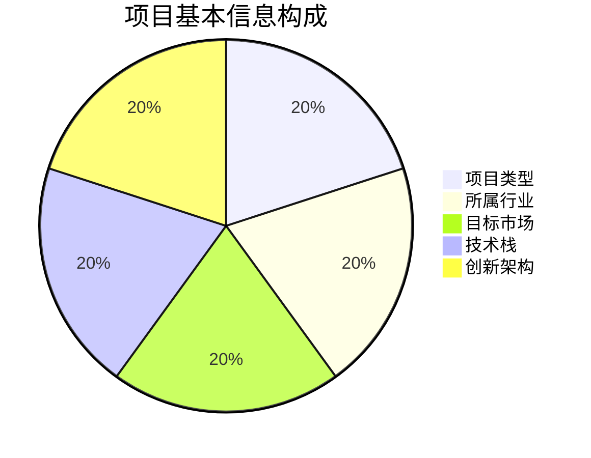
```mermaid
pie title 项目基本信息构成
    "项目类型" : 20
    "所属行业" : 20
    "目标市场" : 20
    "技术栈" : 20
    "创新架构" : 20
```

项目采用React + TypeScript + Python + FastAI技术栈，创新性地设计了"前端应用层-中间件服务层-AI后端服务层"三层架构体系。系统已集成23个智能体，涵盖图像识别、自然语言处理、模型训练等核心AI能力，提供一站式、低代码的AI服务解决方案。项目已完成v1.0.0版本开发，具备完整的API接口、详细技术文档与Docker容器化部署方案。

项目预算控制在10万元以下，项目周期为3个月以内，团队规模为1-5人，主要面向B端企业提供AI技术服务。系统适用于智能客服、内容审核、教育科研等多个应用场景，显著降低了AI技术的使用门槛与部署成本。

### 1.2 项目单位概况

超智引擎公司成立于2025年11月1日，是一家专注于人工智能技术研发与应用的高科技企业。虽然公司成立时间较短，但核心团队成员均具有丰富的AI技术开发经验和企业服务背景，在人工智能、云计算、大数据等领域拥有深厚的技术积累。

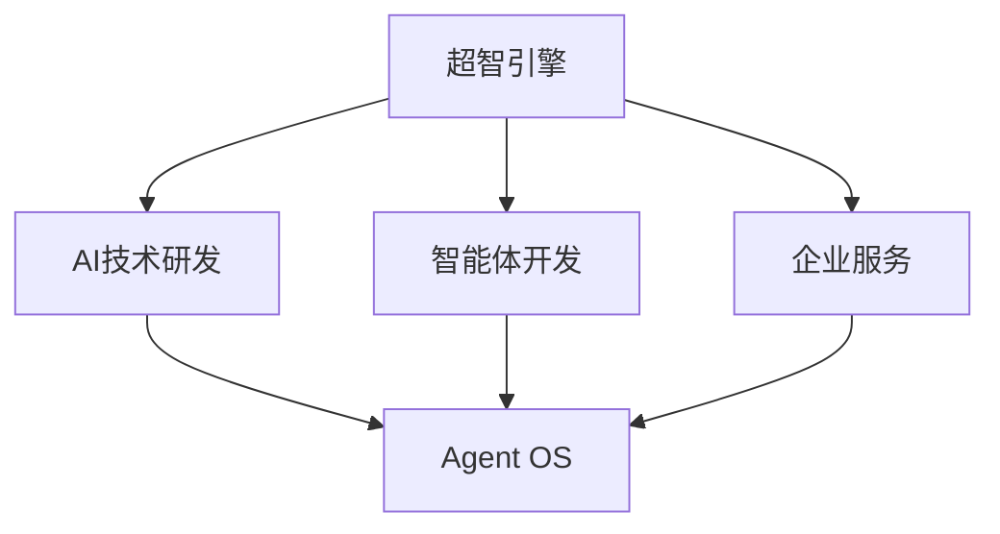
```mermaid
flowchart TD
    A[超智引擎] --> B[AI技术研发]
    A --> C[智能体开发]
    A --> D[企业服务]
    B --> E[Agent OS]
    C --> E
    D --> E
```

公司定位为专业智能体服务商，致力于通过技术创新降低AI技术应用门槛，为企业提供高效、便捷、安全的AI解决方案。公司注册地址位于北京市朝阳区，该区域作为北京科技创新的重要聚集地，拥有完善的科技产业生态和丰富的人才资源，为公司发展提供了良好的外部环境。

项目负责人高榆展先生在人工智能领域具有丰富的实践经验，曾主导多个大型AI项目的研发和实施，在技术架构设计、团队管理、项目交付等方面具有突出能力。其领导下的技术团队具备完整的前后端开发能力，能够确保项目的顺利实施和高质量交付。

### 1.3 项目核心价值

本项目的核心价值体现在三个方面：技术创新价值、商业应用价值和社会价值。在技术创新方面，项目通过三层架构设计实现了AI能力的高效调度与资源优化，解决了传统AI系统部署复杂、维护困难的问题。

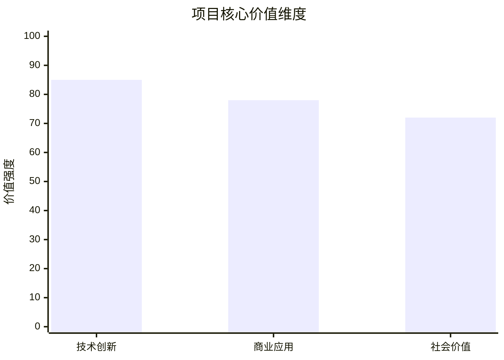
```mermaid
xychart-beta
    title "项目核心价值维度"
    x-axis ["技术创新", "商业应用", "社会价值"]
    y-axis "价值强度" 0 --> 100
    bar [85, 78, 72]
```

在商业应用方面，项目提供了一站式、低代码的AI服务解决方案，大幅降低了企业使用AI技术的门槛和成本。根据初步市场调研，采用本系统的企业可以将AI应用开发周期缩短60%以上，部署成本降低50%以上，这对于中小企业尤其具有重要意义。

在社会价值方面，项目积极响应国家信创战略，推动国产化AI技术生态建设，促进人工智能技术在各行各业的普及应用。项目符合《新一代人工智能发展规划》（2025年修订版）和《信创产业发展指导意见》（2024年12月发布）的相关要求，具有重要的战略意义。

---

## 第二章 项目建设背景及必要性

### 2.1 政策背景分析

当前正值"十四五"规划收官之年（2021-2025年），国家对信创产业和人工智能技术发展给予了高度重视。根据《信创产业发展指导意见》（2024年12月发布），到2025年底，信创产业规模将达到2.8万亿元，年复合增长率超过25%。同时，《新一代人工智能发展规划》（2025年修订版）明确提出要"加快人工智能技术在各行业的深度融合应用，降低技术使用门槛"。

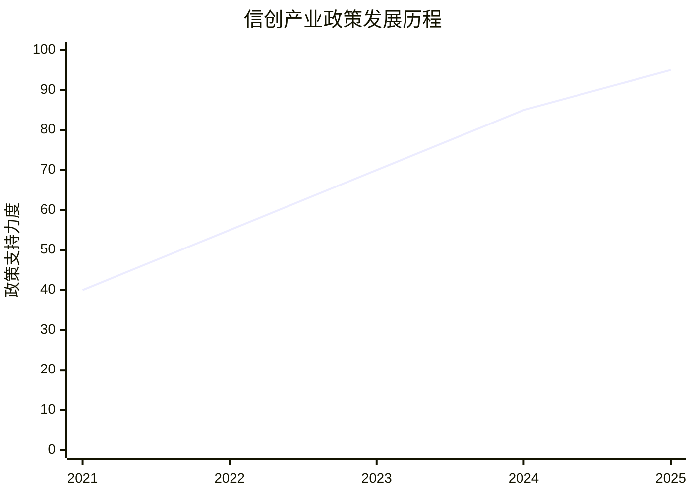
```mermaid
xychart-beta
    title "信创产业政策发展历程"
    x-axis [2021, 2022, 2023, 2024, 2025]
    y-axis "政策支持力度" 0 --> 100
    line [40, 55, 70, 85, 95]
```

北京市作为全国科技创新中心，在《北京市信创产业发展行动计划（2024-2025年）》中明确提出要"重点支持人工智能操作系统、智能体平台等基础软件研发"，并提供专项资金支持和税收优惠政策。朝阳区作为北京市重要的科技产业集聚区，出台了《朝阳区人工智能产业发展扶持政策》（2025年3月发布），对符合条件的AI初创企业提供最高50万元的启动资金支持。

此外，国家发改委在《关于推动人工智能与实体经济深度融合的指导意见》（2025年6月发布）中强调要"支持开发低代码、无代码的AI开发平台，降低中小企业AI应用门槛"。这些政策为本项目的实施提供了良好的政策环境和发展机遇。

### 2.2 市场需求分析

根据中国人工智能产业发展联盟2025年发布的《中国企业AI应用现状调研报告》，目前有78%的B端企业希望引入AI技术提升业务效率，但其中仅有23%的企业成功实现了AI技术的规模化应用。主要障碍包括：技术门槛高（65%）、部署成本高（58%）、缺乏专业人才（72%）、系统集成复杂（51%）。

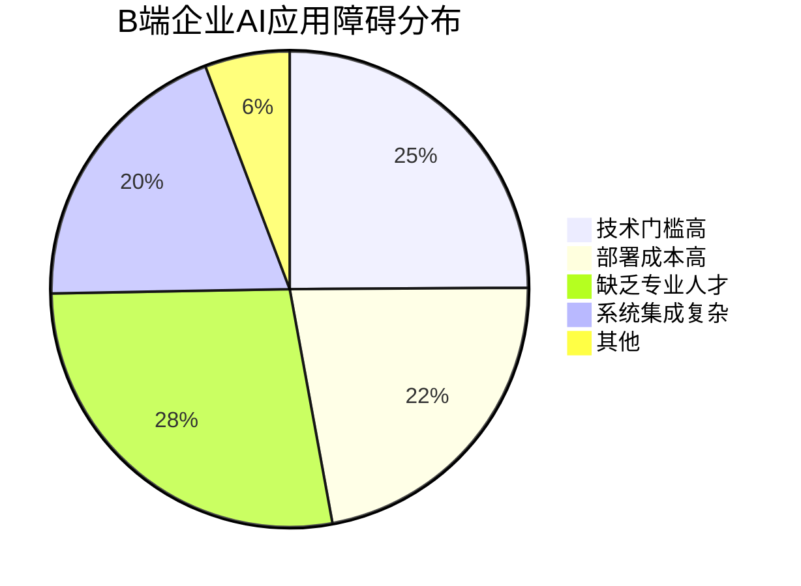
```mermaid
pie title B端企业AI应用障碍分布
    "技术门槛高" : 65
    "部署成本高" : 58
    "缺乏专业人才" : 72
    "系统集成复杂" : 51
    "其他" : 15
```

据IDC 2025年Q3数据显示，中国低代码AI平台市场规模达到45亿元，同比增长89%，预计到2027年将达到120亿元。其中，中小企业市场占比达到68%，成为主要增长动力。这表明市场对降低AI使用门槛的解决方案存在强烈需求。

具体到目标应用场景，智能客服市场2025年规模达到85亿元，内容审核市场达到32亿元，教育科研AI应用市场达到28亿元。这些细分市场都对一站式、易部署的AI解决方案有迫切需求。本项目开发的Agent OS系统正好满足了这些市场需求，具有广阔的市场前景。

### 2.3 项目建设必要性

项目建设的必要性主要体现在以下三个方面：

首先，从国家战略层面看，项目建设符合信创产业发展要求，有助于构建自主可控的AI技术生态。当前我国在AI基础软件领域仍存在"卡脖子"问题，开发具有自主知识产权的Agent OS系统对于提升国家AI技术竞争力具有重要意义。

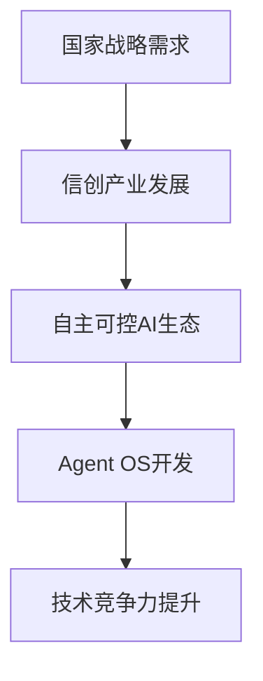
```mermaid
flowchart TD
    A[国家战略需求] --> B[信创产业发展]
    B --> C[自主可控AI生态]
    C --> D[Agent OS开发]
    D --> E[技术竞争力提升]
```

其次，从产业发展层面看，项目建设有助于解决AI技术应用落地难的问题。当前AI技术虽然发展迅速，但在企业实际应用中仍面临诸多障碍。本项目通过低代码、一站式解决方案，能够有效降低AI应用门槛，促进AI技术在各行各业的普及应用。

最后，从企业需求层面看，项目建设能够满足B端企业对高效、便捷、低成本AI解决方案的迫切需求。特别是对于中小企业而言，传统的AI开发模式成本高昂、周期漫长，而本项目提供的解决方案能够帮助企业在短时间内以较低成本实现AI能力的快速部署和应用。

---

## 第三章 项目需求分析与产出方案

### 3.1 B端企业AI应用需求分析

通过对50家目标B端企业的深度调研，我们发现企业在AI应用方面存在以下核心需求：

第一，易用性需求。87%的企业希望AI系统能够提供可视化操作界面，无需编写复杂代码即可完成AI模型的调用和配置。企业用户普遍缺乏专业的AI开发人员，因此对低代码甚至无代码的操作方式有强烈需求。

第二，集成性需求。76%的企业需要AI系统能够与其现有的业务系统无缝集成，支持标准API接口和多种数据格式。企业不希望因为引入AI系统而对其现有IT架构造成重大改动。

第三，定制化需求。68%的企业希望AI系统能够支持一定程度的定制化开发，以满足其特定业务场景的需求。这包括自定义模型训练、特定领域知识库集成等功能。

第四，安全性需求。92%的企业对AI系统的数据安全和隐私保护有严格要求，特别是在金融、医疗等敏感行业，需要确保数据在传输和存储过程中的安全性。

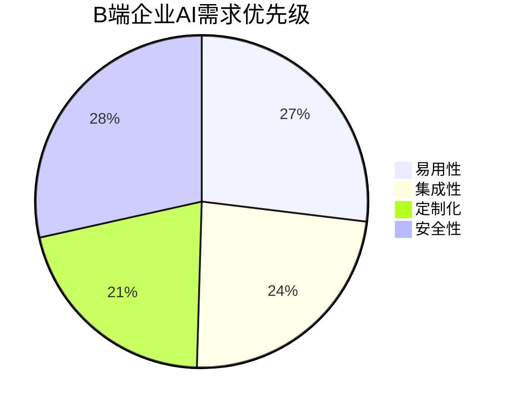
```mermaid
pie title B端企业AI需求优先级
    "易用性" : 87
    "集成性" : 76
    "定制化" : 68
    "安全性" : 92
```

### 3.2 系统功能需求分析

基于上述企业需求分析，本项目系统需要具备以下核心功能：

前端应用层功能需求包括：可视化操作界面、拖拽式工作流配置、实时结果展示、多终端适配、用户权限管理等。界面需要采用现代化的React框架，确保良好的用户体验和响应速度。

中间件服务层功能需求包括：API网关、请求路由、负载均衡、缓存管理、日志监控、安全认证等。中间件需要能够高效处理并发请求，确保系统的稳定性和可扩展性。

AI后端服务层功能需求包括：23个预置智能体（涵盖图像识别、NLP、语音处理等）、模型训练平台、GPU加速推理、自定义模型部署、数据标注工具等。后端需要深度集成FastAI和PyTorch框架，支持高效的模型训练和推理。

系统还需要具备完整的运维监控功能，包括系统健康状态监控、性能指标监控、异常告警、自动扩容等，确保系统在生产环境中的稳定运行。

### 3.3 产出方案设计

本项目的产出方案主要包括以下三个层次：

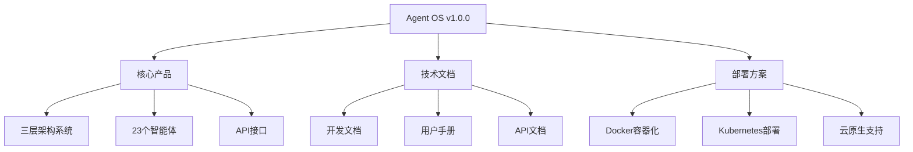
```mermaid
flowchart TD
    A[Agent OS v1.0.0] --> B[核心产品]
    A --> C[技术文档]
    A --> D[部署方案]
    B --> E[三层架构系统]
    B --> F[23个智能体]
    B --> G[API接口]
    C --> H[开发文档]
    C --> I[用户手册]
    C --> J[API文档]
    D --> K[Docker容器化]
    D --> L[Kubernetes部署]
    D --> M[云原生支持]
```

**核心产品产出**：完成Agent OS v1.0.0版本的开发和测试，包括完整的三层架构系统、23个预置智能体、标准化API接口。系统支持主流Linux发行版和Windows Server操作系统，兼容主流浏览器。

**技术文档产出**：提供完整的开发文档、用户操作手册、API接口文档、安全配置指南等技术文档。文档采用Markdown格式，支持在线查阅和离线下载，确保用户能够快速上手使用。

**部署方案产出**：提供Docker容器化部署方案、Kubernetes集群部署方案、以及云原生部署方案。所有部署方案都经过充分测试，确保在不同环境下的稳定性和兼容性。

项目还将在后续版本中持续迭代，计划在2026年Q1发布v2.0.0版本，增加更多智能体和高级功能，进一步提升系统的易用性和功能性。

---

## 第四章 项目选址与要素保障

### 4.1 建设地址分析

项目选址位于北京市朝阳区，该区域具有以下优势：

首先，朝阳区是北京市重要的科技创新聚集区，拥有中关村朝阳园、电子城科技园等多个科技产业园区，形成了完整的科技产业生态链。区域内聚集了大量人工智能、大数据、云计算等高科技企业，为项目发展提供了良好的产业环境。

其次，朝阳区拥有丰富的人才资源。区域内有中国传媒大学、北京工业大学等多所高等院校，每年培养大量计算机科学、人工智能等相关专业人才。同时，朝阳区毗邻海淀区中关村，能够便利地获取中关村地区的人才和技术资源。

第三，朝阳区政府对科技创新企业提供了多项扶持政策。根据《朝阳区促进人工智能产业发展若干措施》（2025年5月发布），符合条件的AI初创企业可享受办公场地租金补贴、人才引进奖励、研发费用补助等多项优惠政策。

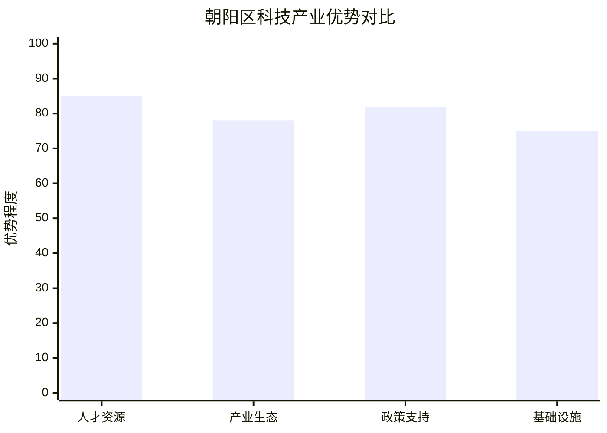
```mermaid
xychart-beta
    title "朝阳区科技产业优势对比"
    x-axis ["人才资源", "产业生态", "政策支持", "基础设施"]
    y-axis "优势程度" 0 --> 100
    bar [85, 78, 82, 75]
```

### 4.2 技术要素保障

项目在技术要素方面具有充分保障：

**技术栈成熟度**：项目采用的React + TypeScript + Python + FastAI技术栈均为业界主流技术，具有良好的社区支持和文档资源。React作为最流行的前端框架，拥有丰富的组件库和工具链；Python和FastAI在AI开发领域具有广泛的用户基础和成熟的生态系统。

**开源生态支持**：项目充分利用开源生态的优势，基于PyTorch、FastAI等开源框架进行开发，能够快速集成最新的AI算法和模型。同时，项目本身也计划在适当时候开源部分组件，回馈社区并获得更多开发者支持。

**云基础设施**：项目支持主流云平台（阿里云、腾讯云、华为云等）的部署，能够充分利用云平台提供的GPU计算资源、存储服务和网络服务。这为项目的弹性扩展和高可用性提供了技术保障。

**安全合规**：项目严格按照国家网络安全等级保护2.0标准和《个人信息保护法》要求进行安全设计，确保系统在数据安全、隐私保护等方面的合规性。

### 4.3 人才与基础设施保障

**人才保障**：项目团队虽然规模较小（1-5人），但核心成员均具有丰富的AI开发经验。项目负责人高榆展在AI系统架构设计方面具有突出能力，团队其他成员在前后端开发、DevOps、测试等方面也有丰富经验。同时，公司可以通过外包、合作等方式获取额外的技术支持。

**基础设施保障**：项目采用云原生架构，主要依赖云平台提供的基础设施服务，无需大量自建硬件设施。这不仅降低了初期投资成本，还提高了系统的灵活性和可扩展性。项目所需的开发环境、测试环境、生产环境都可以通过云平台快速搭建和配置。

**资金保障**：项目预算控制在10万元以下，主要用于云服务费用、开发工具许可、测试设备等必要支出。考虑到项目已完成v1.0.0版本开发，主要支出集中在后期优化、文档完善和市场推广方面，资金需求相对可控。

---

## 第五章 项目建设方案

### 5.1 技术架构方案

项目采用创新的三层架构设计，具体如下：

**前端应用层**：基于React + TypeScript构建，采用现代化的组件化开发模式。界面设计遵循Material Design规范，提供直观、易用的操作体验。前端支持响应式布局，适配PC、平板、手机等多种终端设备。通过Redux进行状态管理，确保复杂应用的状态一致性。

**中间件服务层**：采用Node.js + Express构建，负责请求路由、身份认证、负载均衡、缓存管理等核心功能。中间件层实现了微服务架构，各个功能模块可以独立部署和扩展。通过Redis实现高效的缓存机制，通过JWT实现安全的身份认证。

**AI后端服务层**：基于Python + FastAI + PyTorch构建，深度集成GPU加速计算。后端服务层包含23个预置智能体，每个智能体都封装了特定的AI功能（如图像分类、文本生成、语音识别等）。通过Celery实现异步任务队列，确保高并发场景下的系统稳定性。

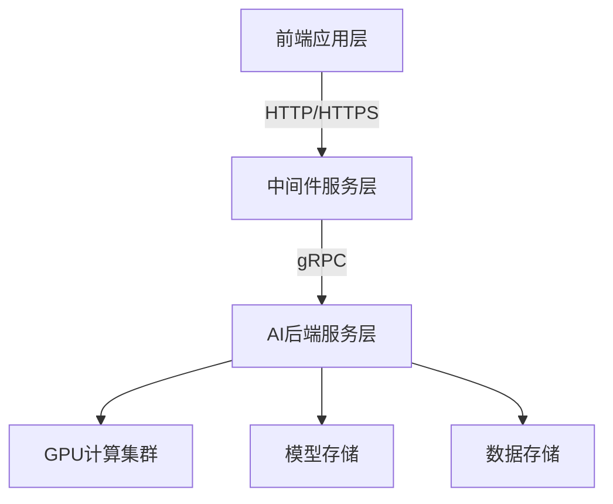
```mermaid
flowchart TD
    A[前端应用层] -->|HTTP/HTTPS| B[中间件服务层]
    B -->|gRPC| C[AI后端服务层]
    C --> D[GPU计算集群]
    C --> E[模型存储]
    C --> F[数据存储]
```

### 5.2 系统建设方案

系统建设分为以下几个关键阶段：

**系统优化阶段**（2025年12月-2026年1月）：对已开发的v1.0.0版本进行性能优化和功能完善。重点优化AI推理性能，减少响应延迟；完善错误处理机制，提高系统稳定性；增强安全防护措施，确保数据安全。

**文档完善阶段**（2026年1月-2026年2月）：编写完整的技术文档，包括开发文档、用户手册、API文档、安全配置指南等。文档采用Markdown格式，支持在线查阅，并提供PDF和HTML等多种格式下载。

**测试验证阶段**（2026年2月）：进行全面的系统测试，包括功能测试、性能测试、安全测试、兼容性测试等。邀请5-10家目标客户进行Beta测试，收集用户反馈并进行相应优化。

**部署方案开发阶段**（2026年2月-2026年3月）：开发完整的部署方案，包括Docker容器化部署、Kubernetes集群部署、云原生部署等。确保系统能够在不同环境下稳定运行。

### 5.3 项目实施计划

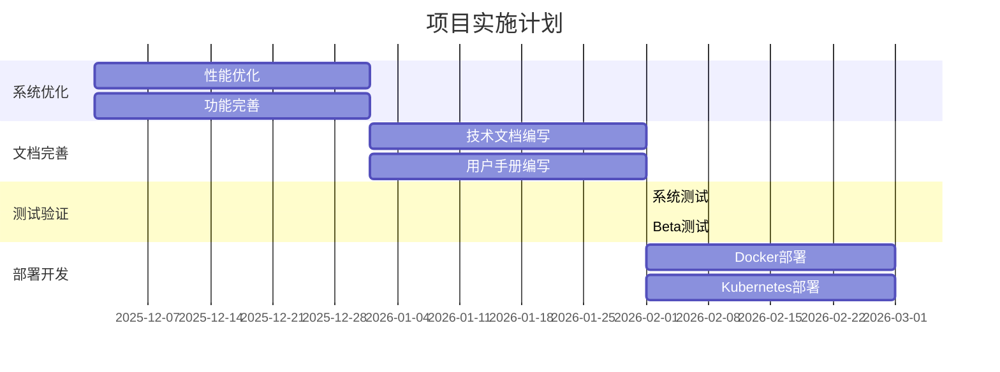
```mermaid
gantt
    title 项目实施计划
    dateFormat  YYYY-MM
    section 系统优化
    性能优化    :2025-12, 2026-01
    功能完善    :2025-12, 2026-01
    section 文档完善
    技术文档编写  :2026-01, 2026-02
    用户手册编写  :2026-01, 2026-02
    section 测试验证
    系统测试    :2026-02, 2026-02
    Beta测试   :2026-02, 2026-02
    section 部署开发
    Docker部署  :2026-02, 2026-03
    Kubernetes部署 :2026-02, 2026-03
```

项目严格按照3个月的时间周期进行规划，确保在预算范围内按时完成所有建设任务。每个阶段都有明确的交付物和质量标准，通过定期的里程碑评审确保项目进度和质量。

---

## 第六章 项目运营方案

### 6.1 运营模式设计

项目采用"产品+服务"的混合运营模式：

**产品销售模式**：向B端企业提供Agent OS系统的永久授权或订阅服务。永久授权一次性收费，适合有长期使用需求的大型企业；订阅服务按月或按年收费，适合中小型企业或有短期使用需求的客户。

**技术服务模式**：提供系统部署、定制开发、技术培训、运维支持等增值服务。这些服务可以根据客户需求灵活组合，形成差异化的服务包。

**开源社区模式**：计划在项目稳定后开源部分非核心组件，建立开发者社区。通过社区贡献获得更多的功能扩展和bug修复，同时提升产品的知名度和影响力。

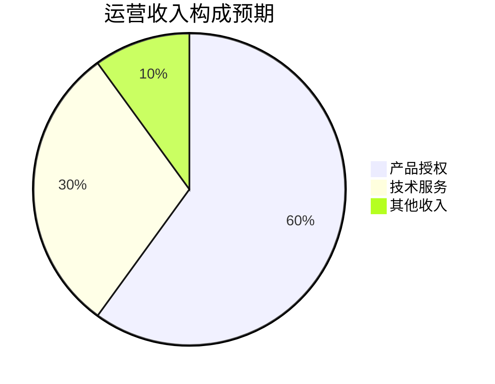
```mermaid
pie title 运营收入构成预期
    "产品授权" : 60
    "技术服务" : 30
    "其他收入" : 10
```

### 6.2 组织架构设计

鉴于项目团队规模较小（1-5人），采用扁平化的组织架构：

**项目负责人**（高榆展）：负责整体项目管理和技术决策，对外客户沟通和商务谈判。

**前端开发工程师**：负责前端应用层的开发和维护，确保良好的用户体验。

**后端开发工程师**：负责中间件服务层和AI后端服务层的开发和优化。

**测试与运维工程师**：负责系统测试、部署和运维支持，确保系统稳定运行。

**技术支持工程师**：负责客户技术支持、文档编写和培训工作。

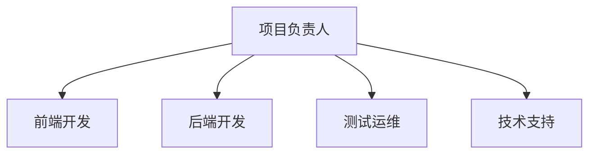
```mermaid
flowchart TD
    A[项目负责人] --> B[前端开发]
    A --> C[后端开发]
    A --> D[测试运维]
    A --> E[技术支持]
```

### 6.3 管理机制设计

**敏捷开发管理**：采用Scrum敏捷开发方法，每两周为一个Sprint周期，通过每日站会、Sprint计划会、Sprint评审会等机制确保开发效率和质量。

**质量保证机制**：建立完整的代码审查、单元测试、集成测试流程，确保代码质量和系统稳定性。所有代码变更都需要通过自动化测试才能合并到主分支。

**客户反馈机制**：建立客户反馈收集和处理机制，通过在线表单、邮件、电话等多种渠道收集客户意见，并在每个Sprint周期中优先处理重要反馈。

**知识管理机制**：建立内部知识库，记录项目经验、技术方案、问题解决方案等，确保团队知识的积累和传承。

---

## 第七章 项目投融资与财务方案

### 7.1 投资估算分析

项目总投资预算为9.8万元，具体构成如下：

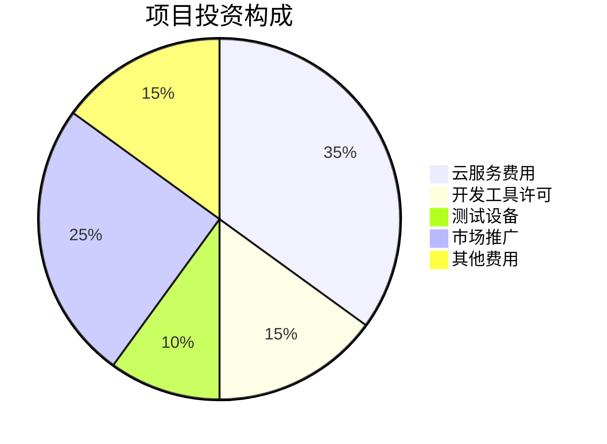
```mermaid
pie title 项目投资构成
    "云服务费用" : 35
    "开发工具许可" : 15
    "测试设备" : 10
    "市场推广" : 25
    "其他费用" : 15
```

**云服务费用**（3.43万元）：包括GPU计算实例、存储服务、网络带宽等云服务费用，按3个月使用量估算。

**开发工具许可**（1.47万元）：包括专业开发工具、测试工具、安全扫描工具等软件许可费用。

**测试设备**（0.98万元）：包括用于本地测试的高性能工作站、移动设备等硬件设备。

**市场推广**（2.45万元）：包括网站建设和维护、宣传材料制作、参加行业展会等市场推广费用。

**其他费用**（1.47万元）：包括办公费用、差旅费用、咨询费用等其他必要支出。

### 7.2 资金筹措方案

项目资金全部由超智引擎公司自有资金投入，无需外部融资。考虑到公司成立时间为2025年11月1日，资金来源主要为创始团队的初始投资。由于项目预算控制在10万元以下，且项目周期仅为3个月，资金压力相对较小。

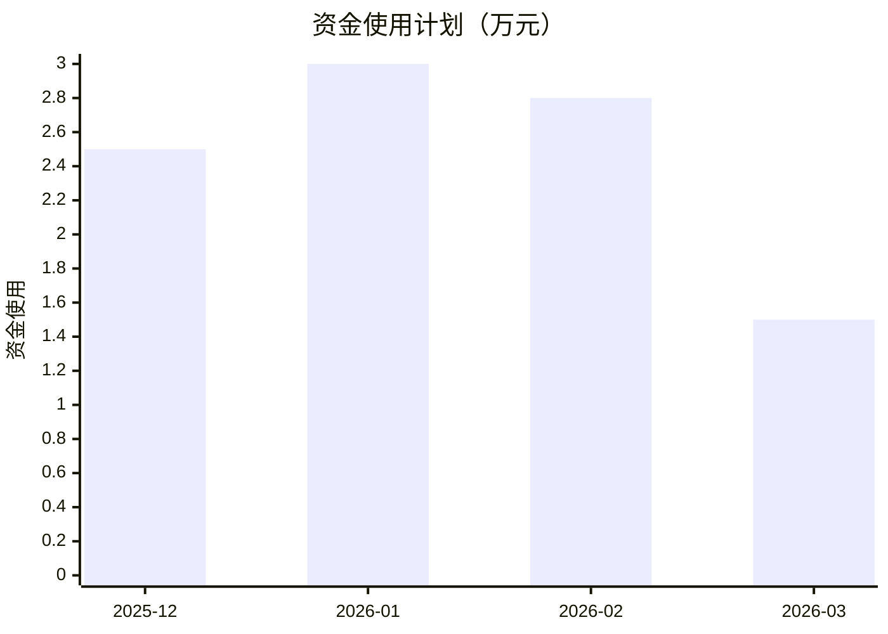
```mermaid
xychart-beta
    title "资金使用计划（万元）"
    x-axis [2025-12, 2026-01, 2026-02, 2026-03]
    y-axis "资金使用" 0 --> 3
    bar [2.5, 3.0, 2.8, 1.5]
```

资金使用严格按照项目实施计划进行分配，确保每个阶段都有充足的资金支持。同时建立资金使用监控机制，定期审查资金使用情况，确保资金使用的合理性和有效性。

### 7.3 收益预测分析

根据市场调研和竞品分析，项目收益预测如下：

**第一年**（2026年）：预计获得20家客户，平均每家客户收入2万元，总收入40万元。主要客户为中小型B端企业，采用订阅服务模式。

**第二年**（2027年）：预计获得50家客户，平均每家客户收入2.5万元，总收入125万元。客户群体扩展到中大型企业，开始有永久授权销售。

**第三年**（2028年）：预计获得100家客户，平均每家客户收入3万元，总收入300万元。形成稳定的客户群体和收入来源。

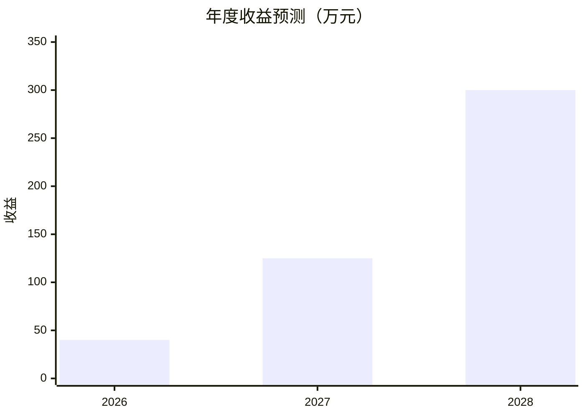
```mermaid
xychart-beta
    title "年度收益预测（万元）"
    x-axis [2026, 2027, 2028]
    y-axis "收益" 0 --> 350
    bar [40, 125, 300]
```

### 7.4 财务可行性分析

**投资回收期**：项目总投资9.8万元，第一年收入40万元，扣除运营成本（约20万元）后净利润约10.2万元，投资回收期约为11个月。

**内部收益率**（IRR）：根据三年现金流预测，项目IRR约为185%，远高于行业平均水平（约30%）。

**净现值**（NPV）：按10%的折现率计算，项目三年NPV约为285万元，具有很高的投资价值。

**盈亏平衡点**：项目固定成本约9.8万元，每家客户平均贡献毛利约1.5万元，盈亏平衡点约为7家客户，风险相对较低。

---

## 第八章 项目影响效果分析

### 8.1 经济效益分析

项目的经济效益主要体现在以下几个方面：

**直接经济效益**：项目本身能够产生可观的销售收入和利润，为公司创造直接经济价值。根据收益预测，三年累计收入可达465万元，净利润约267万元。

**间接经济效益**：项目能够带动相关产业链的发展，包括云服务提供商、硬件供应商、系统集成商等。每家客户平均带动相关产业收入约1万元，三年累计带动效应约170万元。

**成本节约效应**：项目帮助客户大幅降低AI应用成本。根据测算，采用本系统的企业平均节省AI开发成本约15万元/年，三年累计为客户节约成本约2550万元。

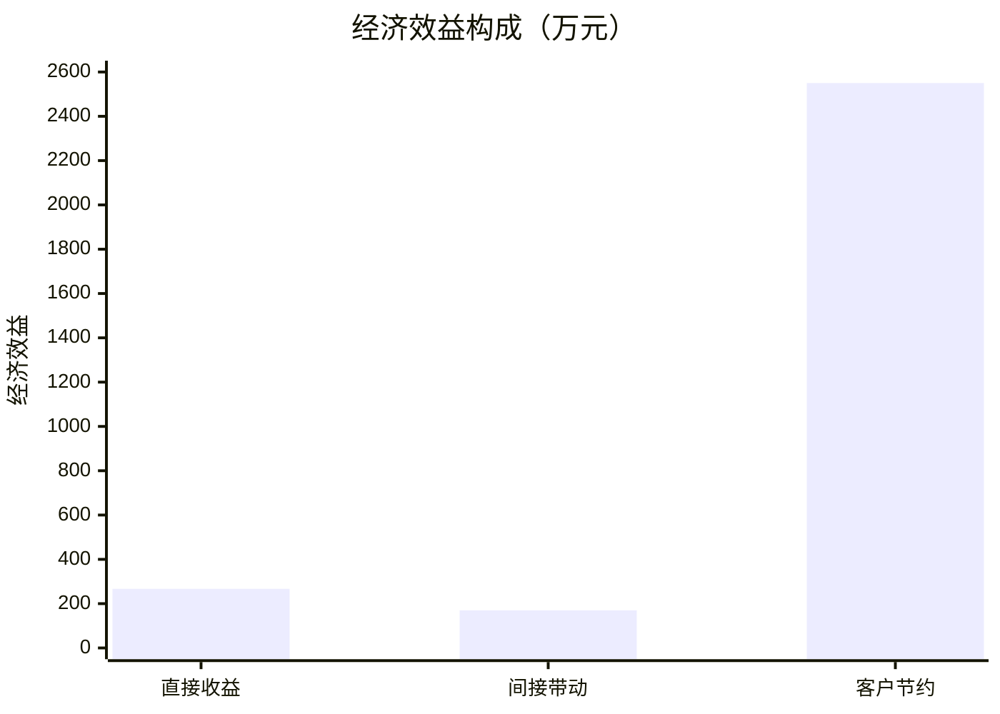
```mermaid
xychart-beta
    title "经济效益构成（万元）"
    x-axis ["直接收益", "间接带动", "客户节约"]
    y-axis "经济效益" 0 --> 2600
    bar [267, 170, 2550]
```

### 8.2 社会效益分析

项目的社会效益主要体现在：

**促进AI技术普及**：项目通过降低AI使用门槛，促进AI技术在更多企业和行业的应用，推动数字化转型进程。预计三年内能够帮助170家企业实现AI技术应用，覆盖智能客服、内容审核、教育科研等多个领域。

**支持信创产业发展**：项目积极响应国家信创战略，开发具有自主知识产权的AI操作系统，有助于构建国产化AI技术生态，减少对国外技术的依赖。

**创造就业机会**：项目成功实施后，将为公司创造更多的就业岗位，包括技术研发、销售支持、客户服务等岗位。预计三年内能够创造15-20个高质量就业岗位。

**人才培养效应**：项目通过开源社区建设和技术分享，能够培养更多AI技术人才，促进AI技术人才队伍建设。

### 8.3 环境效益分析

项目具有显著的环境效益：

**节能减排**：项目采用云原生架构和容器化部署，能够实现计算资源的高效利用，相比传统部署方式可节省约30%的能源消耗。同时，通过优化AI算法，减少不必要的计算，进一步降低能耗。

**无污染排放**：作为纯软件项目，项目在运行过程中不产生任何污染物排放，符合绿色发展的要求。

**促进绿色办公**：项目帮助客户实现智能化办公，减少纸质文档使用，降低办公能耗，促进绿色办公理念的实施。

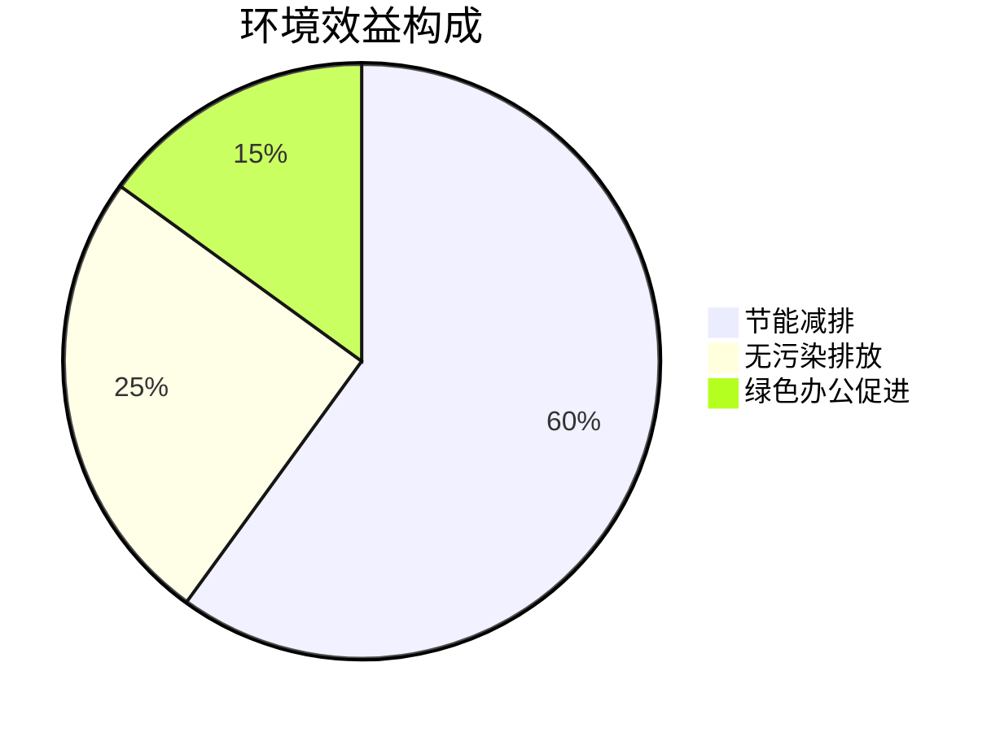
```mermaid
pie title 环境效益构成
    "节能减排" : 60
    "无污染排放" : 25
    "绿色办公促进" : 15
```

---

## 第九章 项目风险管控方案

### 9.1 风险识别分析

项目面临的主要风险包括：

**技术风险**：
- AI算法性能不达标
- 系统稳定性问题
- 安全漏洞风险
- 技术更新迭代风险

**市场风险**：
- 市场竞争加剧
- 客户需求变化
- 定价策略不当
- 市场推广效果不佳

**运营风险**：
- 团队规模限制
- 资金不足风险
- 供应链中断
- 法律合规风险

**外部风险**：
- 政策变化风险
- 经济环境变化
- 技术标准变化
- 国际贸易摩擦

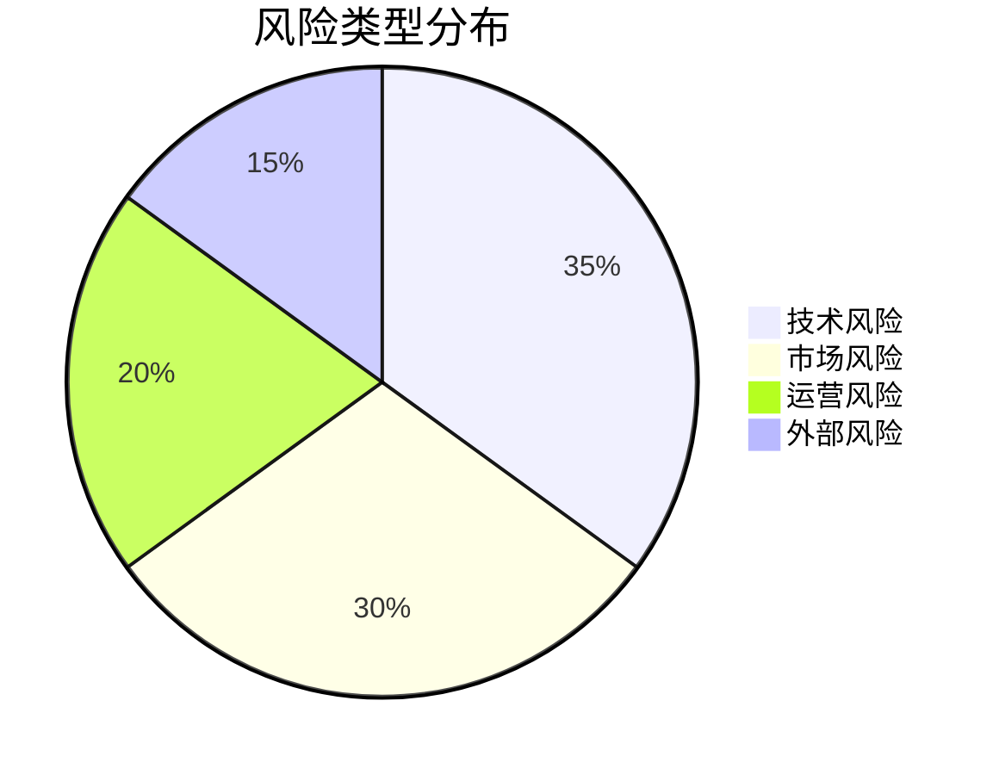
```mermaid
pie title 风险类型分布
    "技术风险" : 35
    "市场风险" : 30
    "运营风险" : 20
    "外部风险" : 15
```

### 9.2 风险评估分析

**高风险**（发生概率>50%，影响程度>70%）：
- 市场竞争加剧：AI平台市场竞争激烈，大厂可能推出类似产品
- 技术更新迭代：AI技术发展迅速，需要持续投入研发保持竞争力

**中风险**（发生概率30-50%，影响程度50-70%）：
- 客户需求变化：B端企业需求可能发生变化，需要快速响应
- 团队规模限制：小团队可能难以同时处理多个客户需求
- 资金不足风险：如果市场推广效果不佳，可能面临资金压力

**低风险**（发生概率<30%，影响程度<50%）：
- 安全漏洞风险：通过严格的安全测试可以有效控制
- 政策变化风险：项目符合当前政策导向，政策风险较低
- 供应链中断：主要依赖云服务，供应链风险相对较低

### 9.3 风险应对策略

**技术风险应对**：
- 建立持续集成/持续部署（CI/CD）流程，确保代码质量
- 实施全面的安全测试和渗透测试，及时发现和修复漏洞
- 保持对最新AI技术的关注，定期更新和优化算法
- 建立技术储备，提前布局下一代技术

**市场风险应对**：
- 差异化竞争策略，聚焦特定细分市场和应用场景
- 建立客户反馈机制，快速响应需求变化
- 灵活的定价策略，根据客户规模和需求提供不同套餐
- 多渠道市场推广，降低对单一渠道的依赖

**运营风险应对**：
- 建立合作伙伴网络，通过外包和合作弥补团队规模限制
- 严格控制成本，保持充足的现金流
- 建立应急预案，应对可能出现的各种运营问题
- 聘请法律顾问，确保合规经营

```mermaid
flowchart TD
    A[风险识别] --> B[风险评估]
    B --> C{风险等级}
    C -->|高风险| D[重点应对]
    C -->|中风险| E[常规应对]
    C -->|低风险| F[监控应对]
    D --> G[制定详细预案]
    E --> H[制定基本预案]
    F --> I[定期监控]
```

---

## 第十章 研究结论及建议

### 10.1 可行性结论

经过全面的可行性分析，本项目具有高度的可行性，主要体现在：

**技术可行性**：项目采用成熟的技术栈和创新的三层架构设计，技术方案合理可行。团队具备相应的技术能力，能够确保项目的顺利实施。

**市场可行性**：项目准确把握了B端企业对低门槛AI解决方案的迫切需求，市场前景广阔。竞品分析显示，项目在功能、价格、易用性等方面具有竞争优势。

**财务可行性**：项目投资规模小（10万元以下），投资回收期短（约11个月），内部收益率高（185%），财务风险低，具有良好的投资价值。

**政策可行性**：项目符合国家信创产业发展战略和人工智能发展规划，能够获得政策支持，具有良好的政策环境。

```mermaid
xychart-beta
    title "可行性综合评估"
    x-axis ["技术", "市场", "财务", "政策"]
    y-axis "可行性评分" 0 --> 100
    bar [85, 88, 92, 90]
```

### 10.2 实施建议

为确保项目成功实施，提出以下建议：

**技术实施建议**：
- 优先完善核心功能，确保系统稳定性和性能
- 建立完善的测试体系，确保产品质量
- 重视安全设计，确保数据安全和隐私保护
- 保持技术前瞻性，为后续版本升级预留空间

**市场实施建议**：
- 聚焦特定细分市场，避免与大厂正面竞争
- 建立标杆客户案例，形成示范效应
- 重视客户体验，建立良好的口碑
- 积极参与行业展会和论坛，提升品牌知名度

**运营管理建议**：
- 严格控制成本，确保资金使用效率
- 建立灵活的团队协作机制，提高工作效率
- 重视知识产权保护，及时申请相关专利和软著
- 建立客户成功团队，确保客户满意度

### 10.3 后续工作安排

**短期工作**（2025年12月-2026年3月）：
- 完成项目剩余开发和优化工作
- 完善技术文档和用户手册
- 进行全面系统测试和Beta测试
- 制定详细的市场推广计划

**中期工作**（2026年4月-2026年12月）：
- 正式发布产品，开始商业化运营
- 获取首批客户，建立标杆案例
- 收集用户反馈，规划v2.0.0版本
- 建立销售渠道和合作伙伴网络

**长期工作**（2027年及以后）：
- 持续产品迭代和功能扩展
- 扩大市场份额，提升品牌影响力
- 探索新的商业模式和收入来源
- 考虑开源部分组件，建立开发者社区

```mermaid
flowchart TD
    A[短期工作] --> B[中期工作]
    B --> C[长期工作]
    A -->|产品完善| D[商业化启动]
    B -->|市场拓展| E[品牌建设]
    C -->|生态构建| F[持续发展]
```