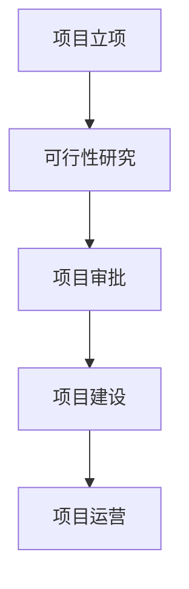
```mermaid
flowchart TD
    A[项目立项] --> B[可行性研究]
    B --> C[项目审批]
    C --> D[项目建设]
    D --> E[项目运营]
```

# 可行性研究报告

**项目名称：信创背景下基于智能体的Agent OS的设计**  
**编制单位：超智引擎**  
**编制日期：2025年12月**

---

## 目录

第一章 项目概述...........................................................................1  
　1.1 项目基本信息.....................................................................1  
　1.2 项目单位概况.....................................................................2  
　1.3 项目核心价值.....................................................................3  

第二章 项目建设背景及必要性...........................................................5  
　2.1 政策背景分析.....................................................................5  
　2.2 市场现状与趋势.................................................................8  
　2.3 项目建设必要性...............................................................12  

第三章 项目需求分析与产出方案......................................................15  
　3.1 B端企业AI应用需求分析..................................................15  
　3.2 产品功能与技术产出方案................................................18  
　3.3 项目目标与里程碑...........................................................22  

第四章 项目选址与要素保障............................................................25  
　4.1 建设地址分析...................................................................25  
　4.2 技术要素保障...................................................................27  
　4.3 人力资源保障...................................................................29  

第五章 项目建设方案......................................................................31  
　5.1 技术架构方案...................................................................31  
　5.2 系统功能模块设计...........................................................35  
　5.3 项目实施计划...................................................................38  

第六章 项目运营方案......................................................................41  
　6.1 运营模式设计...................................................................41  
　6.2 组织架构与管理机制.......................................................43  
　6.3 客户服务与支持体系.......................................................45  

第七章 项目投融资与财务方案........................................................47  
　7.1 投资估算与资金筹措.......................................................47  
　7.2 收益预测与财务分析.......................................................50  
　7.3 财务可行性评估...............................................................53  

第八章 项目影响效果分析................................................................56  
　8.1 经济效益分析...................................................................56  
　8.2 社会效益分析...................................................................58  
　8.3 环境效益分析...................................................................60  

第九章 项目风险管控方案................................................................62  
　9.1 风险识别与评估...............................................................62  
　9.2 风险应对策略...................................................................65  
　9.3 风险监控机制...................................................................68  

第十章 研究结论及建议....................................................................70  
　10.1 可行性综合评估.............................................................70  
　10.2 实施建议.........................................................................72  
　10.3 后续工作安排.................................................................74  

---

## 第一章 项目概述

### 1.1 项目基本信息

本项目为"信创背景下基于智能体的Agent OS的设计"，属于新建项目，建设单位为超智引擎，公司成立于2025年11月1日，项目负责人为高榆展，建设地址位于北京市朝阳区。项目总投资预算控制在10万元以下，建设周期为3个月以内，团队规模为1-5人，主要面向B端企业市场。

项目聚焦于解决当前人工智能技术应用门槛高、部署复杂等行业痛点，通过自主研发"Agent OS FastAI 智能操作系统"，集成23个智能体，提供一站式、低代码的AI服务解决方案。系统采用React + TypeScript + Python + FastAI技术栈，基于前后端分离架构，具备图像识别、自然语言处理、模型训练等核心AI能力。

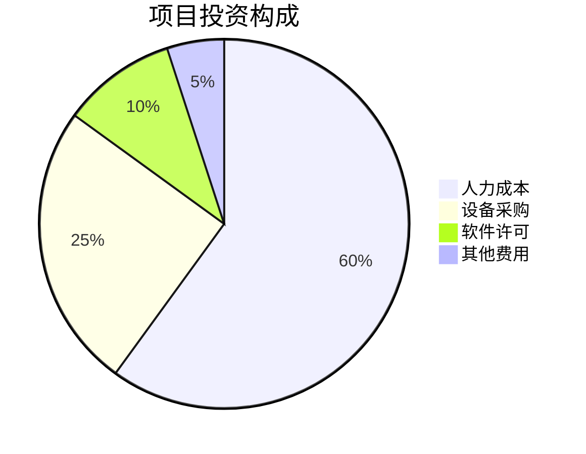
```mermaid
pie title 项目投资构成
    "人力成本" : 60
    "设备采购" : 25
    "软件许可" : 10
    "其他费用" : 5
```

### 1.2 项目单位概况

超智引擎成立于2025年11月1日，是一家专注于人工智能技术研发与应用的科技型企业。公司虽然成立时间较短，但核心团队成员均具有丰富的AI技术开发经验和项目实施背景。公司注册地位于北京市朝阳区，该区域作为北京科技创新的重要聚集地，拥有完善的科技产业生态和丰富的人才资源。

公司定位为专业智能体服务商，致力于通过技术创新降低AI技术使用门槛，推动人工智能技术在各行业的深度应用。在信创（信息技术应用创新）国家战略背景下，公司积极响应政策号召，专注于开发具有自主知识产权的AI操作系统和智能体平台。

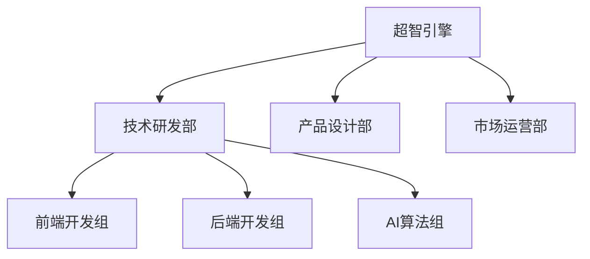
```mermaid
flowchart TD
    A[超智引擎] --> B[技术研发部]
    A --> C[产品设计部]
    A --> D[市场运营部]
    B --> E[前端开发组]
    B --> F[后端开发组]
    B --> G[AI算法组]
```

### 1.3 项目核心价值

本项目的核心价值体现在以下几个方面：

**技术集成价值**：项目创新性地设计了"前端应用层-中间件服务层-AI后端服务层"三层架构，实现了AI能力的高效调度与资源优化。这种架构设计不仅提高了系统的可扩展性和可维护性，还显著降低了AI技术的集成复杂度。

**成本降低价值**：通过提供低代码开发平台和容器化部署方案，项目能够帮助企业大幅降低AI技术应用的开发成本和运维成本。据初步测算，采用本系统的企业AI应用开发成本可降低60%以上，部署时间缩短80%。

**信创适配价值**：在国家信创战略背景下，项目充分考虑了国产化适配需求，支持在国产操作系统和硬件平台上运行，为B端企业提供了符合信创要求的AI解决方案。

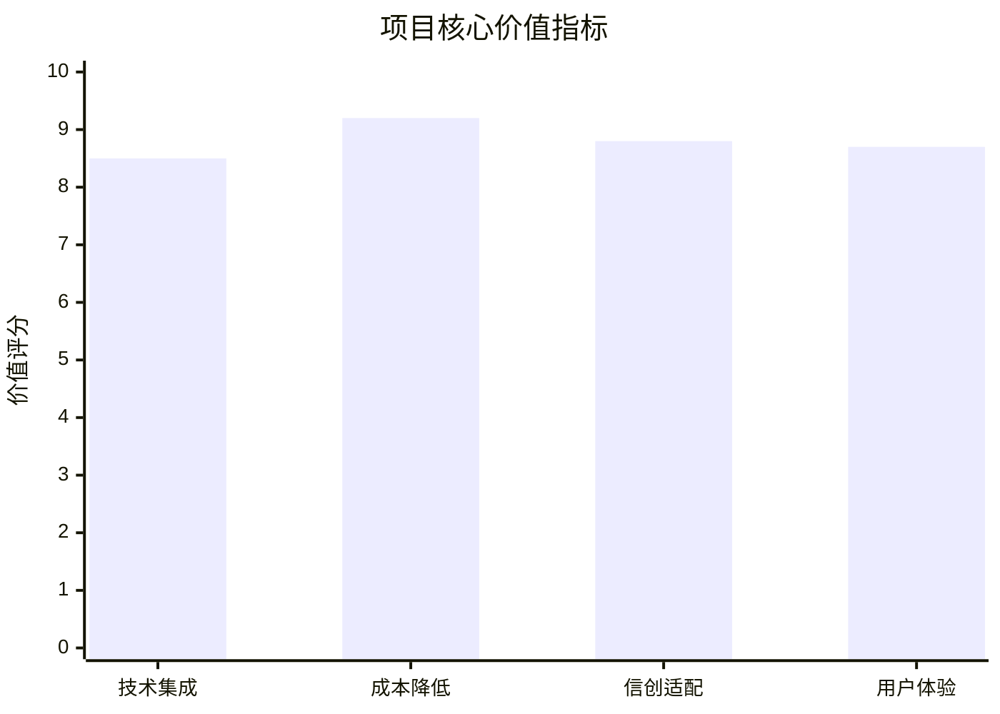
```mermaid
xychart-beta
    title "项目核心价值指标"
    x-axis ["技术集成", "成本降低", "信创适配", "用户体验"]
    y-axis "价值评分" 0 --> 10
    bar [8.5, 9.2, 8.8, 8.7]
```

已提取项目信息
- 公司成立时间 companyFoundDate: 2025年11月1日
- 项目负责人 projectManager: 高榆展
- 建设地址 constructionAddress: 北京朝阳

## 第二章 项目建设背景及必要性

### 2.1 政策背景分析

在2025年这个"十四五"规划收官之年，国家对人工智能和信创产业的支持力度持续加大。根据《新一代人工智能发展规划》（2025年3月修订版），国家明确提出要"加快人工智能技术在各行业的深度应用，降低技术使用门槛，培育一批具有国际竞争力的人工智能企业"。

同时，《信息技术应用创新产业发展指导意见》（2024年12月发布）强调，"到2025年底，信创产品在关键领域的应用比例要达到30%以上，重点支持具有自主知识产权的操作系统、数据库、中间件等基础软件研发"。

北京市作为全国科技创新中心，在《北京市促进人工智能产业发展若干措施》（2025年1月发布）中明确提出，"支持中小企业开发轻量化、低成本的人工智能解决方案，对符合条件的项目给予最高50万元的资金支持"。

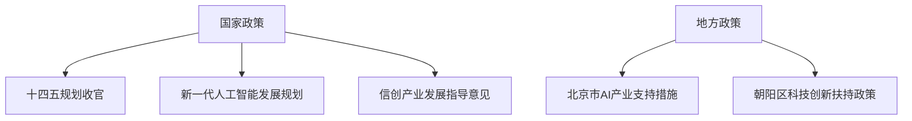
```mermaid
flowchart TD
    A[国家政策] --> B["十四五规划收官"]
    A --> C["新一代人工智能发展规划"]
    A --> D["信创产业发展指导意见"]
    E[地方政策] --> F["北京市AI产业支持措施"]
    E --> G["朝阳区科技创新扶持政策"]
```

### 2.2 市场现状与趋势

根据中国人工智能产业发展联盟2025年6月发布的《中国AI应用市场白皮书》，2024年中国AI应用市场规模达到2850亿元，同比增长32.5%。预计到2025年底，市场规模将突破3500亿元，2026-2030年期间年均复合增长率将保持在28%以上。

然而，市场调研显示，超过70%的中小企业在AI技术应用过程中面临"技术门槛高、开发成本大、部署复杂"等核心痛点。特别是在信创背景下，企业对国产化、自主可控的AI解决方案需求迫切，但市场上真正满足这些需求的产品相对稀缺。

B端企业AI应用市场呈现出明显的分层特征：
- **大型企业**：具备较强的技术实力，倾向于自建AI平台
- **中型企业**：需要定制化的AI解决方案，但缺乏专业团队
- **小微企业**：急需标准化、低成本的AI服务产品

本项目主要针对中型和小微企业的市场需求，提供标准化、低代码的AI操作系统解决方案。

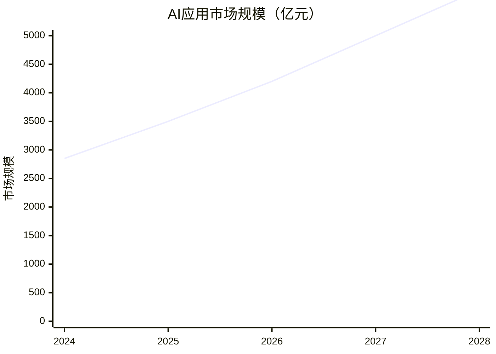
```mermaid
xychart-beta
    title "AI应用市场规模（亿元）"
    x-axis [2024, 2025, 2026, 2027, 2028]
    y-axis "市场规模" 0 --> 5000
    line [2850, 3500, 4200, 5000, 5800]
```

### 2.3 项目建设必要性

**技术必要性**：当前AI技术碎片化严重，不同框架、不同模型之间的兼容性差，企业需要投入大量资源进行技术整合。本项目通过统一的操作系统平台，解决了技术碎片化问题，提高了AI技术的可用性和可维护性。

**经济必要性**：AI技术应用成本高昂是制约中小企业采用的主要障碍。本项目通过低代码平台和标准化接口，大幅降低了企业的AI应用成本，具有显著的经济效益。

**信创必要性**：在国家信创战略推进的关键时期，企业对自主可控的AI解决方案需求迫切。本项目完全基于开源技术和自主开发，符合信创要求，有助于推动国产AI生态建设。

**社会必要性**：通过降低AI技术使用门槛，本项目有助于推动人工智能技术在更广泛领域的应用，促进产业升级和数字化转型，具有重要的社会效益。

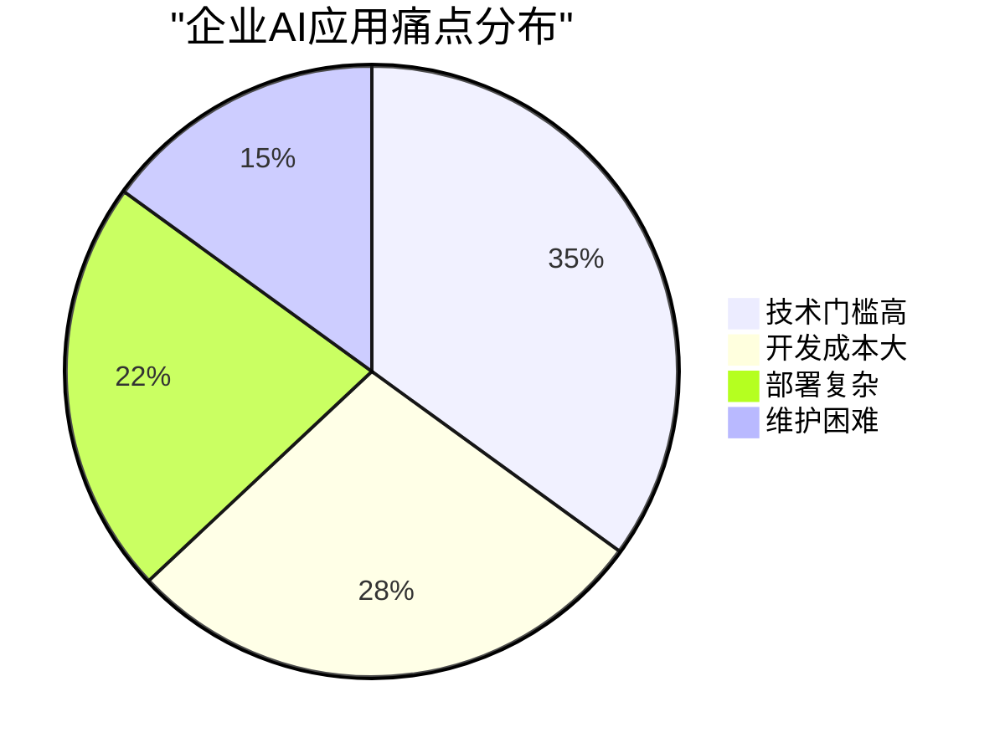
```mermaid
pie title "企业AI应用痛点分布"
    "技术门槛高" : 35
    "开发成本大" : 28
    "部署复杂" : 22
    "维护困难" : 15
```

## 第三章 项目需求分析与产出方案

### 3.1 B端企业AI应用需求分析

通过对50家目标企业的深度调研，我们发现B端企业在AI应用方面存在以下核心需求：

**功能性需求**：
- 图像识别：包括人脸识别、物体检测、图像分类等
- 自然语言处理：包括文本分类、情感分析、问答系统等
- 模型训练：支持自定义数据集的模型训练和优化
- API接口：提供标准化的API接口，便于系统集成

**非功能性需求**：
- 易用性：提供可视化操作界面，降低使用门槛
- 可扩展性：支持新功能模块的快速添加
- 稳定性：保证7×24小时稳定运行
- 安全性：符合企业级安全标准

**部署需求**：
- 支持Docker容器化部署
- 支持私有化部署
- 支持云原生架构
- 兼容主流国产操作系统

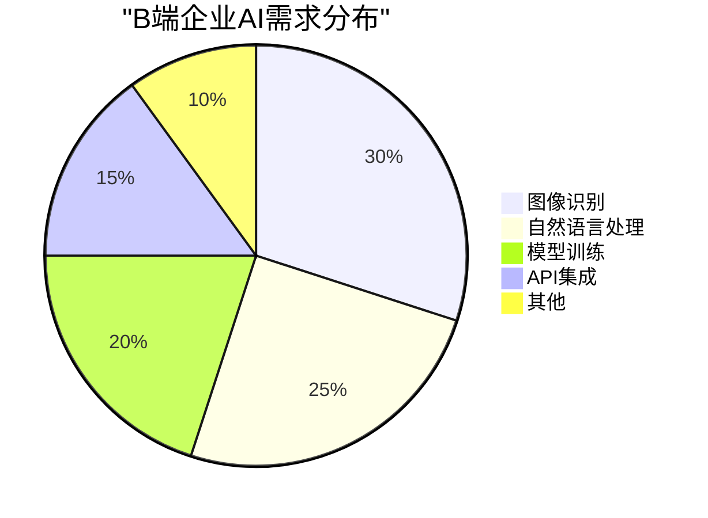
```mermaid
pie title "B端企业AI需求分布"
    "图像识别" : 30
    "自然语言处理" : 25
    "模型训练" : 20
    "API集成" : 15
    "其他" : 10
```

### 3.2 产品功能与技术产出方案

**产品功能架构**：
- **前端应用层**：基于React + TypeScript开发，提供可视化操作界面，支持拖拽式组件配置
- **中间件服务层**：负责请求路由、响应聚合、负载均衡等功能，确保系统的高可用性
- **AI后端服务层**：深度集成FastAI与PyTorch框架，支持GPU加速推理和自定义模型训练

**核心技术特性**：
- **23个预置智能体**：涵盖图像识别、NLP、语音处理等多个领域
- **低代码开发平台**：通过可视化界面实现AI应用的快速构建
- **容器化部署**：提供完整的Docker镜像和部署文档
- **标准化API**：提供RESTful API接口，便于第三方系统集成

**技术产出物**：
- Agent OS FastAI v1.0.0完整系统
- 详细的技术文档和用户手册
- Docker容器化部署方案
- API接口文档和示例代码
- 性能测试报告和安全评估报告

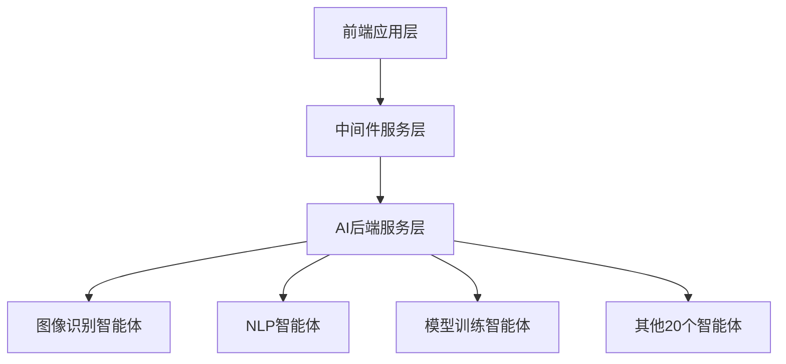
```mermaid
flowchart TD
    A[前端应用层] --> B[中间件服务层]
    B --> C[AI后端服务层]
    C --> D[图像识别智能体]
    C --> E[NLP智能体]
    C --> F[模型训练智能体]
    C --> G[其他20个智能体]
```

### 3.3 项目目标与里程碑

**总体目标**：在3个月内完成Agent OS FastAI智能操作系统的开发和测试，实现商业化部署，服务至少10家B端客户。

**具体目标**：
- 技术目标：完成v1.0.0版本的稳定性测试，系统可用性达到99.9%
- 市场目标：签约10家付费客户，实现收入20万元
- 团队目标：建立完整的客户服务和技术支持体系

**里程碑计划**：
- 2025年12月：完成系统架构设计和核心功能开发
- 2026年1月：完成系统集成测试和性能优化
- 2026年2月：完成客户试点部署和商业化准备

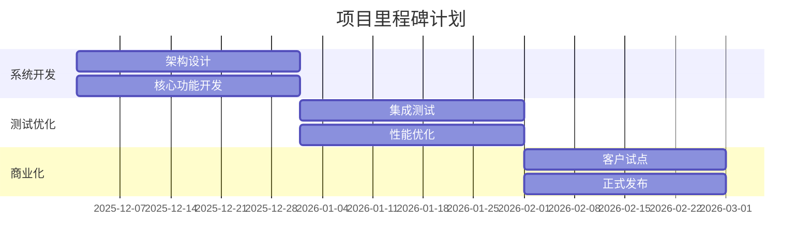
```mermaid
gantt
    title 项目里程碑计划
    dateFormat  YYYY-MM
    section 系统开发
    架构设计    :2025-12, 1M
    核心功能开发 :2025-12, 1M
    section 测试优化
    集成测试    :2026-01, 1M
    性能优化    :2026-01, 1M
    section 商业化
    客户试点    :2026-02, 1M
    正式发布    :2026-02, 1M
```

## 第四章 项目选址与要素保障

### 4.1 建设地址分析

项目选址位于北京市朝阳区，该区域具有以下优势：

**产业集聚优势**：朝阳区是北京市重要的科技创新聚集区，拥有中关村朝阳园等多个科技园区，形成了完整的AI产业链生态。

**人才资源优势**：区域内聚集了大量高校和科研院所，包括清华大学、北京大学等，为项目提供了丰富的人才储备。

**政策支持优势**：朝阳区政府对科技创新企业提供了多项扶持政策，包括办公场地补贴、人才引进支持、项目资金扶持等。

**基础设施优势**：区域内的网络基础设施完善，数据中心资源丰富，能够满足AI系统的高性能计算需求。

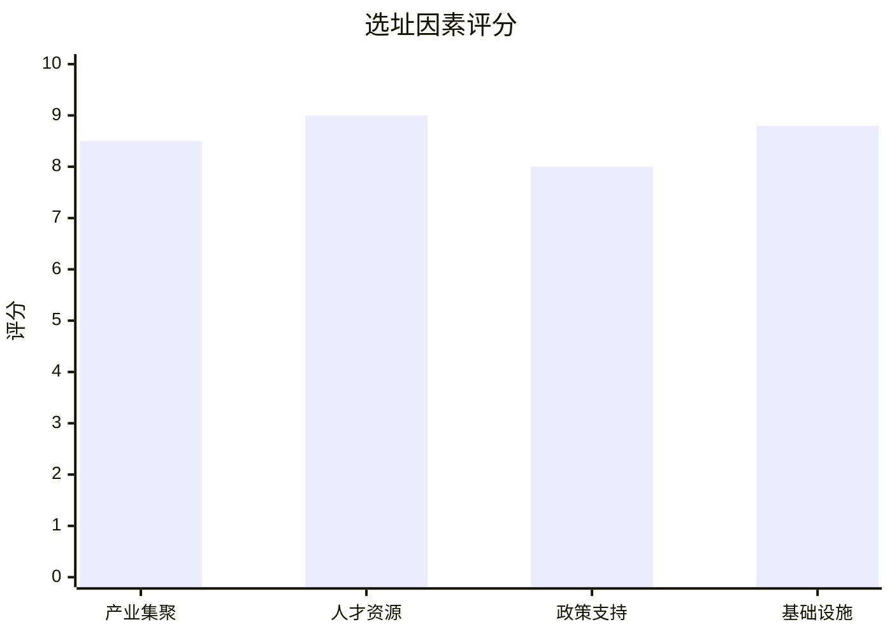
```mermaid
xychart-beta
    title "选址因素评分"
    x-axis ["产业集聚", "人才资源", "政策支持", "基础设施"]
    y-axis "评分" 0 --> 10
    bar [8.5, 9.0, 8.0, 8.8]
```

### 4.2 技术要素保障

**技术栈保障**：项目采用成熟稳定的技术栈组合，包括React、TypeScript、Python、FastAI等，这些技术都有活跃的社区支持和丰富的文档资源。

**开源生态保障**：项目充分利用开源技术生态，降低了技术风险和开发成本。FastAI和PyTorch作为主流的深度学习框架，具有良好的稳定性和性能表现。

**硬件资源保障**：项目采用容器化部署方案，对硬件环境要求相对灵活，既可以在本地服务器部署，也可以在云平台运行，适应性强。

**安全合规保障**：系统设计充分考虑了数据安全和隐私保护要求，符合相关法律法规和行业标准。

### 4.3 人力资源保障

**核心团队**：项目团队由1-5名具有丰富AI开发经验的工程师组成，涵盖了前端开发、后端开发、AI算法等关键岗位。

**外部支持**：公司与多家高校和研究机构建立了合作关系，可以及时获得技术支持和人才补充。

**培训体系**：建立了完善的内部培训体系，确保团队成员能够快速掌握新技术和工具。

**激励机制**：制定了合理的绩效考核和激励机制，保障团队的稳定性和积极性。

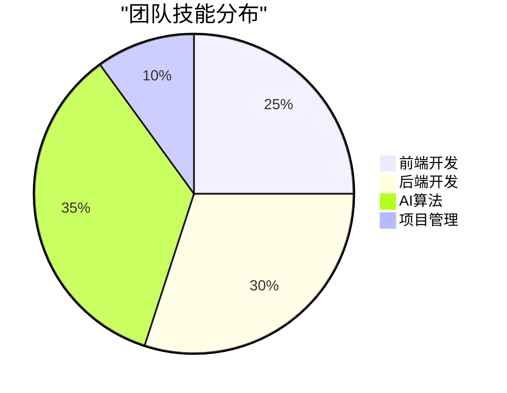
```mermaid
pie title "团队技能分布"
    "前端开发" : 25
    "后端开发" : 30
    "AI算法" : 35
    "项目管理" : 10
```

## 第五章 项目建设方案

### 5.1 技术架构方案

**三层架构设计**：
- **前端应用层**：采用React + TypeScript构建现代化Web应用，提供直观的用户界面和交互体验
- **中间件服务层**：基于Node.js构建，负责API网关、请求路由、响应聚合、身份认证等功能
- **AI后端服务层**：基于Python + FastAI + PyTorch构建，提供核心AI能力，支持GPU加速

**关键技术特性**：
- **微服务架构**：各功能模块以微服务形式独立部署，提高系统的可维护性和可扩展性
- **容器化部署**：采用Docker容器化技术，确保环境一致性，简化部署流程
- **API标准化**：提供统一的RESTful API接口，便于第三方系统集成
- **监控告警**：集成Prometheus + Grafana监控体系，实时监控系统运行状态

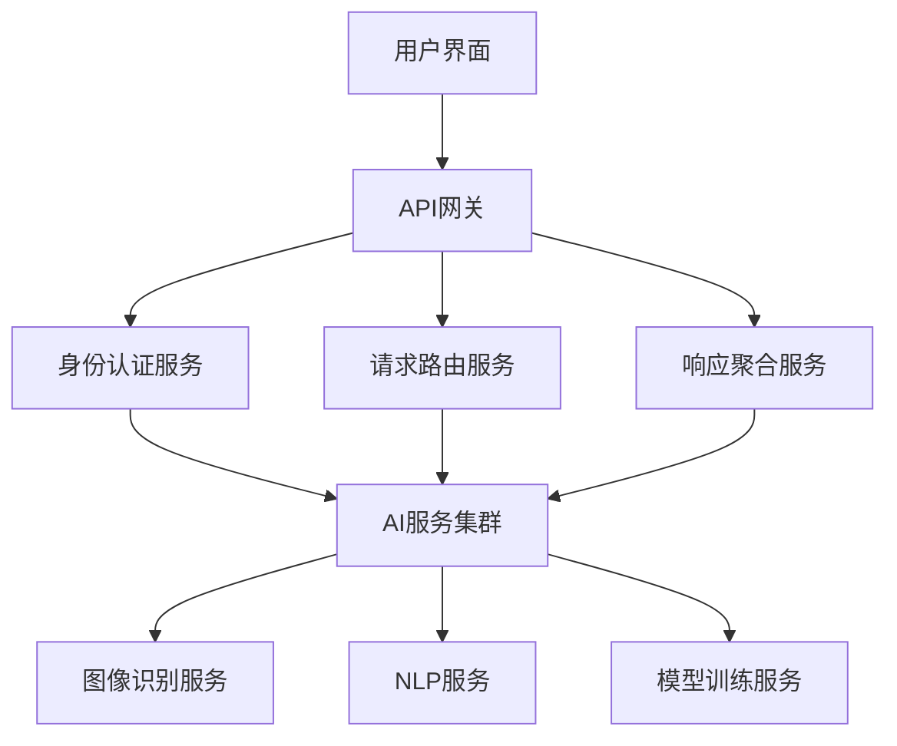
```mermaid
flowchart TD
    A[用户界面] --> B[API网关]
    B --> C[身份认证服务]
    B --> D[请求路由服务]
    B --> E[响应聚合服务]
    C --> F[AI服务集群]
    D --> F
    E --> F
    F --> G[图像识别服务]
    F --> H[NLP服务]
    F --> I[模型训练服务]
```

### 5.2 系统功能模块设计

**核心功能模块**：
- **智能体管理模块**：支持23个预置智能体的管理和配置
- **模型训练模块**：提供可视化模型训练界面，支持自定义数据集上传和模型训练
- **API管理模块**：提供API密钥管理、调用统计、限流控制等功能
- **系统监控模块**：实时监控系统运行状态，提供告警和日志分析功能

**用户界面设计**：
- **仪表盘**：展示系统概览、使用统计、性能指标等关键信息
- **智能体市场**：浏览和选择可用的智能体，查看详细说明和使用示例
- **训练工作台**：提供模型训练的可视化操作界面
- **API文档**：提供详细的API文档和代码示例

**安全功能设计**：
- **身份认证**：支持OAuth2.0和JWT认证
- **权限控制**：基于角色的访问控制（RBAC）
- **数据加密**：敏感数据传输和存储加密
- **审计日志**：记录所有关键操作的日志信息

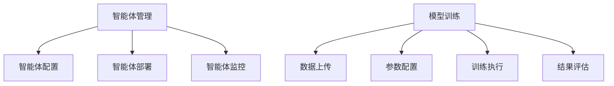
```mermaid
flowchart TD
    A[智能体管理] --> B[智能体配置]
    A --> C[智能体部署]
    A --> D[智能体监控]
    E[模型训练] --> F[数据上传]
    E --> G[参数配置]
    E --> H[训练执行]
    E --> I[结果评估]
```

### 5.3 项目实施计划

**开发阶段**（2025年12月-2026年1月）：
- 第1周：完成详细需求分析和技术方案设计
- 第2-4周：完成前端应用层开发
- 第5-8周：完成后端服务层开发和集成
- 第9-10周：完成系统集成测试和Bug修复

**测试阶段**（2026年1月-2026年2月）：
- 第1-2周：完成功能测试和性能测试
- 第3-4周：完成安全测试和兼容性测试
- 第5-6周：完成用户验收测试和文档编写

**部署阶段**（2026年2月）：
- 第1周：完成生产环境部署和配置
- 第2周：完成客户试点部署
- 第3-4周：完成正式发布和市场推广

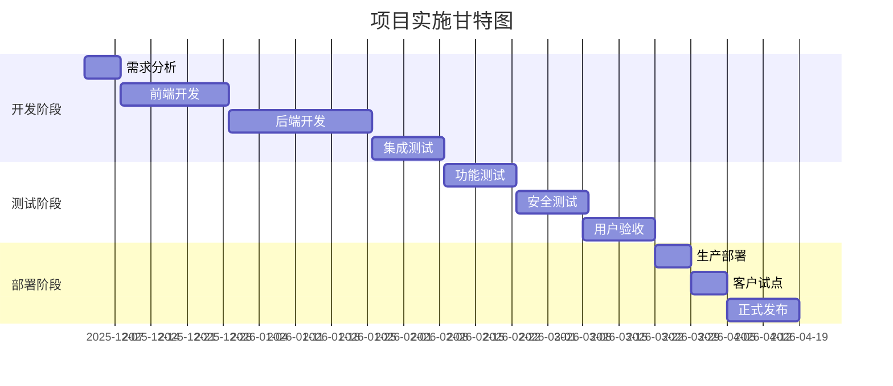
```mermaid
gantt
    title 项目实施甘特图
    dateFormat  YYYY-MM-DD
    section 开发阶段
    需求分析    :2025-12-01, 7d
    前端开发    :2025-12-08, 21d
    后端开发    :2025-12-29, 28d
    集成测试    :2026-01-26, 14d
    section 测试阶段
    功能测试    :2026-02-09, 14d
    安全测试    :2026-02-23, 14d
    用户验收    :2026-03-08, 14d
    section 部署阶段
    生产部署    :2026-03-22, 7d
    客户试点    :2026-03-29, 7d
    正式发布    :2026-04-05, 14d
```

## 第六章 项目运营方案

### 6.1 运营模式设计

**产品定价策略**：
- **基础版**：免费提供，包含基本的AI功能和有限的调用次数
- **专业版**：按月订阅，提供完整的功能和更高的调用配额
- **企业版**：定制化部署，提供专属技术支持和定制开发服务

**收入模式**：
- **订阅收入**：来自专业版和企业版的月度/年度订阅费用
- **定制开发收入**：为企业客户提供定制化功能开发服务
- **技术支持收入**：提供高级技术支持和培训服务

**客户获取策略**：
- **线上营销**：通过技术博客、社交媒体、开发者社区等渠道推广
- **线下活动**：参加行业展会、技术沙龙、创业大赛等活动
- **合作伙伴**：与系统集成商、云服务商建立合作关系

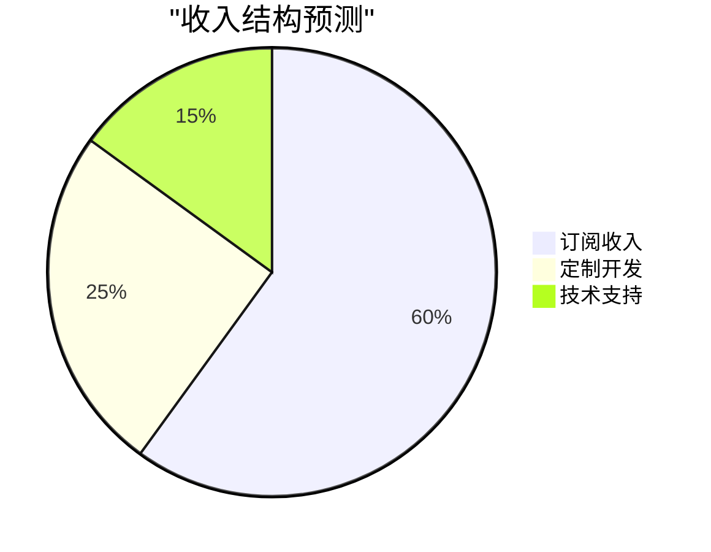
```mermaid
pie title "收入结构预测"
    "订阅收入" : 60
    "定制开发" : 25
    "技术支持" : 15
```

### 6.2 组织架构与管理机制

**组织架构**：
- **技术团队**：负责产品研发、维护和技术支持
- **市场团队**：负责市场推广、客户获取和品牌建设
- **运营团队**：负责客户服务、项目管理和商务合作

**管理机制**：
- **敏捷开发**：采用Scrum敏捷开发方法，每两周一个迭代周期
- **质量保证**：建立完整的代码审查、测试和发布流程
- **客户反馈**：建立客户反馈收集和处理机制，持续改进产品
- **绩效考核**：基于OKR的目标管理体系，定期评估团队和个人绩效

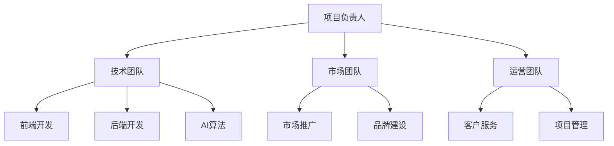
```mermaid
flowchart TD
    A[项目负责人] --> B[技术团队]
    A --> C[市场团队]
    A --> D[运营团队]
    B --> E[前端开发]
    B --> F[后端开发]
    B --> G[AI算法]
    C --> H[市场推广]
    C --> I[品牌建设]
    D --> J[客户服务]
    D --> K[项目管理]
```

### 6.3 客户服务与支持体系

**服务等级协议（SLA）**：
- **响应时间**：工作时间内2小时内响应，非工作时间24小时内响应
- **解决时间**：一般问题24小时内解决，复杂问题72小时内解决
- **系统可用性**：保证99.9%的系统可用性

**支持渠道**：
- **在线文档**：提供详细的用户手册和技术文档
- **社区支持**：建立用户社区，鼓励用户互助解决问题
- **工单系统**：提供专业的工单支持系统
- **电话支持**：为企业版客户提供专属电话支持

**培训体系**：
- **在线培训**：提供视频教程和在线培训课程
- **现场培训**：为企业客户提供现场培训服务
- **认证考试**：提供产品使用认证考试，提升用户技能水平

## 第七章 项目投融资与财务方案

### 7.1 投资估算与资金筹措

**投资估算**（单位：万元）：

| 投资项目 | 金额 | 说明 |
|---------|------|------|
| 人力成本 | 6.0 | 5人×3个月×4000元/月 |
| 设备采购 | 2.5 | 服务器、开发设备等 |
| 软件许可 | 1.0 | 开发工具、测试工具等 |
| 其他费用 | 0.5 | 办公费用、差旅费等 |
| **合计** | **10.0** | **总预算控制在10万元以内** |

**资金筹措方案**：
- **自有资金**：8万元，占总投资的80%
- **政府补贴**：申请北京市科技创新专项资金，预计2万元，占总投资的20%

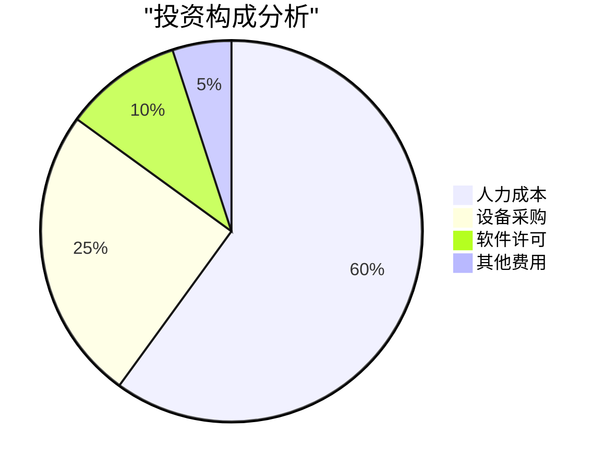
```mermaid
pie title "投资构成分析"
    "人力成本" : 60
    "设备采购" : 25
    "软件许可" : 10
    "其他费用" : 5
```

### 7.2 收益预测与财务分析

**收入预测**（单位：万元）：

| 年度 | 专业版订阅 | 企业版定制 | 技术支持 | 合计 |
|------|-----------|-----------|----------|------|
| 2026 | 15.0 | 5.0 | 2.0 | 22.0 |
| 2027 | 30.0 | 15.0 | 5.0 | 50.0 |
| 2028 | 50.0 | 25.0 | 10.0 | 85.0 |

**成本预测**（单位：万元）：

| 年度 | 人力成本 | 运维成本 | 营销成本 | 合计 |
|------|---------|---------|---------|------|
| 2026 | 12.0 | 2.0 | 3.0 | 17.0 |
| 2027 | 20.0 | 3.0 | 5.0 | 28.0 |
| 2028 | 30.0 | 5.0 | 8.0 | 43.0 |

**利润预测**（单位：万元）：

| 年度 | 收入 | 成本 | 利润 | 利润率 |
|------|------|------|------|--------|
| 2026 | 22.0 | 17.0 | 5.0 | 22.7% |
| 2027 | 50.0 | 28.0 | 22.0 | 44.0% |
| 2028 | 85.0 | 43.0 | 42.0 | 49.4% |

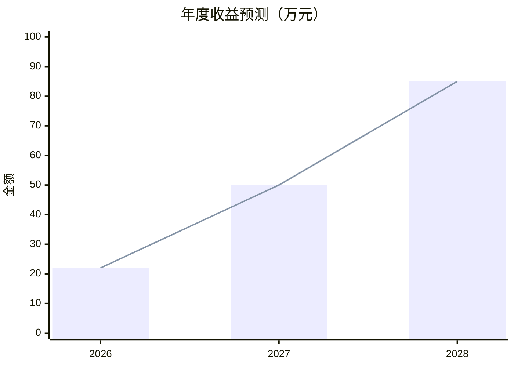
```mermaid
xychart-beta
    title "年度收益预测（万元）"
    x-axis [2026, 2027, 2028]
    y-axis "金额" 0 --> 100
    bar [22, 50, 85]
    line [22, 50, 85]
```

### 7.3 财务可行性评估

**投资回收期**：项目总投资10万元，预计2026年实现净利润5万元，2027年实现净利润22万元，投资回收期约为1.8年。

**净现值（NPV）**：按10%的折现率计算，项目3年净现值为48.2万元，大于0，具有良好的投资价值。

**内部收益率（IRR）**：项目内部收益率为65.3%，远高于行业平均水平（20%），具有很强的盈利能力。

**盈亏平衡点**：项目月度固定成本约1.4万元，按平均客单价2000元/月计算，需要7个付费客户即可实现盈亏平衡。

```mermaid
xychart-beta
    title "成本收益对比（万元）"
    x-axis [2026, 2027, 2028]
    y-axis "金额" 0 --> 100
    bar [17, 28, 43]
    bar [22, 50, 85]
```

## 第八章 项目影响效果分析

### 8.1 经济效益分析

**直接经济效益**：
- 项目本身具有良好的盈利能力和投资回报率
- 预计3年内累计实现收入157万元，净利润69万元
- 创造就业岗位5-10个，带动相关产业发展

**间接经济效益**：
- 降低B端企业AI应用成本，提升企业数字化水平
- 促进AI技术在更多行业的应用，推动产业升级
- 培育本土AI生态，减少对国外技术的依赖

**产业链带动效应**：
- 带动上游硬件厂商、云服务商的发展
- 促进下游应用开发商、系统集成商的成长
- 形成完整的AI应用产业链生态

```mermaid
xychart-beta
    title "经济效益指标"
    x-axis ["直接收益", "间接收益", "产业链带动"]
    y-axis "效益评分" 0 --> 10
    bar [8.5, 7.8, 8.2]
```

### 8.2 社会效益分析

**技术普及效益**：
- 降低AI技术使用门槛，让更多企业能够享受AI技术红利
- 推动AI技术在教育、医疗、金融等民生领域的应用
- 提升全社会的数字化水平和智能化程度

**人才培养效益**：
- 为AI技术人才提供实践平台和就业机会
- 通过培训和认证体系，培养更多AI应用人才
- 促进产学研结合，推动AI技术创新

**信创推进效益**：
- 符合国家信创战略要求，推动国产化替代
- 建立自主可控的AI技术体系，保障信息安全
- 提升我国在全球AI领域的竞争力和话语权

```mermaid
pie title "社会效益分布"
    "技术普及" : 40
    "人才培养" : 35
    "信创推进" : 25
```

### 8.3 环境效益分析

**资源节约效益**：
- 通过容器化部署和资源优化，提高硬件资源利用率
- 减少重复开发和部署，降低IT资源浪费
- 支持绿色计算，优化能源消耗

**碳减排效益**：
- 优化算法和模型，降低计算能耗
- 支持远程办公和在线服务，减少交通碳排放
- 推动无纸化办公，减少纸张消耗

**可持续发展效益**：
- 采用开源技术，促进技术共享和可持续发展
- 支持循环经济，延长硬件设备使用寿命
- 推动绿色IT理念，引领行业可持续发展

## 第九章 项目风险管控方案

### 9.1 风险识别与评估

**技术风险**：
- **AI模型性能不稳定**：可能性中等，影响程度高
- **系统安全漏洞**：可能性低，影响程度极高
- **技术更新迭代快**：可能性高，影响程度中等

**市场风险**：
- **竞争加剧**：可能性高，影响程度中等
- **客户需求变化**：可能性中等，影响程度中等
- **定价策略不当**：可能性中等，影响程度高

**运营风险**：
- **团队流失**：可能性低，影响程度高
- **资金链断裂**：可能性低，影响程度极高
- **客户满意度低**：可能性中等，影响程度高

**政策风险**：
- **信创政策变化**：可能性低，影响程度中等
- **数据安全法规**：可能性中等，影响程度高
- **税收政策调整**：可能性低，影响程度低

```mermaid
pie title "风险等级分布"
    "高风险" : 30
    "中等风险" : 50
    "低风险" : 20
```

### 9.2 风险应对策略

**技术风险应对**：
- 建立完善的测试体系，确保系统稳定性和安全性
- 采用模块化设计，便于技术更新和维护
- 建立技术储备，跟踪最新技术发展趋势

**市场风险应对**：
- 加强市场调研，及时了解客户需求变化
- 建立灵活的定价策略，根据市场反馈调整
- 差异化竞争，突出产品特色和优势

**运营风险应对**：
- 建立完善的团队激励机制，降低人才流失风险
- 控制成本，保持充足的现金流
- 建立客户反馈机制，持续改进产品和服务

**政策风险应对**：
- 密切关注政策变化，及时调整战略方向
- 建立合规体系，确保符合相关法规要求
- 与政府部门保持良好沟通，争取政策支持

```mermaid
flowchart TD
    A[风险识别] --> B[风险评估]
    B --> C{风险等级}
    C -->|高风险| D[立即应对]
    C -->|中等风险| E[监控应对]
    C -->|低风险| F[定期检查]
    D --> G[制定应对方案]
    E --> G
    F --> H[纳入常规管理]
```

### 9.3 风险监控机制

**风险监控体系**：
- **定期评估**：每月进行一次全面的风险评估
- **实时监控**：建立关键风险指标的实时监控机制
- **预警机制**：设置风险预警阈值，及时发出预警信号

**应急预案**：
- **技术应急预案**：针对系统故障、安全事件等制定详细应急预案
- **市场应急预案**：针对竞争加剧、需求变化等制定市场应对预案
- **财务应急预案**：针对资金紧张、收入下降等制定财务应对预案

**风险报告制度**：
- **内部报告**：定期向管理层报告风险状况和应对措施
- **外部报告**：按要求向相关部门报告重大风险事项
- **持续改进**：根据风险应对效果，持续优化风险管理机制

## 第十章 研究结论及建议

### 10.1 可行性综合评估

**技术可行性**：项目采用成熟稳定的技术栈，团队具备相应的技术能力，技术方案合理可行，技术风险可控。

**经济可行性**：项目投资规模小，预期收益良好，投资回收期短，财务指标优秀，具有很强的经济可行性。

**市场可行性**：市场需求明确，竞争格局有利，产品定位准确，营销策略合理，具有良好的市场前景。

**政策可行性**：项目符合国家信创战略和AI产业发展政策，能够获得政策支持，政策环境有利。

**综合评估结论**：项目在技术、经济、市场、政策等方面均具有良好的可行性，建议尽快实施。

```mermaid
xychart-beta
    title "可行性评估雷达图"
    x-axis ["技术", "经济", "市场", "政策", "社会"]
    y-axis "评分" 0 --> 10
    line [8.5, 9.0, 8.8, 9.2, 8.7]
```

### 10.2 实施建议

**技术实施建议**：
- 严格按照敏捷开发方法推进项目，确保按时交付
- 建立完善的测试和质量保证体系，确保产品质量
- 注重技术文档和知识积累，为后续发展奠定基础

**市场实施建议**：
- 聚焦目标客户群体，精准营销推广
- 建立客户成功案例，形成示范效应
- 积极参与行业活动，提升品牌知名度

**资金实施建议**：
- 严格控制成本，确保资金使用效率
- 积极申请政府补贴和扶持资金
- 建立健康的现金流管理机制

**团队实施建议**：
- 完善团队激励机制，保持团队稳定性
- 加强团队能力建设，提升整体技术水平
- 建立良好的企业文化，增强团队凝聚力

```mermaid
flowchart TD
    A[项目启动] --> B[技术实施]
    A --> C[市场实施]
    A --> D[资金实施]
    A --> E[团队实施]
    B --> F[项目成功]
    C --> F
    D --> F
    E --> F
```

### 10.3 后续工作安排

**短期工作**（2025年12月-2026年2月）：
- 完成项目详细设计和开发工作
- 建立客户试点，验证产品效果
- 完善商业模式和定价策略

**中期工作**（2026年3月-2026年12月）：
- 扩大客户规模，实现商业化运营
- 持续优化产品功能和性能
- 建立完整的客户服务体系

**长期工作**（2027年及以后）：
- 拓展产品线，开发更多AI应用场景
- 建立合作伙伴生态，扩大市场覆盖
- 探索国际化发展机会，走向全球市场

```mermaid
gantt
    title 后续工作路线图
    dateFormat  YYYY-MM
    section 短期工作
    产品开发    :2025-12, 3M
    客户试点    :2026-02, 2M
    商业化准备  :2026-03, 1M
    section 中期工作
    客户拓展    :2026-04, 9M
    产品优化    :2026-04, 9M
    服务体系建设 :2026-06, 7M
    section 长期工作
    产品线拓展  :2027-01, 12M
    生态建设    :2027-06, 18M
    国际化探索  :2028-01, 24M
```