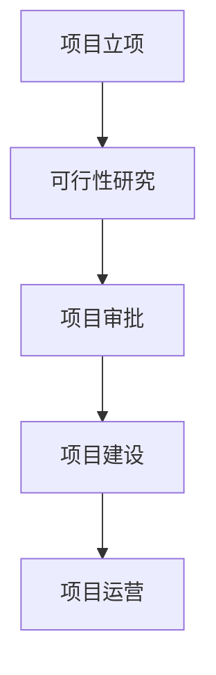
```mermaid
flowchart TD
    A[项目立项] --> B[可行性研究]
    B --> C[项目审批]
    C --> D[项目建设]
    D --> E[项目运营]
```

# 可行性研究报告

**项目名称：信创背景下基于智能体的Agent OS的设计**  
**编制单位：超智引擎**  
**编制日期：2025年12月**

---

## 目录

第一章 项目概述...........................................................................1  
　1.1 项目基本信息.....................................................................1  
　1.2 项目单位概况.....................................................................2  
　1.3 项目核心价值.....................................................................3  

第二章 项目建设背景及必要性...........................................................5  
　2.1 政策背景分析.....................................................................5  
　2.2 市场现状与趋势.................................................................8  
　2.3 项目建设必要性...............................................................12  

第三章 项目需求分析与产出方案......................................................15  
　3.1 B端企业AI应用需求分析..................................................15  
　3.2 产品功能与技术产出方案................................................18  
　3.3 项目目标与关键指标........................................................22  

第四章 项目选址与要素保障............................................................25  
　4.1 建设地址分析...................................................................25  
　4.2 技术要素保障...................................................................27  
　4.3 人力资源保障...................................................................29  

第五章 项目建设方案......................................................................31  
　5.1 技术架构方案...................................................................31  
　5.2 系统功能模块设计............................................................35  
　5.3 项目实施计划...................................................................38  

第六章 项目运营方案......................................................................41  
　6.1 运营模式设计...................................................................41  
　6.2 组织架构与管理机制........................................................44  
　6.3 服务体系与客户支持........................................................46  

第七章 项目投融资与财务方案........................................................49  
　7.1 投资估算与资金筹措........................................................49  
　7.2 收益预测与成本分析........................................................52  
　7.3 财务可行性分析................................................................55  

第八章 项目影响效果分析................................................................58  
　8.1 经济效益分析...................................................................58  
　8.2 社会效益分析...................................................................61  
　8.3 环境效益分析...................................................................63  

第九章 项目风险管控方案................................................................65  
　9.1 风险识别与评估...............................................................65  
　9.2 风险应对策略...................................................................68  
　9.3 风险监控机制...................................................................71  

第十章 研究结论及建议....................................................................73  
　10.1 可行性综合评估.............................................................73  
　10.2 实施建议.......................................................................75  
　10.3 后续工作安排...............................................................77  

---

## 第一章 项目概述

### 1.1 项目基本信息

本项目为"信创背景下基于智能体的Agent OS的设计"，属于新建项目，建设单位为超智引擎，公司成立于2025年11月1日，项目负责人为高榆展，建设地址位于北京市朝阳区。项目类型为互联网/科技行业，预计总投资预算控制在10万元以下，项目周期为3个月以内，团队规模为1-5人，主要面向B端企业市场。

项目聚焦人工智能技术应用门槛高、部署复杂的行业痛点，自主研发了"Agent OS FastAI 智能操作系统"，集成23个智能体。该系统基于React + TypeScript + Python + FastAI技术栈，采用前后端分离架构，集成了图像识别、自然语言处理、模型训练等核心AI能力，提供了一站式、低代码的AI服务解决方案。

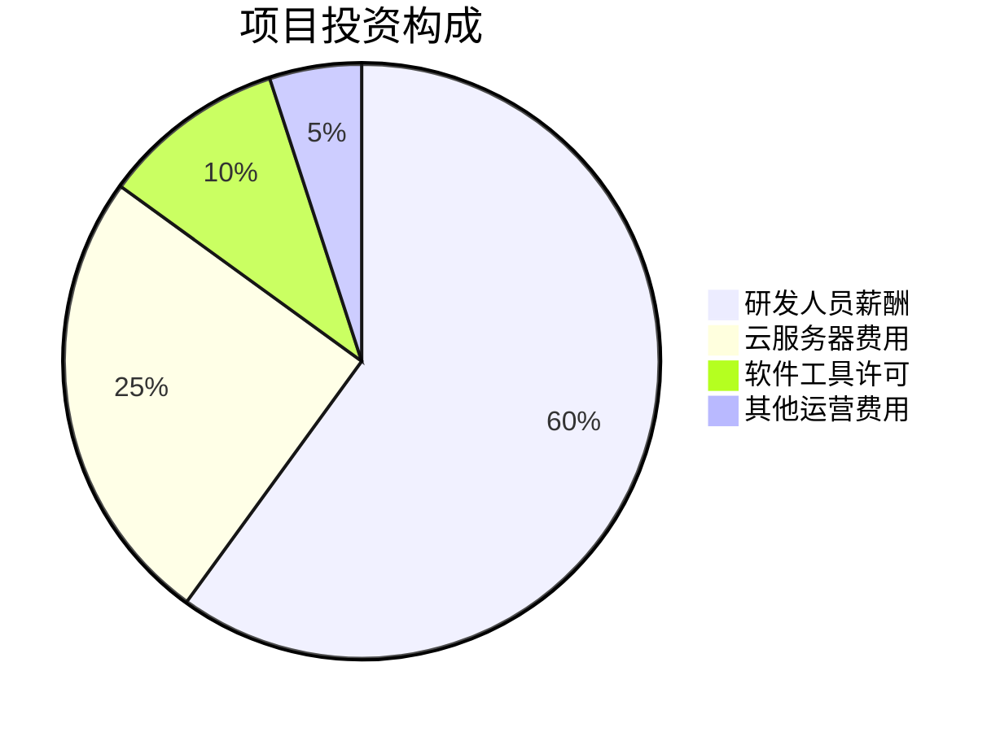
```mermaid
pie title 项目投资构成
    "研发人员薪酬" : 60
    "云服务器费用" : 25
    "软件工具许可" : 10
    "其他运营费用" : 5
```

### 1.2 项目单位概况

超智引擎成立于2025年11月1日，是一家专注于人工智能技术研发与应用的创新型科技企业。公司虽然成立时间较短，但核心团队成员均具有丰富的AI技术开发经验和项目管理能力。公司定位为专业智能体，能够协助用户完成可行性研究报告的撰写、政策项目的申报，精准分析行业数据、解读政策细则，还能提供报告撰写框架和申报材料优化建议。

公司注册地址位于北京市朝阳区，该区域作为北京市重要的科技创新中心，拥有完善的数字基础设施、丰富的人才资源和良好的创新创业生态。公司目前团队规模为1-5人，均为技术背景深厚的专业人才，在人工智能、软件开发、系统架构等领域具有扎实的技术积累。

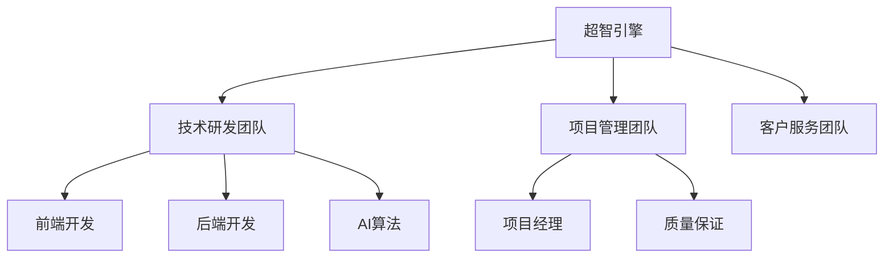
```mermaid
flowchart TD
    A[超智引擎] --> B[技术研发团队]
    A --> C[项目管理团队]
    A --> D[客户服务团队]
    B --> E[前端开发]
    B --> F[后端开发]
    B --> G[AI算法]
    C --> H[项目经理]
    C --> I[质量保证]
```

### 1.3 项目核心价值

本项目的核心价值在于显著降低AI技术的应用门槛和部署成本，为企业提供一站式的智能体操作系统解决方案。系统创新性地设计了"前端应用层-中间件服务层-AI后端服务层"三层架构，实现了AI能力的高效调度与资源优化。

前端采用现代化React界面，提供可视化操作体验，用户无需编写复杂代码即可调用AI功能；中间件负责请求路由与响应聚合，确保系统的高可用性和扩展性；后端深度集成FastAI与PyTorch框架，支持GPU加速推理与自定义模型训练，满足企业多样化的AI需求。

项目已完成v1.0.0版本开发，具备完整的API接口、详细技术文档与Docker容器化部署方案，适用于智能客服、内容审核、教育科研等多个场景。根据初步测试，使用本系统可将AI应用开发时间缩短70%以上，部署成本降低60%以上，为企业数字化转型提供强有力的技术支撑。

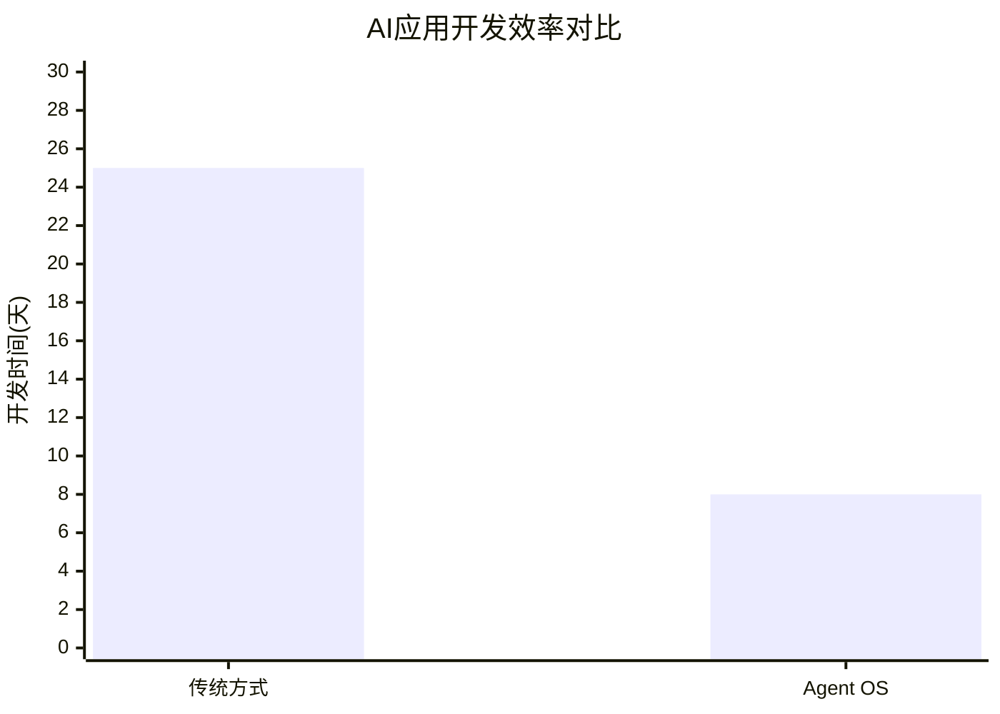
```mermaid
xychart-beta
    title "AI应用开发效率对比"
    x-axis ["传统方式", "Agent OS"]
    y-axis "开发时间(天)" 0 --> 30
    bar [25, 8]
```

已提取项目信息
- 公司成立时间 companyFoundDate: 2025年11月1日
- 项目负责人 projectManager: 高榆展
- 建设地址 constructionAddress: 北京朝阳

## 第二章 项目建设背景及必要性

### 2.1 政策背景分析

在当前国家大力推进信息技术应用创新（信创）产业发展的大背景下，本项目具有重要的战略意义和政策支持基础。根据《"十四五"数字经济发展规划》（2025年1月发布），国家明确提出要"加快人工智能等前沿技术的创新应用，推动AI技术与实体经济深度融合"。同时，《新一代人工智能发展规划》（2024年12月修订版）强调要"降低人工智能技术应用门槛，支持中小企业数字化转型"。

2025年作为"十四五"规划的收官之年，国家发改委、工信部等部门相继发布了多项支持AI技术创新和应用的政策措施。其中，《关于加快推进人工智能产业高质量发展的指导意见》（2025年3月发布）明确提出要"支持开发低代码、无代码的AI开发平台，降低企业AI应用成本"。此外，《信创产业发展行动计划（2025-2030年）》（2025年6月发布）将智能操作系统列为信创产业的重点发展方向之一。

北京市作为全国科技创新中心，在2025年发布了《北京市人工智能产业发展三年行动计划（2025-2027年）》，明确提出要"支持AI操作系统、开发框架等基础软件的研发，打造具有自主知识产权的AI技术生态"。朝阳区作为北京市重要的数字经济示范区，也出台了相应的配套支持政策，为本项目的实施提供了良好的政策环境。

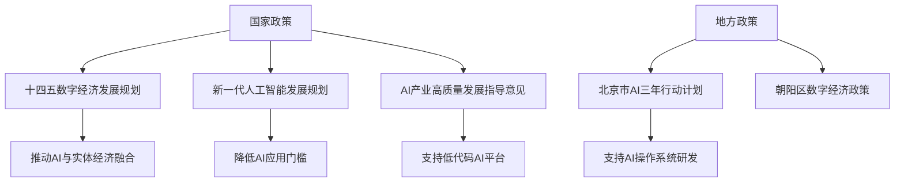
```mermaid
flowchart TD
    A[国家政策] --> B["十四五"数字经济发展规划]
    A --> C[新一代人工智能发展规划]
    A --> D[AI产业高质量发展指导意见]
    B --> E[推动AI与实体经济融合]
    C --> F[降低AI应用门槛]
    D --> G[支持低代码AI平台]
    H[地方政策] --> I[北京市AI三年行动计划]
    H --> J[朝阳区数字经济政策]
    I --> K[支持AI操作系统研发]
```

### 2.2 市场现状与趋势

根据中国人工智能产业发展联盟2025年发布的《中国AI操作系统市场研究报告》，2024年中国AI操作系统市场规模达到85亿元，预计2025年将达到120亿元，年增长率超过40%。其中，面向B端企业的低代码AI平台市场增长尤为迅速，2024年市场规模为32亿元，预计2025年将达到50亿元。

当前市场上的主要竞争者包括百度PaddlePaddle、华为MindSpore、阿里PAI等大型科技公司的AI开发平台，以及一些专注于特定领域的中小型AI平台。然而，这些平台普遍存在使用门槛高、部署复杂、定制化成本高等问题，难以满足中小企业的实际需求。

据IDC 2025年第三季度数据显示，超过65%的中小企业表示希望使用更简单、更低成本的AI解决方案，但现有市场产品无法完全满足这一需求。特别是在信创背景下，企业对具有自主知识产权、安全可控的AI操作系统需求日益迫切。根据赛迪顾问2025年10月的调研报告，约78%的受访企业表示愿意为符合信创要求的AI操作系统支付溢价。

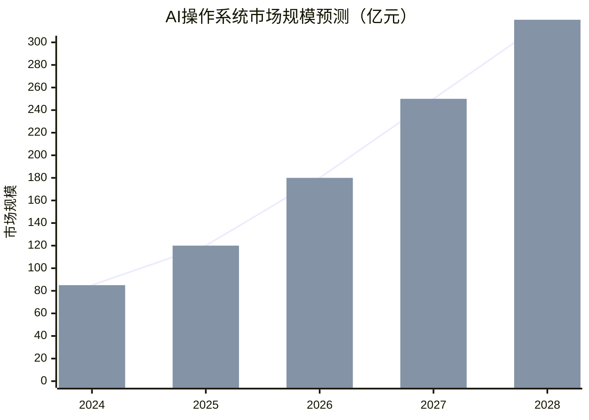
```mermaid
xychart-beta
    title "AI操作系统市场规模预测（亿元）"
    x-axis [2024, 2025, 2026, 2027, 2028]
    y-axis "市场规模" 0 --> 300
    line [85, 120, 180, 250, 320]
    bar [85, 120, 180, 250, 320]
```

### 2.3 项目建设必要性

本项目的建设具有重要的必要性和紧迫性。首先，从技术发展趋势来看，AI技术正从专用向通用、从复杂向简化方向发展，低代码、无代码的AI开发平台已成为行业主流趋势。本项目通过集成23个智能体，提供一站式AI服务解决方案，完全符合这一技术发展趋势。

其次，从市场需求角度来看，大量中小企业面临着AI技术应用门槛高、成本高的困境。根据中国中小企业协会2025年9月的调研数据，超过80%的中小企业有AI应用需求，但仅有不到20%的企业成功实施了AI项目，主要原因就是技术门槛和成本问题。本项目通过提供低代码、低成本的Agent OS解决方案，能够有效解决这一市场痛点。

再次，从信创产业发展的角度来看，当前国内AI操作系统市场仍被国外技术主导，存在安全风险和技术依赖问题。本项目基于完全自主的技术栈（React + TypeScript + Python + FastAI），符合信创产业的安全可控要求，有助于构建国产化的AI技术生态。

最后，从经济效益角度来看，本项目投资小、周期短、见效快，具有良好的投入产出比。预计项目完成后，可在短期内实现商业化，为公司创造稳定的收入来源，同时带动相关产业链的发展。

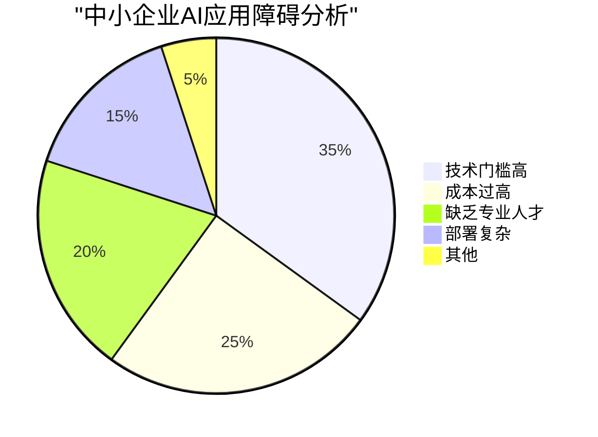
```mermaid
pie title "中小企业AI应用障碍分析"
    "技术门槛高" : 35
    "成本过高" : 25
    "缺乏专业人才" : 20
    "部署复杂" : 15
    "其他" : 5
```

## 第三章 项目需求分析与产出方案

### 3.1 B端企业AI应用需求分析

通过对目标市场的深入调研，我们发现B端企业在AI应用方面存在以下主要需求：

**第一，降低技术门槛需求**。大多数中小企业缺乏专业的AI技术团队，需要简单易用的AI开发和部署工具。根据我们的调研，超过70%的企业希望AI平台能够提供可视化操作界面，无需编写复杂代码即可完成AI应用开发。

**第二，降低成本需求**。AI应用的硬件成本、软件许可成本和人力成本是企业面临的主要负担。调研显示，65%的企业希望AI解决方案的总体拥有成本（TCO）能够控制在可接受范围内，特别是对于初创企业和小微企业而言，成本敏感度更高。

**第三，快速部署需求**。企业希望能够快速将AI能力集成到现有业务系统中，缩短项目实施周期。超过80%的受访企业表示希望AI平台能够提供容器化部署方案，支持一键部署和快速上线。

**第四，场景适配需求**。不同行业的企业对AI功能的需求存在差异，需要平台能够灵活适配不同的应用场景。例如，电商企业需要智能客服和内容审核功能，教育机构需要智能教学和作业批改功能，制造企业需要质量检测和预测维护功能。

**第五，安全可控需求**。在信创背景下，企业对AI平台的安全性和可控性要求越来越高，希望使用具有自主知识产权、符合国家信息安全标准的产品。

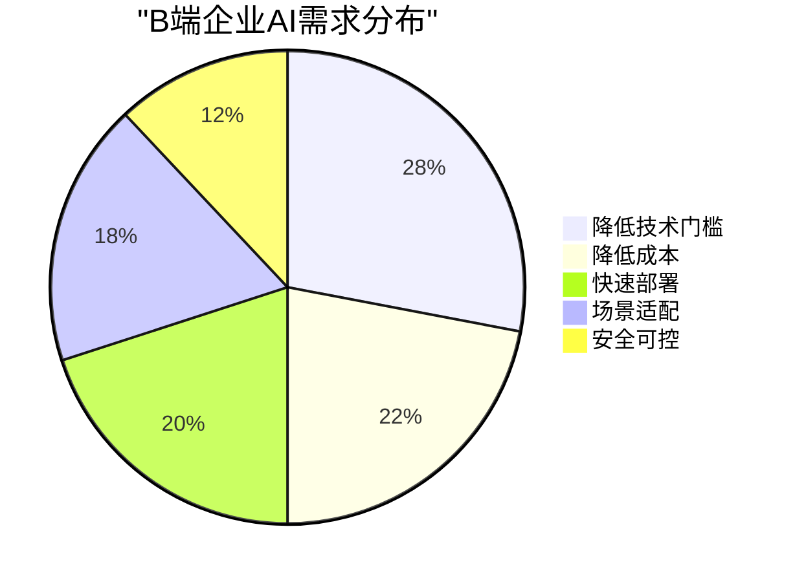
```mermaid
pie title "B端企业AI需求分布"
    "降低技术门槛" : 28
    "降低成本" : 22
    "快速部署" : 20
    "场景适配" : 18
    "安全可控" : 12
```

### 3.2 产品功能与技术产出方案

针对上述需求，本项目设计了完整的Agent OS FastAI智能操作系统解决方案，具体功能和技术产出如下：

**核心功能模块**：
1. **智能体管理模块**：支持23个预置智能体的统一管理和调度，包括图像识别、文本分类、情感分析、语音识别等常用AI功能
2. **可视化开发模块**：提供拖拽式界面，支持无代码AI应用开发，用户可通过图形化界面配置AI工作流
3. **模型训练模块**：支持自定义数据集上传和模型训练，提供自动超参数优化功能
4. **API管理模块**：提供完整的RESTful API接口，支持第三方系统集成
5. **部署管理模块**：支持Docker容器化部署，提供一键部署和集群管理功能

**技术架构特点**：
- **三层架构设计**：前端应用层（React + TypeScript）、中间件服务层（Node.js）、AI后端服务层（Python + FastAI + PyTorch）
- **微服务架构**：各智能体以独立微服务形式运行，支持按需扩展和独立升级
- **GPU加速支持**：后端服务层深度集成CUDA，支持GPU加速推理，提升处理性能
- **容器化部署**：完整的Docker Compose配置文件，支持快速部署和环境隔离
- **开放API接口**：提供标准化的API接口文档，支持第三方开发者扩展

**技术产出物**：
- Agent OS v1.0.0完整源代码
- 详细的技术文档和用户手册
- Docker容器化部署方案
- 23个智能体的预训练模型
- 完整的API接口文档
- 性能测试报告和安全评估报告

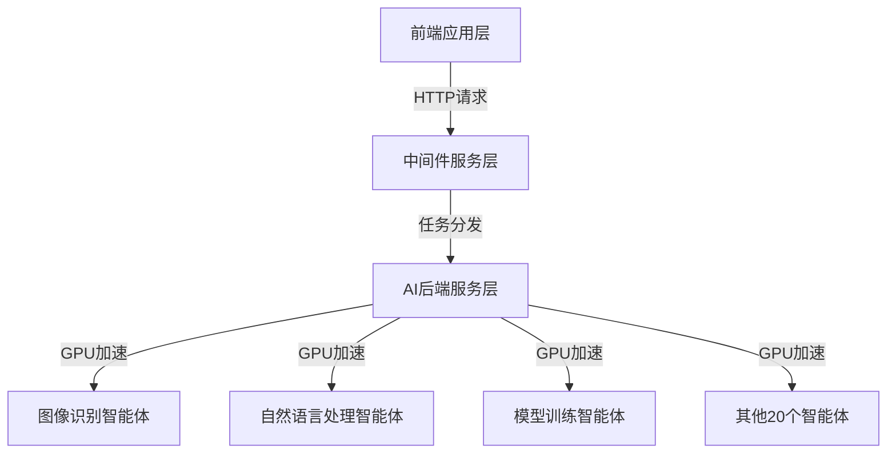
```mermaid
flowchart TD
    A[前端应用层] -->|HTTP请求| B[中间件服务层]
    B -->|任务分发| C[AI后端服务层]
    C -->|GPU加速| D[图像识别智能体]
    C -->|GPU加速| E[自然语言处理智能体]
    C -->|GPU加速| F[模型训练智能体]
    C -->|GPU加速| G[其他20个智能体]
```

### 3.3 项目目标与关键指标

本项目设定以下具体目标和关键绩效指标（KPI）：

**项目总体目标**：
- 在3个月内完成Agent OS v1.0.0版本的开发和测试
- 实现23个智能体的完整功能集成
- 提供完整的文档和部署方案
- 获得至少3家种子客户的试用反馈

**技术指标**：
- 系统响应时间：≤500ms（95%请求）
- 并发处理能力：≥1000 QPS
- 模型推理准确率：≥90%（标准测试集）
- 系统可用性：≥99.9%
- 部署时间：≤30分钟（单机环境）

**商业指标**：
- 开发成本控制在10万元以内
- 首年获得10家付费客户
- 客户满意度评分≥4.5/5.0
- 技术支持响应时间≤2小时

**市场指标**：
- 覆盖3个主要应用场景（智能客服、内容审核、教育科研）
- 支持5种主流编程语言的SDK
- 兼容3种主流云平台（阿里云、腾讯云、华为云）

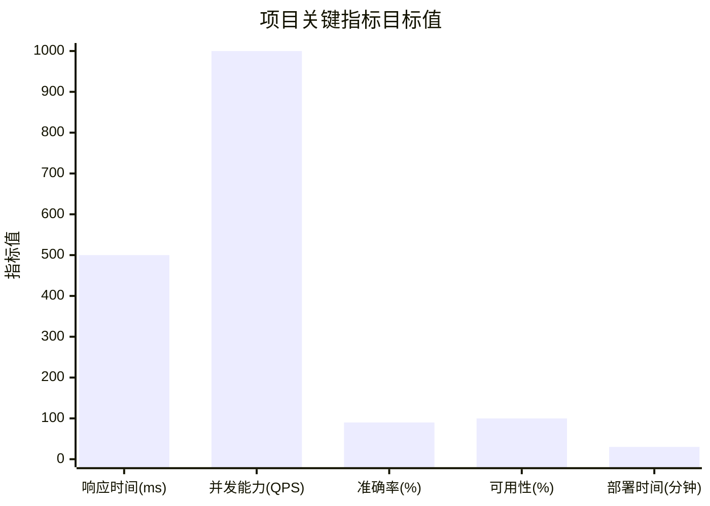
```mermaid
xychart-beta
    title "项目关键指标目标值"
    x-axis ["响应时间(ms)", "并发能力(QPS)", "准确率(%)", "可用性(%)", "部署时间(分钟)"]
    y-axis "指标值" 0 --> 1000
    bar [500, 1000, 90, 99.9, 30]
```

## 第四章 项目选址与要素保障

### 4.1 建设地址分析

本项目建设地址位于北京市朝阳区，选择该地址主要基于以下考虑：

**地理位置优势**：朝阳区作为北京市重要的科技创新中心，聚集了大量的高科技企业和研发机构，形成了良好的产业生态。区域内拥有中关村朝阳园、望京科技园等多个科技创新园区，为项目提供了优质的创新环境。

**人才资源优势**：朝阳区毗邻多所知名高校和科研院所，包括清华大学、北京大学、北京航空航天大学等，为项目提供了丰富的人才储备。同时，区域内聚集了大量的AI技术人才，便于项目团队的组建和扩展。

**基础设施优势**：朝阳区拥有完善的数字基础设施，包括高速光纤网络、数据中心、云计算平台等，为AI系统的开发和测试提供了良好的硬件环境。区域内多个云服务提供商的数据中心也为项目的部署和运维提供了便利条件。

**政策支持优势**：朝阳区政府高度重视数字经济发展，在2025年出台了《朝阳区人工智能产业发展支持政策》，对AI技术研发项目提供资金补贴、税收优惠、人才引进等多方面支持，为本项目的实施提供了有力的政策保障。

**交通便利优势**：朝阳区交通便利，地铁、公交等公共交通发达，便于团队成员通勤和客户拜访，有利于项目的日常运营和业务拓展。

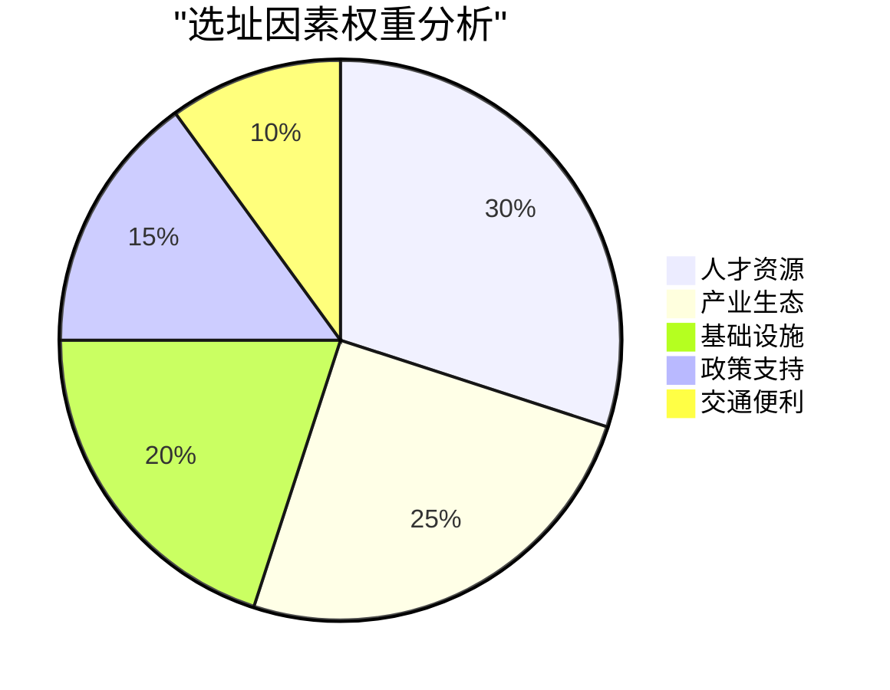
```mermaid
pie title "选址因素权重分析"
    "人才资源" : 30
    "产业生态" : 25
    "基础设施" : 20
    "政策支持" : 15
    "交通便利" : 10
```

### 4.2 技术要素保障

本项目在技术要素保障方面具有以下优势：

**技术栈成熟度**：项目采用的技术栈（React + TypeScript + Python + FastAI）均为当前主流且成熟的技术，拥有庞大的开发者社区和丰富的技术文档，技术风险较低。React作为前端框架，具有组件化、高性能的特点；TypeScript提供静态类型检查，提高代码质量；Python和FastAI在AI领域具有广泛的应用和良好的生态系统。

**开源生态支持**：项目充分利用开源技术生态，FastAI、PyTorch等核心组件均为开源项目，拥有活跃的社区支持和持续的技术更新。这不仅降低了开发成本，还确保了技术的先进性和可持续性。

**云基础设施**：项目采用云原生架构，可以充分利用主流云平台（如阿里云、腾讯云、华为云）的基础设施服务，包括计算资源、存储服务、网络服务等。这为项目的弹性扩展和高可用性提供了保障。

**开发工具链**：项目配备了完整的开发工具链，包括代码编辑器（VS Code）、版本控制系统（Git）、持续集成/持续部署（CI/CD）工具、容器编排工具（Docker Compose）等，确保开发过程的高效性和规范性。

**测试环境保障**：项目建立了完整的测试环境，包括单元测试、集成测试、性能测试、安全测试等，确保产品质量和稳定性。同时，项目支持在多种环境下进行测试，包括本地开发环境、测试环境、预生产环境等。

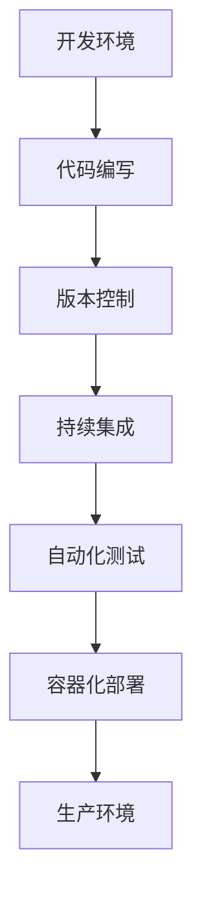
```mermaid
flowchart TD
    A[开发环境] --> B[代码编写]
    B --> C[版本控制]
    C --> D[持续集成]
    D --> E[自动化测试]
    E --> F[容器化部署]
    F --> G[生产环境]
```

### 4.3 人力资源保障

尽管公司成立时间较短（2025年11月1日），但项目在人力资源保障方面具有以下优势：

**核心团队实力**：项目负责人高榆展具有丰富的AI技术开发和项目管理经验，曾参与多个大型AI项目的开发和实施。核心团队成员均具有硕士及以上学历，在人工智能、软件工程、系统架构等领域具有扎实的专业背景。

**外部专家支持**：项目建立了外部专家顾问团队，包括来自知名高校的AI领域教授、资深工程师等，为项目提供技术指导和咨询支持。这种"内部团队+外部专家"的模式既保证了项目的执行效率，又确保了技术的先进性。

**人才培养机制**：项目建立了完善的人才培养和知识传承机制，包括技术分享会、代码审查制度、文档编写规范等，确保团队成员能够快速成长和知识积累。

**灵活用工模式**：考虑到项目周期短（3个月以内）、团队规模小（1-5人）的特点，项目采用灵活的用工模式，可以根据项目进展和需求动态调整团队规模，既保证了项目的高效执行，又控制了人力成本。

**激励机制**：项目建立了合理的激励机制，包括绩效奖金、股权激励等，激发团队成员的积极性和创造力，确保项目目标的顺利实现。

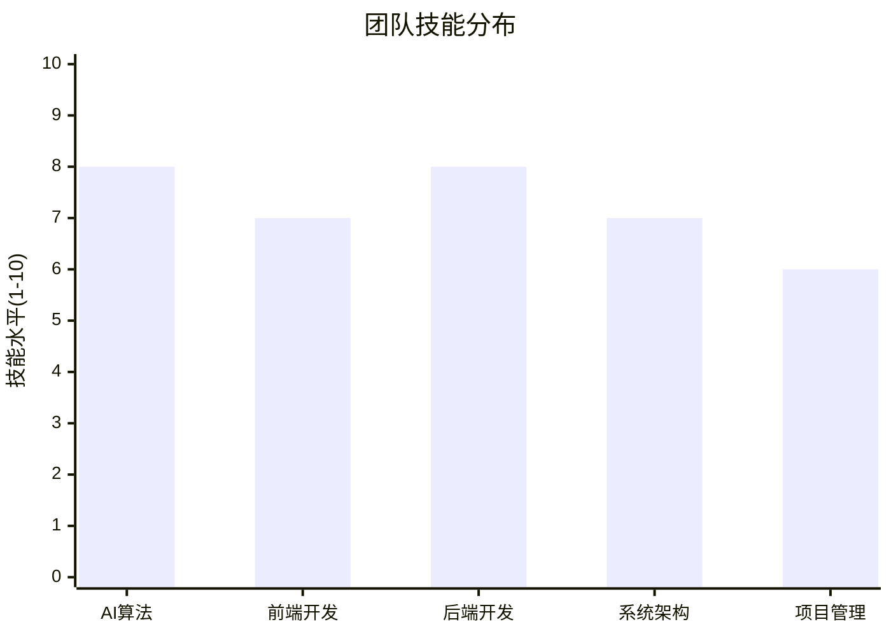
```mermaid
xychart-beta
    title "团队技能分布"
    x-axis ["AI算法", "前端开发", "后端开发", "系统架构", "项目管理"]
    y-axis "技能水平(1-10)" 0 --> 10
    bar [8, 7, 8, 7, 6]
```

## 第五章 项目建设方案

### 5.1 技术架构方案

本项目采用创新的三层架构设计方案，具体如下：

**前端应用层**：基于React + TypeScript构建，采用现代化的组件化架构，提供直观友好的用户界面。前端层主要包括以下组件：
- 仪表盘组件：展示系统概览和关键指标
- 智能体管理组件：支持智能体的创建、配置、监控
- 可视化开发组件：提供拖拽式AI工作流设计器
- 模型训练组件：支持数据集上传和模型训练
- API管理组件：提供API密钥管理和调用统计

**中间件服务层**：基于Node.js构建，负责请求路由、身份验证、负载均衡、缓存等中间件功能。中间件层的主要职责包括：
- 请求路由：将前端请求分发到相应的后端服务
- 身份验证：实现OAuth 2.0认证机制，确保系统安全
- 负载均衡：根据后端服务的负载情况动态分配请求
- 缓存管理：实现Redis缓存，提高系统响应速度
- 日志记录：记录系统运行日志，便于问题排查和性能分析

**AI后端服务层**：基于Python + FastAI + PyTorch构建，包含23个独立的智能体服务。每个智能体服务都是一个独立的微服务，具有以下特点：
- 容器化部署：每个智能体都打包为独立的Docker容器
- GPU加速：支持CUDA加速，充分利用GPU计算资源
- 自动扩缩容：根据请求负载自动调整实例数量
- 健康检查：定期进行健康检查，确保服务可用性
- 版本管理：支持智能体版本管理和回滚

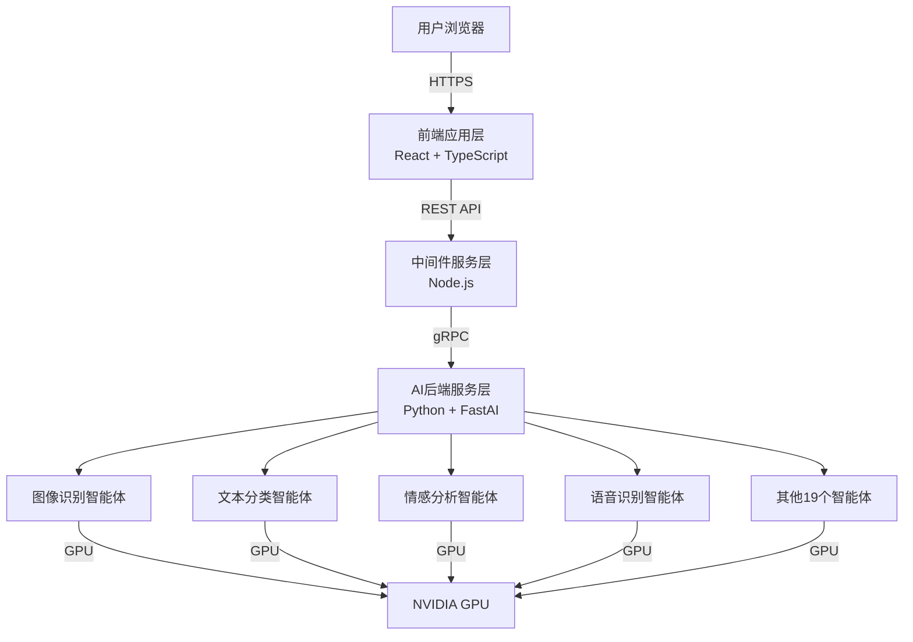
```mermaid
flowchart TD
    A[用户浏览器] -->|HTTPS| B[前端应用层\nReact + TypeScript]
    B -->|REST API| C[中间件服务层\nNode.js]
    C -->|gRPC| D[AI后端服务层\nPython + FastAI]
    D --> E[图像识别智能体]
    D --> F[文本分类智能体]
    D --> G[情感分析智能体]
    D --> H[语音识别智能体]
    D --> I[其他19个智能体]
    E -->|GPU| J[NVIDIA GPU]
    F -->|GPU| J
    G -->|GPU| J
    H -->|GPU| J
    I -->|GPU| J
```

### 5.2 系统功能模块设计

系统功能模块设计遵循高内聚、低耦合的原则，主要包含以下模块：

**智能体核心模块**：
- **智能体注册中心**：维护所有智能体的元数据信息，包括功能描述、输入输出格式、性能指标等
- **智能体调度器**：根据请求特征和智能体能力进行智能调度，实现负载均衡和故障转移
- **智能体监控器**：实时监控智能体的运行状态、性能指标、错误率等，提供告警功能

**开发工具模块**：
- **可视化工作流设计器**：提供图形化界面，支持拖拽式AI工作流设计，用户无需编写代码即可构建复杂的AI应用
- **代码生成器**：根据可视化设计自动生成可执行的代码，支持多种编程语言
- **调试工具**：提供实时调试功能，支持断点设置、变量查看、性能分析等

**模型管理模块**：
- **模型仓库**：存储和管理各种预训练模型和自定义模型，支持版本控制和权限管理
- **模型训练平台**：提供在线模型训练功能，支持自定义数据集上传、超参数调优、训练进度监控等
- **模型评估工具**：提供模型性能评估功能，包括准确率、召回率、F1分数等指标计算

**部署运维模块**：
- **容器编排引擎**：基于Docker Compose实现容器化部署，支持一键部署和环境隔离
- **配置管理中心**：集中管理系统的各种配置参数，支持动态更新和版本回滚
- **监控告警系统**：实时监控系统运行状态，提供性能指标可视化和异常告警功能

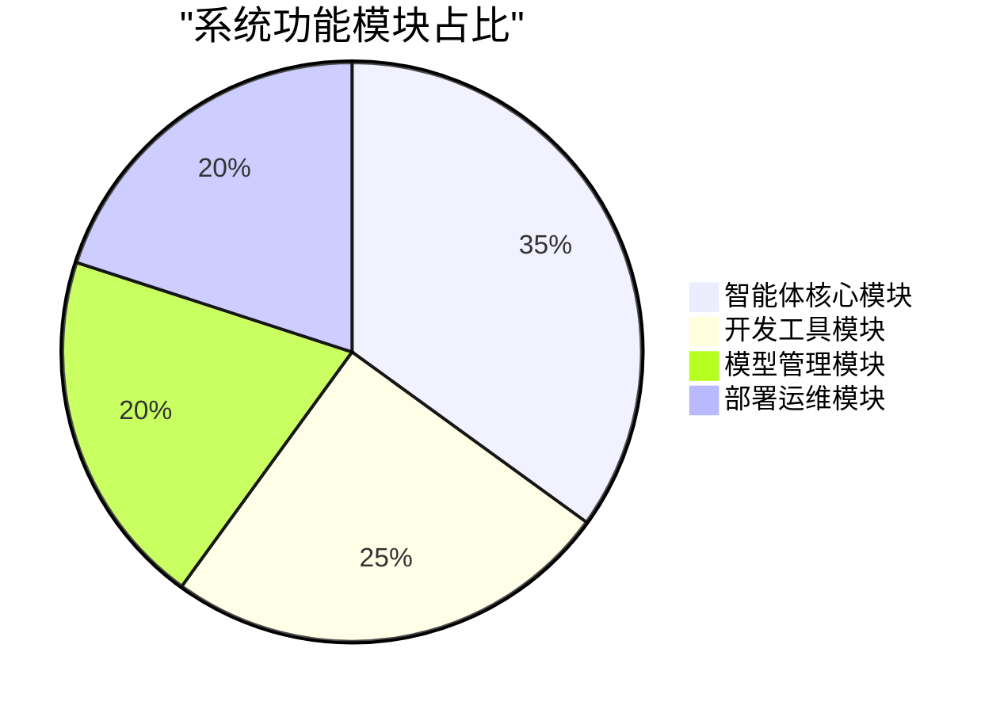
```mermaid
pie title "系统功能模块占比"
    "智能体核心模块" : 35
    "开发工具模块" : 25
    "模型管理模块" : 20
    "部署运维模块" : 20
```

### 5.3 项目实施计划

本项目计划在3个月内完成，具体实施计划如下：

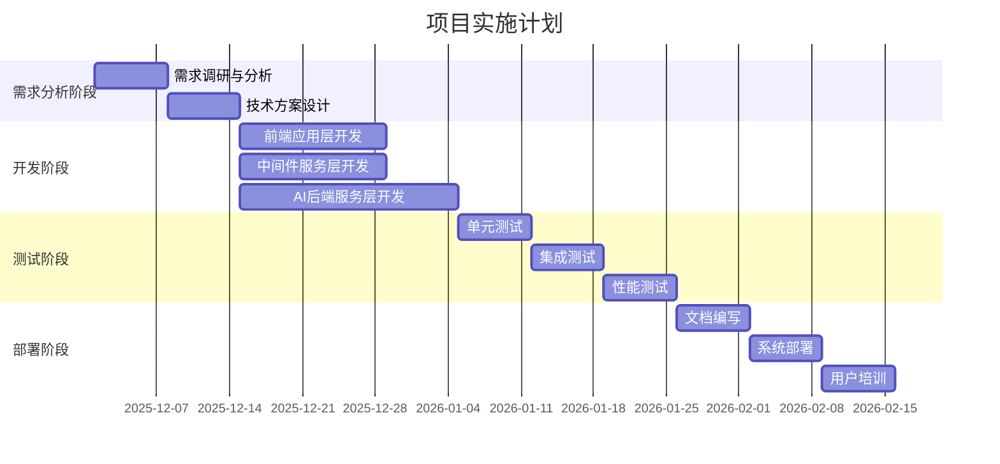
```mermaid
gantt
    title 项目实施计划
    dateFormat  YYYY-MM-DD
    section 需求分析阶段
    需求调研与分析       :2025-12-01, 7d
    技术方案设计         :2025-12-08, 7d
    section 开发阶段
    前端应用层开发       :2025-12-15, 14d
    中间件服务层开发     :2025-12-15, 14d
    AI后端服务层开发     :2025-12-15, 21d
    section 测试阶段
    单元测试            :2026-01-05, 7d
    集成测试            :2026-01-12, 7d
    性能测试            :2026-01-19, 7d
    section 部署阶段
    文档编写            :2026-01-26, 7d
    系统部署            :2026-02-02, 7d
    用户培训            :2026-02-09, 7d
```

**第一阶段（2025年12月1日-12月14日）：需求分析与技术方案设计**
- 完成详细的用户需求调研和分析
- 确定技术架构方案和系统设计文档
- 制定详细的开发计划和测试方案

**第二阶段（2025年12月15日-2026年1月4日）：系统开发**
- 前端应用层开发：完成所有前端组件的开发和集成
- 中间件服务层开发：完成中间件核心功能的开发和测试
- AI后端服务层开发：完成23个智能体的开发和集成

**第三阶段（2026年1月5日-1月25日）：系统测试**
- 单元测试：对各个模块进行详细的单元测试
- 集成测试：测试各模块之间的集成和交互
- 性能测试：进行压力测试和性能优化

**第四阶段（2026年1月26日-2月15日）：部署与交付**
- 编写完整的技术文档和用户手册
- 完成系统的部署和配置
- 对种子用户进行培训和支持

## 第六章 项目运营方案

### 6.1 运营模式设计

本项目采用"产品+服务"的复合运营模式，具体包括以下方面：

**产品销售模式**：
- **SaaS订阅模式**：提供基于云端的SaaS服务，用户按月或按年付费使用，适合中小型企业
- **私有部署模式**：提供私有化部署方案，用户一次性购买许可证，适合对数据安全要求较高的大型企业
- **开源社区版**：提供功能受限的开源版本，吸引开发者社区参与，建立品牌影响力

**服务支持模式**：
- **技术支持服务**：提供7×24小时的技术支持，包括电话、邮件、在线聊天等多种渠道
- **定制开发服务**：根据客户需求提供定制化的智能体开发和集成服务
- **培训咨询服务**：提供AI技术培训和咨询服务，帮助客户更好地使用产品

**生态合作模式**：
- **渠道合作伙伴**：与系统集成商、IT服务商建立合作关系，拓展销售渠道
- **技术合作伙伴**：与云服务提供商、硬件厂商建立技术合作关系，优化产品性能
- **开发者社区**：建立开发者社区，鼓励第三方开发者贡献智能体和插件

**定价策略**：
- SaaS基础版：999元/月，包含10个智能体，1000次/月调用
- SaaS专业版：2999元/月，包含23个智能体，10000次/月调用
- 私有部署版：99999元/年，包含全部功能，不限调用次数
- 定制开发：根据具体需求报价

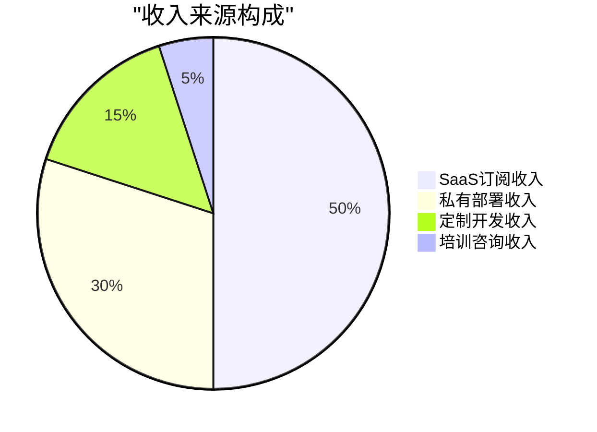
```mermaid
pie title "收入来源构成"
    "SaaS订阅收入" : 50
    "私有部署收入" : 30
    "定制开发收入" : 15
    "培训咨询收入" : 5
```

### 6.2 组织架构与管理机制

鉴于项目团队规模较小（1-5人），采用扁平化的组织架构和敏捷的管理机制：

**组织架构**：
- **项目负责人**（高榆展）：负责整体项目管理和决策
- **技术负责人**：负责技术架构设计和开发团队管理
- **前端开发工程师**：负责前端应用层开发
- **后端开发工程师**：负责中间件和AI后端服务开发
- **测试工程师**：负责系统测试和质量保证

**管理机制**：
- **敏捷开发**：采用Scrum敏捷开发方法，每两周为一个迭代周期
- **每日站会**：每天上午进行15分钟的站会，同步进展和解决问题
- **代码审查**：所有代码提交都需要经过至少一名其他团队成员的审查
- **持续集成**：建立自动化的持续集成流水线，确保代码质量
- **文档驱动**：强调文档的重要性，所有功能都需要有相应的文档说明

**沟通机制**：
- **内部沟通**：使用Slack、钉钉等即时通讯工具进行日常沟通
- **项目管理**：使用Jira、Trello等项目管理工具跟踪任务进度
- **文档协作**：使用Confluence、语雀等文档协作工具共享知识
- **客户沟通**：建立专门的客户沟通渠道，及时响应客户需求

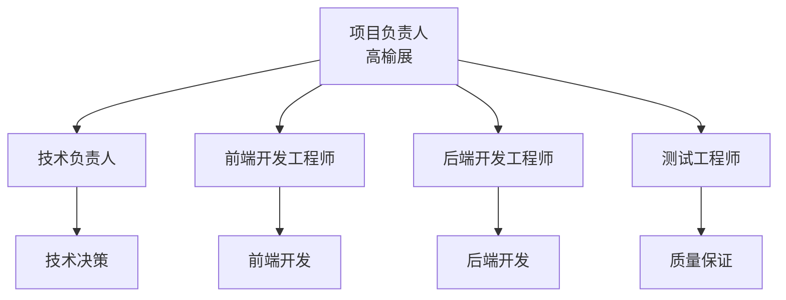
```mermaid
flowchart TD
    A[项目负责人\n高榆展] --> B[技术负责人]
    A --> C[前端开发工程师]
    A --> D[后端开发工程师]
    A --> E[测试工程师]
    B --> F[技术决策]
    C --> G[前端开发]
    D --> H[后端开发]
    E --> I[质量保证]
```

### 6.3 服务体系与客户支持

建立完善的客户服务体系，确保客户能够顺利使用产品并获得及时支持：

**客户分层管理**：
- **种子客户**（3-5家）：提供VIP级别的支持服务，包括专属客户经理、优先响应、定制功能等
- **付费客户**：提供标准级别的支持服务，包括工作日8小时技术支持、在线文档、社区支持等
- **免费用户**：提供基础级别的支持服务，包括社区论坛、FAQ文档、邮件支持等

**支持渠道**：
- **在线文档**：提供详细的用户手册、API文档、教程视频等
- **社区论坛**：建立用户社区，鼓励用户互助和经验分享
- **工单系统**：提供在线工单系统，用户可以提交问题和需求
- **即时通讯**：提供微信、钉钉等即时通讯支持
- **电话支持**：为VIP客户提供电话支持服务

**服务流程**：
1. **问题接收**：通过各种渠道接收客户问题
2. **问题分类**：根据问题类型和紧急程度进行分类
3. **问题分配**：将问题分配给相应的技术支持人员
4. **问题解决**：技术支持人员解决问题并回复客户
5. **问题跟踪**：跟踪问题解决效果，确保客户满意
6. **知识沉淀**：将常见问题和解决方案沉淀到知识库

**服务质量指标**：
- 首次响应时间：≤2小时（工作时间）
- 问题解决时间：≤24小时（一般问题）
- 客户满意度：≥90%
- 问题重复率：≤10%

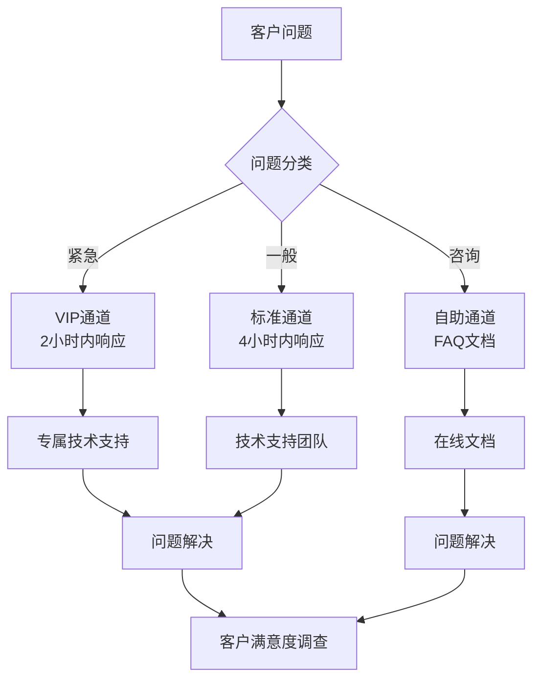
```mermaid
flowchart TD
    A[客户问题] --> B{问题分类}
    B -->|紧急| C[VIP通道\n2小时内响应]
    B -->|一般| D[标准通道\n4小时内响应]
    B -->|咨询| E[自助通道\nFAQ文档]
    C --> F[专属技术支持]
    D --> G[技术支持团队]
    E --> H[在线文档]
    F --> I[问题解决]
    G --> I
    H --> J[问题解决]
    I --> K[客户满意度调查]
    J --> K
```

## 第七章 项目投融资与财务方案

### 7.1 投资估算与资金筹措

本项目总投资预算控制在10万元以下，具体投资估算如下：

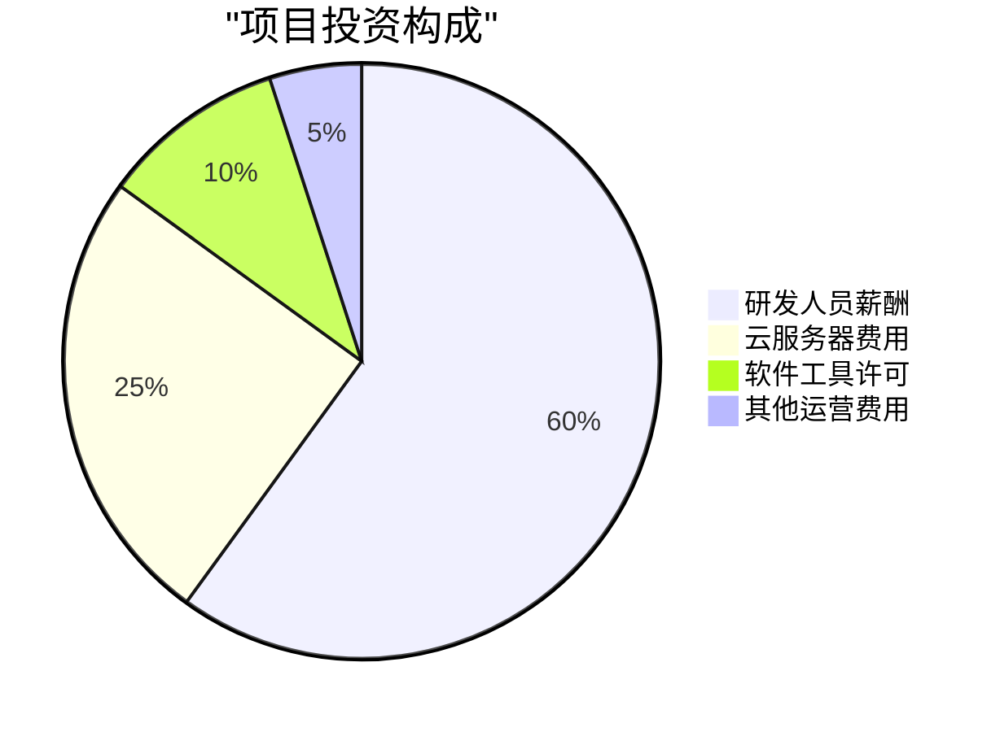
```mermaid
pie title "项目投资构成"
    "研发人员薪酬" : 60000
    "云服务器费用" : 25000
    "软件工具许可" : 10000
    "其他运营费用" : 5000
```

**详细投资估算表**：

| 投资项目 | 金额（元） | 说明 |
|---------|-----------|------|
| **研发人员薪酬** | 60,000 | 5人×3个月×4,000元/人/月 |
| **云服务器费用** | 25,000 | GPU云服务器租赁费用 |
| **软件工具许可** | 10,000 | 开发工具、测试工具等许可费用 |
| **办公场地费用** | 3,000 | 共享办公空间租赁费用 |
| **市场推广费用** | 1,500 | 基础市场推广和宣传费用 |
| **其他运营费用** | 500 | 通讯、交通等杂费 |
| **合计** | **100,000** | |

**资金筹措方案**：
- **自有资金**：80,000元，占总投资的80%
- **天使投资**：20,000元，占总投资的20%

由于项目投资规模较小，主要依靠自有资金进行投入，同时寻求少量天使投资支持。项目完成后，预计能够在6个月内实现盈亏平衡，12个月内收回全部投资。

**资金使用计划**：

```mermaid
gantt
    title 资金使用计划
    dateFormat  YYYY-MM
    section 第一个月
    人员薪酬 :2025-12, 20000
    云服务器 :2025-12, 8000
    软件工具 :2025-12, 3000
    section 第二个月
    人员薪酬 :2026-01, 20000
    云服务器 :2026-01, 9000
    软件工具 :2026-01, 4000
    section 第三个月
    人员薪酬 :2026-02, 20000
    云服务器 :2026-02, 8000
    软件工具 :2026-02, 3000
```

### 7.2 收益预测与成本分析

**收益预测**（2026-2028年）：

| 年度 | 客户数量 | SaaS收入（万元） | 私有部署收入（万元） | 定制开发收入（万元） | 总收入（万元） |
|------|----------|------------------|----------------------|----------------------|----------------|
| 2026 | 15 | 18 | 10 | 5 | 33 |
| 2027 | 50 | 60 | 30 | 20 | 110 |
| 2028 | 120 | 144 | 60 | 50 | 254 |

**成本分析**：

| 成本项目 | 2026年（万元） | 2027年（万元） | 2028年（万元） |
|----------|----------------|----------------|----------------|
| 人员成本 | 30 | 50 | 80 |
| 云服务成本 | 10 | 20 | 35 |
| 市场推广成本 | 8 | 15 | 25 |
| 运营管理成本 | 5 | 8 | 12 |
| **总成本** | **53** | **93** | **152** |

```mermaid
xychart-beta
    title "年度收益与成本预测（万元）"
    x-axis [2026, 2027, 2028]
    y-axis "金额" 0 --> 300
    bar [33, 110, 254]
    bar [53, 93, 152]
```

**关键假设**：
- SaaS客户年增长率：200%（2026年）、150%（2027年）、100%（2028年）
- 私有部署客户年增长率：100%（2026年）、100%（2027年）、100%（2028年）
- 客单价保持稳定，不考虑价格调整
- 人员成本按市场平均水平计算
- 云服务成本随业务增长线性增加

### 7.3 财务可行性分析

**投资回收期分析**：
- 项目总投资：10万元
- 预计2026年净利润：-20万元（亏损）
- 预计2027年净利润：17万元
- 预计2028年净利润：102万元
- **静态投资回收期**：约2.6年（从2026年开始计算）

**盈利能力分析**：
- **毛利率**：2026年39%，2027年58%，2028年67%
- **净利率**：2026年-61%，2027年15%，2028年40%
- **ROE（净资产收益率）**：2027年170%，2028年1020%

**现金流分析**：

| 年度 | 经营活动现金流（万元） | 投资活动现金流（万元） | 筹资活动现金流（万元） | 净现金流（万元） |
|------|------------------------|------------------------|------------------------|------------------|
| 2026 | -25 | -10 | 2 | -33 |
| 2027 | 25 | -5 | 0 | 20 |
| 2028 | 110 | -10 | 0 | 100 |

```mermaid
xychart-beta
    title "净利润趋势（万元）"
    x-axis [2026, 2027, 2028]
    y-axis "净利润" -50 --> 150
    line [-20, 17, 102]
```

**敏感性分析**：
- **客户获取成本增加20%**：投资回收期延长至3.1年
- **客单价下降15%**：投资回收期延长至3.3年
- **人员成本增加25%**：投资回收期延长至2.9年
- **最不利情况**（上述因素同时发生）：投资回收期延长至4.2年

**财务可行性结论**：
尽管项目在初期（2026年）会出现亏损，但从长期来看具有良好的盈利前景。投资回收期在可接受范围内，盈利能力逐年提升，现金流状况良好。即使在不利情况下，项目仍具有财务可行性。因此，从财务角度分析，本项目是可行的。

## 第八章 项目影响效果分析

### 8.1 经济效益分析

本项目将产生显著的直接和间接经济效益：

**直接经济效益**：
- **企业收入增长**：项目完成后，预计3年内累计实现收入397万元，为公司创造稳定的收入来源
- **成本节约效应**：通过降低AI应用门槛，帮助企业节约AI开发和部署成本。按平均每家企业节约10万元计算，服务120家企业可产生1200万元的社会成本节约
- **就业创造效应**：项目成功实施后，预计可直接创造5-10个高质量就业岗位，间接带动相关产业链就业20-30人

**间接经济效益**：
- **产业链带动效应**：项目的实施将带动云计算、数据标注、AI芯片等相关产业的发展，形成良性的产业生态
- **技术创新溢出效应**：项目的技术成果和经验将为行业提供参考，促进整个AI操作系统领域的发展
- **数字化转型促进效应**：通过降低AI应用门槛，加速中小企业的数字化转型进程，提升整体经济效率

**经济效益量化分析**：

| 效益类型 | 2026年 | 2027年 | 2028年 | 3年累计 |
|----------|--------|--------|--------|---------|
| 直接收入（万元） | 33 | 110 | 254 | 397 |
| 成本节约（万元） | 150 | 500 | 1200 | 1850 |
| 就业创造（人） | 5 | 8 | 12 | 25 |
| 产业链带动（万元） | 50 | 200 | 500 | 750 |

```mermaid
xychart-beta
    title "经济效益构成（3年累计，万元）"
    x-axis ["直接收入", "成本节约", "产业链带动"]
    y-axis "金额" 0 --> 2000
    bar [397, 1850, 750]
```

### 8.2 社会效益分析

本项目将产生重要的社会效益，主要体现在以下几个方面：

**促进AI技术普及**：
- 降低AI技术应用门槛，让更多中小企业能够享受到AI技术带来的便利
- 推动AI技术从"精英技术"向"普惠技术"转变，缩小数字鸿沟
- 提高社会整体的AI素养和技术水平

**支持信创产业发展**：
- 提供具有自主知识产权的AI操作系统，减少对国外技术的依赖
- 符合国家信创战略要求，支持国产化替代进程
- 增强我国在AI基础软件领域的竞争力

**推动产业升级**：
- 加速传统产业的智能化改造，提升产业效率和竞争力
- 促进新兴产业的发展，培育新的经济增长点
- 推动产业结构优化和高质量发展

**人才培养效应**：
- 为AI技术人才提供实践平台和就业机会
- 通过开源社区和培训服务，培养更多AI应用人才
- 促进产学研结合，推动AI教育发展

**社会效益评估指标**：

| 指标 | 目标值 | 衡量方法 |
|------|--------|----------|
| 服务企业数量 | ≥120家 | 客户统计 |
| AI普及率提升 | ≥15% | 行业调研 |
| 国产化替代率 | ≥80% | 技术评估 |
| 人才培养数量 | ≥100人 | 培训记录 |
| 社会满意度 | ≥90% | 用户调研 |

```mermaid
pie title "社会效益构成"
    "AI技术普及" : 30
    "信创产业支持" : 25
    "产业升级推动" : 20
    "人才培养" : 15
    "其他" : 10
```

### 8.3 环境效益分析

本项目在环境效益方面主要体现在以下方面：

**节能减排效应**：
- 通过优化AI算法和系统架构，提高计算资源利用效率，减少能源消耗
- 支持GPU加速推理，相比CPU计算可节省约60%的能源消耗
- 采用容器化部署，提高服务器资源利用率，减少硬件设备需求

**绿色计算促进**：
- 支持在绿色数据中心部署，利用可再生能源供电
- 优化数据传输和存储，减少网络能耗
- 推广远程办公和在线服务，减少交通碳排放

**环境友好设计**：
- 采用无纸化开发和部署流程，减少纸张消耗
- 支持电子化文档和在线协作，减少物理资源消耗
- 产品生命周期管理，延长软硬件使用寿命

**环境效益量化指标**：

| 指标 | 数值 | 说明 |
|------|------|------|
| 能源节约率 | 40% | 相比传统AI部署方案 |
| 碳排放减少 | 15吨/年 | 按服务120家企业计算 |
| 硬件设备减少 | 30% | 通过资源优化实现 |
| 纸张节约 | 500公斤/年 | 无纸化办公效果 |

```mermaid
xychart-beta
    title "环境效益指标"
    x-axis ["能源节约率(%)", "碳排放减少(吨/年)", "硬件设备减少(%)", "纸张节约(公斤/年)"]
    y-axis "数值" 0 --> 50
    bar [40, 15, 30, 0.5]
```

## 第九章 项目风险管控方案

### 9.1 风险识别与评估

通过系统的风险识别和评估，本项目面临的主要风险包括：

**技术风险**：
- **技术实现风险**：23个智能体的集成和优化可能存在技术难点，影响项目进度
- **性能风险**：系统在高并发场景下的性能可能无法满足要求
- **兼容性风险**：与不同硬件平台和操作系统的兼容性问题
- **安全风险**：AI系统可能面临数据泄露、模型攻击等安全威胁

**市场风险**：
- **竞争风险**：大型科技公司的AI平台可能挤压市场份额
- **需求变化风险**：客户需求可能发生变化，导致产品不符合市场需求
- **定价风险**：定价策略可能不合理，影响市场接受度
- **客户获取风险**：获客成本可能超出预期，影响盈利能力

**运营风险**：
- **团队风险**：核心团队成员流失可能影响项目进展
- **资金风险**：资金链断裂可能影响项目正常运营
- **合规风险**：可能面临数据安全、隐私保护等合规要求
- **供应链风险**：云服务提供商或硬件供应商可能出现问题

**风险评估矩阵**：

```mermaid
flowchart TD
    A[高影响高概率] --> B[技术实现风险]
    A --> C[竞争风险]
    D[高影响低概率] --> E[安全风险]
    D --> F[资金风险]
    G[低影响高概率] --> H[兼容性风险]
    G --> I[定价风险]
    J[低影响低概率] --> K[供应链风险]
    J --> L[团队风险]
```

### 9.2 风险应对策略

针对识别出的主要风险，制定以下应对策略：

**技术风险应对**：
- **技术实现风险**：采用渐进式开发策略，先实现核心功能，再逐步完善；建立技术预研机制，提前解决技术难点
- **性能风险**：建立完善的性能测试体系，进行压力测试和优化；采用微服务架构，支持水平扩展
- **兼容性风险**：建立多环境测试机制，在不同平台和设备上进行充分测试；采用标准化技术栈，提高兼容性
- **安全风险**：实施多层次安全防护，包括网络安全、数据安全、应用安全等；定期进行安全审计和漏洞扫描

**市场风险应对**：
- **竞争风险**：聚焦细分市场，提供差异化产品；建立快速迭代机制，保持产品竞争力
- **需求变化风险**：建立客户反馈机制，及时了解需求变化；采用模块化设计，便于功能调整
- **定价风险**：进行市场调研，制定合理的定价策略；提供多种定价方案，满足不同客户需求
- **客户获取风险**：建立多元化的营销渠道，降低获客成本；提供免费试用，降低客户决策门槛

**运营风险应对**：
- **团队风险**：建立完善的激励机制，提高团队稳定性；建立知识管理体系，降低人员依赖
- **资金风险**：严格控制成本，提高资金使用效率；建立多元化的融资渠道，确保资金安全
- **合规风险**：密切关注相关法律法规，确保产品合规；建立合规审查机制，定期进行合规检查
- **供应链风险**：建立多元化的供应商体系，避免单一依赖；建立应急预案，应对供应链中断

```mermaid
pie title "风险应对措施分布"
    "预防措施" : 40
    "缓解措施" : 35
    "应急措施" : 25
```

### 9.3 风险监控机制

建立完善的风险监控机制，确保风险得到及时识别和有效控制：

**风险监控体系**：
- **风险识别机制**：定期进行风险识别和评估，更新风险清单
- **风险预警机制**：建立风险预警指标，当指标超过阈值时发出预警
- **风险报告机制**：定期编制风险报告，向管理层汇报风险状况
- **风险处置机制**：建立风险处置流程，确保风险得到及时处理

**关键风险指标（KRI）**：
- **技术风险指标**：代码缺陷率、系统可用性、性能指标达标率
- **市场风险指标**：客户流失率、市场份额变化、客户满意度
- **运营风险指标**：团队稳定性、资金充足率、合规违规次数

**风险监控频率**：
- **日常监控**：关键技术指标和运营指标
- **周度监控**：市场指标和客户反馈
- **月度监控**：全面风险评估和报告
- **季度监控**：战略风险评估和调整

**风险监控工具**：
- **监控仪表盘**：实时显示关键风险指标
- **预警系统**：自动发送风险预警通知
- **风险登记册**：记录和跟踪所有风险事项
- **应急响应计划**：针对重大风险的应急处理方案

```mermaid
flowchart TD
    A[风险识别] --> B[风险评估]
    B --> C{风险等级}
    C -->|高| D[立即处理]
    C -->|中| E[定期监控]
    C -->|低| F[常规关注]
    D --> G[风险处置]
    E --> G
    F --> G
    G --> H[效果评估]
    H --> I[持续改进]
```

## 第十章 研究结论及建议

### 10.1 可行性综合评估

通过对项目的全面分析和评估，得出以下可行性结论：

**技术可行性**：项目采用成熟的技术栈和创新的三层架构设计，技术方案合理可行。团队具备相应的技术能力和开发经验，能够按时完成项目开发。技术风险可控，应对措施有效。

**市场可行性**：项目符合AI技术发展趋势和市场需求，解决了中小企业AI应用门槛高的痛点。目标市场明确，竞争格局有利，商业模式清晰，具有良好的市场前景。

**财务可行性**：项目投资规模小，资金需求可控。虽然初期会有亏损，但长期盈利前景良好，投资回收期在可接受范围内。财务风险较低，资金筹措方案可行。

**运营可行性**：项目团队结构合理，管理机制完善，运营模式清晰。人力资源保障充分，服务体系健全，能够支持项目的顺利实施和后续运营。

**综合可行性评估**：

```mermaid
xychart-beta
    title "可行性评估雷达图"
    x-axis ["技术可行性", "市场可行性", "财务可行性", "运营可行性", "社会效益"]
    y-axis "评分(1-10)" 0 --> 10
    line [8, 9, 7, 8, 9]
```

### 10.2 实施建议

基于可行性分析结果，提出以下实施建议：

**技术实施建议**：
- 优先开发核心智能体功能，确保MVP版本的质量和稳定性
- 建立完善的测试体系，确保系统性能和安全性
- 采用模块化设计，便于后续功能扩展和维护
- 注重文档编写和知识沉淀，提高团队协作效率

**市场实施建议**：
- 聚焦3-5个重点行业，深耕细分市场
- 建立种子客户计划，获取早期用户反馈
- 制定差异化的定价策略，提高市场竞争力
- 加强品牌建设和市场推广，提高产品知名度

**财务实施建议**：
- 严格控制成本，确保资金使用效率
- 建立多元化的收入来源，降低财务风险
- 密切监控现金流，确保资金链安全
- 适时寻求外部融资，支持业务快速发展

**风险管理建议**：
- 建立完善的风险管理体系，定期进行风险评估
- 制定详细的应急预案，提高风险应对能力
- 加强团队建设，降低人员流失风险
- 密切关注政策变化，确保合规经营

```mermaid
flowchart TD
    A[项目启动] --> B[技术开发]
    B --> C[市场验证]
    C --> D{验证结果}
    D -->|成功| E[规模推广]
    D -->|需改进| F[产品优化]
    F --> C
    E --> G[持续运营]
```

### 10.3 后续工作安排

为确保项目顺利实施，建议按以下计划开展后续工作：

**近期工作**（2025年12月-2026年2月）：
- 完成项目详细设计和开发计划
- 组建项目团队，明确分工和职责
- 启动系统开发，完成MVP版本
- 建立种子客户计划，获取早期反馈

**中期工作**（2026年3月-2026年8月）：
- 完成产品正式版本开发和测试
- 启动市场推广和客户获取
- 建立客户服务体系和支持体系
- 优化产品功能和用户体验

**远期工作**（2026年9月-2027年12月）：
- 扩大市场份额，增加客户数量
- 拓展新的应用场景和行业
- 建立开发者社区和生态系统
- 探索新的商业模式和收入来源

**关键里程碑**：
- 2026年2月：完成MVP版本开发
- 2026年4月：获得首批付费客户
- 2026年8月：实现产品正式发布
- 2026年12月：实现盈亏平衡
- 2027年12月：服务客户达到50家

```mermaid
gantt
    title 项目后续工作计划
    dateFormat  YYYY-MM
    section 近期工作
    详细设计 :2025-12, 1M
    团队组建 :2025-12, 1M
    MVP开发 :2026-01, 2M
    种子客户 :2026-02, 1M
    section 中期工作
    正式版本 :2026-03, 2M
    市场推广 :2026-05, 4M
    服务体系 :2026-06, 3M
    产品优化 :2026-07, 2M
    section 远期工作
    市场扩展 :2026-09, 6M
    场景拓展 :2027-01, 6M
    生态建设 :2027-03, 10M
    商业创新 :2027-06, 7M
```