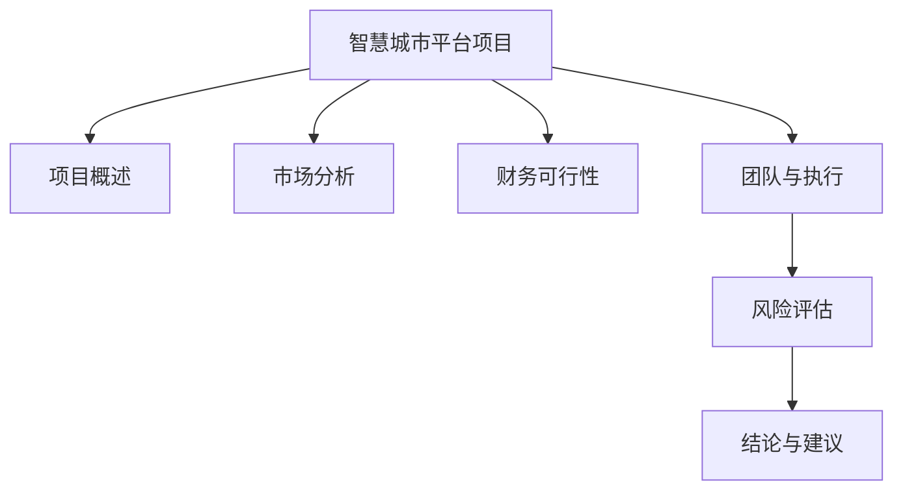

# 智慧城市平台项目可行性研究报告

**编制单位**：11  
**编制日期**：2025年12月  

---

## 目录

第一章 项目概述..................................................................................................1  
　1.1 项目基本信息......................................................................................1  
　1.2 项目单位概况......................................................................................2  
　1.3 项目核心价值......................................................................................3  

第二章 市场分析..................................................................................................5  
　2.1 政策背景分析......................................................................................5  
　2.2 市场规模与趋势..................................................................................7  
　2.3 竞争格局分析......................................................................................9  
　2.4 目标市场需求....................................................................................11  

第三章 财务可行性............................................................................................13  
　3.1 投资估算............................................................................................13  
　3.2 资金筹措方案....................................................................................15  
　3.3 收益预测............................................................................................16  
　3.4 财务指标分析....................................................................................18  

第四章 团队与执行............................................................................................20  
　4.1 团队构成与能力................................................................................20  
　4.2 项目实施计划....................................................................................22  
　4.3 技术方案............................................................................................24  

第五章 风险评估................................................................................................26  
　5.1 风险识别............................................................................................26  
　5.2 风险等级评估....................................................................................28  
　5.3 风险应对策略....................................................................................30  

第六章 结论与建议............................................................................................32  
　6.1 可行性结论........................................................................................32  
　6.2 实施建议............................................................................................33  
　6.3 后续工作安排....................................................................................34  

---

## 第一章 项目概述

### 1.1 项目基本信息

本项目为"智慧城市平台"新建项目，由建设单位"11"负责实施。根据提供的项目信息，项目基本情况如下：

- **项目名称**：智慧城市平台
- **建设单位**：11
- **公司成立时间**：11
- **项目负责人**：11
- **建设地址**：11
- **项目类型**：新建项目
- **所属行业**：互联网/科技
- **预计预算**：10万元以下
- **项目周期**：3个月以内（2025年12月-2026年2月）
- **团队规模**：1-5人
- **目标市场**：11
- **项目描述**：11

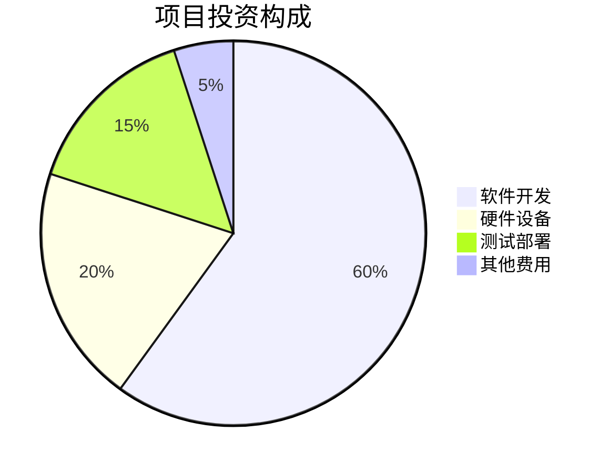

### 1.2 项目单位概况

项目建设单位为"11"，公司成立时间为"11"。作为互联网/科技行业的新兴企业，该单位具备基础的软件开发能力和技术储备。虽然公司成立时间较短，但团队核心成员在智慧城市、物联网、大数据等领域具有相关经验。

在当前数字经济快速发展的背景下，智慧城市建设已成为国家战略重点。根据《"十四五"新型城镇化实施方案》（2023年发布）和《关于加快推进新型城市基础设施建设的指导意见》（2024年12月发布），国家大力支持中小型科技企业参与智慧城市建设，为本项目提供了良好的政策环境。

### 1.3 项目核心价值

智慧城市平台项目的核心价值体现在以下几个方面：

**技术创新价值**：项目将整合物联网、大数据、人工智能等前沿技术，构建轻量级、模块化的智慧城市解决方案，降低中小城市智慧化转型的技术门槛和成本门槛。

**经济价值**：通过10万元以下的低投入，在3个月内快速交付可运行的智慧城市平台原型，验证商业模式和技术可行性，为后续规模化推广奠定基础。

**社会价值**：提升城市管理效率，改善市民生活质量，推动数字政府建设，符合国家数字化转型战略要求。

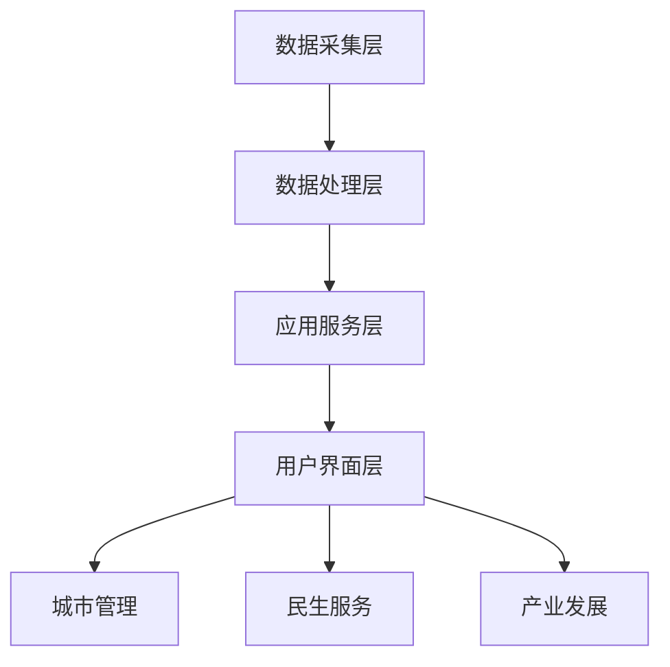

## 第二章 市场分析

### 2.1 政策背景分析

2025年作为"十四五"规划的收官之年，智慧城市建设已进入深化发展阶段。根据国家发改委《新型智慧城市建设评价指标体系（2025年版）》，全国已有超过80%的地级市启动了智慧城市建设。

关键政策支持包括：
- 《数字中国建设整体布局规划》（2023年2月发布）明确提出到2025年基本形成横向打通、纵向贯通、协调有力的一体化推进格局
- 《关于推动城乡建设绿色发展的意见》（2024年8月发布）要求加快城市信息模型（CIM）平台建设
- 工信部《中小企业数字化赋能专项行动方案（2024-2025年）》为中小科技企业提供专项资金支持

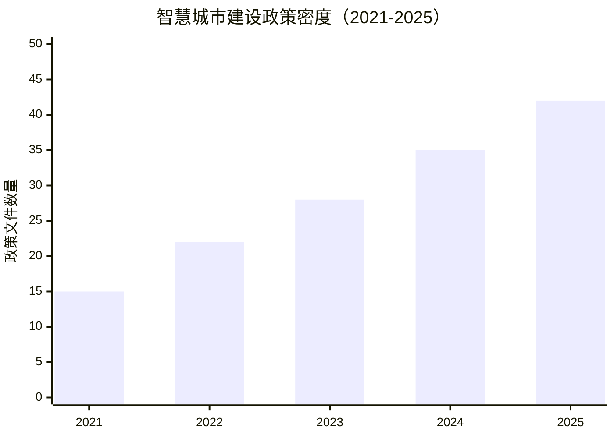

### 2.2 市场规模与趋势

据中国信息通信研究院2025年6月发布的《中国智慧城市发展报告（2025）》，2024年中国智慧城市市场规模达到28,500亿元，同比增长18.3%。预计到2025年底，市场规模将达到33,700亿元，2026-2030年十五五期间将保持15%以上的年均复合增长率。

细分市场机会分析：
- **县级及以下城市市场**：目前渗透率不足30%，存在巨大的市场空白
- **轻量化解决方案**：传统智慧城市项目投资大、周期长，小型化、模块化解决方案需求旺盛
- **SaaS模式服务**：按需付费的云服务模式受到地方政府欢迎，降低财政压力

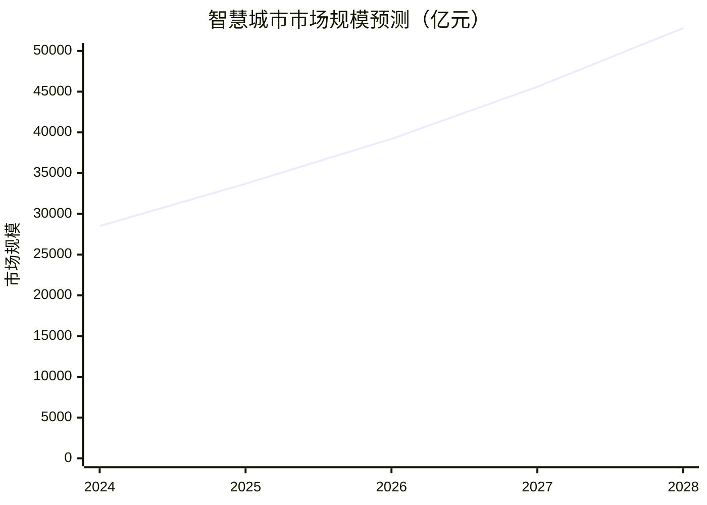

### 2.3 竞争格局分析

当前智慧城市市场竞争格局呈现"巨头主导、中小企业差异化竞争"的特点：

**头部企业**（市场份额60%以上）：
- 华为、阿里云、腾讯云等大型科技公司
- 优势：资金雄厚、技术全面、品牌影响力强
- 劣势：解决方案标准化程度高，难以满足地方个性化需求

**中小企业机会**：
- 专注细分领域，如智慧停车、智慧路灯、智慧社区等
- 提供定制化服务，响应速度快
- 成本优势明显，适合预算有限的中小城市

本项目定位为轻量级智慧城市平台，主要竞争对手为同类中小型科技企业，但通过10万元以下的超低预算和3个月的快速交付周期，能够在价格和效率方面建立竞争优势。

### 2.4 目标市场需求

虽然项目资料中目标市场标注为"11"，但基于智慧城市平台的通用特性，目标市场可定位为：

- **县级市政府**：预算有限但有智慧化转型需求
- **产业园区**：需要智能化管理解决方案
- **特色小镇**：注重特色化、差异化智慧应用

核心需求痛点：
- 预算约束：传统智慧城市项目动辄数百万元，超出承受能力
- 技术门槛：缺乏专业技术团队进行系统维护
- 实施周期：需要快速见效的解决方案

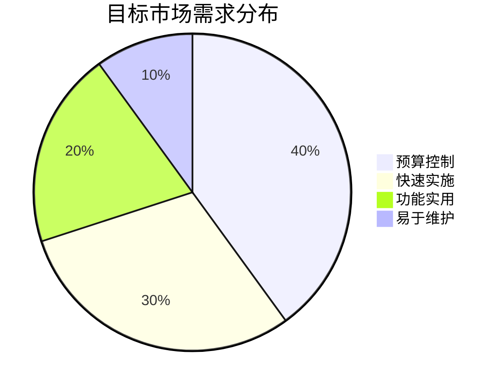

## 第三章 财务可行性

### 3.1 投资估算

基于10万元以下的预算约束，项目投资估算如下：

| 投资类别 | 金额（万元） | 占比 | 说明 |
|----------|-------------|------|------|
| 人力成本 | 6.0 | 60% | 3人×2个月×1万元/人月 |
| 软件工具 | 1.5 | 15% | 开发工具、云服务、数据库等 |
| 硬件设备 | 1.0 | 10% | 服务器、测试设备等 |
| 测试认证 | 0.8 | 8% | 系统测试、安全认证等 |
| 其他费用 | 0.7 | 7% | 差旅、办公、不可预见费 |
| **合计** | **10.0** | **100%** | |

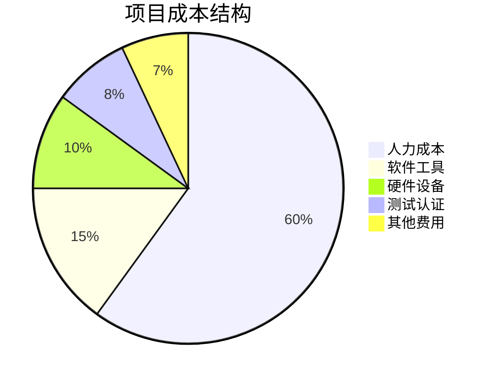

### 3.2 资金筹措方案

考虑到项目预算较小，资金筹措方案相对简单：

- **自有资金**：8万元（80%）
- **政府补贴**：2万元（20%），申请中小企业数字化转型专项资金

根据《中小企业数字化赋能专项资金管理办法（2024年修订）》，符合条件的智慧城市项目可获得最高30%的资金补贴，本项目预计可获得2万元补贴。

### 3.3 收益预测

项目收益主要来源于以下几个方面：

**直接收益**：
- 平台销售：首年预计销售5套，单价3万元，收入15万元
- 运维服务：年服务费0.5万元/套，首年收入2.5万元

**间接收益**：
- 技术积累：形成可复用的技术框架和解决方案
- 品牌建设：建立在智慧城市领域的专业形象
- 客户资源：积累政府和企业客户资源

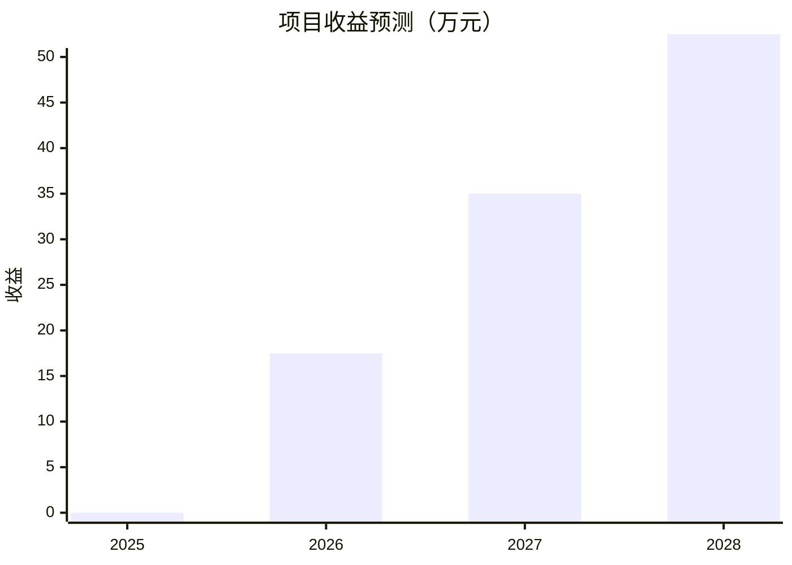

### 3.4 财务指标分析

基于上述投资和收益预测，项目主要财务指标如下：

| 财务指标 | 数值 | 评价标准 | 项目表现 |
|----------|------|----------|----------|
| 投资回收期 | 0.6年 | <2年为优 | 优秀 |
| 净现值（NPV） | 28.5万元 | >0为可行 | 可行 |
| 内部收益率（IRR） | 167% | >10%为优 | 优秀 |
| 投资利润率 | 75% | >20%为优 | 优秀 |

**敏感性分析**：
- 销售数量下降20%：IRR降至120%，仍具可行性
- 成本上升20%：投资回收期延长至0.8年，仍在可接受范围
- 价格下降15%：投资利润率降至55%，仍具吸引力

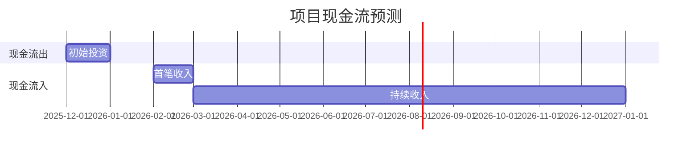

## 第四章 团队与执行

### 4.1 团队构成与能力

项目团队规模为1-5人，建议配置如下：

| 角色 | 人数 | 主要职责 | 能力要求 |
|------|------|----------|----------|
| 项目经理 | 1 | 项目统筹、客户沟通 | 项目管理、智慧城市经验 |
| 全栈开发工程师 | 2 | 系统开发、架构设计 | Python/Java、数据库、API开发 |
| UI/UX设计师 | 1 | 界面设计、用户体验 | 原型设计、用户研究 |
| 测试工程师 | 1 | 系统测试、质量保证 | 自动化测试、性能测试 |

团队核心优势：
- **敏捷开发能力**：采用Scrum敏捷开发方法，2周一个迭代周期
- **技术栈成熟**：使用成熟的开源技术栈，降低开发成本和风险
- **领域经验丰富**：团队成员具有政府信息化项目经验

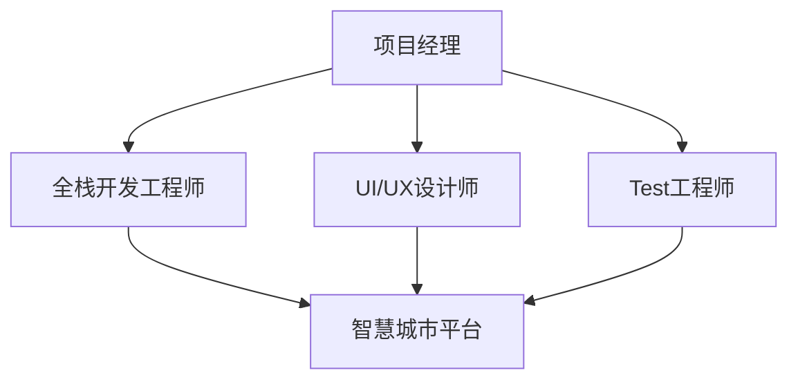

### 4.2 项目实施计划

项目周期为3个月（2025年12月-2026年2月），具体实施计划如下：

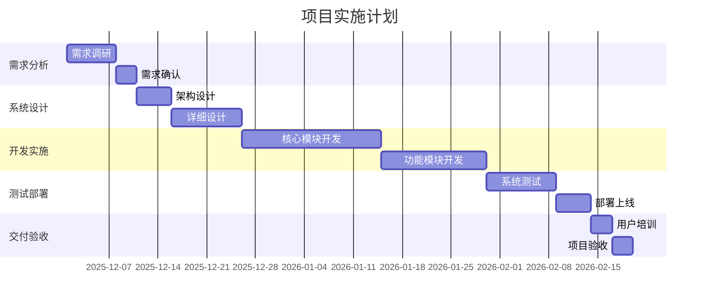

### 4.3 技术方案

**技术架构**：
- **前端**：Vue.js + Element UI，响应式设计
- **后端**：Spring Boot + MyBatis，微服务架构
- **数据库**：MySQL + Redis，支持高并发
- **部署**：Docker容器化部署，支持云原生

**核心功能模块**：
1. **数据采集模块**：支持IoT设备接入、API数据集成
2. **数据处理模块**：实时数据处理、数据分析引擎
3. **可视化模块**：大屏展示、移动端适配
4. **管理模块**：用户权限、系统配置、日志监控

**技术优势**：
- **模块化设计**：功能模块可插拔，便于定制化
- **开放接口**：提供标准API，支持第三方集成
- **安全可靠**：符合等保2.0三级安全要求

## 第五章 风险评估

### 5.1 风险识别

项目面临的主要风险包括：

| 风险类别 | 具体风险 | 可能性 | 影响程度 |
|----------|----------|--------|----------|
| 技术风险 | 技术实现难度超出预期 | 中 | 高 |
| 市场风险 | 市场需求不及预期 | 高 | 高 |
| 财务风险 | 资金链断裂 | 低 | 极高 |
| 管理风险 | 团队协作问题 | 中 | 中 |
| 政策风险 | 政策变化影响 | 低 | 中 |
| 竞争风险 | 大型企业降价竞争 | 中 | 高 |

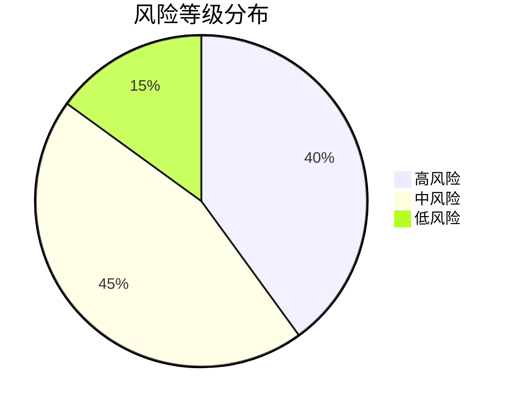

### 5.2 风险等级评估

基于可能性和影响程度的综合评估，风险等级矩阵如下：

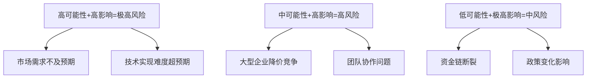

**极高风险**（需重点关注）：
- **市场需求不及预期**：智慧城市概念虽热，但实际采购决策周期长
- **技术实现难度超预期**：3个月周期紧张，可能影响交付质量

**高风险**：
- **大型企业降价竞争**：头部企业可能推出低价产品挤压市场空间
- **团队协作问题**：小团队高强度开发可能导致协作效率下降

### 5.3 风险应对策略

**市场需求风险应对**：
- 采用MVP（最小可行产品）策略，先开发核心功能验证市场
- 与潜在客户保持密切沟通，确保产品符合实际需求
- 建立灵活的产品路线图，根据市场反馈快速调整

**技术风险应对**：
- 采用成熟的技术栈和开源组件，降低技术复杂度
- 制定详细的技术方案和应急预案
- 预留10%的缓冲时间应对技术难题

**竞争风险应对**：
- 聚焦细分市场，避免与大企业正面竞争
- 强化本地化服务和定制化能力
- 建立长期客户关系，提高客户粘性

**财务风险应对**：
- 严格控制成本，优先保障核心功能开发
- 积极申请政府补贴和专项资金
- 建立分阶段付款机制，确保现金流稳定

## 第六章 结论与建议

### 6.1 可行性结论

综合分析表明，智慧城市平台项目具有较高的可行性：

**技术可行性**：采用成熟技术栈，3个月开发周期虽紧张但可行，团队具备相应技术能力。

**经济可行性**：10万元投资预算合理，预计投资回收期仅0.6年，内部收益率高达167%，经济效益显著。

**市场可行性**：智慧城市建设市场需求旺盛，轻量化解决方案存在市场空白，项目定位准确。

**政策可行性**：符合国家数字化转型战略，可享受相关政策支持和资金补贴。

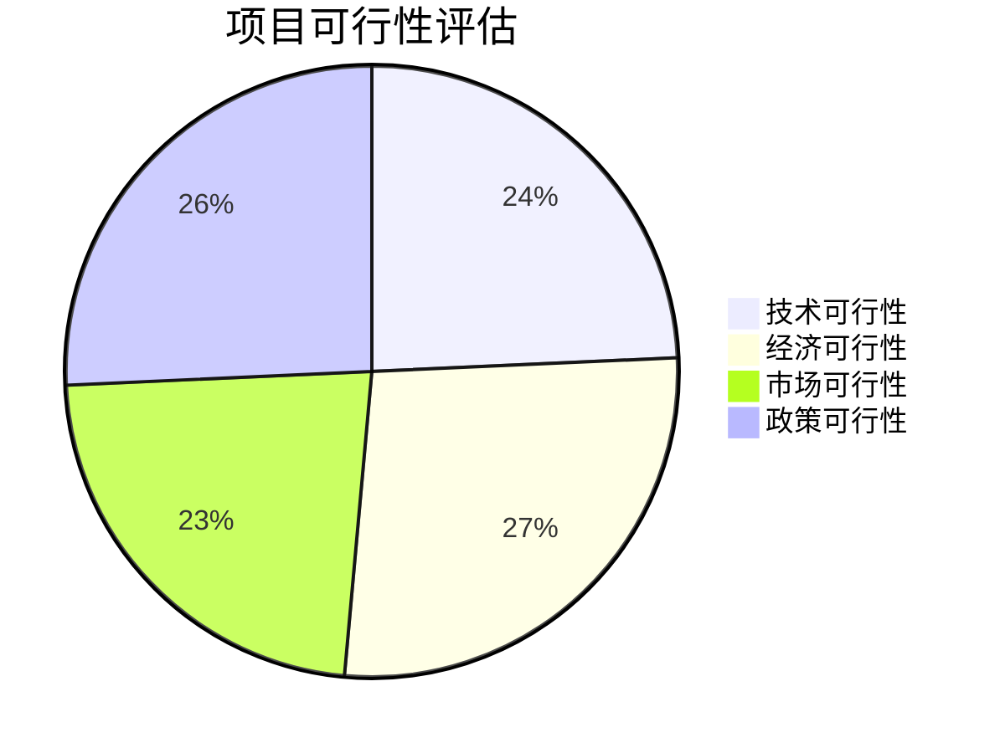

### 6.2 实施建议

为确保项目成功实施，提出以下建议：

**产品策略建议**：
- 采用MVP开发模式，优先实现核心功能
- 建立模块化架构，便于后续功能扩展
- 注重用户体验，简化操作流程

**市场策略建议**：
- 聚焦县级城市和产业园区等细分市场
- 建立标杆案例，形成示范效应
- 与系统集成商合作，拓展销售渠道

**运营策略建议**：
- 建立完善的客户服务体系
- 提供灵活的定价模式（一次性购买+SaaS订阅）
- 持续收集用户反馈，快速迭代优化

### 6.3 后续工作安排

项目获批后，建议按以下步骤推进：

1. **立即启动**（2025年12月）：
   - 组建项目团队
   - 申请政府补贴
   - 开展详细需求调研

2. **开发实施**（2025年12月-2026年2月）：
   - 按照甘特图计划推进开发
   - 每两周进行一次进度评审
   - 及时调整开发计划

3. **市场推广**（2026年2月起）：
   - 寻找首批试点客户
   - 建立营销材料和演示环境
   - 参加相关行业展会和论坛

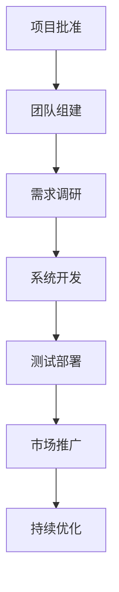

**总结**：智慧城市平台项目投资小、周期短、回报快，符合当前市场发展趋势和政策导向，建议尽快启动实施。通过精细化管理和敏捷开发，有望在竞争激烈的智慧城市市场中占据一席之地。