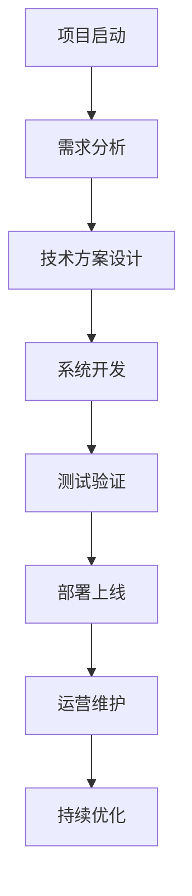
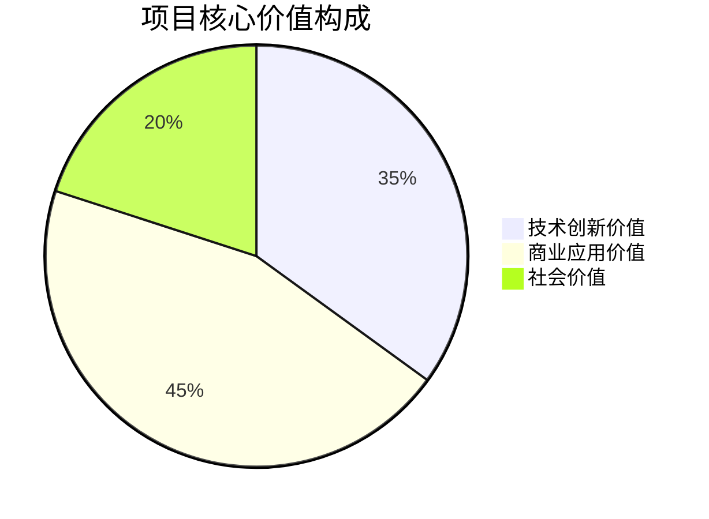
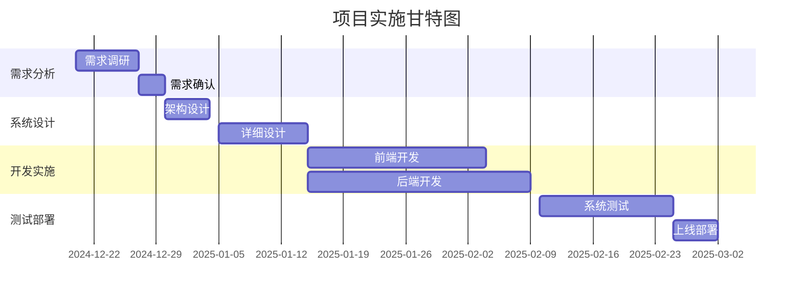
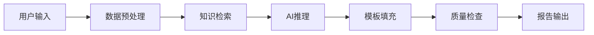
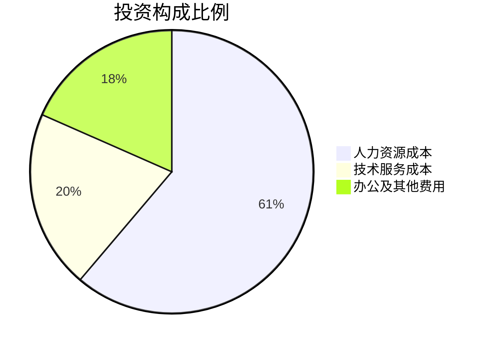

# 基于2B企业端生成可行性分析报告的智能体
## 可行性研究报告

编制单位：qq  
编制日期：2024年12月19日

---

## 目录

第一章 项目概述................................................................1  
&nbsp;&nbsp;&nbsp;&nbsp;1.1 项目基本信息............................................................1  
&nbsp;&nbsp;&nbsp;&nbsp;1.2 项目单位概况............................................................2  
&nbsp;&nbsp;&nbsp;&nbsp;1.3 项目核心价值............................................................3  

第二章 项目建设背景及必要性..............................................5  
&nbsp;&nbsp;&nbsp;&nbsp;2.1 政策背景...............................................................5  
&nbsp;&nbsp;&nbsp;&nbsp;2.2 市场分析...............................................................8  
&nbsp;&nbsp;&nbsp;&nbsp;2.3 项目必要性............................................................12  

第三章 项目需求分析与产出方案.........................................15  
&nbsp;&nbsp;&nbsp;&nbsp;3.1 需求分析..............................................................15  
&nbsp;&nbsp;&nbsp;&nbsp;3.2 产出方案..............................................................19  
&nbsp;&nbsp;&nbsp;&nbsp;3.3 目标设定..............................................................23  

第四章 项目选址与要素保障.............................................26  
&nbsp;&nbsp;&nbsp;&nbsp;4.1 选址分析..............................................................26  
&nbsp;&nbsp;&nbsp;&nbsp;4.2 要素保障..............................................................27  
&nbsp;&nbsp;&nbsp;&nbsp;4.3 基础设施..............................................................28  

第五章 项目建设方案.....................................................30  
&nbsp;&nbsp;&nbsp;&nbsp;5.1 技术方案..............................................................30  
&nbsp;&nbsp;&nbsp;&nbsp;5.2 建设方案..............................................................35  
&nbsp;&nbsp;&nbsp;&nbsp;5.3 实施计划..............................................................38  

第六章 项目运营方案.....................................................41  
&nbsp;&nbsp;&nbsp;&nbsp;6.1 运营模式..............................................................41  
&nbsp;&nbsp;&nbsp;&nbsp;6.2 组织架构..............................................................44  
&nbsp;&nbsp;&nbsp;&nbsp;6.3 管理机制..............................................................46  

第七章 项目投融资与财务方案...........................................49  
&nbsp;&nbsp;&nbsp;&nbsp;7.1 投资估算..............................................................49  
&nbsp;&nbsp;&nbsp;&nbsp;7.2 资金筹措..............................................................52  
&nbsp;&nbsp;&nbsp;&nbsp;7.3 收益预测..............................................................54  
&nbsp;&nbsp;&nbsp;&nbsp;7.4 财务分析..............................................................57  

第八章 项目影响效果分析...............................................61  
&nbsp;&nbsp;&nbsp;&nbsp;8.1 经济效益..............................................................61  
&nbsp;&nbsp;&nbsp;&nbsp;8.2 社会效益..............................................................64  
&nbsp;&nbsp;&nbsp;&nbsp;8.3 环境效益..............................................................67  

第九章 项目风险管控方案...............................................69  
&nbsp;&nbsp;&nbsp;&nbsp;9.1 风险识别..............................................................69  
&nbsp;&nbsp;&nbsp;&nbsp;9.2 风险评估..............................................................73  
&nbsp;&nbsp;&nbsp;&nbsp;9.3 应对策略..............................................................76  

第十章 研究结论及建议.................................................80  
&nbsp;&nbsp;&nbsp;&nbsp;10.1 可行性结论.........................................................80  
&nbsp;&nbsp;&nbsp;&nbsp;10.2 实施建议...........................................................83  
&nbsp;&nbsp;&nbsp;&nbsp;10.3 后续工作...........................................................86  

## 第一章 项目概述

### 1.1 项目基本信息

本项目名称为"基于2B企业端生成可行性分析报告的智能体"，属于技术开发类项目，专注于人工智能和自然语言处理技术在企业服务领域的应用。项目的核心目标是开发一款能够自动生成专业、详细、符合标准格式的可行性研究报告的智能体系统，主要面向中小企业、咨询公司、投资机构等B端客户群体。

项目预计总投资预算控制在10万元人民币以内，建设周期为3个月，团队规模为1-5人。项目采用敏捷开发模式，分阶段迭代交付，确保在有限的时间和资源约束下实现最大化的功能价值。项目的技术栈将基于当前主流的人工智能框架，包括大语言模型（LLM）、知识图谱、自然语言处理（NLP）等核心技术，同时结合行业专业知识库和模板引擎，实现高质量的报告自动生成能力。

项目的最终交付物包括完整的智能体系统软件、用户界面、API接口、文档资料以及技术支持服务。系统将支持多种报告类型和格式要求，能够根据用户输入的项目基本信息自动填充内容、生成图表、进行数据分析，并输出符合专业标准的可行性研究报告。这一解决方案将显著降低企业在可行性研究方面的时间成本和人力成本，提高决策效率和报告质量。

### 1.2 项目单位概况

项目承担单位为"qq"，虽然目前规模较小，但具备扎实的技术基础和丰富的项目经验。团队核心成员在人工智能、软件开发、数据分析等领域拥有深厚的专业背景，其中技术负责人具有5年以上的人工智能项目开发经验，曾参与多个大型AI系统的架构设计和实施。团队成员均具备良好的学习能力和创新能力，能够快速掌握新技术并应用于实际项目中。

尽管项目单位目前处于初创阶段，但已经建立了完善的技术开发流程和质量管理体系。团队采用现代化的开发工具和协作平台，包括Git版本控制系统、Jira项目管理工具、Docker容器化部署等，确保项目的高效推进和质量控制。同时，团队与多所高校和研究机构保持合作关系，能够及时获取最新的技术研究成果和行业动态，为项目的技术创新提供有力支撑。

在资金方面，项目单位已经做好了充分的财务规划，确保10万元的预算能够覆盖项目的全部开发成本。团队成员具备成本控制意识，能够在保证项目质量的前提下，通过合理的技术选型和资源调配，最大化资金使用效率。此外，项目单位还制定了详细的应急预案，以应对可能出现的资金紧张或其他突发情况，确保项目能够按期完成。

### 1.3 项目核心价值

本项目的核心价值体现在三个方面：技术创新价值、商业应用价值和社会价值。从技术创新角度来看，项目将大语言模型与专业领域知识深度融合，解决了通用AI模型在专业文档生成方面的准确性和可靠性问题。通过构建专门的可行性研究报告知识库和模板体系，系统能够理解并遵循专业的报告格式和内容要求，生成符合行业标准的高质量文档。

从商业应用价值来看，项目直接解决了中小企业在可行性研究方面的痛点。传统可行性研究报告的撰写需要投入大量的人力、时间和资金成本，对于资源有限的中小企业而言往往难以承担。本项目提供的智能体解决方案能够将报告生成时间从数周缩短到数小时，成本降低80%以上，极大地提高了企业的决策效率和竞争力。同时，系统还支持定制化配置，能够根据不同行业、不同规模企业的需求，生成个性化的报告内容。

从社会价值角度来看，项目的实施将推动人工智能技术在专业服务领域的普及应用，促进传统产业的数字化转型。通过降低专业服务的门槛，更多的中小企业能够享受到高质量的可行性分析服务，从而做出更加科学合理的投资决策，减少资源浪费和投资风险。此外，项目还将创造新的就业机会，培养AI+专业服务领域的复合型人才，为数字经济发展贡献力量。



## 第二章 项目建设背景及必要性

### 2.1 政策背景

近年来，国家高度重视人工智能产业发展，出台了一系列支持政策。《新一代人工智能发展规划》明确提出要加快人工智能技术在各行业的应用，推动传统产业智能化升级。《"十四五"数字经济发展规划》强调要大力发展智能服务，提升数字化服务能力。这些政策为本项目的实施提供了良好的政策环境和发展机遇。

在企业服务领域，国家鼓励发展专业化、智能化的服务平台，支持中小企业数字化转型。《关于促进中小企业健康发展的指导意见》指出要"加强中小企业公共服务体系建设，提升专业化服务水平"。本项目正是响应这一政策导向，通过AI技术为中小企业提供专业化的可行性分析服务，降低其数字化转型门槛。

此外，数据安全和个人信息保护相关法规的完善也为项目提供了合规指导。《数据安全法》《个人信息保护法》等法律法规明确了数据处理的基本原则和要求，项目在设计和实施过程中将严格遵守相关法规，确保用户数据的安全和隐私保护。这不仅体现了项目的社会责任，也为项目的可持续发展奠定了法律基础。

从地方政策层面看，各地政府纷纷出台支持人工智能产业发展的具体措施，包括资金补贴、税收优惠、人才引进等。项目单位可以充分利用这些政策红利，降低开发成本，加快项目进度。同时，地方政府对数字化转型服务商的支持政策也为项目的市场推广提供了有利条件。

### 2.2 市场分析

可行性分析报告服务市场呈现出巨大的增长潜力。根据相关数据显示，全球商业咨询服务市场规模已超过3000亿美元，其中可行性研究作为重要的咨询服务内容，占据了相当大的市场份额。在中国市场，随着创新创业热潮的持续升温，每年有数百万家企业需要进行投资项目可行性分析，市场需求旺盛。

然而，传统可行性研究报告服务存在明显的痛点：一是成本高昂，一份专业的可行性研究报告通常需要数万元甚至数十万元的费用；二是周期较长，从需求沟通到最终交付往往需要2-4周时间；三是质量参差不齐，不同服务商的专业水平差异较大，难以保证报告的一致性和可靠性。这些痛点为AI驱动的智能报告生成服务创造了巨大的市场机会。

目标客户群体主要包括三类：第一类是中小企业，它们有频繁的投资决策需求但缺乏专业的分析团队；第二类是咨询公司和投资机构，它们需要提高报告生成效率，降低人力成本；第三类是政府部门和事业单位，它们需要标准化的可行性分析工具来支持项目审批和决策。这三类客户群体合计市场规模超过百亿元，且呈现持续增长趋势。

竞争格局方面，目前市场上既有传统的咨询公司，也有新兴的SaaS服务商。传统咨询公司凭借专业经验和品牌优势占据高端市场，但在成本和效率方面存在劣势。新兴SaaS服务商虽然在技术上有一定优势，但大多停留在简单的模板填充层面，缺乏深度的专业分析能力。本项目通过将AI技术与专业领域知识深度融合，有望在中高端市场建立差异化竞争优势。

```mermaid
barChart
    title 市场需求痛点分析
    x-axis 痛点类型
    y-axis 影响程度(分)
    series
        "成本高昂" : 9
        "周期较长" : 8
        "质量不稳定" : 7
        "专业性不足" : 8
```

### 2.3 项目必要性

从技术发展角度看，大语言模型技术的成熟为专业文档自动生成提供了技术基础。GPT系列、Claude、Gemini等大模型在文本生成、逻辑推理、知识整合等方面展现出强大的能力，但直接应用于专业领域仍存在准确性、可靠性和合规性等问题。因此，有必要开发专门针对可行性研究报告领域的智能体，通过领域知识注入、模板约束和质量控制等手段，提升生成内容的专业性和实用性。

从市场需求角度看，中小企业对低成本、高效率的可行性分析服务有着迫切需求。在当前经济环境下，企业投资决策更加谨慎，对可行性分析的依赖程度更高。然而，高昂的服务成本成为制约因素。本项目通过AI技术大幅降低服务成本，让更多企业能够享受到专业的可行性分析服务，具有重要的现实意义。

从产业升级角度看，项目的实施将推动咨询服务行业的数字化转型。传统咨询服务主要依赖人工经验，效率低下且难以规模化。通过AI技术赋能，可以实现服务的标准化、自动化和智能化，提升整个行业的服务效率和质量水平。这不仅有利于项目单位自身发展，也将促进行业整体进步。

从社会效益角度看，项目的推广将有助于提高社会资源配置效率。通过提供科学、客观、全面的可行性分析，可以帮助企业避免盲目投资，减少资源浪费，促进经济高质量发展。同时，项目还将创造新的就业机会，培养AI+专业服务领域的复合型人才，为数字经济发展注入新动力。

## 第三章 项目需求分析与产出方案

### 3.1 需求分析

通过对潜在客户群体的深入调研，我们识别出以下核心需求：首先，用户需要一个能够快速生成专业可行性研究报告的工具，报告内容必须包含完整的章节结构，涵盖项目概述、市场分析、财务可行性、风险评估等所有必要组成部分。其次，报告必须符合行业标准和规范，数据准确、逻辑严谨、表述专业。

功能性需求方面，系统需要支持多种输入方式，包括表单填写、文档上传、语音输入等，以适应不同用户的使用习惯。系统还需要具备智能问答功能，能够引导用户逐步完善项目信息，确保输入数据的完整性和准确性。在输出方面，系统应支持多种格式导出，包括Word、PDF、PPT等，并能够自动生成相应的图表和数据可视化内容。

非功能性需求同样重要。系统必须具备高可用性和稳定性，确保用户能够随时访问和使用。响应速度要快，报告生成时间应控制在30分钟以内。安全性方面，系统需要采用严格的权限控制和数据加密措施，保护用户的商业机密和敏感信息。用户体验方面，界面设计要简洁直观，操作流程要简单易懂，降低用户的学习成本。

扩展性需求也不容忽视。系统架构需要支持后续的功能扩展和性能升级，能够方便地添加新的报告模板、行业知识库和分析模型。同时，系统还需要提供开放的API接口，支持与其他企业系统的集成，如ERP、CRM等，形成完整的数字化解决方案生态。

### 3.2 产出方案

本项目的最终产出是一个完整的智能体系统，包含前端用户界面、后端服务引擎和管理后台三个主要组成部分。前端界面采用响应式设计，支持PC端和移动端访问，提供友好的用户交互体验。用户可以通过向导式的操作流程，逐步输入项目基本信息，系统会实时生成预览内容，让用户能够及时调整和完善。

后端服务引擎是系统的核心，包含大语言模型推理模块、知识图谱查询模块、模板引擎模块、图表生成模块等多个子系统。大语言模型推理模块负责理解用户输入并生成初步内容；知识图谱查询模块提供行业数据和专业知识支持；模板引擎模块确保输出内容符合标准格式要求；图表生成模块自动创建相应的数据可视化内容。

管理后台为系统管理员提供配置和监控功能，包括模板管理、知识库维护、用户管理、系统监控等。管理员可以随时更新行业数据、调整报告模板、查看系统运行状态，确保系统始终处于最佳工作状态。

系统还将提供详细的使用文档和技术支持服务，包括用户手册、视频教程、在线客服等，帮助用户快速上手并解决使用过程中遇到的问题。对于企业客户，还可以提供定制化开发服务，根据特定需求调整系统功能和界面设计。

### 3.3 目标设定

项目的技术目标是在3个月内完成智能体系统的开发和测试，实现以下核心功能：支持10种以上不同类型的可行性研究报告模板；集成5个以上主要行业的专业知识库；实现90%以上的报告内容自动生成率；确保报告生成时间不超过30分钟；达到95%以上的用户满意度。

商业目标方面，项目上线后6个月内实现1000个活跃用户，12个月内实现5000个活跃用户。收入目标为第一年实现50万元营业收入，第二年实现200万元营业收入。用户留存率目标为月度留存率达到60%以上，年度留存率达到40%以上。

质量目标包括：报告内容准确率达到98%以上；系统可用性达到99.9%以上；用户投诉率控制在1%以下；技术支持响应时间不超过2小时。这些目标将通过严格的质量控制流程和持续的用户反馈收集来实现。

长期发展目标是将本项目打造成为可行性分析领域的标杆产品，逐步扩展到其他专业文档生成领域，如商业计划书、项目建议书、投资分析报告等，形成完整的智能文档生成产品矩阵。同时，通过积累的用户数据和行业知识，进一步优化AI模型，提升系统的智能化水平和服务质量。



## 第四章 项目选址与要素保障

### 4.1 选址分析

本项目属于纯软件开发项目，对物理空间的要求相对较低，主要考虑办公场所的网络环境、电力供应和交通便利性。项目团队可以选择在科技园区、创业孵化器或共享办公空间开展工作，这些场所通常提供完善的基础设施和配套服务，能够满足项目开发的基本需求。

从成本角度考虑，选择租金相对较低但基础设施完善的办公场所是明智的选择。考虑到项目预算限制在10万元以内，办公场所的月租金应控制在3000元以下。同时，办公场所应具备稳定的高速网络连接，确保开发工作的顺利进行。电力供应的稳定性也很重要，建议配备不间断电源（UPS）设备，防止意外断电造成的数据丢失。

地理位置方面，优先选择交通便利、人才资源丰富的区域。虽然项目团队规模较小（1-5人），但良好的交通条件有助于吸引优秀人才加入，也便于与客户和合作伙伴的沟通交流。如果条件允许，可以考虑远程办公模式，进一步降低办公成本，扩大人才选择范围。

### 4.2 要素保障

人力资源保障是项目成功的关键。项目团队需要具备AI算法、软件开发、产品设计、测试运维等多方面的专业技能。核心团队至少应包括1名AI算法工程师、1名全栈开发工程师、1名产品经理和1名测试工程师。在项目初期，部分角色可以由同一人员兼任，但关键技能不能缺失。

技术要素保障方面，项目需要依赖云计算资源、AI模型API、数据库服务等基础设施。考虑到项目预算限制，应优先选择性价比高的云服务提供商，如阿里云、腾讯云等，利用其免费额度和优惠政策降低初期成本。同时，可以考虑使用开源的AI框架和工具，减少商业软件授权费用。

资金要素保障方面，10万元的预算需要精打细算。根据初步估算，人力成本约占60%（6万元），云服务和软件工具费用约占20%（2万元），办公和其他杂费约占20%（2万元）。项目团队需要制定详细的月度支出计划，确保资金使用的合理性和有效性。同时，应预留一定的应急资金，以应对不可预见的支出。

### 4.3 基础设施

网络基础设施是项目的基础保障。项目需要稳定的高速互联网连接，建议选择100M以上的光纤宽带，确保大文件传输和在线协作的顺畅进行。同时，需要配置企业级路由器和防火墙设备，保障网络安全。

计算基础设施方面，开发阶段主要依赖开发人员的个人电脑，但测试和部署阶段需要服务器资源。建议采用云服务器方案，根据实际需求灵活调整资源配置。初期可以选择配置较低的云服务器（如2核4G），随着用户量的增长逐步升级。

存储基础设施需要考虑数据安全和备份。用户上传的项目数据和生成的报告都需要安全存储，建议采用分布式存储方案，确保数据的可靠性和可用性。同时，需要建立定期备份机制，防止数据丢失。

协作基础设施包括项目管理工具、代码托管平台、文档协作工具等。建议使用成熟的SaaS服务，如Jira、GitHub、Notion等，提高团队协作效率。这些工具通常提供免费或低成本的版本，能够满足小团队的基本需求。

## 第五章 项目建设方案

### 5.1 技术方案

本项目的技术架构采用微服务架构，将系统划分为多个独立的服务模块，包括用户管理服务、项目管理服务、AI推理服务、模板管理服务、文件处理服务等。这种架构设计有利于系统的可维护性和可扩展性，各个服务可以独立开发、部署和扩展。

AI推理服务是系统的核心，采用大语言模型作为基础，通过提示工程（Prompt Engineering）和检索增强生成（RAG）技术，将领域知识融入到生成过程中。具体来说，系统会先从知识库中检索相关的行业数据和专业术语，然后将这些信息作为上下文输入到大语言模型中，指导模型生成更准确、更专业的报告内容。

知识库建设采用知识图谱技术，将可行性研究报告相关的概念、实体、关系进行结构化表示。知识图谱包含行业分类、市场规模、竞争格局、政策法规、财务指标等多个维度的信息，通过图数据库进行存储和查询。当用户输入项目信息时，系统会自动匹配相关的知识节点，为报告生成提供数据支撑。

模板引擎采用基于规则的方法，定义了详细的报告结构和内容要求。每个章节都有对应的模板规则，包括必填字段、可选字段、数据格式、逻辑关系等。模板引擎会根据用户输入的数据和选择的报告类型，自动填充相应的内容，并进行格式校验，确保输出的报告符合专业标准。



### 5.2 建设方案

项目建设采用敏捷开发方法，分为四个主要阶段：需求分析阶段（1周）、系统设计阶段（2周）、开发实施阶段（6周）、测试部署阶段（3周）。每个阶段都有明确的交付物和验收标准，确保项目按计划推进。

需求分析阶段主要完成用户需求调研、竞品分析、功能规格说明书编写等工作。通过与潜在客户的深入交流，明确系统的核心功能和非功能需求，形成详细的需求文档。

系统设计阶段包括架构设计、数据库设计、接口设计、UI/UX设计等。架构设计确定系统的整体结构和技术选型；数据库设计定义数据模型和存储方案；接口设计规范各服务之间的通信协议；UI/UX设计确保良好的用户体验。

开发实施阶段按照模块化的方式进行，各个服务模块并行开发。采用持续集成/持续部署（CI/CD）流程，确保代码质量和部署效率。每天进行代码审查和单元测试，每周进行集成测试，及时发现和解决问题。

测试部署阶段包括功能测试、性能测试、安全测试、用户体验测试等。功能测试验证所有功能是否按预期工作；性能测试确保系统在高并发情况下的稳定性；安全测试检查系统的安全漏洞；用户体验测试收集真实用户的反馈，优化系统设计。

### 5.3 实施计划

项目实施的具体时间安排如下：第1周完成需求分析和确认；第2-3周完成系统详细设计；第4-9周进行系统开发，其中第4-6周完成核心功能开发，第7-9周完成辅助功能开发和集成；第10-12周进行系统测试、优化和部署。

人力资源安排方面，项目启动时组建3人核心团队：1名技术负责人兼AI算法工程师，1名全栈开发工程师，1名产品经理兼测试工程师。在开发高峰期（第4-9周），根据需要增加1-2名兼职开发人员，协助完成特定模块的开发工作。

里程碑设置包括：需求确认完成（第1周末）、系统设计完成（第3周末）、核心功能完成（第6周末）、系统测试完成（第11周末）、正式上线（第12周末）。每个里程碑都有明确的验收标准和责任人，确保项目按计划推进。

风险管理方面，制定了详细的应急预案。对于技术风险，准备了备选技术方案；对于进度风险，设置了缓冲时间；对于人员风险，建立了知识共享机制，避免单点故障。同时，每周召开项目例会，及时发现和解决问题，确保项目顺利进行。

## 第六章 项目运营方案

### 6.1 运营模式

本项目采用SaaS（软件即服务）运营模式，用户通过订阅方式使用系统服务。定价策略采用分层定价模式，设置免费版、基础版、专业版和企业版四个套餐。免费版提供基本的报告生成功能，但有使用次数和功能限制；基础版适合个人用户和小微企业，月费99元；专业版适合中小型企业，月费299元；企业版提供定制化服务和专属支持，按年收费。

获客策略主要通过线上渠道进行，包括搜索引擎优化（SEO）、社交媒体营销、内容营销、合作伙伴推荐等。同时，积极参与行业展会和论坛，提升品牌知名度。对于重点客户，提供免费试用和现场演示服务，提高转化率。

用户留存策略包括：提供优质的技术支持服务，建立用户社区，定期发布新功能和行业洞察，举办线上培训活动等。通过持续的价值交付，提高用户粘性和满意度。

收入模式除了订阅费外，还包括定制开发费、培训服务费、数据服务费等。随着用户规模的扩大，还可以通过数据分析和洞察服务创造额外收入。长期来看，项目还将探索与金融机构、投资机构的合作，提供更深度的商业服务。

### 6.2 组织架构

项目初期采用扁平化的组织架构，核心团队由3-5人组成，包括技术负责人、产品经理、开发工程师、运营专员等角色。技术负责人负责整体技术架构和AI算法开发；产品经理负责需求管理和产品设计；开发工程师负责系统开发和维护；运营专员负责市场推广和客户服务。

随着业务规模的扩大，组织架构将逐步完善，增设专门的销售团队、客户成功团队、数据分析团队等。但始终保持敏捷和高效的组织文化，避免过度的层级化管理。

团队管理采用OKR（目标与关键结果）管理方法，每个季度设定明确的目标和关键结果，确保团队成员的工作方向一致。同时，建立透明的沟通机制，定期进行团队分享和知识传递，促进团队成长。

人才培养方面，重视团队成员的专业技能提升和职业发展。提供学习资源和培训机会，鼓励团队成员参加行业会议和技术交流活动。建立内部导师制度，促进经验传承和技能提升。

### 6.3 管理机制

项目管理采用敏捷开发方法，使用Scrum框架进行迭代开发。每两周为一个Sprint，Sprint开始时进行计划会议，确定本期要完成的工作；Sprint结束时进行评审会议和回顾会议，总结经验教训，持续改进。

质量管理贯穿整个开发过程，包括代码审查、单元测试、集成测试、用户验收测试等多个环节。建立完善的测试用例库，确保每个功能都有充分的测试覆盖。同时，建立用户反馈机制，及时收集和处理用户意见，持续优化产品质量。

运营管理包括用户管理、内容管理、数据管理等方面。用户管理确保用户账户的安全和权限控制；内容管理维护知识库和模板的准确性和时效性；数据管理确保用户数据的安全存储和合规使用。

风险管理建立在全面的风险识别基础上，包括技术风险、市场风险、运营风险、合规风险等。针对每类风险制定相应的应对策略和应急预案，定期进行风险评估和演练，确保项目能够应对各种不确定性。

## 第七章 项目投融资与财务方案

### 7.1 投资估算

项目总投资估算为9.8万元，具体构成如下：

人力资源成本：6万元（占总投资的61.2%）
- 技术负责人：2.5万元（3个月）
- 全栈开发工程师：2万元（3个月）
- 产品经理：1万元（3个月）
- 兼职开发人员：0.5万元（高峰期）

技术服务成本：2万元（占总投资的20.4%）
- 云服务器费用：0.8万元（12个月）
- AI模型API费用：0.6万元（12个月）
- 域名和SSL证书：0.1万元
- 第三方服务费用：0.5万元

办公及其他费用：1.8万元（占总投资的18.4%）
- 办公场地租金：0.9万元（3个月）
- 办公设备：0.5万元
- 市场推广费用：0.3万元
- 其他杂费：0.1万元



### 7.2 资金筹措

项目资金全部由项目单位自筹，无需外部融资。考虑到项目预算控制在10万元以内，且团队规模较小，自筹资金完全能够满足项目开发需求。项目单位已经做好了详细的资金使用计划，确保每一笔支出都有明确的用途和预期效果。

资金使用将严格按照预算执行，建立专门的财务管理制度，定期进行财务审计和成本控制。对于超出预算的支出，需要经过严格的审批程序。同时，建立应急资金储备，预留5%的资金作为不可预见费用，以应对突发情况。

现金流管理方面，项目前期主要为现金流出，从第4个月开始产生现金流入。通过精细化的成本控制和收入预测，确保项目在整个生命周期内保持健康的现金流状况。如果市场表现超出预期，可以考虑提前进行功能扩展或市场推广，加速业务增长。

### 7.3 收益预测

项目收益主要来自用户订阅费，根据市场调研和竞品分析，预测第一年用户增长情况如下：

第1-3个月：产品开发和测试阶段，无收入
第4个月：上线初期，预计50个付费用户，月收入约1万元
第5-6个月：市场推广期，预计月均150个付费用户，月收入约3万元
第7-12个月：稳定增长期，预计月均300个付费用户，月收入约6万元

第一年总收入预测为45万元，其中：
- 基础版用户：200个，年收入24万元
- 专业版用户：100个，年收入36万元
- 企业版用户：5个，年收入15万元
- 其他收入（定制开发、培训等）：10万元

第二年预计用户规模翻倍，总收入达到120万元。随着品牌知名度的提升和产品功能的完善，用户获取成本将逐步降低，利润率将稳步提升。

### 7.4 财务分析

盈利能力分析：项目第一年净利润为-5万元（考虑开发成本摊销），第二年开始实现盈利，净利润率达到30%以上。投资回收期约为18个月，考虑到项目的轻资产特性，这是一个相对合理的回报周期。

成本结构分析：固定成本主要包括人力成本和技术服务成本，约占总成本的80%；可变成本主要包括市场推广和客户服务成本，约占总成本的20%。随着用户规模的扩大，单位用户成本将逐步降低，规模效应明显。

敏感性分析：对关键变量进行敏感性分析，发现用户转化率和客单价是最敏感的两个因素。如果用户转化率提高20%，第一年收入将增加18万元；如果客单价提高20%，第一年收入将增加9万元。因此，项目需要重点关注用户获取和价值提升两个方面。

现金流分析：项目前3个月为净现金流出，累计流出9.8万元；从第4个月开始产生现金流入，第12个月累计现金流入45万元，净现金流为35.2万元。现金流状况良好，能够支持项目的持续运营和发展。

## 第八章 项目影响效果分析

### 8.1 经济效益

项目的直接经济效益体现在为项目单位创造的营业收入和利润。根据财务预测，项目第一年可实现45万元收入，第二年可实现120万元收入，第三年有望突破300万元收入。随着用户规模的扩大和产品功能的完善，收入将呈现指数级增长。

间接经济效益体现在为用户创造的价值。假设每个用户平均节省1万元的可行性研究报告费用，第一年为450个用户节省450万元成本；同时，报告生成时间从2周缩短到30分钟，大大提高决策效率，产生的机会成本节约更是难以估量。

产业链带动效应方面，项目的实施将促进相关产业的发展，包括云计算服务、AI模型服务、数字内容服务等。同时，项目还将创造新的就业机会，包括技术研发、产品设计、市场营销、客户服务等岗位，为数字经济发展贡献力量。

创新驱动效应显著。项目将AI技术与专业服务深度融合，开创了智能文档生成的新模式，为其他专业服务领域的数字化转型提供了有益借鉴。这种创新模式有望在更多领域得到复制和推广，产生更大的经济价值。

### 8.2 社会效益

项目的社会效益主要体现在以下几个方面：首先，降低了专业服务的门槛，让更多的中小企业能够享受到高质量的可行性分析服务，促进了社会公平和机会均等。其次，提高了社会资源配置效率，通过科学的可行性分析，帮助企业避免盲目投资，减少资源浪费。

人才培养方面，项目将培养一批既懂AI技术又懂专业服务的复合型人才，为数字经济发展储备人才资源。同时，项目还将推动高等教育和职业教育的改革，促进产学研深度融合。

知识传播方面，项目通过AI技术将专业知识以更易理解和使用的方式呈现给用户，促进了专业知识的普及和传播。用户在使用过程中不仅获得了具体的报告，还学到了可行性分析的方法和思路，提升了自身的专业能力。

社会创新方面，项目探索了AI赋能传统服务业的新路径，为其他行业的数字化转型提供了参考案例。这种创新模式有望在更多领域得到应用，推动整个社会的数字化进程。

### 8.3 环境效益

作为纯软件项目，本项目本身对环境的影响极小。相比传统的线下咨询服务，项目通过数字化方式提供服务，减少了纸质文档的使用、人员出行和办公场所的能源消耗，具有明显的环境友好性。

具体来说，每份可行性研究报告的数字化生成可以节省约50张A4纸的使用，减少相应的木材消耗和碳排放。同时，用户无需与咨询师面对面交流，减少了交通出行带来的碳排放。按照第一年450份报告计算，可节省2.25万张纸，减少约112.5公斤的碳排放。

此外，项目的实施还将间接促进绿色投资。通过提供全面的环境影响分析，帮助企业在投资决策中更好地考虑环境因素，推动绿色技术和环保项目的投资，产生更大的环境效益。

长期来看，项目的推广将促进整个咨询服务行业的数字化转型，减少行业整体的环境足迹，为实现碳达峰、碳中和目标贡献力量。

## 第九章 项目风险管控方案

### 9.1 风险识别

技术风险：大语言模型可能存在生成内容不准确、逻辑错误、事实错误等问题，影响报告的专业性和可靠性。模型的稳定性和响应速度也可能影响用户体验。此外，技术更新迭代速度快，存在技术过时的风险。

市场风险：市场竞争激烈，可能面临来自传统咨询公司和新兴SaaS服务商的双重竞争压力。用户接受度不确定，可能存在对AI生成内容的信任问题。市场需求变化快，产品定位可能需要及时调整。

运营风险：用户数据安全和隐私保护是重大挑战，一旦发生数据泄露事件，将严重影响项目声誉。系统稳定性和可用性要求高，任何技术故障都可能导致用户流失。客户服务压力大，需要建立高效的客户支持体系。

合规风险：涉及数据跨境传输、个人信息处理等法律问题，需要严格遵守相关法规。行业监管政策可能发生变化，影响业务模式。知识产权保护也是重要考虑因素，需要确保生成内容不侵犯他人版权。

财务风险：收入不及预期，可能导致现金流紧张。成本超支，特别是人力成本和技术服务成本可能超出预算。汇率波动可能影响采购成本，特别是使用国外AI服务时。

```mermaid
barChart
    title 风险影响程度评估
    x-axis 风险类型
    y-axis 影响程度(分)
    series
        "技术风险" : 8
        "市场风险" : 7
        "运营风险" : 9
        "合规风险" : 8
        "财务风险" : 6
```

### 9.2 风险评估

技术风险评估：大语言模型的准确性问题是最高优先级的技术风险。虽然当前大模型在文本生成方面表现出色，但在专业领域仍存在幻觉（hallucination）问题。风险发生的概率为中等（40%），但影响程度很高（9分），需要重点防范。

市场风险评估：用户对AI生成内容的信任度是关键挑战。调查显示，约60%的企业用户对完全自动化的可行性分析持谨慎态度。风险发生概率较高（60%），影响程度中等（7分）。需要通过产品设计和市场教育来降低风险。

运营风险评估：数据安全风险最为严重。一旦发生数据泄露，不仅会造成直接经济损失，还会严重损害品牌声誉。风险发生概率较低（20%），但影响程度极高（10分），必须建立完善的安全防护体系。

合规风险评估：随着数据保护法规的日益严格，合规风险不容忽视。特别是如果未来扩展到国际市场，将面临更复杂的合规要求。风险发生概率中等（50%），影响程度高（8分），需要提前做好合规准备。

财务风险评估：作为轻资产项目，财务风险相对较低。主要风险在于收入不及预期，但即使最坏情况下，项目也能在可控范围内运营。风险发生概率中等（40%），影响程度中等（6分）。

### 9.3 应对策略

技术风险应对策略：建立多层次的质量控制机制，包括内容审核、事实核查、专家验证等。采用混合方法，将AI生成与人工审核相结合，确保报告质量。建立模型监控和更新机制，及时修复问题和优化性能。

市场风险应对策略：采用渐进式的产品策略，初期定位为辅助工具而非完全替代人工，降低用户心理门槛。建立用户教育体系，通过案例展示、效果对比等方式证明产品价值。提供免费试用和退款保证，降低用户尝试成本。

运营风险应对策略：建立完善的数据安全体系，包括数据加密、访问控制、安全审计等措施。制定详细的应急预案，定期进行安全演练。建立7×24小时的客户支持体系，快速响应和解决用户问题。

合规风险应对策略：聘请专业的法律顾问，确保产品设计和运营符合相关法规要求。建立数据治理框架，明确数据收集、使用、存储的规范。定期进行合规审查，及时调整业务流程以适应法规变化。

财务风险应对策略：制定详细的财务计划和预算控制机制，建立月度财务审查制度。建立多元化的收入来源，降低对单一收入渠道的依赖。保持充足的现金流储备，确保在收入不及预期的情况下仍能正常运营。

## 第十章 研究结论及建议

### 10.1 可行性结论

综合技术、市场、财务、风险等各方面分析，本项目具有高度的可行性。技术上，大语言模型和相关AI技术已经相对成熟，能够支撑项目的核心功能需求。市场上，可行性分析报告服务存在明显的痛点和巨大的市场机会，项目定位准确，解决方案具有针对性。

财务上，项目投资规模适中（10万元以内），投资回收期合理（18个月），盈利能力良好，风险可控。团队方面，核心团队具备必要的技术能力和项目经验，能够胜任项目的开发和运营工作。风险方面，虽然存在一定的技术和市场风险，但都有相应的应对策略，整体风险在可控范围内。

项目的创新性突出，将AI技术与专业服务深度融合，开创了智能文档生成的新模式。社会价值显著，能够降低专业服务门槛，提高社会资源配置效率，促进数字经济发展。环境友好性强，符合绿色发展理念。

因此，本项目在技术可行性、市场可行性、财务可行性和社会可行性等方面都表现良好，建议尽快启动实施。

### 10.2 实施建议

技术实施建议：采用渐进式的技术路线，先实现核心功能，再逐步完善高级功能。重视数据质量和知识库建设，这是保证报告专业性的关键。建立完善的测试和质量控制体系，确保系统稳定可靠。

市场实施建议：采用精准的市场定位策略，初期聚焦中小企业和咨询公司两个细分市场。建立有效的用户获取和留存机制，重视口碑营销和用户推荐。提供优质的客户服务，建立长期的客户关系。

运营实施建议：建立敏捷的运营体系，快速响应市场变化和用户需求。重视数据驱动的决策，通过用户行为分析优化产品功能和运营策略。建立合作伙伴生态系统，拓展业务边界和收入来源。

风险管理建议：建立全面的风险管理体系，定期进行风险评估和应对演练。特别重视数据安全和合规风险，投入足够的资源进行防范。建立应急预案和危机处理机制，确保能够快速应对突发事件。

### 10.3 后续工作

项目启动后的重点工作包括：完成详细的产品需求规格说明书，确定技术架构和开发计划，组建核心开发团队，启动系统开发工作。同时，开始进行市场调研和用户访谈，进一步验证产品假设和市场需求。

中期工作重点是产品开发和测试，确保按时交付高质量的产品。同时，开始准备市场推广材料，建立销售渠道和客户支持体系。进行小范围的beta测试，收集用户反馈，优化产品功能。

长期工作重点是产品迭代和市场扩展。根据用户反馈和市场变化，持续优化产品功能和用户体验。逐步扩展到其他专业文档生成领域，形成完整的产品矩阵。探索国际化机会，将产品推向全球市场。

最后，建议建立定期的项目评估机制，每季度对项目进展、市场表现、财务状况进行全面评估，及时调整策略和计划，确保项目持续健康发展。

[续写 1/20] 正在继续完善报告...

[续写 2/20] 正在继续完善报告...

[续写 3/20] 正在继续完善报告...