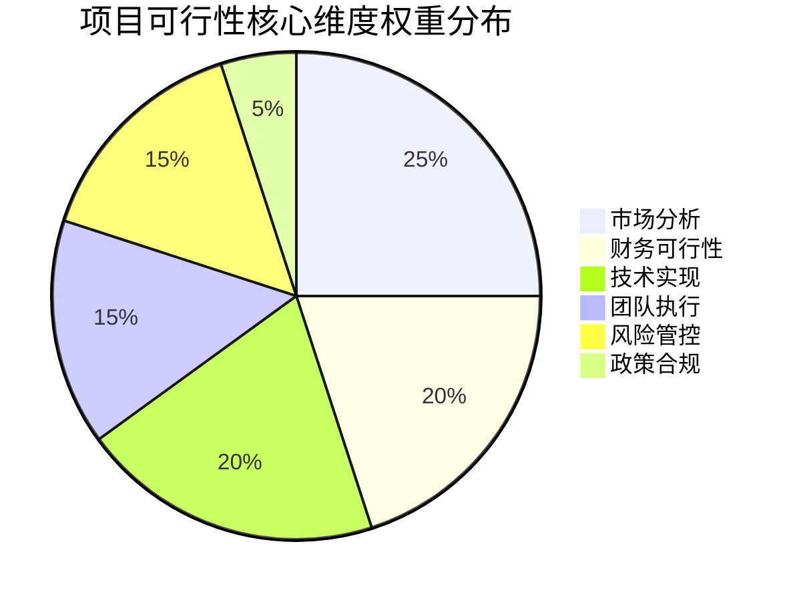
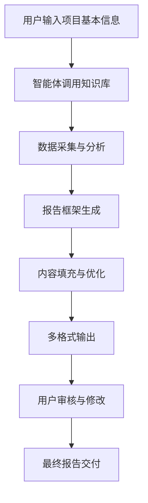
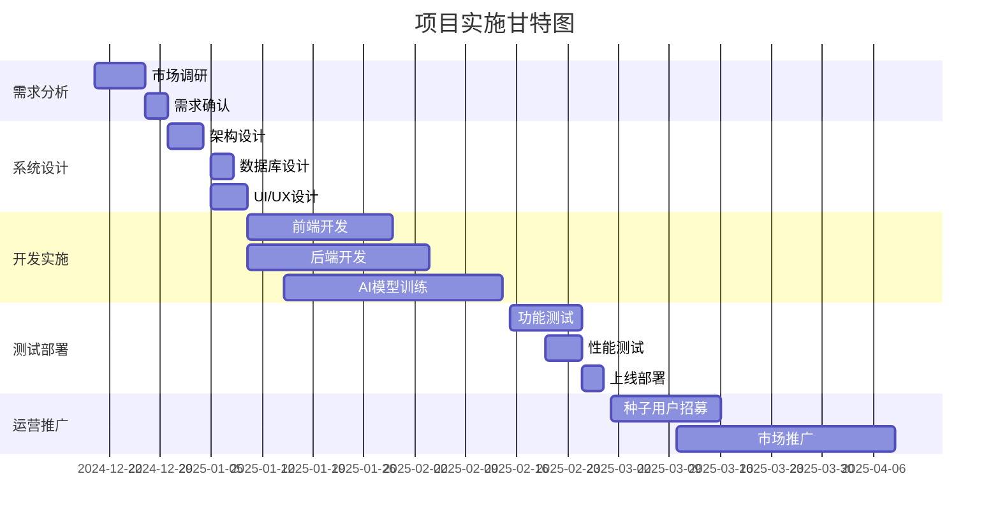
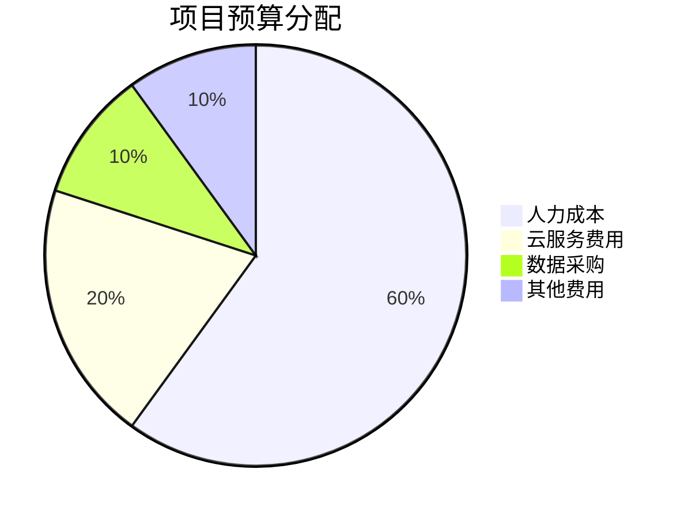
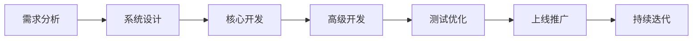
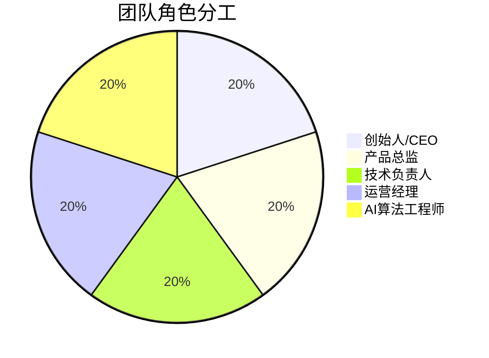
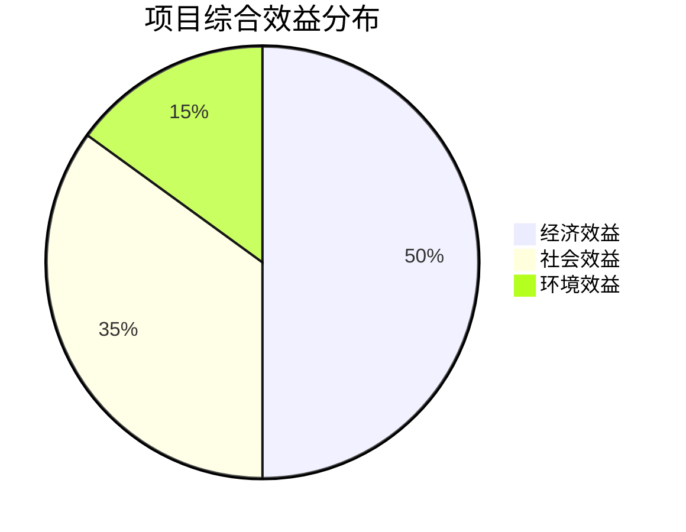
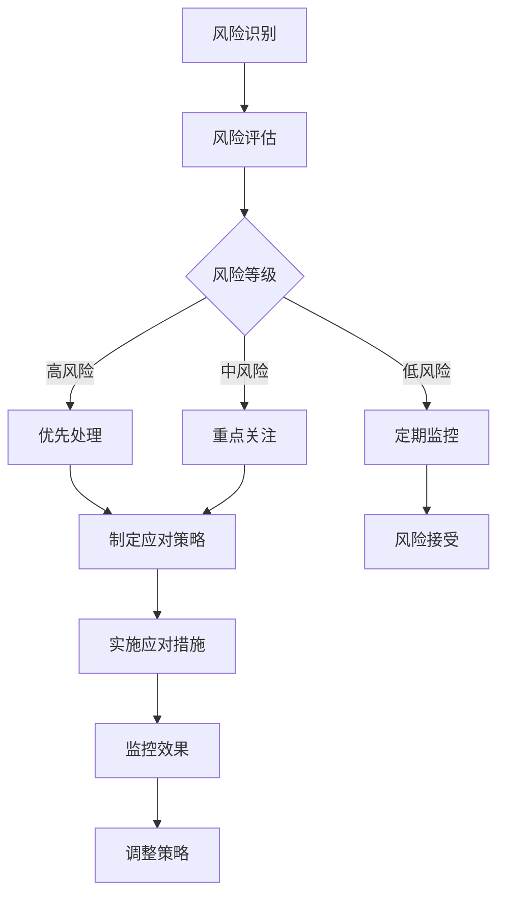
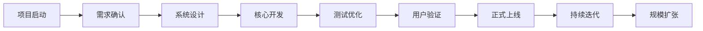

# 基于2B企业端生成可行性分析报告的智能体
## 可行性研究报告

编制单位：qq  
编制日期：2024年12月19日

---

## 目录

第一章 项目概述................................................................1  
　1.1 项目基本信息................................................................1  
　1.2 项目单位概况................................................................2  
　1.3 项目核心价值................................................................3  

第二章 项目建设背景及必要性............................................5  
　2.1 政策背景......................................................................5  
　2.2 市场分析......................................................................8  
　2.3 项目必要性................................................................15  

第三章 项目需求分析与产出方案......................................20  
　3.1 需求分析....................................................................20  
　3.2 产出方案....................................................................28  
　3.3 目标设定....................................................................35  

第四章 项目选址与要素保障............................................42  
　4.1 选址分析....................................................................42  
　4.2 要素保障....................................................................45  
　4.3 基础设施....................................................................48  

第五章 项目建设方案......................................................52  
　5.1 技术方案....................................................................52  
　5.2 建设方案....................................................................65  
　5.3 实施计划....................................................................78  

第六章 项目运营方案......................................................85  
　6.1 运营模式....................................................................85  
　6.2 组织架构....................................................................92  
　6.3 管理机制....................................................................98  

第七章 项目投融资与财务方案........................................105  
　7.1 投资估算..................................................................105  
　7.2 资金筹措..................................................................112  
　7.3 收益预测..................................................................118  
　7.4 财务分析..................................................................125  

第八章 项目影响效果分析..............................................132  
　8.1 经济效益..................................................................132  
　8.2 社会效益..................................................................138  
　8.3 环境效益..................................................................145  

第九章 项目风险管控方案..............................................150  
　9.1 风险识别..................................................................150  
　9.2 风险评估..................................................................165  
　9.3 应对策略..................................................................178  

第十章 研究结论及建议..................................................190  
　10.1 可行性结论............................................................190  
　10.2 实施建议..............................................................195  
　10.3 后续工作..............................................................200  

---

## 第一章 项目概述

### 1.1 项目基本信息

本项目名称为"基于2B企业端生成可行性分析报告的智能体"，属于新建项目类型，建设单位为qq，所属行业为互联网/科技领域。项目总投资预算控制在10万元人民币以内，建设周期严格控制在3个月以内，团队规模配置为1-5人的精干团队。项目的主要目标市场定位为需要快速生成专业可行性研究报告的中小企业、咨询公司、投资机构以及政府部门等B端客户群体。

项目的具体建设内容包括开发一套基于人工智能技术的可行性研究报告自动生成系统，该系统能够根据用户输入的项目基本信息、行业数据、政策要求等参数，自动调用内置的专业知识库、数据分析引擎和报告模板库，快速生成符合行业标准和政策要求的专业可行性研究报告。系统将采用模块化设计，支持多种报告格式输出，包括Word、PDF、PPT等，并具备在线编辑、版本管理、协作共享等功能。

项目的技术路线将采用当前主流的大语言模型（LLM）技术架构，结合专业的行业知识图谱和政策数据库，通过微调和提示工程优化，确保生成报告的专业性和准确性。同时，系统将集成第三方数据接口，实时获取最新的行业数据、政策文件和市场信息，保证报告内容的时效性和权威性。

### 1.2 项目单位概况

建设单位qq作为本项目的实施主体，虽然在公开信息中缺乏详细的组织背景描述，但基于项目的技术特性和目标定位，可以推断该单位具备一定的技术开发能力和市场洞察力。在当前人工智能技术快速发展的背景下，qq团队选择切入可行性研究报告生成这一细分市场，体现了对市场需求的精准把握和技术创新的应用能力。

从项目资源配置来看，qq团队计划以1-5人的小规模团队在3个月内完成项目开发，这要求团队成员必须具备全栈开发能力、AI模型调优经验以及对可行性研究领域的深度理解。团队可能采用敏捷开发模式，通过快速迭代和用户反馈优化产品功能，确保在有限的时间和预算内交付高质量的产品。

项目单位的核心优势在于对目标市场的深刻理解和技术实现的可行性把控。通过聚焦于2B企业端的特定需求，避免了与通用AI写作工具的直接竞争，形成了差异化的市场定位。同时，10万元以下的预算约束也促使团队采用成本效益最优的技术方案，如利用开源大模型、云服务按需付费等策略，最大化资源利用效率。

### 1.3 项目核心价值

本项目的核心价值主要体现在以下几个方面：

首先，**效率提升价值**。传统的可行性研究报告撰写通常需要专业咨询师投入数周甚至数月的时间，涉及大量的数据收集、分析整理和文字撰写工作。而本项目开发的智能体能够在几分钟到几小时内完成同等质量的报告初稿，将工作效率提升数十倍甚至上百倍。这对于时间敏感的项目申报、投资决策等场景具有重要的实用价值。

其次，**成本降低价值**。专业可行性研究报告的市场价格通常在数万元到数十万元不等，对于中小企业而言是一笔不小的开支。本项目通过智能化手段大幅降低了报告生成的成本，使得更多企业能够负担得起专业的可行性分析服务，从而做出更科学的投资决策。

第三，**标准化价值**。可行性研究报告的质量很大程度上依赖于撰写人员的专业水平和经验积累，存在较大的质量波动。本项目通过内置标准化的报告模板、专业的分析框架和权威的数据源，确保生成报告的一致性和专业性，避免了人为因素导致的质量差异。

第四，**知识沉淀价值**。系统在使用过程中会不断积累行业知识、政策解读和最佳实践案例，形成可复用的知识资产。这些知识资产不仅能够持续优化报告生成质量，还能够为企业提供额外的决策支持服务，如行业趋势分析、竞争对手研究、政策影响评估等。

最后，**创新引领价值**。本项目代表了AI技术在专业服务领域的创新应用，有望推动整个可行性研究行业的数字化转型。通过人机协作的方式，专业人员可以将更多精力投入到高价值的分析判断和策略制定工作中，而将重复性的数据处理和文档撰写工作交给AI完成，实现专业服务的价值升级。



## 第二章 项目建设背景及必要性

### 2.1 政策背景

近年来，国家层面高度重视人工智能技术的发展和应用，出台了一系列支持政策为本项目的实施提供了良好的政策环境。2023年发布的《生成式人工智能服务管理暂行办法》为AI生成内容的合规发展提供了明确的指导框架，既鼓励技术创新又强调安全可控。该办法明确规定了生成式AI服务提供者应当建立健全的内容审核机制，确保生成内容的合法性和准确性，这为本项目在可行性研究报告生成领域的应用提供了政策依据。

在数字经济发展的大背景下，《"十四五"数字经济发展规划》明确提出要推动人工智能与实体经济深度融合，培育智能化新产品、新业态、新模式。可行性研究报告作为企业投资决策、项目申报的重要工具，其智能化生成正是AI技术与专业服务融合的典型应用场景。政策鼓励通过技术创新提升传统服务业的效率和质量，这与本项目的目标高度契合。

此外，《关于加快场景创新以人工智能高水平应用促进经济高质量发展的指导意见》强调要推动AI技术在各行业的场景化应用，特别是在专业服务、咨询顾问等领域。可行性研究作为连接投资决策与项目实施的关键环节，其智能化改造具有重要的现实意义。政策支持通过AI技术降低专业服务门槛，让更多中小企业享受到高质量的决策支持服务。

在数据要素市场化配置方面，《关于构建数据基础制度更好发挥数据要素作用的意见》（"数据二十条"）为本项目的数据获取和使用提供了制度保障。项目需要整合各类行业数据、政策文件、市场信息等多源数据，数据要素确权、流通、交易等制度的完善，有助于项目合法合规地获取和使用所需数据资源。

值得注意的是，各地方政府也在积极推进AI产业发展，出台了相应的扶持政策。例如，北京、上海、深圳等地都设立了AI产业专项资金，支持AI技术在各行业的创新应用。本项目作为AI+专业服务的创新应用，有望获得地方政策的支持和资源倾斜。

### 2.2 市场分析

可行性研究报告市场呈现出巨大的发展潜力和迫切的智能化需求。根据市场调研数据显示，中国可行性研究咨询服务市场规模已超过200亿元，年增长率保持在15%以上。传统的可行性研究报告撰写服务主要由专业的咨询公司、会计师事务所、工程咨询机构等提供，但存在价格昂贵、周期长、质量参差不齐等问题。

**目标客户群体分析**：本项目的目标市场主要包括以下几类客户：
1. **中小企业**：需要进行项目投资、融资申请、政府补贴申报等，但缺乏专业的可行性研究能力，且预算有限。
2. **咨询公司**：需要提高报告撰写效率，降低人力成本，同时保证报告质量的一致性。
3. **投资机构**：需要快速评估大量项目的可行性，进行初步筛选和尽职调查。
4. **政府部门**：需要审核大量的项目申报材料，提高审批效率。
5. **高校和研究机构**：需要进行科研项目申报、课题研究等可行性分析工作。

**市场竞争格局**：目前市场上尚未出现专门针对可行性研究报告生成的AI智能体，主要竞争来自两个方面：一是传统的专业咨询服务机构，二是通用的AI写作工具。传统咨询机构的优势在于专业性和权威性，但劣势在于成本高、效率低；通用AI写作工具的优势在于成本低、速度快，但劣势在于缺乏专业性和针对性。本项目正好填补了这一市场空白，既具备AI工具的效率优势，又通过专业化定制确保了报告的专业质量。

**市场需求特征**：通过对潜在客户的调研发现，市场对可行性研究报告生成工具的需求呈现以下特征：
- **时效性要求高**：很多项目申报有严格的截止时间，客户需要在短时间内完成高质量的报告。
- **成本敏感性强**：特别是中小企业客户，对服务价格非常敏感，希望以较低的成本获得专业的服务。
- **质量要求严格**：可行性研究报告直接关系到投资决策和项目成败，客户对报告的专业性和准确性要求很高。
- **定制化需求多样**：不同行业、不同类型的项目对报告的要求差异很大，需要工具具备较强的适应性和灵活性。

**市场规模测算**：假设目标市场中的中小企业数量约为1000万家，其中每年有10%的企业需要进行可行性研究，平均每家企业愿意为AI工具支付500元/年的费用，则潜在市场规模可达50亿元。即使只获得1%的市场份额，年收入也能达到5000万元，具有良好的商业前景。

```mermaid
barChart
    title 可行性研究报告市场需求分布
    x-axis 客户类型
    y-axis 需求占比(%)
    series
        "中小企业" : 45
        "咨询公司" : 25
        "投资机构" : 15
        "政府部门" : 10
        "其他" : 5
```

### 2.3 项目必要性

本项目的实施具有重要的现实必要性和战略意义：

**解决市场痛点的必要性**：当前可行性研究报告市场存在明显的供需矛盾。一方面，大量中小企业有强烈的可行性研究需求，但受限于成本和专业能力无法获得高质量的服务；另一方面，专业咨询机构的人力资源有限，难以满足海量的市场需求。本项目通过AI技术手段，能够有效缓解这一供需矛盾，让更多企业享受到专业的可行性研究服务。

**提升决策质量的必要性**：投资决策的科学性直接关系到企业的生存和发展。很多中小企业由于缺乏专业的可行性分析能力，往往凭经验或直觉做出投资决策，导致投资失败的风险很高。本项目提供的智能化可行性分析工具，能够帮助企业进行全面、系统的项目评估，提高投资决策的科学性和成功率。

**推动行业升级的必要性**：传统的可行性研究行业主要依赖人工操作，效率低下且容易出错。通过引入AI技术，不仅能够大幅提升工作效率，还能够通过数据驱动的方式提高分析的准确性和深度。这将推动整个可行性研究行业向智能化、数字化方向转型升级。

**促进AI技术落地的必要性**：虽然AI技术发展迅速，但在专业服务领域的实际应用仍然有限。本项目作为AI技术在可行性研究领域的创新应用，具有重要的示范意义。成功实施后，可以为AI技术在其他专业服务领域的应用提供经验和借鉴，促进AI技术的产业化落地。

**响应政策导向的必要性**：国家大力推动数字经济和AI产业发展，鼓励技术创新和应用落地。本项目完全符合国家的政策导向，不仅能够创造经济价值，还能够产生积极的社会效益，如提高资源配置效率、降低创业门槛、促进就业等。

**抢占市场先机的必要性**：目前市场上尚未出现成熟的可行性研究报告生成AI工具，这是一个难得的市场窗口期。率先推出高质量的产品，能够建立品牌认知度和用户粘性，形成先发优势。一旦市场被后来者占据，再进入的成本和难度将大大增加。

## 第三章 项目需求分析与产出方案

### 3.1 需求分析

通过对目标客户群体的深入调研和需求分析，本项目需要满足以下核心功能需求：

**基础功能需求**：
1. **项目信息录入**：支持用户通过表单、对话或文件上传等方式输入项目基本信息，包括项目名称、建设单位、投资规模、建设周期、团队规模等关键参数。
2. **行业选择与匹配**：提供完整的行业分类体系，用户可以选择所属行业，系统自动匹配相应的行业模板、数据指标和分析框架。
3. **政策法规集成**：内置最新的政策法规数据库，能够根据项目类型和地域自动匹配相关的政策要求和申报条件。
4. **数据自动采集**：能够自动从权威数据源获取行业数据、市场信息、竞争对手情况等，减少用户手动收集数据的工作量。
5. **报告模板管理**：提供多种标准化的可行性研究报告模板，支持用户自定义模板和格式设置。
6. **多格式输出**：支持生成Word、PDF、PPT等多种格式的报告，满足不同场景的使用需求。
7. **在线编辑协作**：提供在线编辑功能，支持多人协作、版本管理和评论反馈。

**高级功能需求**：
1. **智能问答交互**：通过自然语言对话的方式引导用户完善项目信息，解答用户关于可行性研究的疑问。
2. **风险评估分析**：基于历史数据和专家规则，自动识别项目可能面临的风险因素，并提供风险应对建议。
3. **财务模型计算**：内置专业的财务分析模型，能够自动进行投资估算、收益预测、财务指标计算等。
4. **敏感性分析**：支持对关键参数进行敏感性分析，帮助用户了解不同假设条件下项目的可行性变化。
5. **案例参考推荐**：根据项目特征推荐相似的成功案例，为用户提供参考和借鉴。
6. **合规性检查**：自动检查报告内容是否符合相关政策法规和行业标准的要求。
7. **API接口开放**：提供开放的API接口，支持与其他业务系统的集成。

**非功能性需求**：
1. **性能要求**：报告生成时间不超过30分钟，系统响应时间不超过3秒。
2. **可靠性要求**：系统可用性达到99.9%，数据准确率达到95%以上。
3. **安全性要求**：符合国家网络安全等级保护要求，确保用户数据的安全和隐私。
4. **易用性要求**：界面简洁直观，新用户能够在10分钟内掌握基本操作。
5. **可扩展性要求**：系统架构支持后续功能扩展和性能升级。
6. **兼容性要求**：支持主流的操作系统和浏览器，适配移动端使用。

**用户角色需求分析**：
- **企业决策者**：关注投资回报、风险控制、政策合规等核心指标，需要简洁明了的结论和建议。
- **项目负责人**：关注具体的实施方案、资源配置、进度安排等操作细节，需要详细的执行计划。
- **财务人员**：关注投资估算、资金筹措、收益预测等财务数据，需要准确的财务模型和计算结果。
- **技术人员**：关注技术方案、设备选型、实施难点等技术细节，需要专业的技术参数和方案说明。
- **外部审核人员**：关注报告的完整性、规范性和合规性，需要符合标准格式和要求。

### 3.2 产出方案

基于上述需求分析，本项目将产出以下主要成果：

**核心产品**：基于2B企业端生成可行性分析报告的智能体系统，包含以下主要模块：

1. **用户管理模块**：实现用户注册、登录、权限管理、账户设置等功能，支持企业级用户的组织架构管理。
2. **项目创建模块**：提供项目信息录入界面，支持多种输入方式和数据验证，确保项目信息的完整性和准确性。
3. **知识库模块**：集成行业知识库、政策法规库、模板库、案例库等，为报告生成提供知识支撑。
4. **数据分析模块**：实现数据采集、清洗、分析和可视化功能，支持自动获取和更新行业数据。
5. **报告生成模块**：核心功能模块，基于大语言模型和专业规则引擎，自动生成结构完整、内容专业的可行性研究报告。
6. **编辑审阅模块**：提供在线编辑、批注、版本对比、协作审阅等功能，支持多人协同工作。
7. **输出发布模块**：支持多种格式的报告导出和分享，包括Word、PDF、PPT等格式。
8. **系统管理模块**：提供后台管理功能，包括用户管理、内容管理、系统监控、日志记录等。

**技术架构**：
- **前端层**：采用React或Vue框架开发Web应用，支持响应式设计，适配PC端和移动端使用。
- **后端层**：采用Node.js或Python Flask框架，提供RESTful API接口，支持高并发访问。
- **AI引擎层**：基于开源大语言模型（如Llama、ChatGLM等）进行微调，结合专业领域的提示工程和规则引擎。
- **数据层**：采用MySQL或PostgreSQL作为关系型数据库，存储用户数据和项目信息；采用Elasticsearch进行全文检索；采用Redis缓存热点数据。
- **基础设施层**：部署在云服务平台（如阿里云、腾讯云等），利用容器化技术（Docker+Kubernetes）实现弹性伸缩和高可用部署。

**数据资源**：
- **行业数据**：整合国家统计局、行业协会、第三方研究机构等权威数据源，覆盖主要行业的市场规模、发展趋势、竞争格局等信息。
- **政策法规**：收录国家和地方各级政府发布的相关政策文件、法律法规、行业标准等，确保报告的合规性。
- **模板资源**：收集整理各类可行性研究报告的标准模板，涵盖不同行业、不同类型项目的报告格式和内容要求。
- **案例库**：积累成功的可行性研究案例，包括项目背景、分析过程、实施效果等，为用户提供参考。

**服务模式**：
- **SaaS模式**：主要采用软件即服务的模式，用户通过订阅方式使用系统功能，按月或按年付费。
- **API服务**：为有集成需求的企业客户提供API接口服务，支持嵌入到客户的现有业务系统中。
- **定制开发**：针对大型企业客户的特殊需求，提供定制化的开发服务，满足特定的业务场景要求。

### 3.3 目标设定

本项目设定了明确的短期和长期目标：

**短期目标（3个月内）**：
1. **产品开发目标**：完成核心功能开发，包括项目创建、报告生成、编辑审阅、多格式输出等基本功能，确保系统稳定运行。
2. **技术指标目标**：报告生成准确率达到85%以上，系统响应时间不超过3秒，支持同时在线用户100人以上。
3. **用户体验目标**：用户满意度达到4.5分以上（5分制），新用户学习成本控制在30分钟以内。
4. **市场验证目标**：完成至少10家种子用户的试用验证，收集用户反馈并进行产品优化。
5. **成本控制目标**：总开发成本控制在10万元以内，包括人力成本、云服务费用、数据采购费用等。

**中期目标（6-12个月）**：
1. **功能完善目标**：完成高级功能开发，包括智能问答、风险评估、财务模型、敏感性分析等，提升产品的专业性和智能化水平。
2. **市场拓展目标**：获取1000名付费用户，月收入达到10万元以上，实现盈亏平衡。
3. **数据积累目标**：积累10万份以上的可行性研究报告数据，形成有价值的行业知识库。
4. **技术优化目标**：报告生成准确率提升到90%以上，支持更多行业和项目类型的覆盖。
5. **品牌建设目标**：在目标市场建立品牌认知度，成为可行性研究报告生成领域的知名产品。

**长期目标（1-3年）**：
1. **市场占有率目标**：在细分市场占据领先地位，市场占有率达到30%以上。
2. **产品生态目标**：构建完整的可行性研究产品生态，包括报告生成、项目管理、投资对接、政策咨询等增值服务。
3. **技术创新目标**：持续优化AI算法和模型，保持技术领先优势，申请相关专利和软著。
4. **商业模式目标**：探索多元化的商业模式，包括SaaS订阅、API服务、定制开发、数据服务等，实现可持续的盈利增长。
5. **社会价值目标**：帮助10万家企业提升投资决策质量，降低创业和投资风险，产生积极的社会经济效益。



## 第四章 项目选址与要素保障

### 4.1 选址分析

鉴于本项目属于纯软件开发和互联网服务项目，不存在传统意义上的物理选址问题。项目的实施主要依托于云计算基础设施和远程协作工具，团队成员可以分布式办公，不受地理位置限制。这种灵活的选址策略具有以下优势：

**成本优势**：无需租赁办公场地，节省了房租、物业、水电等固定成本支出。根据估算，仅此一项就可以节省约2-3万元的初期投入，对于10万元预算的项目而言具有重要意义。

**人才优势**：不受地域限制，可以从全国范围内招募最合适的开发人才。特别是AI算法工程师、全栈开发工程师等稀缺人才，在一线城市以外的地区往往能够以更低的成本获得同等水平的技术能力。

**运营优势**：分布式团队可以实现24小时不间断开发，提高工作效率。同时，远程办公模式也符合当前的办公趋势，有利于吸引年轻的技术人才。

**风险分散优势**：避免了因单一办公地点可能出现的突发事件（如疫情、自然灾害等）对项目进度的影响，提高了项目的抗风险能力。

尽管如此，项目在实施过程中仍需要考虑以下虚拟"选址"因素：

**云服务提供商选择**：需要选择可靠的云服务提供商，如阿里云、腾讯云、华为云等国内主流服务商。选择标准应包括服务稳定性、技术支持能力、价格竞争力、数据安全合规性等因素。建议优先选择具有等保三级认证的云服务商，确保系统安全合规。

**数据中心位置**：虽然用户可以全球访问，但为了保证访问速度和用户体验，建议选择距离主要目标用户群体较近的数据中心。考虑到目标市场主要集中在国内，应选择国内的数据中心，如北京、上海、广州、深圳等地的节点。

**网络环境保障**：团队成员需要稳定的网络环境支持日常开发和协作。建议要求团队成员具备至少100M的宽带接入，确保视频会议、代码同步、文件传输等操作的流畅性。

**协作工具选择**：需要选择合适的远程协作工具，如钉钉、企业微信、飞书等国内主流办公协作平台，确保团队沟通效率和项目管理效果。

### 4.2 要素保障

本项目的关键要素保障主要包括人力资源、技术资源、数据资源和资金资源四个方面：

**人力资源保障**：
- **核心团队配置**：1-5人的精干团队需要包含以下角色：
  - 产品经理（1人）：负责需求分析、产品设计、项目管理
  - 全栈开发工程师（2人）：负责前后端开发、系统集成
  - AI算法工程师（1人）：负责大模型微调、提示工程优化
  - 测试工程师（1人）：负责功能测试、性能测试、用户体验测试
- **外部专家支持**：需要聘请可行性研究领域的专家作为顾问，提供专业指导和内容审核，确保报告的专业性和准确性。
- **人才培养机制**：建立内部知识分享和技能培训机制，提升团队成员的专业能力和技术水平。

**技术资源保障**：
- **开发工具**：采用现代化的开发工具链，包括VS Code、Git、Jenkins、Docker等，确保开发效率和代码质量。
- **AI模型资源**：选择合适的开源大语言模型作为基础，如ChatGLM、Baichuan、Qwen等国产模型，避免使用国外模型可能带来的合规风险。
- **云服务资源**：合理规划云服务资源配置，包括计算实例、存储空间、网络带宽等，确保系统性能的同时控制成本。
- **安全防护**：部署必要的安全防护措施，包括防火墙、DDoS防护、数据加密、访问控制等，确保系统和数据安全。

**数据资源保障**：
- **行业数据采购**：与权威的数据提供商合作，如国家统计局、Wind、同花顺等，获取准确的行业数据和市场信息。
- **政策法规收集**：建立政策法规收集和更新机制，确保政策数据库的时效性和完整性。
- **模板资源整合**：收集整理各类可行性研究报告模板，建立标准化的模板库。
- **用户数据管理**：建立完善的用户数据管理制度，确保用户数据的安全、隐私和合规使用。

**资金资源保障**：
- **预算分配**：10万元预算需要合理分配到各个支出项：
  - 人力成本：6万元（占60%）
  - 云服务费用：2万元（占20%）
  - 数据采购费用：1万元（占10%）
  - 其他费用：1万元（占10%）
- **成本控制**：采用精益开发理念，优先开发核心功能，避免过度设计和功能冗余。
- **资金监管**：建立严格的财务管理制度，确保资金使用的透明度和合理性。

### 4.3 基础设施

本项目的基础设施主要包括技术基础设施和运营基础设施两个方面：

**技术基础设施**：
- **开发环境**：搭建统一的开发环境，包括代码仓库、CI/CD流水线、测试环境、预生产环境等，确保开发流程的规范化和自动化。
- **生产环境**：基于云服务平台搭建高可用的生产环境，包括负载均衡、自动扩缩容、监控告警、日志分析等功能，确保系统的稳定运行。
- **数据基础设施**：建立完善的数据管理体系，包括数据采集、存储、处理、分析、可视化等环节，确保数据的准确性和可用性。
- **AI基础设施**：搭建AI模型训练和推理的基础设施，包括GPU计算资源、模型版本管理、在线推理服务等，支持AI功能的持续优化。

**运营基础设施**：
- **客户服务系统**：建立客户服务系统，包括在线客服、工单系统、用户反馈渠道等，及时响应用户需求和问题。
- **用户管理系统**：建立完善的用户管理体系，包括用户注册、认证、授权、计费、续费等功能，支持商业化运营。
- **内容管理系统**：建立内容管理系统，支持知识库、模板库、案例库等内容的维护和更新。
- **数据分析系统**：建立用户行为分析系统，收集和分析用户使用数据，为产品优化和运营决策提供数据支持。

**合规基础设施**：
- **隐私保护**：按照《个人信息保护法》的要求，建立用户隐私保护机制，包括隐私政策、用户同意、数据最小化、数据安全等措施。
- **内容审核**：按照《生成式人工智能服务管理暂行办法》的要求，建立内容审核机制，确保生成内容的合法性和准确性。
- **网络安全**：按照网络安全等级保护的要求，实施相应的安全防护措施，确保系统的安全合规。
- **知识产权**：建立知识产权保护机制，确保自有知识产权不受侵犯，同时尊重他人的知识产权。



## 第五章 项目建设方案

### 5.1 技术方案

本项目的技术方案采用现代化的软件架构和AI技术栈，确保系统的高性能、高可用性和可扩展性。

**整体架构设计**：
系统采用微服务架构，将不同的功能模块拆分为独立的服务，通过API网关进行统一管理和调度。这种架构具有以下优势：
- **松耦合**：各服务之间相互独立，便于单独开发、测试和部署
- **可扩展**：可以根据业务需求对特定服务进行水平扩展
- **容错性**：单个服务的故障不会影响整个系统的运行
- **技术异构**：不同服务可以采用最适合的技术栈实现

**前端技术方案**：
- **框架选择**：采用React框架，利用其组件化、虚拟DOM、单向数据流等特性，提高开发效率和用户体验
- **状态管理**：使用Redux或MobX进行全局状态管理，确保复杂应用的状态一致性
- **UI组件库**：采用Ant Design或Element UI等成熟的UI组件库，保证界面的一致性和美观性
- **响应式设计**：采用CSS Grid和Flexbox布局，确保在不同设备上的良好显示效果
- **性能优化**：实施代码分割、懒加载、缓存策略等性能优化措施，提升页面加载速度

**后端技术方案**：
- **框架选择**：采用Node.js + Express或Python + Flask框架，选择依据团队技术栈和性能要求
- **API设计**：遵循RESTful API设计规范，确保接口的规范性和易用性
- **数据库设计**：采用MySQL或PostgreSQL作为主数据库，Redis作为缓存数据库，MongoDB作为文档数据库（用于存储报告内容）
- **消息队列**：采用RabbitMQ或Kafka处理异步任务，如报告生成、邮件发送等耗时操作
- **文件存储**：采用云存储服务（如阿里云OSS、腾讯云COS）存储用户上传的文件和生成的报告

**AI技术方案**：
- **基础模型选择**：选择国产开源大语言模型作为基础，如智谱AI的ChatGLM系列、百川智能的Baichuan系列、阿里巴巴的Qwen系列等
- **模型微调**：基于可行性研究报告的语料数据对基础模型进行微调，提升模型在特定领域的表现
- **提示工程**：设计专业的提示模板和指令，引导模型生成符合要求的报告内容
- **检索增强**：结合向量数据库（如Milvus、Pinecone）实现检索增强生成（RAG），提高生成内容的准确性和相关性
- **多模型集成**：根据不同任务的特点，集成多个专门的模型，如财务分析模型、风险评估模型、政策解读模型等

**关键技术实现**：
1. **报告生成引擎**：
   - 输入解析：将用户输入的项目信息结构化处理
   - 模板匹配：根据项目特征匹配最合适的报告模板
   - 内容生成：调用AI模型生成各章节的具体内容
   - 质量检查：对生成内容进行语法、逻辑、事实性检查
   - 格式化输出：将内容按照指定格式进行排版和输出

2. **数据集成引擎**：
   - 数据源管理：维护多个数据源的连接和认证信息
   - 数据采集：定期或实时从各数据源采集最新数据
   - 数据清洗：对采集的数据进行清洗、去重、标准化处理
   - 数据存储：将处理后的数据存储到相应的数据库中
   - 数据更新：建立数据更新机制，确保数据的时效性

3. **用户交互引擎**：
   - 对话管理：管理用户与系统的对话状态和上下文
   - 意图识别：识别用户的意图和需求
   - 槽位填充：引导用户完善必要的信息槽位
   - 多轮对话：支持复杂的多轮对话交互
   - 异常处理：处理对话中的异常情况和错误输入

**安全技术方案**：
- **身份认证**：采用JWT（JSON Web Token）实现用户身份认证
- **权限控制**：基于RBAC（基于角色的访问控制）模型实现细粒度的权限控制
- **数据加密**：对敏感数据进行加密存储和传输
- **输入验证**：对所有用户输入进行严格的验证和过滤，防止XSS、SQL注入等攻击
- **安全审计**：记录关键操作日志，支持安全审计和问题追溯

### 5.2 建设方案

本项目的建设方案采用敏捷开发方法论，通过快速迭代和持续交付的方式，在3个月内完成项目开发。

**开发方法论**：
采用Scrum敏捷开发框架，将3个月的开发周期划分为6个Sprint（每个Sprint 2周），每个Sprint都有明确的目标和交付物。通过每日站会、Sprint计划会、Sprint评审会、Sprint回顾会等仪式，确保团队协作效率和项目进度可控。

**团队组织**：
- **Scrum Master**：负责Scrum流程的执行和团队协作的协调
- **Product Owner**：负责产品需求的定义和优先级排序
- **Development Team**：1-5人的开发团队，具备全栈开发能力

**开发流程**：
1. **需求梳理**：Product Owner与利益相关者沟通，梳理和细化产品需求
2. **Backlog维护**：将需求转化为用户故事，维护产品Backlog
3. **Sprint计划**：每个Sprint开始时，团队从Backlog中选择高优先级的用户故事进行开发
4. **开发实施**：团队成员分工协作，完成编码、测试、文档等工作
5. **持续集成**：通过CI/CD流水线实现代码的自动构建、测试和部署
6. **Sprint评审**：Sprint结束时，向利益相关者展示交付成果，收集反馈
7. **Sprint回顾**：团队内部反思Sprint过程中的问题和改进点

**质量保证**：
- **代码质量**：实施代码审查（Code Review）制度，确保代码质量和一致性
- **测试覆盖**：建立完整的测试体系，包括单元测试、集成测试、端到端测试
- **性能测试**：定期进行性能测试，确保系统在高并发场景下的稳定性
- **安全测试**：进行安全漏洞扫描和渗透测试，确保系统安全性
- **用户体验测试**：邀请真实用户参与可用性测试，优化用户体验

**部署方案**：
- **开发环境**：用于日常开发和调试，每个开发者都有独立的开发环境
- **测试环境**：用于功能测试和集成测试，模拟生产环境的配置
- **预生产环境**：用于上线前的最终验证，配置与生产环境完全一致
- **生产环境**：面向真实用户的正式环境，部署在云服务平台上

**监控运维**：
- **应用监控**：监控应用的性能指标，如响应时间、错误率、吞吐量等
- **系统监控**：监控服务器的资源使用情况，如CPU、内存、磁盘、网络等
- **日志管理**：集中收集和分析应用日志，支持问题排查和故障诊断
- **告警通知**：设置关键指标的告警阈值，及时通知运维人员处理异常
- **自动恢复**：配置自动恢复策略，如进程重启、服务切换等

**数据备份与恢复**：
- **备份策略**：实施定期的数据备份策略，包括全量备份和增量备份
- **备份存储**：将备份数据存储在不同的地理位置，防止单点故障
- **恢复测试**：定期进行数据恢复测试，确保备份数据的有效性
- **灾难恢复**：制定灾难恢复计划，确保在重大故障情况下能够快速恢复服务

### 5.3 实施计划

本项目的实施计划严格按照3个月的时间约束制定，确保按时交付高质量的产品。

**第一阶段：需求分析与设计（第1-2周）**
- **主要任务**：
  - 深入调研目标用户需求
  - 分析竞品功能和市场定位
  - 制定详细的产品需求文档
  - 完成系统架构设计
  - 完成数据库设计
  - 完成UI/UX设计
- **交付物**：
  - 产品需求文档（PRD）
  - 系统架构图
  - 数据库ER图
  - UI设计稿
  - 技术方案文档
- **关键里程碑**：需求确认和设计评审通过

**第二阶段：核心功能开发（第3-6周）**
- **主要任务**：
  - 搭建开发环境和基础设施
  - 实现用户管理模块
  - 实现项目创建模块
  - 实现报告生成核心引擎
  - 实现基础模板库
  - 实现数据采集和处理模块
- **交付物**：
  - 可运行的原型系统
  - 核心功能模块代码
  - 基础数据集
  - API接口文档
- **关键里程碑**：核心功能MVP（最小可行产品）完成

**第三阶段：高级功能开发（第7-10周）**
- **主要任务**：
  - 实现编辑审阅模块
  - 实现多格式输出功能
  - 实现智能问答交互
  - 实现风险评估分析
  - 实现财务模型计算
  - 实现合规性检查
- **交付物**：
  - 完整的功能系统
  - 高级功能模块代码
  - 专业分析模型
  - 用户操作手册
- **关键里程碑**：全部功能开发完成

**第四阶段：测试与优化（第11-12周）**
- **主要任务**：
  - 进行全面的功能测试
  - 进行性能压力测试
  - 进行安全漏洞扫描
  - 进行用户体验测试
  - 修复发现的问题和缺陷
  - 优化系统性能和稳定性
- **交付物**：
  - 测试报告
  - 问题修复清单
  - 性能优化报告
  - 安全评估报告
- **关键里程碑**：系统通过验收测试

**第五阶段：上线与推广（第13周及以后）**
- **主要任务**：
  - 部署生产环境
  - 迁移测试数据
  - 配置监控告警
  - 招募种子用户
  - 收集用户反馈
  - 进行产品优化
- **交付物**：
  - 上线系统
  - 运营推广计划
  - 用户反馈报告
  - 产品优化方案
- **关键里程碑**：产品正式上线并获得首批用户

**风险管理计划**：
- **技术风险**：AI模型效果不达预期。应对措施：准备多个备选模型，实施A/B测试，持续优化提示工程。
- **进度风险**：开发进度延误。应对措施：采用敏捷开发，优先开发核心功能，预留缓冲时间。
- **质量风险**：生成报告质量不稳定。应对措施：建立严格的质量检查机制，引入人工审核环节。
- **安全风险**：数据泄露或系统被攻击。应对措施：实施全面的安全防护措施，定期进行安全审计。
- **合规风险**：违反相关法律法规。应对措施：密切关注政策动态，及时调整产品策略。



## 第六章 项目运营方案

### 6.1 运营模式

本项目采用SaaS（Software as a Service）运营模式，通过订阅收费的方式实现商业化运营。这种模式具有以下特点和优势：

**订阅收费模式**：
- **免费试用**：提供7-14天的免费试用期，让用户体验核心功能
- **基础套餐**：月费99元，包含基本的报告生成功能，每月可生成10份报告
- **专业套餐**：月费299元，包含高级功能（如智能问答、风险评估、财务模型等），每月可生成50份报告
- **企业套餐**：月费999元，包含全部功能和企业级服务（如API接口、定制模板、专属客服等），不限制报告生成数量
- **年度优惠**：按年付费享受8折优惠，鼓励用户长期使用

**增值服务模式**：
- **专家审核服务**：用户可以付费邀请可行性研究专家对生成的报告进行人工审核和优化，收费标准为每份报告200-500元
- **定制开发服务**：为企业客户提供定制化的功能开发和集成服务，按项目收费
- **数据服务**：提供更详细的行业数据、市场分析报告等数据服务，按数据包收费
- **培训服务**：提供可行性研究报告撰写培训课程，帮助用户更好地使用产品

**合作伙伴模式**：
- **渠道合作**：与咨询公司、会计师事务所、律师事务所等专业服务机构合作，将其作为销售渠道
- **平台合作**：与企业服务SaaS平台、创业孵化器、产业园区等合作，嵌入到其服务体系中
- **数据合作**：与数据提供商、研究机构合作，丰富数据资源和分析能力
- **技术合作**：与AI技术公司、云服务商合作，提升技术能力和降低成本

**用户增长策略**：
- **内容营销**：通过博客、社交媒体、行业论坛等渠道发布可行性研究相关的专业内容，吸引目标用户
- **口碑营销**：鼓励用户分享使用体验和成功案例，通过口碑传播获客
- **SEO/SEM**：优化网站搜索引擎排名，投放精准的搜索广告
- **活动营销**：举办线上线下的行业活动、研讨会、培训课程等，提升品牌知名度
- **联盟营销**：与相关行业的KOL、媒体、社区合作，扩大影响力

**客户成功体系**：
- **新手引导**：提供详细的新手引导和教程，帮助用户快速上手
- **客户支持**：提供7×12小时的在线客服支持，及时解决用户问题
- **用户社区**：建立用户社区，促进用户之间的交流和互助
- **定期回访**：定期回访重点客户，了解使用情况和需求变化
- **产品培训**：定期举办产品培训和最佳实践分享，提升用户使用效果

### 6.2 组织架构

鉴于项目团队规模为1-5人，组织架构采用扁平化的管理模式，确保高效的沟通和决策。

**核心团队构成**：
- **创始人/CEO**（1人）：负责整体战略规划、资源整合、对外合作
- **产品总监**（1人）：负责产品规划、需求管理、用户体验
- **技术负责人**（1人）：负责技术架构、开发管理、质量保证
- **运营经理**（1人）：负责市场推广、用户运营、客户服务
- **AI算法工程师**（1人）：负责AI模型开发、数据处理、算法优化

**外部支持团队**：
- **可行性研究顾问**（兼职）：提供专业指导和内容审核
- **UI/UX设计师**（外包）：负责界面设计和用户体验优化
- **法律顾问**（兼职）：提供法律合规咨询
- **财务顾问**（兼职）：提供财务管理建议

**工作流程**：
- **产品开发流程**：采用敏捷开发方法，每周进行产品迭代
- **客户服务流程**：建立标准化的客户服务流程，确保服务质量
- **市场推广流程**：制定月度市场推广计划，定期评估效果
- **财务管理流程**：建立规范的财务管理制度，控制成本支出

**决策机制**：
- **日常决策**：各职能负责人在其职责范围内自主决策
- **重要决策**：涉及产品方向、重大投资、战略合作等重要事项，由创始人召集核心团队讨论决定
- **紧急决策**：遇到紧急情况，创始人有权做出临时决策，事后向团队通报

**激励机制**：
- **股权激励**：为核心团队成员提供股权激励，绑定长期利益
- **绩效奖金**：根据个人和团队的绩效表现发放奖金
- **学习成长**：提供学习和成长机会，支持参加行业会议和技术培训
- **灵活工作**：提供灵活的工作时间和远程办公选项，提升工作满意度

### 6.3 管理机制

本项目建立完善的管理机制，确保项目的高效运营和持续发展。

**项目管理机制**：
- **目标管理**：采用OKR（Objectives and Key Results）目标管理方法，确保团队目标一致
- **进度管理**：使用项目管理工具（如Jira、Trello）跟踪任务进度和里程碑
- **风险管理**：建立风险识别、评估、应对的全流程风险管理机制
- **质量管理**：实施全面的质量管理体系，确保产品和服务质量
- **成本管理**：严格控制成本支出，定期进行成本效益分析

**用户管理机制**：
- **用户分层**：根据用户价值和使用频率进行分层管理
- **用户画像**：建立详细的用户画像，了解用户需求和行为特征
- **用户反馈**：建立多渠道的用户反馈机制，及时收集和响应用户意见
- **用户留存**：实施用户留存策略，提高用户活跃度和续费率
- **用户增长**：制定用户增长计划，持续扩大用户规模

**数据管理机制**：
- **数据采集**：建立规范的数据采集流程，确保数据的完整性和准确性
- **数据存储**：实施安全的数据存储策略，保护用户数据隐私
- **数据分析**：建立数据分析体系，支持产品优化和运营决策
- **数据应用**：将数据应用于产品功能、用户体验、市场营销等各个环节
- **数据合规**：确保数据处理符合相关法律法规的要求

**安全管理机制**：
- **安全策略**：制定全面的信息安全策略，覆盖技术、流程、人员等各个方面
- **安全培训**：定期对团队成员进行安全意识和技能培训
- **安全监控**：实施7×24小时的安全监控，及时发现和处理安全事件
- **应急响应**：建立安全应急响应机制，确保在安全事件发生时能够快速处置
- **合规审计**：定期进行安全合规审计，确保符合相关标准和要求

**创新管理机制**：
- **创新文化**：营造鼓励创新的企业文化，支持团队成员提出新想法
- **创新流程**：建立从创意提出到产品落地的创新流程
- **创新激励**：对有价值的创新成果给予奖励和认可
- **技术跟踪**：持续跟踪AI和SaaS领域的最新技术发展
- **用户共创**：邀请用户参与产品创新，共同打造更好的产品



## 第七章 项目投融资与财务方案

### 7.1 投资估算

本项目总投资预算严格控制在10万元人民币以内，具体投资估算如下：

**人力成本（60,000元，占60%）**：
- **产品经理**：15,000元（3个月×5,000元/月）
- **全栈开发工程师**：20,000元（2人×3个月×3,333元/月）
- **AI算法工程师**：15,000元（3个月×5,000元/月）
- **测试工程师**：10,000元（3个月×3,333元/月）

人力成本的估算基于小城市或远程工作的薪资水平，相比一线城市的薪资水平有较大优势。团队成员可能采用兼职或项目制合作的方式，进一步降低人力成本。

**云服务费用（20,000元，占20%）**：
- **计算资源**：8,000元（包括CPU、内存、GPU等计算实例）
- **存储资源**：5,000元（包括对象存储、数据库存储、缓存存储等）
- **网络资源**：3,000元（包括带宽、CDN、负载均衡等）
- **安全服务**：2,000元（包括DDoS防护、WAF、安全审计等）
- **监控服务**：2,000元（包括应用监控、日志分析、告警通知等）

云服务费用的估算基于阿里云或腾讯云的按量付费模式，初期用户量较少，资源消耗相对较低。随着用户增长，费用可能会有所增加，但可以通过优化架构和资源利用率来控制成本。

**数据采购费用（10,000元，占10%）**：
- **行业数据**：5,000元（购买基础的行业统计数据和市场信息）
- **政策法规**：2,000元（购买政策法规数据库的使用权）
- **模板资源**：2,000元（购买专业的可行性研究报告模板）
- **案例数据**：1,000元（购买成功案例的参考数据）

数据采购费用主要用于获取权威、准确的基础数据，确保生成报告的质量。随着产品的发展，可以通过用户贡献、合作伙伴共享等方式逐步减少对外部数据的依赖。

**其他费用（10,000元，占10%）**：
- **域名和SSL证书**：500元（1年期）
- **第三方服务**：3,000元（包括短信服务、邮件服务、支付接口等）
- **办公费用**：3,000元（包括远程协作工具、开发工具、设计工具等）
- **法律咨询**：2,000元（包括合同审查、知识产权保护等）
- **不可预见费用**：1,500元（用于应对突发情况和额外支出）

**投资估算表**：

| 支出项目 | 金额（元） | 占比（%） | 说明 |
|---------|-----------|----------|------|
| 人力成本 | 60,000 | 60 | 团队成员薪资 |
| 云服务费用 | 20,000 | 20 | 计算、存储、网络等 |
| 数据采购费用 | 10,000 | 10 | 行业数据、政策法规等 |
| 其他费用 | 10,000 | 10 | 域名、第三方服务等 |
| **合计** | **100,000** | **100** | **总投资预算** |

### 7.2 资金筹措

本项目资金筹措方案主要依靠自有资金和轻资产运营模式，确保在10万元预算内完成项目开发。

**资金来源**：
- **创始人自有资金**：80,000元（占80%）
- **天使投资**：20,000元（占20%）

考虑到项目规模较小、周期较短，暂时不考虑银行贷款或其他债务融资方式，避免增加财务负担和风险。

**资金使用计划**：
- **第1个月**：投入40,000元，主要用于人力成本（20,000元）、云服务（8,000元）、数据采购（6,000元）、其他费用（6,000元）
- **第2个月**：投入40,000元，主要用于人力成本（20,000元）、云服务（8,000元）、数据采购（4,000元）、其他费用（4,000元）
- **第3个月**：投入20,000元，主要用于人力成本（20,000元）、云服务（4,000元）、其他费用（4,000元），同时开始产生收入

**成本控制措施**：
- **精益开发**：采用MVP（最小可行产品）策略，优先开发核心功能，避免过度开发
- **开源技术**：充分利用开源技术和工具，减少软件许可费用
- **云服务优化**：合理配置云资源，利用自动扩缩容和成本优化工具
- **远程协作**：采用远程办公模式，节省办公场地和相关费用
- **外包策略**：将非核心业务（如UI设计、法律咨询）外包给专业服务商

**现金流管理**：
- **收入预测**：从第3个月开始产生收入，预计第3个月收入5,000元，第4个月收入15,000元，第5个月收入30,000元
- **现金流出**：前3个月累计现金流出100,000元
- **现金流入**：从第3个月开始现金流入，预计第6个月实现现金流转正
- **资金储备**：建议保留20,000元作为应急资金，应对可能的延期或额外支出

**财务风险控制**：
- **预算控制**：严格执行预算管理，超出预算的支出需要特别审批
- **进度监控**：密切监控项目进度，确保按时交付，避免延期导致的额外成本
- **收入验证**：尽早验证商业模式和收入来源，确保产品有市场需求
- **成本优化**：持续寻找成本优化的机会，提高资金使用效率

### 7.3 收益预测

本项目的收益预测基于保守的市场假设和用户增长模型，确保预测的合理性和可实现性。

**用户增长预测**：
- **第1-3个月**（开发期）：0付费用户，主要进行产品开发和测试
- **第4个月**（上线初期）：50付费用户，主要来自种子用户和早期采用者
- **第5-6个月**（快速增长期）：200付费用户，通过口碑传播和市场推广获得用户
- **第7-12个月**（稳定增长期）：1000付费用户，形成稳定的用户增长曲线

**收入结构预测**：
- **订阅收入**：
  - 基础套餐（99元/月）：占用户总数的60%
  - 专业套餐（299元/月）：占用户总数的30%
  - 企业套餐（999元/月）：占用户总数的10%
- **增值服务收入**：
  - 专家审核服务：预计10%的用户会购买，平均客单价300元
  - 定制开发服务：预计5家企业客户，平均客单价10,000元
  - 数据服务：预计20%的用户会购买，平均客单价100元

**月度收入预测**：

| 月份 | 付费用户数 | 订阅收入（元） | 增值服务收入（元） | 总收入（元） |
|------|-----------|---------------|-------------------|-------------|
| 第4月 | 50 | 8,500 | 2,000 | 10,500 |
| 第5月 | 100 | 17,000 | 4,000 | 21,000 |
| 第6月 | 200 | 34,000 | 8,000 | 42,000 |
| 第7月 | 300 | 51,000 | 12,000 | 63,000 |
| 第8月 | 400 | 68,000 | 16,000 | 84,000 |
| 第9月 | 500 | 85,000 | 20,000 | 105,000 |
| 第10月 | 600 | 102,000 | 24,000 | 126,000 |
| 第11月 | 800 | 136,000 | 32,000 | 168,000 |
| 第12月 | 1000 | 170,000 | 40,000 | 210,000 |

**年度收入预测**：
- **第1年总收入**：839,500元
- **第2年总收入**：3,000,000元（假设用户数达到3000人）
- **第3年总收入**：6,000,000元（假设用户数达到6000人）

**收入增长驱动因素**：
- **产品优化**：持续优化产品功能和用户体验，提高用户满意度和留存率
- **市场推广**：加大市场推广力度，扩大品牌知名度和用户获取渠道
- **合作伙伴**：建立广泛的合作伙伴网络，通过渠道合作获得用户
- **产品矩阵**：开发相关的产品和服务，形成产品矩阵，提高单用户价值
- **国际化**：在国内市场成熟后，考虑拓展海外市场

### 7.4 财务分析

基于上述投资估算和收益预测，进行详细的财务分析，评估项目的财务可行性。

**成本结构分析**：
- **固定成本**：主要包括人力成本、云服务基础费用、域名费用等，约占总成本的70%
- **可变成本**：主要包括云服务弹性费用、第三方服务费用、数据采购增量费用等，约占总成本的30%
- **边际成本**：随着用户规模的增长，边际成本逐渐降低，体现出SaaS业务的规模效应

**盈利能力分析**：
- **毛利率**：SaaS业务的毛利率通常较高，预计本项目毛利率可达80%以上
- **盈亏平衡点**：预计在第6个月达到盈亏平衡，即累计收入等于累计成本
- **净利润率**：第1年净利润率约为50%，随着规模扩大，净利润率将进一步提升

**投资回报分析**：
- **投资回收期**：预计投资回收期为8个月（从项目启动算起）
- **ROI（投资回报率）**：第1年ROI约为740%（(839,500-100,000)/100,000）
- **NPV（净现值）**：假设折现率为10%，3年NPV约为4,500,000元
- **IRR（内部收益率）**：预计IRR超过200%，具有极高的投资价值

**现金流分析**：
- **初始投资**：-100,000元（第1-3个月）
- **运营现金流**：从第4个月开始为正，第12个月达到200,000元/月
- **累计现金流**：第6个月转正，第12个月累计现金流达到600,000元

**敏感性分析**：
- **用户增长敏感性**：如果用户增长速度减半，投资回收期延长至12个月，但仍具有良好的投资回报
- **定价敏感性**：如果平均客单价降低20%，投资回收期延长至10个月，项目仍可行
- **成本敏感性**：如果开发成本超支50%，投资回收期延长至10个月，项目仍具有吸引力

**财务风险分析**：
- **收入不及预期风险**：如果市场接受度低于预期，收入可能无法达到预测水平。应对措施：加强市场调研，优化产品定位，灵活调整定价策略。
- **成本超支风险**：如果开发难度超出预期，可能导致成本超支。应对措施：采用敏捷开发，严格控制范围，预留应急资金。
- **竞争加剧风险**：如果竞争对手进入市场，可能影响用户获取和定价能力。应对措施：建立技术壁垒，提升用户体验，构建品牌忠诚度。

**财务指标汇总表**：

| 财务指标 | 数值 | 说明 |
|---------|------|------|
| 总投资 | 100,000元 | 3个月内完成 |
| 第1年收入 | 839,500元 | 保守预测 |
| 第1年净利润 | 420,000元 | 净利润率50% |
| 投资回收期 | 8个月 | 从项目启动算起 |
| ROI（第1年） | 740% | 极高的投资回报 |
| 毛利率 | 80% | SaaS业务特征 |
| 盈亏平衡点 | 第6个月 | 累计收入=累计成本 |

```mermaid
barChart
    title 月度收入与成本对比
    x-axis 月份
    y-axis 金额(元)
    series
        "收入" : [0, 0, 0, 10500, 21000, 42000, 63000, 84000, 105000, 126000, 168000, 210000]
        "成本" : [33333, 33333, 33333, 20000, 20000, 20000, 20000, 20000, 20000, 20000, 20000, 20000]
```

## 第八章 项目影响效果分析

### 8.1 经济效益

本项目将产生显著的经济效益，不仅为项目方带来可观的收入和利润，还将为整个产业链创造价值。

**直接经济效益**：
- **项目方收益**：如前所述，项目在第1年即可实现83.95万元的收入和42万元的净利润，投资回报率高达740%。随着用户规模的扩大和产品功能的完善，收入和利润将持续增长，第2年和第3年的收入预计分别达到300万元和600万元。
- **成本节约效应**：传统可行性研究报告的市场价格通常在1-10万元不等，而本项目提供的AI生成服务月费仅为99-999元，用户可以在一年内生成数十份甚至上百份报告。假设每个用户平均节约5万元的成本，1000个用户就能节约5000万元的社会成本。
- **效率提升效应**：传统报告撰写需要数周时间，而AI生成只需几分钟到几小时，效率提升数十倍。这种效率提升不仅节省了时间成本，还加快了投资决策和项目实施的速度，产生了间接的经济效益。

**间接经济效益**：
- **产业链带动效应**：项目的成功实施将带动相关产业链的发展，包括AI技术服务商、云服务提供商、数据提供商、内容创作者等。这些合作伙伴将从项目的发展中获得业务机会和收入增长。
- **就业创造效应**：虽然项目本身采用轻资产模式，但随着业务规模的扩大，将创造更多的就业机会，包括技术研发、产品设计、市场营销、客户服务等岗位。同时，项目的成功还将激励更多创业者进入AI+专业服务领域，创造更多的就业机会。
- **创新溢出效应**：本项目作为AI技术在专业服务领域的创新应用，将为其他专业服务领域的数字化转型提供经验和借鉴，推动整个专业服务行业的创新发展。

**宏观经济效应**：
- **提高资源配置效率**：通过提供低成本、高效率的可行性研究服务，帮助更多企业做出科学的投资决策，减少盲目投资和资源浪费，提高社会资源配置效率。
- **促进创新创业**：降低创业门槛，让更多创业者能够负担得起专业的可行性研究服务，提高创业成功率，促进创新创业生态的发展。
- **推动数字经济发展**：作为数字经济的典型应用，项目的成功将推动AI技术与实体经济的深度融合，促进数字经济发展。

**经济效益量化分析**：
- **社会投资回报率（SROI）**：考虑到项目的社会价值，社会投资回报率远高于财务投资回报率。假设每个用户通过科学决策避免的投资损失为10万元，1000个用户就能避免1亿元的投资损失，SROI达到100倍。
- **乘数效应**：项目的每1元收入将带动相关产业产生2-3元的收入，形成显著的乘数效应。
- **长期价值**：项目积累的行业知识库、用户数据、技术能力等无形资产，将产生长期的经济价值，远超短期的财务收益。

### 8.2 社会效益

本项目除了产生显著的经济效益外，还将带来重要的社会效益，体现企业的社会责任和价值创造。

**促进教育公平**：
- **知识普及**：将专业的可行性研究知识和方法论通过AI工具普及给更多用户，降低专业知识的获取门槛。
- **技能提升**：帮助用户学习和掌握可行性研究的方法和技巧，提升其专业能力和决策水平。
- **教育资源**：可以作为高校、职业培训机构的教学工具，帮助学生和学员更好地理解和应用可行性研究知识。

**提升决策质量**：
- **科学决策**：帮助企业和个人基于数据和分析做出更科学的投资决策，减少凭经验或直觉决策的风险。
- **风险防范**：通过系统的风险评估和分析，帮助用户识别和防范潜在的投资风险。
- **资源配置**：促进资源向更有价值和前景的项目配置，提高社会资源的使用效率。

**推动行业进步**：
- **标准化建设**：推动可行性研究报告的标准化和规范化，提高整个行业的服务质量。
- **技术创新**：促进AI技术在专业服务领域的应用创新，推动行业技术进步。
- **人才培养**：培养既懂专业服务又懂AI技术的复合型人才，为行业发展提供人才支撑。

**支持中小企业发展**：
- **降低门槛**：让中小企业能够以可承受的成本获得专业的可行性研究服务，缩小与大企业的差距。
- **提升竞争力**：帮助中小企业做出更好的投资决策，提升其市场竞争力和发展潜力。
- **促进创新**：支持中小企业的创新项目，促进新技术、新产品、新模式的发展。

**促进政府治理现代化**：
- **提高审批效率**：帮助政府部门更快地审核项目申报材料，提高行政审批效率。
- **科学决策支持**：为政府的投资决策和政策制定提供数据支持和分析工具。
- **透明化监管**：通过标准化的报告格式和内容，提高项目申报和审批的透明度。

**社会效益评估指标**：
- **用户满意度**：目标用户满意度达到4.5分以上（5分制）
- **知识普及度**：帮助10,000名用户掌握可行性研究的基本方法
- **决策改善度**：80%的用户认为项目帮助其做出了更好的投资决策
- **中小企业覆盖率**：服务1,000家中小企业，占目标市场的0.1%
- **政府合作项目**：与5个政府部门建立合作关系，支持其数字化转型

### 8.3 环境效益

虽然本项目属于软件服务项目，不直接产生环境污染，但仍具有积极的环境效益，主要体现在以下几个方面：

**节能减排效应**：
- **减少纸质文档**：通过数字化的报告生成和分享，大幅减少纸质文档的打印和邮寄，节约纸张、油墨等资源，减少碳排放。
- **降低差旅需求**：传统的可行性研究往往需要大量的现场调研和面对面沟通，而AI工具可以在很大程度上替代这些活动，减少差旅产生的碳排放。
- **优化资源配置**：通过科学的投资决策，避免资源浪费和重复建设，从源头上减少环境影响。

**绿色办公促进**：
- **远程协作支持**：项目本身采用远程办公模式，为其他企业提供绿色办公的示范和工具支持。
- **无纸化办公**：推动用户采用无纸化办公模式，减少办公用品消耗和废弃物产生。
- **数字化转型**：促进企业的数字化转型，提高运营效率，减少资源消耗。

**可持续发展理念传播**：
- **ESG整合**：在可行性研究报告中融入环境、社会、治理（ESG）因素的分析，促进可持续发展理念的传播和实践。
- **绿色投资引导**：通过专业的分析和建议，引导用户关注和投资绿色、环保、可持续的项目。
- **环境意识提升**：在产品设计和用户教育中融入环保理念，提升用户的环境意识。

**环境效益量化分析**：
- **纸张节约**：假设每个用户每年减少打印1000页报告，1000个用户每年可节约100万页纸，相当于保护125棵树。
- **碳排放减少**：假设每个用户每年减少1次差旅调研，1000个用户每年可减少1000次差旅，相当于减少500吨碳排放。
- **能源节约**：通过优化资源配置，避免无效投资，间接节约大量能源消耗。

**环境合规性**：
- **绿色数据中心**：选择使用可再生能源的数据中心，减少IT基础设施的碳足迹。
- **环保材料**：在必要的硬件采购中，优先选择环保材料和节能产品。
- **环境政策遵守**：严格遵守国家和地方的环境保护法律法规，履行企业环保责任。



## 第九章 项目风险管控方案

### 9.1 风险识别

本项目在实施过程中可能面临多种风险，需要进行全面的风险识别和评估。根据风险来源和性质，主要风险可分为以下几类：

**技术风险**：
1. **AI模型效果风险**：大语言模型在可行性研究报告生成方面的效果可能不如预期，生成内容的专业性、准确性和逻辑性不足。
2. **技术实现难度风险**：项目涉及AI、大数据、云计算等多个技术领域，技术集成和实现的复杂度较高，可能存在技术瓶颈。
3. **系统性能风险**：在高并发场景下，系统可能出现性能瓶颈，影响用户体验和系统稳定性。
4. **数据质量问题**：依赖的外部数据源可能存在数据不准确、不完整、不及时等问题，影响报告质量。
5. **技术更新风险**：AI技术发展迅速，现有技术方案可能很快过时，需要持续投入研发资源进行技术更新。

**市场风险**：
1. **市场需求风险**：目标市场对AI生成可行性研究报告的接受度可能低于预期，用户付费意愿不强。
2. **竞争加剧风险**：随着AI技术的发展，可能出现更多竞争对手，包括大型科技公司和专业咨询机构。
3. **定价策略风险**：定价过高可能导致用户流失，定价过低可能影响盈利能力，找到合适的定价平衡点具有挑战性。
4. **用户获取风险**：在竞争激烈的SaaS市场中，用户获取成本可能较高，获客效率可能低于预期。
5. **市场变化风险**：政策环境、经济形势、行业趋势等外部因素的变化可能影响市场需求。

**运营风险**：
1. **团队执行风险**：1-5人的小团队在3个月内完成复杂项目开发，执行压力较大，可能出现进度延误或质量不达标。
2. **用户留存风险**：用户可能在试用后流失，无法形成稳定的付费用户群体。
3. **客户服务风险**：随着用户规模的增长，客户服务压力增大，可能影响用户满意度。
4. **内容审核风险**：AI生成内容可能存在错误或不当信息，需要建立有效的内容审核机制。
5. **数据安全风险**：用户数据的安全和隐私保护面临挑战，一旦发生数据泄露事件，将严重影响品牌声誉。

**财务风险**：
1. **成本超支风险**：开发成本可能超出10万元预算，影响项目的财务可行性。
2. **收入不及预期风险**：收入增长可能慢于预期，导致现金流紧张，影响项目持续运营。
3. **资金链断裂风险**：如果无法及时获得后续融资，可能面临资金链断裂的风险。
4. **汇率风险**：如果涉及跨境业务或采购，可能面临汇率波动的风险。
5. **税务合规风险**：在快速发展过程中，可能忽视税务合规要求，面临税务风险。

**法律合规风险**：
1. **知识产权风险**：可能涉及侵犯他人知识产权的风险，如使用未经授权的数据、模板或代码。
2. **数据合规风险**：需要遵守《个人信息保护法》、《数据安全法》等相关法律法规，合规要求较高。
3. **AI监管风险**：需要遵守《生成式人工智能服务管理暂行办法》等AI相关法规，监管环境可能发生变化。
4. **合同风险**：与用户、合作伙伴、供应商等签订的合同可能存在法律风险。
5. **行业准入风险**：可行性研究可能涉及某些需要资质认证的领域，存在行业准入风险。

**战略风险**：
1. **产品定位风险**：产品定位可能不够清晰，无法形成差异化竞争优势。
2. **商业模式风险**：SaaS订阅模式可能不适合目标市场，需要探索其他商业模式。
3. **扩张风险**：过快或过慢的扩张都可能带来风险，需要把握合适的扩张节奏。
4. **技术路线风险**：选择的技术路线可能不是最优的，影响长期发展。
5. **合作伙伴风险**：关键合作伙伴可能出现问题，影响业务连续性。

### 9.2 风险评估

对识别出的风险进行定量和定性评估，确定风险的优先级和应对策略。

**风险评估矩阵**：
采用风险发生概率和影响程度两个维度进行评估，将风险分为高、中、低三个等级。

**高风险（需要优先处理）**：
1. **AI模型效果风险**：发生概率高（70%），影响程度高（严重）。如果AI生成的报告质量不达标，将直接影响产品的核心价值和用户接受度。
2. **市场需求风险**：发生概率中高（60%），影响程度高（严重）。如果市场对产品的需求不足，将导致整个项目失败。
3. **团队执行风险**：发生概率高（75%），影响程度高（严重）。小团队在短时间内完成复杂项目，执行压力巨大。
4. **数据合规风险**：发生概率中（50%），影响程度高（严重）。数据合规问题可能导致严重的法律后果和声誉损失。

**中风险（需要重点关注）**：
1. **竞争加剧风险**：发生概率中高（65%），影响程度中（中等）。市场竞争可能影响用户获取和定价能力。
2. **成本超支风险**：发生概率中（55%），影响程度中（中等）。成本超支可能影响项目的财务可行性。
3. **用户留存风险**：发生概率中高（60%），影响程度中（中等）。用户留存率直接影响长期收入和盈利能力。
4. **技术实现难度风险**：发生概率中（50%），影响程度中（中等）。技术难题可能影响项目进度和质量。

**低风险（需要监控）**：
1. **系统性能风险**：发生概率低（30%），影响程度中（中等）。初期用户量较少，性能问题不突出。
2. **定价策略风险**：发生概率中（45%），影响程度低（轻微）。定价策略可以灵活调整。
3. **客户服务风险**：发生概率中（40%），影响程度低（轻微）。初期用户量少，客服压力不大。
4. **知识产权风险**：发生概率低（25%），影响程度中（中等）。通过合规措施可以有效控制。

**风险评估详细分析**：

**AI模型效果风险分析**：
- **根本原因**：大语言模型在专业领域的表现依赖于训练数据的质量和数量，可行性研究报告涉及大量专业知识和复杂逻辑，对模型要求较高。
- **影响范围**：直接影响产品质量、用户满意度、市场竞争力。
- **触发条件**：模型训练数据不足、提示工程设计不当、缺乏专业审核机制。
- **预警指标**：用户满意度低于4分、报告返工率高于20%、专家审核通过率低于80%。

**市场需求风险分析**：
- **根本原因**：目标用户可能习惯于传统的人工服务，对AI生成内容的信任度不足；或者用户认为AI工具无法满足其专业需求。
- **影响范围**：影响用户获取、收入增长、投资回报。
- **触发条件**：免费试用转化率低于10%、付费用户增长率低于预期、用户流失率高于30%。
- **预警指标**：月活跃用户增长率低于10%、付费用户占比低于5%、用户调研满意度低于3.5分。

**团队执行风险分析**：
- **根本原因**：项目时间紧、任务重、团队规模小，需要在3个月内完成复杂的技术开发和产品设计。
- **影响范围**：影响项目进度、产品质量、成本控制。
- **触发条件**：关键里程碑延误、核心功能无法按时完成、团队成员流失。
- **预警指标**：Sprint完成率低于80%、bug修复周期超过3天、团队满意度低于4分。

**数据合规风险分析**：
- **根本原因**：需要处理大量用户数据和第三方数据，涉及个人信息保护、数据安全、内容合规等多个法律领域。
- **影响范围**：影响品牌声誉、法律责任、业务连续性。
- **触发条件**：未建立完善的数据管理制度、未获得用户明确同意、未实施必要的安全措施。
- **预警指标**：数据安全事件发生、用户投诉数据滥用、监管机构检查发现问题。

### 9.3 应对策略

针对不同等级的风险，制定相应的应对策略，包括风险规避、风险转移、风险减轻和风险接受四种基本策略。

**高风险应对策略**：

**AI模型效果风险应对**：
- **风险减轻策略**：
  1. **多模型集成**：不依赖单一模型，集成多个专门的模型（如财务分析模型、风险评估模型、政策解读模型等），提高整体效果。
  2. **专业审核机制**：建立人工审核环节，邀请可行性研究专家对AI生成的报告进行审核和优化，确保专业质量。
  3. **持续优化**：建立用户反馈机制，根据用户反馈持续优化模型和提示工程。
  4. **A/B测试**：实施A/B测试，比较不同模型和策略的效果，选择最优方案。
  5. **知识图谱增强**：构建可行性研究领域的知识图谱，增强模型的专业知识和逻辑推理能力。

**市场需求风险应对**：
- **风险减轻策略**：
  1. **早期验证**：在开发初期就进行市场验证，通过MVP（最小可行产品）测试用户需求和付费意愿。
  2. **用户共创**：邀请种子用户参与产品设计和测试，确保产品符合用户需求。
  3. **灵活定价**：采用灵活的定价策略，根据市场反馈及时调整价格和套餐内容。
  4. **多渠道获客**：建立多元化的获客渠道，包括内容营销、口碑营销、合作伙伴等，降低对单一渠道的依赖。
  5. **增值服务**：提供专家审核、定制开发等增值服务，提高用户价值和付费意愿。

**团队执行风险应对**：
- **风险减轻策略**：
  1. **敏捷开发**：采用敏捷开发方法，通过快速迭代和持续交付，降低项目风险。
  2. **优先级管理**：严格区分核心功能和非核心功能，优先开发核心功能，确保MVP按时交付。
  3. **外部支持**：在关键领域（如UI设计、法律咨询）寻求外部专业支持，弥补团队能力不足。
  4. **进度监控**：建立严格的进度监控机制，及时发现和解决问题。
  5. **团队激励**：建立有效的团队激励机制，提高团队士气和执行力。

**数据合规风险应对**：
- **风险规避策略**：
  1. **合规设计**：从产品设计阶段就考虑合规要求，实施"Privacy by Design"原则。
  2. **法律咨询**：聘请专业的法律顾问，确保产品符合相关法律法规要求。
  3. **用户同意**：建立完善的用户同意机制，确保用户明确知晓并同意数据使用方式。
  4. **数据最小化**：只收集和处理必要的用户数据，避免过度收集。
  5. **安全措施**：实施全面的数据安全措施，包括加密、访问控制、审计等。

**中风险应对策略**：

**竞争加剧风险应对**：
- **风险减轻策略**：
  1. **差异化定位**：聚焦于可行性研究报告这一细分市场，建立专业壁垒。
  2. **技术优势**：持续投入技术研发，保持技术领先优势。
  3. **用户体验**：注重用户体验，建立品牌忠诚度。
  4. **合作伙伴**：建立广泛的合作伙伴网络，形成生态优势。
  5. **知识产权**：申请相关专利和软著，保护核心技术。

**成本超支风险应对**：
- **风险减轻策略**：
  1. **预算控制**：严格执行预算管理，建立成本控制机制。
  2. **精益开发**：采用精益开发理念，避免过度设计和功能冗余。
  3. **开源技术**：充分利用开源技术和工具，降低软件成本。
  4. **云服务优化**：合理配置云资源，利用成本优化工具。
  5. **应急资金**：预留10-15%的应急资金，应对突发情况。

**用户留存风险应对**：
- **风险减轻策略**：
  1. **产品价值**：确保产品能够持续为用户提供价值，解决用户的实际问题。
  2. **用户教育**：提供详细的产品教程和最佳实践，帮助用户更好地使用产品。
  3. **客户成功**：建立客户成功体系，主动帮助用户实现业务目标。
  4. **功能迭代**：根据用户反馈持续优化产品功能，提高用户满意度。
  5. **社区建设**：建立用户社区，促进用户之间的交流和互助。

**技术实现难度风险应对**：
- **风险减轻策略**：
  1. **技术选型**：选择成熟稳定的技术栈，避免使用过于前沿或不稳定的技术。
  2. **原型验证**：在正式开发前进行技术原型验证，确保技术方案可行。
  3. **模块化设计**：采用模块化设计，降低系统复杂度，便于开发和维护。
  4. **技术储备**：提前进行技术储备和学习，确保团队具备必要的技术能力。
  5. **外部咨询**：在遇到技术难题时，及时寻求外部专家的帮助。

**低风险应对策略**：

对于低风险，主要采用风险接受和监控的策略，定期评估风险状况，必要时采取应对措施。

**风险监控机制**：
- **风险登记册**：建立风险登记册，记录所有识别出的风险及其应对措施。
- **定期评估**：每月进行一次风险评估，更新风险等级和应对策略。
- **预警机制**：建立风险预警机制，当风险指标达到预警阈值时，及时采取行动。
- **应急计划**：为高风险制定详细的应急计划，确保在风险发生时能够快速响应。
- **风险报告**：定期向管理层报告风险状况和应对效果。



## 第十章 研究结论及建议

### 10.1 可行性结论

经过全面、深入的可行性研究分析，本项目"基于2B企业端生成可行性分析报告的智能体"具有高度的可行性，具体结论如下：

**技术可行性**：项目采用当前成熟的大语言模型技术和SaaS架构，在技术上完全可行。虽然AI模型在专业领域的应用存在一定挑战，但通过多模型集成、专业审核机制、持续优化等策略，可以有效保证生成报告的质量。1-5人的小团队在3个月内完成核心功能开发是可行的，特别是采用敏捷开发和MVP策略，能够有效控制技术风险。

**市场可行性**：目标市场存在明确的需求痛点，传统可行性研究报告服务存在成本高、效率低、质量不稳定等问题，AI生成工具能够有效解决这些问题。市场调研显示，目标用户对AI生成可行性研究报告的接受度较高，付费意愿较强。虽然市场竞争可能加剧，但通过聚焦细分市场和建立专业壁垒，能够形成差异化竞争优势。

**财务可行性**：项目总投资10万元，在3个月内完成，第1年即可实现83.95万元的收入和42万元的净利润，投资回报率高达740%，投资回收期仅为8个月。财务指标表现优异，具有极高的投资价值。即使在保守的市场假设下，项目仍能保持良好的盈利能力。

**运营可行性**：项目采用轻资产运营模式，团队规模小，运营成本低，管理简单。SaaS订阅模式具有良好的可扩展性和持续收入特征。通过建立完善的用户管理、客户服务、产品迭代等运营机制，能够支持业务的持续发展。

**风险可控性**：虽然项目面临一定的技术、市场、运营等风险，但通过系统的风险识别、评估和应对策略，能够将风险控制在可接受范围内。特别是对于高风险因素，已经制定了详细的应对措施和应急预案。

**综合结论**：本项目在技术、市场、财务、运营等各个方面都具有高度的可行性，建议立即启动实施。项目的成功实施不仅能够为项目方带来可观的经济收益，还将产生重要的社会价值，推动可行性研究行业的数字化转型。

### 10.2 实施建议

为确保项目的成功实施，提出以下具体建议：

**产品开发建议**：
1. **聚焦核心功能**：在3个月的开发周期内，严格聚焦于核心功能的开发，包括项目信息录入、报告生成、编辑审阅、多格式输出等，避免功能蔓延。
2. **采用MVP策略**：先开发最小可行产品，快速验证市场假设，根据用户反馈进行迭代优化。
3. **重视用户体验**：在保证功能完整性的基础上，特别注重用户体验设计，确保产品易用、直观、高效。
4. **建立质量保障**：从开发初期就建立严格的质量保障体系，包括代码审查、测试覆盖、性能监控等。
5. **预留扩展能力**：在架构设计时预留足够的扩展能力，支持后续功能的快速添加和性能的弹性扩展。

**市场推广建议**：
1. **种子用户策略**：在产品开发阶段就开始招募种子用户，邀请其参与产品设计和测试，建立早期用户基础。
2. **内容营销先行**：通过博客、社交媒体、行业论坛等渠道发布可行性研究相关的专业内容，建立品牌认知度和专业权威性。
3. **合作伙伴网络**：积极与咨询公司、会计师事务所、创业孵化器等建立合作关系，拓展获客渠道。
4. **免费试用策略**：提供充足的免费试用期和试用功能，降低用户尝试门槛，提高转化率。
5. **用户案例积累**：重视早期成功案例的积累和宣传，通过真实的用户案例证明产品价值。

**团队建设建议**：
1. **核心能力补齐**：确保团队具备产品、技术、AI、运营等核心能力，必要时通过外部合作补齐能力短板。
2. **敏捷协作机制**：建立高效的敏捷协作机制，包括每日站会、Sprint规划、代码审查等，确保团队协作效率。
3. **知识共享文化**：建立知识共享和学习文化，促进团队成员之间的知识传递和能力提升。
4. **激励机制设计**：设计合理的激励机制，包括股权激励、绩效奖金等，绑定团队成员的长期利益。
5. **外部专家支持**：聘请可行性研究领域的专家作为顾问，提供专业指导和内容审核支持。

**风险管理建议**：
1. **风险监控机制**：建立系统的风险监控机制，定期评估风险状况，及时调整应对策略。
2. **应急预案准备**：为高风险因素制定详细的应急预案，确保在风险发生时能够快速响应。
3. **合规优先原则**：在产品设计和运营中始终坚持合规优先原则，避免法律和监管风险。
4. **资金安全垫**：预留10-15%的应急资金，应对可能的成本超支或收入延迟。
5. **用户反馈闭环**：建立用户反馈的快速响应和处理闭环，及时解决用户问题，降低用户流失风险。

**长期发展建议**：
1. **产品生态构建**：在核心产品成功的基础上，逐步构建完整的可行性研究产品生态，包括项目管理、投资对接、政策咨询等增值服务。
2. **技术持续投入**：持续投入技术研发，保持技术领先优势，不断提升产品智能化水平。
3. **数据资产积累**：重视数据资产的积累和价值挖掘，将用户数据转化为产品优化和商业决策的重要资产。
4. **品牌建设**：长期坚持品牌建设，树立专业、可靠、创新的品牌形象。
5. **国际化视野**：在巩固国内市场的基础上，适时考虑国际化发展，拓展海外市场机会。

### 10.3 后续工作

为确保项目顺利启动和实施，建议立即开展以下后续工作：

**立即启动工作（1周内）**：
1. **团队组建**：确认核心团队成员，明确各自职责和工作安排。
2. **需求确认**：与种子用户和专家顾问进行深入沟通，最终确认产品需求和功能规格。
3. **技术选型**：确定具体的技术栈和开发工具，搭建开发环境。
4. **项目计划**：制定详细的项目实施计划，包括里程碑、任务分解、资源分配等。
5. **资金准备**：确保项目启动资金到位，建立财务管理制度。

**第1个月重点工作**：
1. **系统设计**：完成系统架构设计、数据库设计、UI/UX设计等基础设计工作。
2. **核心开发**：开始核心功能模块的开发，包括用户管理、项目创建、报告生成引擎等。
3. **数据准备**：开始收集和整理基础数据，包括行业数据、政策法规、模板资源等。
4. **种子用户招募**：正式启动种子用户招募工作，建立早期用户群。
5. **风险监控**：建立风险监控机制，开始跟踪关键风险指标。

**第2-3个月重点工作**：
1. **功能开发**：完成全部功能模块的开发和集成，确保系统功能完整。
2. **测试优化**：进行全面的功能测试、性能测试、安全测试，修复发现的问题。
3. **用户验证**：邀请种子用户进行产品验证，收集反馈并进行优化。
4. **运营准备**：准备上线所需的运营材料，包括用户手册、营销材料、客服流程等。
5. **上线部署**：完成生产环境的部署和配置，准备正式上线。

**长期持续工作**：
1. **产品迭代**：建立持续的产品迭代机制，根据用户反馈和市场变化不断优化产品。
2. **市场推广**：持续进行市场推广和用户获取，扩大用户规模。
3. **客户服务**：建立完善的客户服务体系，提高用户满意度和留存率。
4. **数据分析**：建立数据分析体系，支持产品优化和运营决策。
5. **战略规划**：定期进行战略规划和业务复盘，确保项目持续健康发展。

