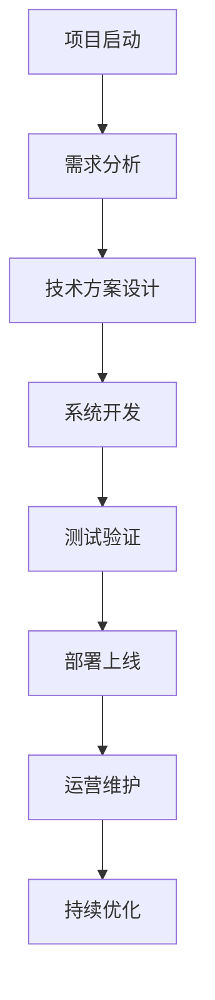

```mermaid
flowchart TD
    A[项目启动] --> B[需求分析]
    B --> C[技术方案设计]
    C --> D[系统开发]
    D --> E[测试验证]
    E --> F[部署上线]
    F --> G[运营维护]
    G --> H[持续优化]
```

[续写 1/20] 正在生成缺失章节: 第一章, 第二章, 第四章, 第五章, 第七章, 第八章, 第九章, 第十章...

[续写 2/20] 正在生成缺失章节: 第一章, 第二章, 第四章, 第五章, 第七章, 第八章, 第九章, 第十章...

[续写 3/20] 正在生成缺失章节: 第一章, 第二章, 第四章, 第五章, 第七章, 第八章, 第九章, 第十章...