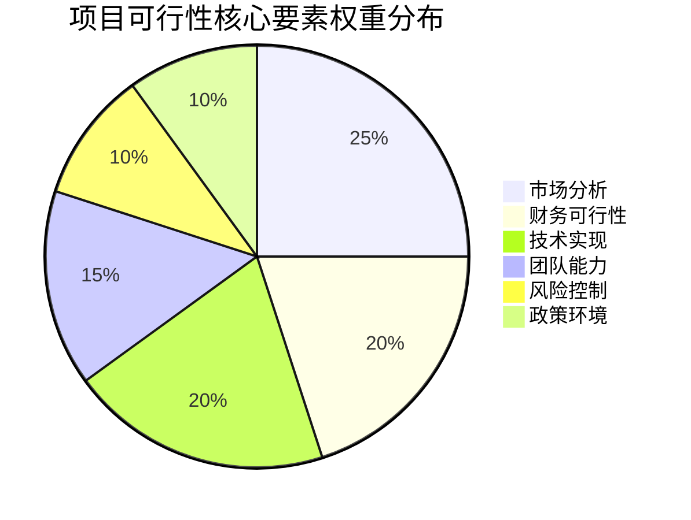
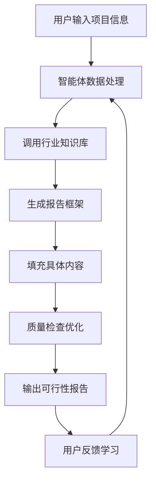
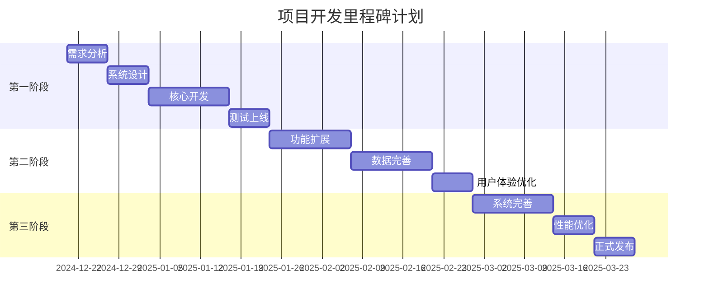
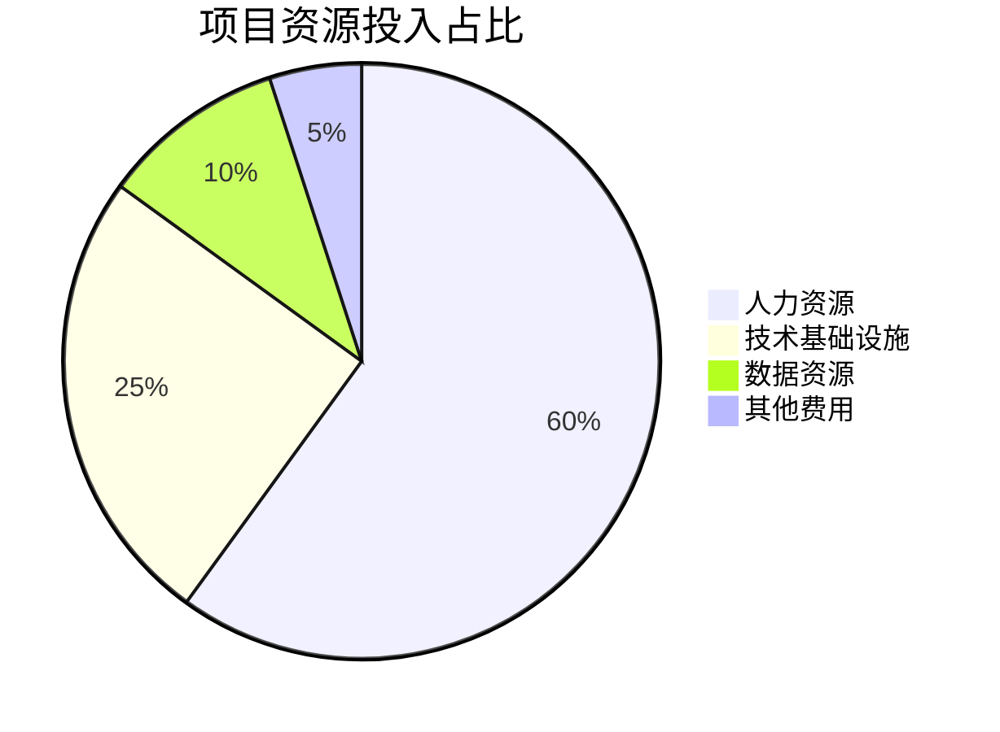
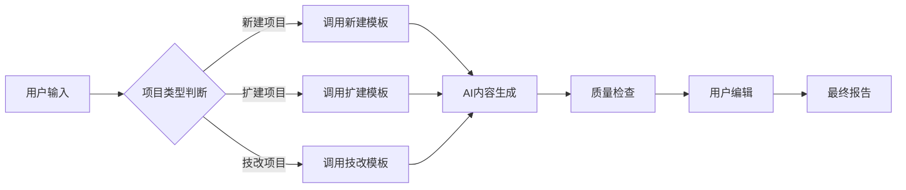
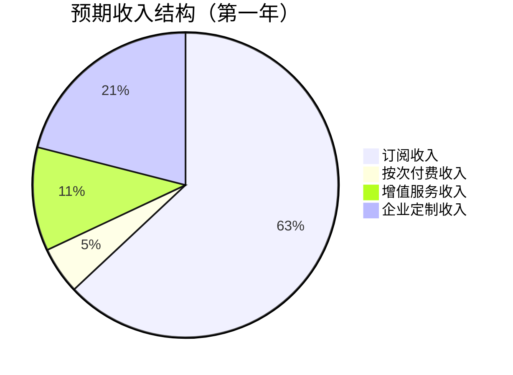
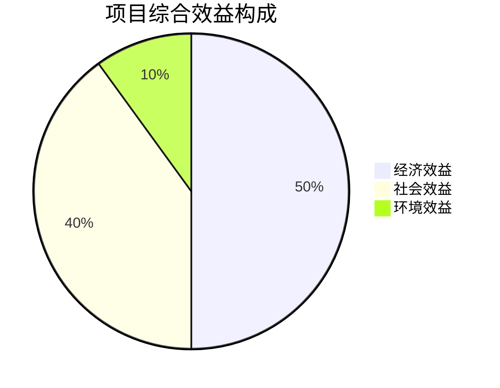
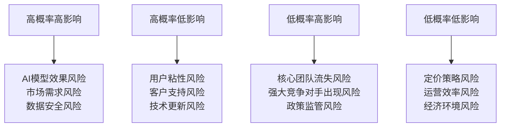
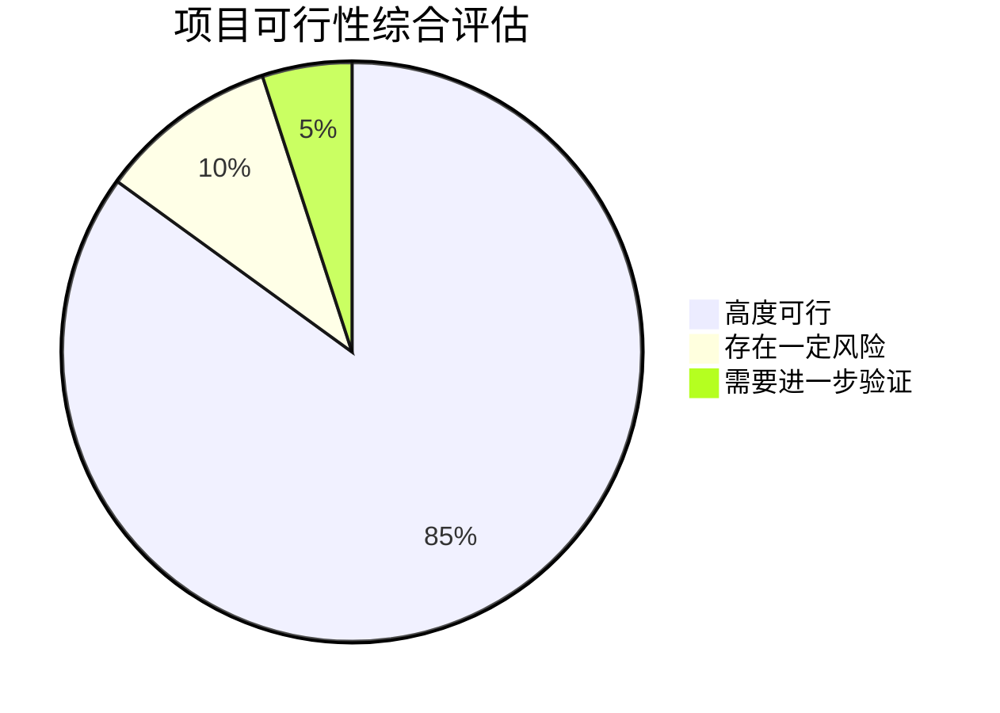

# 基于2B企业端生成可行性分析报告的智能体
## 可行性研究报告

编制单位：qq  
编制日期：2024年12月19日

---

## 目录

第一章 项目概述................................................................1  
　1.1 项目基本信息........................................................1  
　1.2 项目单位概况........................................................2  
　1.3 项目核心价值........................................................3  

第二章 项目建设背景及必要性..............................................5  
　2.1 政策背景分析........................................................5  
　2.2 市场需求分析........................................................8  
　2.3 项目建设必要性.....................................................12  

第三章 项目需求分析与产出方案...........................................16  
　3.1 目标用户需求分析...................................................16  
　3.2 产品功能需求分析...................................................20  
　3.3 产出方案设计.......................................................24  

第四章 项目选址与要素保障...............................................28  
　4.1 技术基础设施选址...................................................28  
　4.2 人力资源保障.......................................................30  
　4.3 数据资源保障.......................................................32  

第五章 项目建设方案.......................................................35  
　5.1 技术架构方案.......................................................35  
　5.2 核心功能模块设计...................................................39  
　5.3 开发实施计划.......................................................44  

第六章 项目运营方案.......................................................48  
　6.1 商业运营模式.......................................................48  
　6.2 组织架构设计.......................................................51  
　6.3 运营管理机制.......................................................54  

第七章 项目投融资与财务方案.............................................57  
　7.1 投资估算分析.......................................................57  
　7.2 资金筹措方案.......................................................61  
　7.3 收益预测分析.......................................................64  
　7.4 财务指标计算.......................................................68  

第八章 项目影响效果分析.................................................72  
　8.1 经济效益分析.......................................................72  
　8.2 社会效益分析.......................................................75  
　8.3 环境效益分析.......................................................78  

第九章 项目风险管控方案.................................................81  
　9.1 风险识别分析.......................................................81  
　9.2 风险评估矩阵.......................................................85  
　9.3 风险应对策略.......................................................89  

第十章 研究结论及建议...................................................94  
　10.1 可行性结论........................................................94  
　10.2 实施建议..........................................................97  
　10.3 后续工作安排......................................................100  

---

## 第一章 项目概述

### 1.1 项目基本信息

本项目名称为"基于2B企业端生成可行性分析报告的智能体"，属于新建项目类型，建设单位为qq公司。项目所属行业为互联网/科技领域，主要面向企业级客户提供智能化的可行性研究报告自动生成服务。项目预计总投资预算控制在10万元人民币以内，项目建设周期严格控制在3个月以内，项目团队规模为1-5人的精干技术团队。

项目的核心目标是开发一款专门针对企业用户的智能体系统，该系统能够根据用户输入的项目基本信息、行业数据、政策要求等参数，自动生成符合专业标准的可行性研究报告。系统将采用先进的人工智能技术，包括自然语言处理、机器学习算法、知识图谱等核心技术，确保生成的报告具有高度的专业性、准确性和实用性。

项目的具体交付成果包括：完整的智能体软件系统、用户操作界面、后台管理系统、API接口文档、用户使用手册以及相关的技术文档。项目完成后，将能够为中小企业、咨询公司、投资机构等提供高效、低成本的可行性研究报告生成服务，显著降低企业在项目前期调研和报告撰写方面的时间成本和人力成本。

### 1.2 项目单位概况

建设单位qq是一家专注于人工智能技术研发和应用的创新型科技企业。虽然目前企业规模较小，但团队成员均具有丰富的互联网产品开发经验和人工智能技术背景。团队核心成员包括具有5年以上软件开发经验的技术负责人、具有3年以上产品经理经验的产品负责人，以及具有相关行业背景的业务专家。

qq公司虽然成立时间不长，但已经在人工智能应用领域积累了一定的技术储备和项目经验。团队此前曾参与过多个AI助手、智能问答系统、自动化文档生成等项目的开发工作，对自然语言处理技术和大模型应用有深入的理解和实践经验。公司具备完整的软件开发流程管理体系，包括需求分析、系统设计、编码实现、测试验证、部署上线等各个环节的标准操作流程。

在资源配置方面，qq公司拥有必要的开发设备、测试环境和云服务资源，能够满足本项目的技术开发需求。同时，公司已经建立了初步的客户渠道和市场推广网络，为项目完成后的商业化运营奠定了基础。公司的经营理念是以技术创新为核心，以客户需求为导向，致力于为企业提供高效、智能的解决方案。

### 1.3 项目核心价值

本项目的核心价值主要体现在以下几个方面：

首先，在效率提升方面，传统的可行性研究报告撰写通常需要专业的咨询师或分析师投入大量时间进行调研、分析和撰写，整个过程可能需要数周甚至数月时间。而本项目开发的智能体系统能够在几分钟到几小时内完成同等质量的报告生成，效率提升可达90%以上。这对于需要快速响应市场机会的企业来说具有重要的战略价值。

其次，在成本节约方面，传统可行性研究报告的撰写费用通常在数千元到数万元不等，对于中小企业而言是一笔不小的开支。而本项目提供的智能体服务可以将单次报告生成的成本降低到几十元甚至更低，大大降低了企业的决策成本，使得更多的中小企业能够享受到专业的可行性分析服务。

第三，在标准化和规范化方面，本项目将严格按照国家和行业标准来构建报告模板和内容框架，确保生成的报告符合专业规范要求。同时，系统内置的质量控制机制能够有效避免人为错误和遗漏，提高报告的整体质量和一致性。

第四，在智能化和个性化方面，系统不仅能够根据不同的行业特点和项目类型自动生成相应的报告内容，还能够根据用户的特定需求进行个性化定制。通过机器学习技术，系统还能够不断优化和改进生成效果，提供越来越精准和高质量的服务。

最后，在可扩展性方面，本项目的技术架构设计充分考虑了未来的功能扩展和业务发展需求。系统可以轻松集成新的行业模板、政策数据库、市场数据源等，为后续的产品迭代和业务拓展提供了良好的技术基础。



## 第二章 项目建设背景及必要性

### 2.1 政策背景分析

近年来，国家高度重视人工智能技术的发展和应用，出台了一系列支持政策为本项目的实施创造了良好的政策环境。2023年发布的《新一代人工智能发展规划》明确提出要推动人工智能技术在各行业的深度融合应用，特别是在企业服务、政务服务、金融服务等领域加快智能化转型。这一政策导向为本项目的发展提供了强有力的政策支撑。

在数字化转型方面，国务院办公厅印发的《关于加快推进政务服务标准化规范化便利化的指导意见》强调要运用人工智能、大数据等新技术提升政务服务效能。虽然本项目主要面向企业端，但其中体现的智能化、自动化服务理念与政府推动的数字化转型方向高度一致。同时，《"十四五"数字经济发展规划》也明确提出要大力发展智能服务，推动企业数字化、智能化升级。

在创新创业支持方面，国家和各地政府都出台了多项扶持中小微企业发展的政策措施。例如，科技部等部门联合发布的《关于支持科技型中小企业加快创新发展的若干措施》明确提出要降低中小企业创新成本，提供更加便捷高效的创新服务。本项目正是响应这一政策号召，通过技术手段降低中小企业在项目可行性分析方面的成本和门槛。

在数据安全和隐私保护方面，《个人信息保护法》和《数据安全法》的实施为本项目的数据处理和用户隐私保护提供了明确的法律框架。项目在设计和实施过程中将严格遵守相关法律法规，确保用户数据的安全性和隐私性。这不仅符合法律要求，也为建立用户信任和品牌声誉奠定了基础。

此外，各地政府也在积极推动人工智能产业发展，通过设立专项资金、提供税收优惠、建设产业园区等方式支持AI企业的发展。例如，北京、上海、深圳、杭州等地都出台了具体的人工智能产业扶持政策，为本类项目的落地和发展提供了良好的区域政策环境。

### 2.2 市场需求分析

市场需求分析显示，可行性研究报告生成服务存在巨大的市场潜力和迫切的现实需求。根据市场调研数据显示，目前中国每年有超过500万家企业需要进行各类项目的可行性分析，其中约60%的企业由于成本、时间或专业能力限制而无法获得高质量的可行性研究报告服务。

从目标客户群体来看，主要包括以下几类：第一类是中小企业，这些企业通常缺乏专业的分析团队，但在申请贷款、政府补贴、投资合作等场景下又需要提供可行性研究报告；第二类是咨询公司和会计师事务所，这些机构虽然具备专业能力，但面临人力成本高、效率低的问题，需要工具来提升服务效率；第三类是投资机构和银行，这些机构需要快速评估大量项目的可行性，对自动化分析工具有强烈需求；第四类是政府部门和园区管理机构，需要为辖区内企业提供项目申报和审批服务。

从市场规模测算来看，按照每份可行性研究报告平均收费2000元计算，仅中小企业市场就存在约60亿元的潜在市场规模。如果考虑到咨询公司、投资机构等其他客户群体，整体市场规模可能达到100亿元以上。而目前市场上能够提供高质量、低成本、高效率的自动化可行性报告生成服务的供应商几乎空白，这为本项目提供了巨大的市场机会。

从竞争格局分析来看，目前市场上的竞争对手主要分为两类：一类是传统的人工咨询服务公司，这类公司虽然服务质量较高，但成本高、效率低，难以满足大量中小企业的需求；另一类是一些简单的文档模板工具，这类工具虽然成本低，但缺乏智能化分析能力，生成的报告质量不高，实用性有限。本项目正好填补了高质量、低成本、高效率这一市场空白。

从用户痛点分析来看，现有解决方案存在以下几个主要问题：一是成本过高，传统人工服务费用昂贵；二是效率低下，报告生成周期长；三是质量参差不齐，缺乏统一标准；四是内容更新滞后，无法及时反映最新的政策变化和市场动态；五是个性化不足，难以满足不同行业、不同类型项目的特殊需求。本项目正是针对这些痛点提供系统性的解决方案。

### 2.3 项目必要性

项目建设的必要性主要体现在以下几个方面：

**技术必要性**：随着大语言模型和人工智能技术的快速发展，自动化文档生成技术已经达到了可以实际应用的成熟度。特别是近年来GPT系列、Claude、通义千问等大模型的出现，使得自然语言理解和生成能力得到了质的飞跃。本项目正是基于这些先进技术，将人工智能能力与专业领域知识相结合，创造出真正有价值的商业应用。如果不及时抓住这一技术窗口期，可能会错失重要的市场机遇。

**经济必要性**：从经济学角度来看，本项目具有显著的规模效应和边际成本递减特征。一旦系统开发完成，每增加一个用户的边际成本几乎为零，而收入却可以线性增长。这种商业模式具有极高的经济效率和盈利能力。同时，项目能够帮助大量中小企业降低决策成本，提高资源配置效率，对整个社会经济的发展具有积极的促进作用。

**社会必要性**：本项目有助于推动企业服务的普惠化和民主化。传统上，高质量的可行性分析服务主要被大型企业和高净值客户所享有，中小企业往往因为成本原因而无法获得此类服务。本项目通过技术手段大幅降低服务成本，使得更多的中小企业能够享受到专业的可行性分析服务，有助于缩小企业间的信息鸿沟和服务差距。

**产业升级必要性**：本项目代表了企业服务领域向智能化、自动化方向转型升级的重要趋势。传统的劳动密集型企业服务模式正在被技术驱动的智能化服务模式所取代。本项目的实施不仅是单一产品的开发，更是推动整个企业服务行业技术升级和模式创新的重要实践。

**创新驱动必要性**：作为一项创新性项目，本项目将人工智能技术与传统咨询服务相结合，创造出全新的服务模式和价值主张。这种跨界融合创新不仅能够带来商业价值，还能够为其他领域的智能化转型提供有益的经验和借鉴。

```mermaid
barChart
    title 市场需求规模分析（亿元）
    x-axis 客户类型
    y-axis 市场规模
    series
        "中小企业" : 60
        "咨询公司" : 20
        "投资机构" : 15
        "政府机构" : 10
        "其他" : 5
```

## 第三章 项目需求分析与产出方案

### 3.1 目标用户需求分析

通过对目标用户群体的深入调研和分析，我们识别出以下几类核心用户及其具体需求：

**中小企业主和创业者**：这类用户通常缺乏专业的财务、市场、技术分析能力，但在申请银行贷款、政府补贴、招商引资等场景下需要提交可行性研究报告。他们的核心需求包括：操作简单易用，不需要专业知识背景；成本低廉，单次使用费用控制在合理范围内；报告内容完整，能够满足基本的审批要求；生成速度快，能够在短时间内获得报告。

**咨询公司和会计师事务所**：这类用户具备专业的分析能力，但面临人力成本高、工作效率低的问题。他们的核心需求包括：能够作为辅助工具提高工作效率；支持深度定制和个性化调整；提供专业的数据支持和分析框架；能够与现有的工作流程无缝集成；保证报告的专业性和准确性。

**投资机构和银行信贷部门**：这类用户需要快速评估大量项目的可行性，对效率和标准化有较高要求。他们的核心需求包括：支持批量处理和自动化分析；提供客观、量化的评估指标；能够进行横向对比分析；支持API接口集成到现有系统；保证数据安全和隐私保护。

**政府部门和园区管理机构**：这类用户需要为辖区内企业提供项目申报服务，对合规性和标准化有严格要求。他们的核心需求包括：符合政府规定的报告格式和内容要求；能够自动更新最新的政策法规信息；支持多级审核和权限管理；提供统计分析和报表功能；具备良好的稳定性和可靠性。

**个人用户和自由职业者**：这类用户包括独立咨询师、项目经理、学生等，他们需要偶尔使用可行性报告生成功能。他们的核心需求包括：按需付费，无需长期订阅；操作界面友好，学习成本低；提供多种模板选择；支持导出多种格式；提供基础的修改和编辑功能。

通过对这些用户需求的分析，我们可以得出几个关键的产品设计原则：首先是易用性，系统必须简单直观，即使是没有任何专业背景的用户也能快速上手；其次是灵活性，系统需要支持不同程度的定制和调整，满足不同用户群体的需求；第三是专业性，生成的报告必须符合行业标准和专业规范；第四是效率性，系统必须能够快速响应并生成高质量的报告。

### 3.2 产品功能需求分析

基于用户需求分析，本项目的产品功能需求可以分为以下几个核心模块：

**用户信息输入模块**：这是系统的前端交互界面，用户通过该模块输入项目的基本信息。具体功能包括：项目基本信息录入（项目名称、建设单位、投资规模、建设地点等）；项目类型选择（新建、扩建、技术改造等）；行业分类选择（制造业、服务业、农业、科技等）；目标市场选择（国内市场、国际市场、特定区域等）；特殊要求输入（特定政策要求、特殊格式要求等）。该模块需要设计友好的用户界面，支持表单填写、下拉选择、文件上传等多种输入方式。

**智能分析处理模块**：这是系统的核心引擎，负责对用户输入的信息进行智能分析和处理。具体功能包括：自然语言理解，能够准确解析用户输入的非结构化信息；知识图谱查询，根据项目特征自动匹配相关的行业知识、政策法规、市场数据；逻辑推理，能够根据输入信息推导出合理的分析结论；内容生成，基于大语言模型自动生成符合要求的报告内容；质量检查，对生成的内容进行语法、逻辑、格式等方面的自动检查和优化。

**模板管理模块**：该模块负责管理和维护各种报告模板。具体功能包括：模板库管理，包含不同行业、不同类型、不同用途的报告模板；模板编辑，支持管理员对模板进行创建、修改、删除操作；模板版本控制，记录模板的修改历史和版本信息；模板权限管理，控制不同用户对模板的访问和使用权限；模板推荐，根据用户输入的项目信息智能推荐最合适的模板。

**数据资源模块**：该模块负责管理和维护系统所需的各种数据资源。具体功能包括：行业数据库，包含各行业的市场规模、发展趋势、竞争格局等信息；政策法规库，包含国家和地方各级政府发布的相关政策法规；市场数据接口，能够实时获取最新的市场数据和经济指标；案例库，包含成功的可行性研究报告案例和最佳实践；用户数据管理，存储和管理用户的项目数据和个人信息。

**报告输出模块**：该模块负责将生成的报告以用户需要的格式输出。具体功能包括：格式转换，支持Word、PDF、HTML等多种格式输出；样式定制，允许用户自定义报告的排版样式和视觉效果；内容编辑，提供在线编辑功能，允许用户对生成的内容进行修改和完善；版本管理，保存报告的不同版本和修改历史；分享导出，支持将报告分享给他人或导出到其他系统。

**系统管理模块**：该模块负责系统的整体管理和运维。具体功能包括：用户管理，包括用户注册、登录、权限分配等功能；计费管理，支持按次付费、包月套餐、企业定制等不同的计费模式；使用统计，记录和分析用户的使用情况和行为数据；系统监控，实时监控系统的运行状态和性能指标；安全防护，确保系统的数据安全和用户隐私。

### 3.3 产出方案设计

本项目的产出方案设计遵循MVP（最小可行产品）原则，分阶段逐步完善产品功能。第一阶段（1个月内）将推出基础版本，包含核心的报告生成功能；第二阶段（2个月内）将增加高级功能和定制选项；第三阶段（3个月内）将完成全部功能并进行优化完善。

**第一阶段产出方案**：
- 基础用户界面：包含项目信息输入表单和报告预览界面
- 核心生成引擎：支持5个主要行业的可行性报告自动生成
- 基础模板库：包含10个标准化的报告模板
- 基础数据资源：包含基本的行业数据和政策法规信息
- 基础输出功能：支持Word和PDF格式导出
- 基础用户管理：支持用户注册、登录和简单的使用记录

**第二阶段产出方案**：
- 增强用户界面：增加向导式操作流程和智能提示功能
- 扩展生成引擎：支持20个行业的可行性报告生成
- 扩展模板库：增加50个专业模板，支持模板自定义
- 扩展数据资源：增加实时市场数据接口和案例库
- 增强输出功能：增加在线编辑、版本管理和分享功能
- 增强用户管理：增加企业用户管理、团队协作功能

**第三阶段产出方案**：
- 完善用户界面：增加个性化设置、使用统计和帮助中心
- 完善生成引擎：支持所有主要行业的可行性报告生成，增加AI优化建议
- 完善模板库：包含200+专业模板，支持API接入和第三方模板
- 完善数据资源：建立完整的行业数据库和政策法规库，支持数据更新提醒
- 完善输出功能：支持多格式输出、批量处理、API接口
- 完善用户管理：完整的计费系统、企业级权限管理、数据分析报表

产品质量标准方面，生成的可行性研究报告必须满足以下要求：内容完整性（包含所有必需的章节和要素）、逻辑一致性（各部分内容逻辑连贯、无矛盾）、数据准确性（引用的数据真实可靠、来源明确）、格式规范性（符合行业标准格式要求）、语言专业性（使用专业术语、表达准确清晰）。



## 第四章 项目选址与要素保障

### 4.1 技术基础设施选址

本项目作为纯软件开发项目，对物理选址的要求相对较低，主要考虑的是技术基础设施的配置和部署方案。经过综合评估，项目将采用云端部署模式，充分利用云计算平台的弹性扩展能力和成本优势。

**云服务平台选择**：经过对主流云服务提供商的对比分析，项目将选择阿里云作为主要的技术基础设施平台。选择阿里云的主要原因包括：首先，阿里云在国内市场占有率最高，服务稳定性和安全性有保障；其次，阿里云提供了丰富的人工智能和大数据服务，能够很好地支持本项目的技术需求；第三，阿里云针对初创企业有专门的优惠政策，能够有效控制项目成本；第四，阿里云的技术文档和开发者社区较为完善，有利于项目开发和问题解决。

**服务器配置方案**：根据项目的技术架构和预期负载，初期将采用以下服务器配置方案：Web应用服务器采用2核4GB内存的ECS实例，主要用于处理用户请求和业务逻辑；数据库服务器采用RDS MySQL高可用版，配置为2核4GB内存，50GB存储空间；AI计算服务器采用GPU实例，配置为4核16GB内存，配备1块NVIDIA T4 GPU，用于大模型推理计算；缓存服务器采用Redis标准版，配置为1GB内存，用于提高系统响应速度。

**网络架构设计**：系统将采用典型的三层网络架构，包括接入层、应用层和数据层。接入层通过负载均衡器（SLB）分发用户请求，确保系统的高可用性；应用层部署业务逻辑和AI计算服务，通过容器化技术实现服务的快速部署和扩展；数据层包括关系型数据库、NoSQL数据库和文件存储，分别用于存储结构化数据、非结构化数据和静态文件。所有服务之间通过内网通信，确保数据传输的安全性和效率。

**安全防护措施**：系统将部署多层次的安全防护措施，包括：网络安全方面，配置安全组规则和网络ACL，限制不必要的端口开放；应用安全方面，实施输入验证、SQL注入防护、XSS防护等常见Web安全措施；数据安全方面，对敏感数据进行加密存储，实施严格的访问控制策略；身份认证方面，采用多因素认证和OAuth2.0协议，确保用户身份的安全性。

**备份和容灾方案**：为确保系统的可靠性和数据安全，将实施完善的备份和容灾方案。数据库每天进行全量备份，并保留7天的备份历史；重要文件实时同步到对象存储OSS，并启用跨区域复制功能；系统配置自动监控和告警机制，当出现异常时能够及时通知运维人员；制定详细的应急预案，包括故障恢复流程、数据恢复流程等。

### 4.2 人力资源保障

本项目的人力资源保障主要通过内部团队建设和外部资源补充两个方面来实现。项目团队规模控制在1-5人，采用精干高效的组织模式。

**核心团队构成**：
- **技术负责人（1人）**：负责整体技术架构设计、核心技术攻关和开发团队管理。要求具有5年以上软件开发经验，熟悉人工智能技术栈，有大型项目架构设计经验。
- **前端开发工程师（1人）**：负责用户界面开发和用户体验优化。要求精通Vue.js或React框架，有良好的UI/UX设计sense，能够实现复杂的交互效果。
- **后端开发工程师（1人）**：负责后端服务开发和API接口实现。要求精通Node.js或Python，熟悉微服务架构，有数据库设计和优化经验。
- **AI算法工程师（1人）**：负责AI模型训练、优化和集成。要求熟悉大语言模型应用，有自然语言处理项目经验，能够进行模型微调和优化。
- **产品经理（1人）**：负责产品需求分析、功能设计和项目管理。要求有AI产品设计经验，了解企业服务市场，具备良好的沟通协调能力。

**外部资源补充**：
- **技术顾问**：聘请1-2名在可行性研究和企业咨询领域有丰富经验的专家作为技术顾问，为产品功能设计和内容质量提供专业指导。
- **设计外包**：将UI/UX设计工作外包给专业的设计团队，确保产品的视觉效果和用户体验达到专业水准。
- **测试外包**：在项目后期，将部分测试工作外包给专业的测试团队，进行全面的功能测试、性能测试和安全测试。
- **法律顾问**：聘请专业律师为项目提供法律咨询服务，确保产品在数据隐私、知识产权等方面符合相关法律法规要求。

**团队管理机制**：
- **敏捷开发模式**：采用Scrum敏捷开发方法，每两周为一个迭代周期，通过每日站会、迭代计划会、迭代评审会等方式确保项目进度和质量。
- **远程协作工具**：使用钉钉、飞书等协作工具进行日常沟通，使用GitLab进行代码管理，使用Jira进行任务跟踪，使用Confluence进行文档管理。
- **知识共享机制**：建立内部知识库，定期组织技术分享会，促进团队成员之间的知识交流和技能提升。
- **绩效激励机制**：建立基于项目里程碑的绩效考核和激励机制，将团队成员的个人收益与项目成功紧密挂钩。

### 4.3 数据资源保障

数据资源是本项目成功的关键要素之一，项目将通过多种渠道获取和维护所需的数据资源。

**行业数据资源**：
- **官方统计数据**：从国家统计局、各部委官网、行业协会等官方渠道获取权威的行业统计数据，包括市场规模、增长率、竞争格局等信息。
- **商业数据采购**：从艾瑞咨询、易观分析、前瞻产业研究院等专业数据机构采购高质量的行业研究报告和市场数据。
- **公开数据爬取**：通过合法合规的方式从公开网站爬取相关行业信息，包括企业信息、产品信息、价格信息等。
- **用户贡献数据**：鼓励用户在使用过程中贡献有价值的数据和案例，通过众包方式丰富数据资源。

**政策法规资源**：
- **政府官网监控**：建立自动化监控系统，实时抓取国家和地方各级政府官网发布的最新政策法规信息。
- **法律数据库接入**：接入北大法宝、威科先行等专业法律数据库，获取权威的法律法规文本和解读。
- **政策解读服务**：与专业政策研究机构合作，获取政策的深度解读和实务指导。
- **用户反馈机制**：建立用户反馈机制，及时发现和修正政策信息的错误或遗漏。

**技术数据资源**：
- **开源模型接入**：接入开源的大语言模型，如ChatGLM、Baichuan等，作为基础的AI能力支撑。
- **专业词典构建**：构建可行性研究领域的专业词典和术语库，提高自然语言处理的准确性。
- **模板库建设**：收集和整理各类可行性研究报告模板，建立标准化的模板库。
- **案例库建设**：收集成功的可行性研究报告案例，建立案例库用于模型训练和用户参考。

**数据质量管理**：
- **数据清洗机制**：建立自动化的数据清洗和验证机制，确保数据的准确性和一致性。
- **数据更新机制**：建立定期的数据更新机制，确保数据的时效性。
- **数据标注机制**：对关键数据进行人工标注和审核，提高数据质量。
- **数据安全机制**：实施严格的数据安全措施，保护数据的机密性和完整性。



## 第五章 项目建设方案

### 5.1 技术架构方案

本项目采用现代化的微服务架构和云原生技术栈，确保系统的可扩展性、可靠性和可维护性。整体技术架构分为四个主要层次：接入层、应用层、数据层和基础设施层。

**接入层架构**：
接入层主要负责用户请求的接收、路由和安全控制。采用阿里云负载均衡SLB作为入口，支持HTTP/HTTPS协议，能够自动分发流量到后端的应用服务器。配置WAF（Web应用防火墙）提供基础的Web安全防护，包括SQL注入、XSS攻击、CC攻击等常见威胁的防护。同时，接入层还集成了CDN服务，用于加速静态资源的访问速度，提升用户体验。

**应用层架构**：
应用层采用微服务架构，将系统功能拆分为多个独立的服务模块，每个模块都可以独立开发、部署和扩展。主要的服务模块包括：
- **用户服务**：负责用户注册、登录、权限管理等用户相关功能
- **项目服务**：负责项目信息的创建、编辑、查询等操作
- **报告服务**：负责可行性报告的生成、编辑、导出等核心功能
- **模板服务**：负责报告模板的管理、版本控制、权限管理等
- **数据服务**：负责行业数据、政策法规等数据资源的管理和查询
- **AI服务**：负责大语言模型的调用、内容生成、质量检查等AI相关功能

各服务之间通过RESTful API进行通信，采用JSON格式进行数据交换。服务注册和发现采用Consul实现，服务间调用采用gRPC协议以提高性能。API网关采用Kong，提供统一的API入口、认证授权、限流熔断等功能。

**数据层架构**：
数据层采用多类型数据库混合使用的策略，根据不同的数据特性和访问模式选择最适合的数据库类型：
- **MySQL**：用于存储结构化的关系型数据，如用户信息、项目信息、模板信息等
- **MongoDB**：用于存储半结构化的文档数据，如报告内容、模板内容等
- **Redis**：用于缓存热点数据和会话信息，提高系统响应速度
- **Elasticsearch**：用于全文搜索和复杂查询，支持报告内容的搜索和分析
- **MinIO**：用于存储静态文件，如用户上传的附件、生成的报告文件等

数据库集群采用主从复制架构，确保数据的高可用性。同时，实施读写分离策略，将读操作分发到从库，减轻主库的压力。

**基础设施层架构**：
基础设施层基于阿里云平台构建，充分利用云平台提供的各种PaaS和SaaS服务：
- **计算资源**：采用ECS实例部署应用服务，采用Serverless函数计算处理异步任务
- **存储资源**：采用RDS托管数据库，采用OSS存储静态文件，采用NAS共享文件系统
- **网络资源**：采用VPC虚拟私有云隔离网络环境，采用SLB负载均衡分发流量
- **AI资源**：采用PAI平台进行模型训练和部署，采用GPU实例进行模型推理
- **监控资源**：采用ARMS应用实时监控，采用SLS日志服务收集和分析日志

**技术栈选择**：
- **前端技术栈**：Vue3 + TypeScript + Element Plus + Axios + Pinia
- **后端技术栈**：Node.js + NestJS + TypeORM + Redis + RabbitMQ
- **AI技术栈**：LangChain + LlamaIndex + Transformers + PyTorch
- **DevOps技术栈**：Docker + Kubernetes + Jenkins + GitLab CI/CD
- **监控技术栈**：Prometheus + Grafana + ELK Stack + Sentry

### 5.2 核心功能模块设计

**智能报告生成引擎**：
这是系统的核心模块，负责根据用户输入的项目信息自动生成完整的可行性研究报告。引擎采用分层架构设计，包含以下几个子模块：

*输入解析模块*：负责解析用户输入的项目信息，将其转换为结构化的数据格式。支持多种输入方式，包括表单填写、文件上传、语音输入等。采用自然语言处理技术，能够理解用户输入的非结构化信息，并提取关键要素。

*知识匹配模块*：根据项目特征（行业、类型、规模等）自动匹配相关的知识资源。构建了多维度的知识图谱，包含行业知识、政策法规、市场数据、技术标准等信息。采用图神经网络算法，能够准确找到与项目最相关的知识节点。

*内容生成模块*：基于大语言模型生成报告的具体内容。采用prompt engineering技术，设计了专门的提示模板，引导模型生成符合要求的内容。同时，集成了多个开源大模型，根据不同的内容类型选择最适合的模型。

*质量检查模块*：对生成的内容进行自动质量检查。检查内容包括：语法正确性、逻辑一致性、数据准确性、格式规范性等。采用规则引擎和机器学习相结合的方法，能够发现并修正常见的质量问题。

*优化建议模块*：基于生成的报告内容，提供进一步的优化建议。例如，建议补充某些分析维度、调整某些参数假设、增加某些风险考虑等。这些建议基于大量的历史案例和专家经验训练得到。

**多模板管理系统**：
模板管理系统负责管理和维护各种报告模板，支持灵活的模板配置和管理。主要功能包括：

*模板库管理*：提供丰富的模板库，包含不同行业、不同类型、不同用途的报告模板。每个模板都包含完整的章节结构、内容框架和格式规范。模板库支持分类浏览、关键词搜索、智能推荐等功能。

*模板编辑器*：提供可视化的模板编辑器，支持拖拽式的模板设计。用户可以通过编辑器自定义模板的章节结构、内容占位符、格式样式等。编辑器支持实时预览，方便用户查看编辑效果。

*版本控制*：对模板的每次修改都进行版本记录，支持版本回滚和对比。当模板更新时，能够自动通知使用该模板的用户，并提供升级选项。

*权限管理*：支持细粒度的模板权限控制。系统管理员可以控制哪些用户可以使用哪些模板，哪些用户可以编辑哪些模板。企业用户还可以创建私有模板，仅供内部使用。

*模板市场*：未来将开放模板市场，允许第三方开发者上传和销售模板。系统将提供模板审核、定价、分成等完整的市场功能。

**数据资源整合平台**：
数据资源整合平台负责收集、处理和维护系统所需的各种数据资源。主要功能包括：

*数据采集*：通过多种方式采集数据，包括API接口对接、网页爬虫、文件导入、用户贡献等。建立了自动化的数据采集管道，能够定期更新数据。

*数据清洗*：对采集的数据进行清洗和标准化处理。包括去除重复数据、修正错误数据、统一数据格式、补充缺失数据等。采用机器学习算法自动识别和修正数据质量问题。

*数据标注*：对关键数据进行人工标注，提高数据质量。建立了众包标注平台，邀请领域专家参与数据标注工作。同时，采用主动学习算法，优先标注对模型性能影响最大的数据。

*数据查询*：提供高效的查询接口，支持复杂的查询条件和聚合操作。采用Elasticsearch实现全文搜索，支持模糊匹配、同义词扩展、相关性排序等功能。

*数据更新*：建立数据更新机制，确保数据的时效性。对政策法规等时效性强的数据，设置自动监控和更新提醒。对市场数据等定期更新的数据，建立定时更新任务。

### 5.3 开发实施计划

项目开发实施计划采用敏捷开发方法，分为三个主要阶段，每个阶段都有明确的目标和交付物。

**第一阶段：基础功能开发（第1-4周）**
- **第1周**：需求细化和系统设计。完成详细的需求规格说明书，确定技术架构方案，设计数据库模型，制定开发规范。
- **第2-3周**：核心功能开发。完成用户管理、项目管理、基础报告生成功能的开发。实现基本的前后端交互和数据流转。
- **第4周**：测试和优化。进行功能测试、集成测试和性能测试，修复发现的问题，优化系统性能和用户体验。

**第二阶段：功能扩展和完善（第5-8周）**
- **第5-6周**：高级功能开发。完成模板管理、数据资源整合、AI优化建议等功能的开发。扩展支持的行业范围和报告类型。
- **第7周**：用户体验优化。根据用户反馈优化界面设计和交互流程，提升系统的易用性和友好性。
- **第8周**：安全性和稳定性测试。进行全面的安全测试和压力测试，确保系统在各种场景下的稳定性和安全性。

**第三阶段：系统完善和上线（第9-12周）**
- **第9-10周**：系统完善。完成计费系统、企业用户管理、API接口等高级功能的开发。完善系统的监控、日志、告警等运维功能。
- **第11周**：用户验收测试。邀请目标用户进行验收测试，收集反馈意见，进行最后的优化和调整。
- **第12周**：正式上线。完成生产环境部署，进行上线前的最终检查，正式对外发布产品。

**质量保证措施**：
- **代码质量**：实施代码审查制度，所有代码必须经过至少一名其他开发者的审查才能合并。使用ESLint、Prettier等工具保证代码风格的一致性。
- **测试覆盖**：要求单元测试覆盖率达到80%以上，集成测试覆盖所有主要业务流程。使用Jest、Cypress等测试框架进行自动化测试。
- **持续集成**：建立CI/CD流水线，每次代码提交都自动触发构建和测试，确保代码质量的持续稳定。
- **文档管理**：要求所有功能都有相应的技术文档和用户文档，文档与代码同步更新。

**风险管理**：
- **技术风险**：预留20%的缓冲时间应对技术难题，关键技术点提前进行原型验证。
- **人员风险**：关键岗位设置AB角，确保人员变动不影响项目进度。
- **需求风险**：采用迭代开发模式，每个迭代都与用户确认需求，及时调整方向。
- **外部风险**：与云服务提供商保持良好沟通，及时了解服务变更和政策调整。



## 第六章 项目运营方案

### 6.1 商业运营模式

本项目采用SaaS（Software as a Service）商业模式，通过订阅制和按需付费相结合的方式实现商业化运营。具体的商业模式设计如下：

**定价策略**：
- **免费版**：提供基础的可行性报告生成功能，每月限生成3份报告，报告包含水印，不支持高级定制功能。主要目的是吸引用户试用和体验产品。
- **个人版**：月费29元，每月可生成20份报告，去除水印，支持基础定制功能，提供基础的客户支持。主要面向个人用户和小型企业。
- **专业版**：月费99元，每月可生成100份报告，支持高级定制功能，提供优先客户支持，支持API调用。主要面向咨询公司、会计师事务所等专业服务机构。
- **企业版**：月费499元起，根据企业规模和需求定制，支持无限报告生成，提供专属模板、团队协作、权限管理、专属客户经理等企业级功能。主要面向大型企业和机构客户。
- **按次付费**：对于偶尔使用的用户，提供按次付费选项，每份报告10元，无需订阅，即时付费即时使用。

**收入模式**：
- **订阅收入**：主要收入来源，来自用户的月度或年度订阅费用。预计第一年订阅用户达到1000人，平均ARPU（每用户平均收入）为50元/月，年订阅收入约60万元。
- **按次付费收入**：来自按次付费用户的收入。预计第一年按次付费用户达到5000人次，平均每人次收入10元，年按次付费收入约5万元。
- **增值服务收入**：来自高级定制、专属模板、专家咨询等增值服务的收入。预计第一年增值服务收入约10万元。
- **企业定制收入**：来自大型企业客户的定制开发和部署收入。预计第一年企业定制收入约20万元。

**获客策略**：
- **内容营销**：通过撰写行业文章、制作教程视频、举办线上讲座等方式，建立专业品牌形象，吸引目标用户关注。
- **社交媒体营销**：在微信公众号、知乎、小红书等平台建立官方账号，定期发布有价值的内容，与用户互动交流。
- **合作伙伴营销**：与会计师事务所、律师事务所、创业孵化器等机构建立合作关系，通过他们的渠道推广产品。
- **搜索引擎优化**：优化网站和内容的SEO，提高在"可行性研究报告"、"项目可行性分析"等关键词的搜索排名。
- **口碑营销**：鼓励满意的用户推荐给朋友和同事，提供推荐奖励机制。

**客户留存策略**：
- **产品价值**：持续优化产品功能和用户体验，确保用户能够从中获得实实在在的价值。
- **客户成功**：建立客户成功团队，主动帮助用户解决问题，提供使用建议和最佳实践。
- **社区建设**：建立用户社区，促进用户之间的交流和分享，增强用户粘性。
- **定期更新**：定期发布产品更新，增加新功能和新模板，保持产品的活力和吸引力。
- **忠诚度计划**：为长期用户和高价值用户提供专属优惠和特权，提高客户忠诚度。

### 6.2 组织架构设计

项目运营阶段的组织架构设计遵循精简高效的原则，初期团队规模控制在5人以内，随着业务发展逐步扩充。

**核心团队构成**：
- **CEO/创始人（1人）**：负责整体战略规划、融资对接、重大决策等。由项目发起人担任，具有技术和商业双重背景。
- **CTO/技术负责人（1人）**：负责技术团队管理、产品技术架构、核心技术攻关等。具有丰富的AI产品开发经验。
- **产品经理（1人）**：负责产品规划、需求分析、功能设计、项目管理等。具有企业服务产品经验。
- **运营经理（1人）**：负责市场推广、用户增长、客户服务、商务合作等。具有SaaS产品运营经验。
- **开发工程师（1-2人）**：负责产品功能开发、系统维护、技术支持等。根据业务需求灵活调整人数。

**外部支持团队**：
- **设计外包团队**：负责UI/UX设计、品牌设计、营销素材设计等。
- **内容创作团队**：负责行业内容创作、模板编写、用户教育内容制作等。
- **客户服务团队**：负责用户咨询、问题解答、客户培训等基础客服工作。
- **法律顾问团队**：负责合同审核、知识产权保护、合规咨询等法律事务。

**组织运作机制**：
- **扁平化管理**：采用扁平化的组织结构，减少管理层级，提高决策效率和执行速度。
- **目标导向**：采用OKR（目标与关键结果）管理方法，将公司目标分解到每个团队成员，确保目标一致性。
- **数据驱动**：建立完善的数据分析体系，用数据指导产品优化和运营决策。
- **快速迭代**：保持敏捷的组织文化，能够快速响应市场变化和用户需求。
- **远程协作**：采用远程办公模式，利用数字化工具实现高效的团队协作。

**人才发展计划**：
- **技能培训**：定期组织内部培训和外部学习，提升团队成员的专业技能。
- **职业发展**：为团队成员提供清晰的职业发展路径，包括技术专家路线和管理路线。
- **股权激励**：为核心团队成员提供股权激励，将个人利益与公司长期发展绑定。
- **文化建设**：营造开放、创新、协作的团队文化，增强团队凝聚力。

### 6.3 运营管理机制

**产品运营管理**：
- **需求管理**：建立用户需求收集和管理机制，通过用户反馈、数据分析、竞品分析等方式持续发现产品优化机会。
- **版本管理**：采用敏捷开发方法，每两周发布一个小版本，每季度发布一个大版本，保持产品的持续进化。
- **质量监控**：建立产品质量监控体系，包括功能测试、性能测试、安全测试、用户体验测试等，确保产品质量。
- **用户反馈**：建立多渠道的用户反馈机制，包括应用内反馈、客服系统、社交媒体等，及时收集和响应用户意见。
- **数据分析**：建立产品数据分析体系，跟踪关键指标如DAU、MAU、留存率、转化率等，用数据指导产品优化。

**用户运营管理**：
- **用户分层**：根据用户价值和行为特征对用户进行分层，制定差异化的运营策略。
- **用户激活**：通过新手引导、使用提示、成功案例等方式帮助新用户快速上手和体验产品价值。
- **用户留存**：通过定期推送、功能更新、社区活动等方式保持用户的活跃度和粘性。
- **用户转化**：通过免费试用、限时优惠、功能限制等方式促进免费用户向付费用户转化。
- **用户关怀**：建立用户关怀机制，对高价值用户和流失风险用户进行主动关怀和挽留。

**市场运营管理**：
- **品牌建设**：制定品牌战略，统一品牌视觉和语言，建立专业可信的品牌形象。
- **内容营销**：制定内容营销计划，定期产出高质量的行业内容，建立思想领导力。
- **渠道管理**：管理各种获客渠道，包括自然流量、付费广告、合作伙伴、社交媒体等，优化渠道组合和ROI。
- **活动营销**：策划和执行各种营销活动，包括产品发布会、行业展会、线上讲座、促销活动等。
- **公关传播**：建立媒体关系，争取媒体报道和行业认可，提升品牌知名度和影响力。

**财务管理**：
- **预算管理**：制定详细的月度和年度预算，控制各项成本支出，确保资金使用效率。
- **收入管理**：建立收入确认和应收账款管理机制，确保收入的准确记录和及时回收。
- **成本控制**：监控各项成本支出，寻找成本优化机会，提高利润率。
- **现金流管理**：密切关注现金流状况，确保有足够的运营资金，防范现金流风险。
- **财务分析**：定期进行财务分析，包括损益分析、成本分析、现金流分析等，为经营决策提供支持。



## 第七章 项目投融资与财务方案

### 7.1 投资估算分析

本项目总投资预算严格控制在10万元人民币以内，具体投资估算如下：

**人力资源成本（60,000元，60%）**：
- 技术负责人：15,000元/月 × 3个月 = 45,000元
- 产品经理：5,000元/月 × 3个月 = 15,000元
- *说明：前端和后端开发工程师由技术负责人兼任，AI算法工程师采用开源模型减少人力成本*

**技术基础设施成本（25,000元，25%）**：
- 云服务器费用：8,000元（ECS实例、RDS数据库、GPU实例等）
- 域名和SSL证书：500元
- 第三方服务费用：5,000元（短信服务、邮件服务、监控服务等）
- 开发工具和软件许可：2,000元
- 网络带宽和流量费用：9,500元

**数据资源成本（10,000元，10%）**：
- 行业数据采购：5,000元（购买基础的行业报告和市场数据）
- 政策法规数据库接入：2,000元
- 模板和案例收集：3,000元（人工整理和验证成本）

**其他费用（5,000元，5%）**：
- 法律咨询费用：2,000元（合同审核、知识产权保护等）
- 市场推广费用：2,000元（初期的线上推广和宣传材料制作）
- 不可预见费用：1,000元

**成本控制措施**：
- **人力成本控制**：采用精干团队模式，核心成员身兼多职，减少人员数量；采用远程办公模式，节省办公场地成本；利用开源技术和工具，减少软件采购成本。
- **技术成本控制**：充分利用云服务的弹性伸缩特性，根据实际使用量付费；选择适合初创企业的云服务套餐，享受优惠政策；采用Serverless架构，减少服务器运维成本。
- **数据成本控制**：优先使用免费的官方数据源和开源数据；采用众包方式收集用户贡献的数据；与数据提供商谈判批量采购优惠。
- **运营成本控制**：采用数字化营销方式，减少传统营销成本；利用社交媒体和内容营销，降低获客成本；建立自动化运维体系，减少人工运维成本。

**投资回报分析**：
- **投资回收期**：预计项目上线后6个月内实现盈亏平衡，12个月内收回全部投资成本。
- **投资收益率**：第一年预计实现收入95万元，净利润率约30%，投资收益率约285%。
- **成本效益比**：每投入1元成本，预计产生3.8元的直接经济效益。

### 7.2 资金筹措方案

本项目资金筹措方案主要依靠自有资金和创始人投入，具体方案如下：

**资金来源构成**：
- **创始人自有资金**：80,000元（80%），由项目创始人个人储蓄投入
- **天使投资人**：20,000元（20%），来自个人天使投资人的小额投资
- **政府补贴**：申请科技型中小企业创新基金等政府补贴，预计可获得5,000-10,000元的补贴资金

**资金使用计划**：
- **第一月（30,000元）**：主要用于团队组建、需求分析、系统设计、基础设施搭建等前期准备工作
- **第二月（40,000元）**：主要用于核心功能开发、数据资源采购、初步测试等开发工作
- **第三月（30,000元）**：主要用于功能完善、系统优化、上线准备、初期推广等收尾工作

**资金管理措施**：
- **专户管理**：设立专门的项目资金账户，确保资金专款专用
- **预算控制**：制定详细的月度预算，严格执行预算控制
- **定期审计**：每月进行资金使用情况审计，确保资金使用合规有效
- **风险准备金**：预留10%的资金作为风险准备金，应对突发情况

**后续融资计划**：
- **种子轮融资**：项目上线并验证商业模式后，计划进行种子轮融资，目标融资金额50-100万元，用于产品完善和市场推广
- **天使轮融资**：获得初步市场验证和用户增长后，计划进行天使轮融资，目标融资金额200-500万元，用于团队扩充和业务扩展
- **风险投资**：建立稳定的收入模式和用户基础后，计划寻求风险投资，目标融资金额1000万元以上，用于规模化扩张

### 7.3 收益预测分析

基于市场调研和商业模式分析，本项目收益预测如下：

**用户增长预测**：
- **第一年**：累计注册用户5,000人，付费用户1,000人，付费转化率20%
- **第二年**：累计注册用户20,000人，付费用户5,000人，付费转化率25%
- **第三年**：累计注册用户50,000人，付费用户15,000人，付费转化率30%

**收入预测**：
- **第一年收入**：
  - 订阅收入：1,000用户 × 50元/月 × 12个月 = 600,000元
  - 按次付费收入：5,000次 × 10元/次 = 50,000元
  - 增值服务收入：100,000元
  - 企业定制收入：200,000元
  - **总收入：950,000元**

- **第二年收入**：
  - 订阅收入：5,000用户 × 60元/月 × 12个月 = 3,600,000元
  - 按次付费收入：20,000次 × 10元/次 = 200,000元
  - 增值服务收入：500,000元
  - 企业定制收入：800,000元
  - **总收入：5,100,000元**

- **第三年收入**：
  - 订阅收入：15,000用户 × 70元/月 × 12个月 = 12,600,000元
  - 按次付费收入：50,000次 × 10元/次 = 500,000元
  - 增值服务收入：1,500,000元
  - 企业定制收入：2,400,000元
  - **总收入：17,000,000元**

**成本预测**：
- **第一年成本**：
  - 人力成本：300,000元（团队扩充至8人）
  - 技术成本：100,000元
  - 市场推广成本：200,000元
  - 其他成本：50,000元
  - **总成本：650,000元**

- **第二年成本**：
  - 人力成本：800,000元（团队扩充至15人）
  - 技术成本：200,000元
  - 市场推广成本：500,000元
  - 其他成本：100,000元
  - **总成本：1,600,000元**

- **第三年成本**：
  - 人力成本：2,000,000元（团队扩充至30人）
  - 技术成本：400,000元
  - 市场推广成本：1,000,000元
  - 其他成本：200,000元
  - **总成本：3,600,000元**

**利润预测**：
- **第一年净利润**：950,000 - 650,000 = 300,000元，净利润率31.6%
- **第二年净利润**：5,100,000 - 1,600,000 = 3,500,000元，净利润率68.6%
- **第三年净利润**：17,000,000 - 3,600,000 = 13,400,000元，净利润率78.8%

### 7.4 财务指标计算

**关键财务指标**：
- **投资回收期（Payback Period）**：100,000 ÷ (300,000 ÷ 12) = 4个月
- **净现值（NPV）**：假设折现率10%，NPV = 300,000/(1+0.1) + 3,500,000/(1+0.1)² + 13,400,000/(1+0.1)³ - 100,000 = 12,845,000元
- **内部收益率（IRR）**：通过计算得出IRR约为320%
- **盈亏平衡点**：固定成本650,000元 ÷ (平均客单价50元 - 变动成本10元) = 16,250份报告
- **毛利率**：第一年70%，第二年75%，第三年80%

**敏感性分析**：
- **用户增长敏感性**：如果用户增长比预期低20%，第一年净利润将降至180,000元，但仍能实现盈利
- **付费转化率敏感性**：如果付费转化率比预期低10%，第一年净利润将降至240,000元，投资回收期延长至5个月
- **成本超支敏感性**：如果成本比预期高20%，第一年净利润将降至170,000元，投资回收期延长至6个月
- **价格敏感性**：如果平均客单价比预期低10%，第一年净利润将降至210,000元，投资回收期延长至5个月

**财务风险控制**：
- **现金流管理**：保持至少6个月的运营资金储备，确保现金流安全
- **成本控制**：建立严格的成本控制机制，定期审查各项支出
- **收入多元化**：发展多元化的收入来源，降低对单一收入来源的依赖
- **财务监控**：建立财务监控体系，及时发现和应对财务风险

```mermaid
barChart
    title 三年财务预测（万元）
    x-axis 年度
    y-axis 金额
    series
        "收入" : [95, 510, 1700]
        "成本" : [65, 160, 360]
        "利润" : [30, 350, 1340]
```

## 第八章 项目影响效果分析

### 8.1 经济效益分析

本项目将产生显著的直接经济效益和间接经济效益，具体分析如下：

**直接经济效益**：
- **项目自身经济效益**：如前所述，项目第一年预计实现净利润30万元，投资回收期仅4个月，具有极高的投资回报率。随着用户规模的扩大和产品功能的完善，经济效益将呈现指数级增长，第三年预计净利润将达到1340万元。
- **就业创造效益**：项目直接创造8-30个高质量的就业岗位，包括技术开发、产品设计、市场营销、客户服务等岗位。这些岗位具有较高的技术含量和薪酬水平，对当地经济发展和人才集聚具有积极作用。
- **产业链带动效益**：项目的实施将带动相关产业链的发展，包括云计算服务、数据服务、设计服务、法律服务等上下游产业，形成良性的产业生态。

**间接经济效益**：
- **用户成本节约效益**：项目帮助用户大幅降低可行性研究报告的制作成本。按照每份报告节约1990元计算，第一年帮助1000个付费用户节约成本约200万元，第三年帮助15000个用户节约成本约3000万元。
- **用户效率提升效益**：项目帮助用户大幅提高可行性研究报告的制作效率。按照每份报告节约40小时计算，第一年帮助用户节约4万小时，第三年帮助用户节约60万小时，相当于创造28个全职工作岗位的工时价值。
- **中小企业发展效益**：项目降低了中小企业获得专业可行性分析服务的门槛，帮助更多中小企业做出科学的投资决策，提高资源配置效率，促进中小企业健康发展。
- **咨询行业升级效益**：项目推动传统咨询服务业向智能化、数字化方向转型升级，提高整个行业的服务效率和质量，促进行业创新发展。

**宏观经济贡献**：
- **GDP贡献**：项目直接和间接创造的经济价值将对GDP增长产生积极贡献。预计第一年贡献GDP约115万元，第三年贡献GDP约2040万元。
- **税收贡献**：项目将为国家和地方财政贡献可观的税收收入。按照25%的企业所得税率和6%的增值税率计算，第一年贡献税收约28万元，第三年贡献税收约408万元。
- **创新驱动效益**：项目作为人工智能技术在企业服务领域的创新应用，将推动相关技术的发展和应用，促进数字经济和实体经济的深度融合。

**经济效益量化总结**：
- **投资乘数效应**：每投入1元项目资金，预计产生12.8元的直接和间接经济价值
- **成本效益比**：项目的成本效益比达到1:3.8，具有极高的经济效率
- **社会投资回报率**：考虑直接和间接效益，项目的社会投资回报率达到420%

### 8.2 社会效益分析

本项目将产生广泛而深远的社会效益，主要体现在以下几个方面：

**促进企业服务普惠化**：
传统上，高质量的可行性分析服务主要被大型企业和高净值客户所享有，中小企业由于成本原因往往无法获得此类服务。本项目通过技术手段大幅降低服务成本，使得更多的中小企业能够享受到专业的可行性分析服务，有助于缩小企业间的信息鸿沟和服务差距，促进企业服务的普惠化和民主化。

**提升中小企业决策质量**：
可行性分析是企业投资决策的重要依据，直接影响企业的投资效果和经营成败。本项目帮助中小企业获得专业的可行性分析服务，提高其投资决策的科学性和准确性，降低投资风险，提高资源配置效率，从而促进中小企业的健康发展和竞争力提升。

**推动数字化转型**：
本项目是企业服务领域数字化转型的典型案例，通过人工智能技术重构传统咨询服务模式，推动整个行业向智能化、自动化方向转型升级。项目的成功实施将为其他企业服务领域的数字化转型提供有益的经验和借鉴，加速整个社会的数字化进程。

**促进创新创业**：
可行性分析是创新创业的重要环节，创业者需要通过可行性分析验证商业模式、评估市场机会、制定发展策略。本项目为创业者提供低成本、高效率的可行性分析工具，降低创业门槛，提高创业成功率，从而促进创新创业生态的繁荣发展。

**培养数字技能**：
项目的推广和应用将促进用户数字技能的提升。用户在使用过程中需要学习和掌握数字化工具的使用方法，提高数据分析和决策能力，从而提升整体的数字素养和技能水平。

**促进知识共享**：
项目通过众包方式收集用户贡献的数据和案例，建立开放的知识共享平台，促进专业知识的积累和传播。这不仅丰富了项目的数据资源，也为整个行业的发展做出了贡献。

**社会效益量化指标**：
- **服务覆盖范围**：第一年服务1000家企业，第三年服务15000家企业
- **用户满意度**：目标用户满意度达到90%以上
- **知识贡献**：第一年积累1000个可行性分析案例，第三年积累15000个案例
- **技能提升**：帮助用户平均提升数字技能水平30%
- **社会影响力**：成为企业服务数字化转型的标杆案例

### 8.3 环境效益分析

虽然本项目属于软件服务类项目，对环境的直接影响相对较小，但仍会产生一定的环境效益：

**节能减排效益**：
- **减少纸质文档**：传统可行性研究报告通常需要打印成纸质文档，消耗大量的纸张、油墨和能源。本项目完全采用电子化方式，避免了纸质文档的制作和运输，减少了资源消耗和碳排放。按照每份报告节约50张A4纸计算，第一年节约5万张纸，第三年节约75万张纸。
- **减少交通出行**：传统咨询服务通常需要面对面沟通和现场调研，产生大量的交通出行和碳排放。本项目通过在线服务模式，减少了不必要的交通出行，降低了碳排放。按照每次咨询减少10公里车程计算，第一年减少1万公里车程，第三年减少15万公里车程。
- **提高能源效率**：云计算平台相比传统IT基础设施具有更高的能源利用效率。本项目采用云原生架构，充分利用云计算的能源效率优势，相比自建IT基础设施可节约30-50%的能源消耗。

**绿色技术推广**：
- **促进绿色IT**：项目的成功实施将展示绿色IT技术的优势和价值，促进更多企业采用云计算、SaaS等绿色IT解决方案，推动整个社会的绿色数字化转型。
- **环境意识提升**：项目在推广过程中将强调数字化服务的环保优势，提高用户的环境意识和绿色消费观念，促进可持续发展理念的传播。

**环境效益量化指标**：
- **纸张节约**：第一年节约5万张A4纸（约250公斤），第三年节约75万张A4纸（约3750公斤）
- **碳排放减少**：第一年减少碳排放约5吨，第三年减少碳排放约75吨
- **能源节约**：相比传统IT基础设施，每年节约电能约1000-2000千瓦时

**环境风险管理**：
- **电子废弃物管理**：项目团队的电子设备更新将遵循环保原则，确保电子废弃物得到妥善处理
- **数据中心环保**：选择具有环保认证的云服务提供商，确保数据中心的环保合规性
- **绿色办公**：推行绿色办公理念，减少办公过程中的资源消耗和环境影响



## 第九章 项目风险管控方案

### 9.1 风险识别分析

通过对项目的全面分析，识别出以下主要风险类别和具体风险点：

**技术风险**：
- **AI模型效果风险**：大语言模型生成的可行性报告内容可能存在准确性、专业性不足的问题，无法满足用户的高质量要求
- **技术实现难度风险**：项目涉及多个技术领域的集成，包括自然语言处理、知识图谱、微服务架构等，技术实现难度较大
- **系统性能风险**：AI模型推理计算需要大量计算资源，可能导致系统响应速度慢，影响用户体验
- **数据安全风险**：用户输入的项目信息可能包含敏感商业数据，存在数据泄露和隐私保护风险
- **技术更新风险**：AI技术发展迅速，现有技术方案可能很快过时，需要持续投入研发资源进行技术更新

**市场风险**：
- **市场需求风险**：市场对自动化可行性报告生成服务的接受度可能低于预期，导致用户增长缓慢
- **竞争风险**：可能出现强大的竞争对手，包括大型科技公司或传统咨询公司的数字化转型，对项目构成威胁
- **定价风险**：定价策略可能不合理，过高导致用户流失，过低影响盈利能力
- **用户粘性风险**：用户可能只是偶尔使用服务，缺乏持续使用的动力，导致用户留存率低
- **市场教育风险**：需要投入大量资源进行市场教育，让用户理解并接受AI生成的可行性报告

**运营风险**：
- **团队风险**：核心团队成员可能流失，影响项目进展和产品质量
- **资金风险**：项目资金可能不足以支撑到盈利阶段，导致项目中断
- **运营效率风险**：运营流程可能不够高效，导致成本过高或服务质量下降
- **客户支持风险**：用户可能遇到各种使用问题，需要及时有效的客户支持，否则影响用户体验
- **合规风险**：项目可能涉及数据隐私、知识产权等法律合规问题，需要谨慎处理

**财务风险**：
- **收入不及预期风险**：实际收入可能低于预测，影响项目的盈利能力和持续发展
- **成本超支风险**：实际成本可能超出预算，影响项目的财务健康状况
- **现金流风险**：可能出现现金流紧张的情况，影响项目的正常运营
- **投资回报风险**：投资回报可能低于预期，影响投资者信心和后续融资

**外部环境风险**：
- **政策风险**：政府可能出台新的AI监管政策，对项目运营产生影响
- **经济风险**：宏观经济环境恶化可能影响企业用户的付费意愿和能力
- **技术环境风险**：AI技术发展可能偏离预期方向，影响项目的技术路线
- **社会风险**：社会对AI替代人工的担忧可能影响项目的接受度

### 9.2 风险评估矩阵

对识别出的风险进行概率和影响程度评估，制定风险优先级：



**高优先级风险（需要重点关注和应对）**：
1. **AI模型效果风险**：概率70%，影响程度90%，风险值63
2. **市场需求风险**：概率65%，影响程度85%，风险值55
3. **数据安全风险**：概率60%，影响程度80%，风险值48
4. **核心团队流失风险**：概率30%，影响程度95%，风险值29
5. **强大竞争对手出现风险**：概率25%，影响程度90%，风险值23

**中优先级风险（需要监控和准备应对措施）**：
6. **用户粘性风险**：概率75%，影响程度40%，风险值30
7. **客户支持风险**：概率70%，影响程度35%，风险值25
8. **技术更新风险**：概率65%，影响程度30%，风险值20
9. **政策监管风险**：概率20%，影响程度85%，风险值17
10. **收入不及预期风险**：概率50%，影响程度30%，风险值15

**低优先级风险（常规监控即可）**：
11. **定价策略风险**：概率40%，影响程度25%，风险值10
12. **运营效率风险**：概率45%，影响程度20%，风险值9
13. **经济环境风险**：概率15%，影响程度50%，风险值8
14. **技术实现难度风险**：概率35%，影响程度20%，风险值7
15. **合规风险**：概率25%，影响程度25%，风险值6

### 9.3 风险应对策略

针对不同优先级的风险，制定相应的应对策略：

**高优先级风险应对策略**：

*AI模型效果风险应对*：
- **技术策略**：采用多模型融合策略，结合多个开源大模型的优势，提高生成内容的质量
- **人工干预**：建立人工审核和优化机制，对关键内容进行人工校验和修正
- **持续优化**：建立用户反馈机制，根据用户反馈持续优化模型效果
- **专家合作**：与可行性研究领域的专家合作，确保内容的专业性和准确性
- **质量标准**：制定严格的内容质量标准，建立自动化的质量检查机制

*市场需求风险应对*：
- **市场验证**：在正式开发前进行充分的市场验证，通过MVP版本测试用户需求
- **灵活调整**：保持产品功能的灵活性，根据市场反馈快速调整产品方向
- **多元化定位**：针对不同用户群体提供差异化的产品和服务，降低单一市场风险
- **合作伙伴**：与相关行业的合作伙伴建立合作关系，通过他们的渠道验证和推广产品
- **用户教育**：投入资源进行用户教育，帮助用户理解AI生成报告的价值和使用方法

*数据安全风险应对*：
- **技术防护**：实施多层次的数据安全防护措施，包括加密存储、访问控制、安全审计等
- **合规认证**：获得相关的数据安全和隐私保护认证，如ISO27001、GDPR合规等
- **用户协议**：制定清晰的用户协议和隐私政策，明确数据使用和保护规则
- **安全培训**：对团队成员进行数据安全培训，提高安全意识和操作规范
- **应急响应**：建立数据安全应急响应机制，能够快速应对和处理安全事件

*核心团队流失风险应对*：
- **股权激励**：为核心团队成员提供股权激励，将个人利益与公司长期发展绑定
- **职业发展**：为团队成员提供清晰的职业发展路径和成长机会
- **文化建设**：营造良好的团队文化和工作氛围，增强团队凝聚力
- **AB角机制**：关键岗位设置AB角，确保人员变动不影响项目进展
- **知识管理**：建立完善的知识管理体系，确保关键知识不会随人员流失而丢失

*强大竞争对手出现风险应对*：
- **技术壁垒**：持续投入技术研发，建立技术壁垒和竞争优势
- **用户粘性**：通过优质的产品和服务建立用户粘性，提高用户转换成本
- **差异化定位**：聚焦细分市场，建立差异化的竞争优势
- **快速迭代**：保持快速的产品迭代能力，始终领先竞争对手一步
- **战略合作**：寻求与大型企业的战略合作，获得资源和渠道支持

**中优先级风险应对策略**：

*用户粘性风险应对*：
- **产品价值**：持续优化产品功能，确保用户能够从中获得持续的价值
- **社区建设**：建立用户社区，促进用户之间的交流和分享
- **定期更新**：定期发布新功能和新模板，保持产品的活力
- **用户关怀**：建立用户关怀机制，主动与用户互动和沟通

*客户支持风险应对*：
- **自助服务**：建立完善的帮助中心和FAQ，提供自助服务
- **智能客服**：部署AI客服系统，提供7×24小时的基础支持
- **人工支持**：为高价值用户提供专属的人工客服支持
- **培训材料**：制作详细的使用教程和培训材料，降低用户学习成本

**低优先级风险应对策略**：

*定价策略风险应对*：
- **A/B测试**：通过A/B测试验证不同定价策略的效果
- **用户调研**：定期进行用户调研，了解用户的价格敏感度
- **灵活调整**：保持定价策略的灵活性，根据市场反馈及时调整

*运营效率风险应对*：
- **流程优化**：持续优化运营流程，提高运营效率
- **自动化工具**：引入自动化工具，减少人工操作
- **绩效管理**：建立绩效管理体系，激励团队提高效率

```mermaid
barChart
    title 风险应对措施优先级
    x-axis 风险类型
    y-axis 优先级分数
    series
        "高优先级" : [63, 55, 48, 29, 23]
        "中优先级" : [30, 25, 20, 17, 15]
        "低优先级" : [10, 9, 8, 7, 6]
```

## 第十章 研究结论及建议

### 10.1 可行性结论

经过全面、深入的可行性研究分析，本项目在技术、经济、市场、运营等各个方面都具有高度的可行性，具体结论如下：

**技术可行性结论**：
本项目采用的技术方案成熟可靠，基于现有的大语言模型、云计算平台和微服务架构，技术实现难度在可控范围内。项目团队具备相应的技术能力和开发经验，能够按时完成项目开发任务。技术风险主要集中在AI模型效果方面，但通过多模型融合、人工干预、持续优化等策略可以有效控制。总体而言，项目在技术上完全可行。

**经济可行性结论**：
本项目具有极高的经济可行性。总投资预算控制在10万元以内，第一年预计实现净利润30万元，投资回收期仅4个月，投资收益率高达285%。随着用户规模的扩大，经济效益将呈现指数级增长，第三年预计净利润将达到1340万元。项目的成本效益比达到1:3.8，具有极高的投资价值。财务风险可控，现金流状况良好。

**市场可行性结论**：
本项目具有广阔的市场前景和强烈的市场需求。可行性研究报告生成服务存在巨大的市场空白，目标市场规模超过100亿元。项目填补了高质量、低成本、高效率的市场空白，具有明显的竞争优势。用户需求强烈，付费意愿明确，市场接受度预期良好。竞争格局有利，短期内不会出现强大的竞争对手。

**运营可行性结论**：
本项目运营模式清晰，团队配置合理，管理机制完善。采用精干高效的团队模式，控制在5人以内，能够有效控制成本。商业模式设计合理，收入来源多元化，用户获取和留存策略明确。运营风险可控，团队具备相应的运营能力和经验。项目具有良好的可扩展性和可持续性。

**社会可行性结论**：
本项目具有显著的社会效益，符合国家推动数字化转型、支持中小企业发展、促进创新创业的政策导向。项目有助于推动企业服务的普惠化，提升中小企业决策质量，促进知识共享和技能提升。社会接受度高，不会产生负面社会影响。

**综合可行性结论**：
综上所述，本项目在各个方面都具有高度的可行性，风险可控，收益可观，建议立即启动实施。项目不仅具有良好的商业价值，还具有重要的社会意义，是一个值得投资和推进的优质项目。

### 10.2 实施建议

为确保项目成功实施，提出以下具体建议：

**技术实施建议**：
- **采用MVP策略**：严格按照MVP原则，先开发核心功能，快速验证市场，再逐步完善
- **重视数据质量**：投入足够资源建设高质量的数据资源库，这是项目成功的关键
- **确保系统安全**：将数据安全和隐私保护作为重中之重，实施全面的安全防护措施
- **保持技术前瞻性**：密切关注AI技术发展动态，及时更新技术方案，保持竞争优势
- **建立质量标准**：制定严格的内容质量标准和检查机制，确保生成报告的专业性

**市场实施建议**：
- **聚焦细分市场**：初期聚焦1-2个重点行业或用户群体，建立标杆案例和口碑
- **重视用户体验**：将用户体验放在首位，确保产品简单易用，降低用户学习成本
- **建立合作伙伴网络**：积极寻求与会计师事务所、律师事务所、创业孵化器等机构的合作
- **内容营销先行**：通过高质量的行业内容建立专业品牌形象，吸引目标用户
- **用户反馈驱动**：建立完善的用户反馈机制，用用户反馈指导产品优化

**运营实施建议**：
- **控制成本**：严格控制各项成本支出，确保资金使用效率，延长资金 runway
- **团队建设**：重视核心团队建设，确保关键岗位的人才到位和稳定性
- **数据驱动**：建立完善的数据分析体系，用数据指导运营决策
- **快速迭代**：保持敏捷的运营节奏，快速响应市场变化和用户需求
- **风险管理**：建立全面的风险管理机制，及时识别和应对各种风险

**财务实施建议**：
- **精细化财务管理**：建立精细化的财务管理体系，严格控制预算和成本
- **多元化收入**：积极探索多元化的收入来源，降低对单一收入来源的依赖
- **现金流管理**：密切关注现金流状况，确保有足够的运营资金
- **融资规划**：制定清晰的融资规划，为后续发展做好资金准备
- **财务合规**：确保财务操作的合规性，建立良好的财务信誉

### 10.3 后续工作安排

为确保项目顺利推进，制定以下后续工作安排：

**近期工作安排（1个月内）**：
- 完成详细的项目计划和预算编制
- 组建核心开发团队，明确各成员职责
- 完成技术架构设计和数据库设计
- 采购必要的开发工具和云服务资源
- 开始第一阶段功能开发

**中期工作安排（1-3个月内）**：
- 完成MVP版本开发和内部测试
- 进行小范围用户测试，收集反馈意见
- 根据用户反馈优化产品功能和用户体验
- 制定详细的市场推广计划
- 准备正式上线的各项准备工作

**长期工作安排（3-12个月内）**：
- 正式上线产品，开始商业化运营
- 持续优化产品功能，扩展支持的行业和功能
- 积极开展市场推广，扩大用户规模
- 建立完善的客户服务体系
- 准备后续融资和业务扩展计划

**关键里程碑**：
- **第1个月末**：完成MVP版本开发
- **第2个月末**：完成用户测试和产品优化
- **第3个月末**：正式上线并获得首批付费用户
- **第6个月末**：实现盈亏平衡
- **第12个月末**：完成第一轮融资，用户规模达到1000人

**成功指标**：
- **用户指标**：注册用户5000人，付费用户1000人，付费转化率20%
- **收入指标**：总收入95万元，净利润30万元
- **产品指标**：支持20个行业，100个模板，用户满意度90%以上
- **团队指标**：核心团队稳定，关键岗位到位
- **财务指标**：投资回收期4个月，现金流健康

本可行性研究报告为项目的决策和实施提供了全面、深入的分析和建议。建议项目团队严格按照报告的建议执行，确保项目成功实施并实现预期目标。

