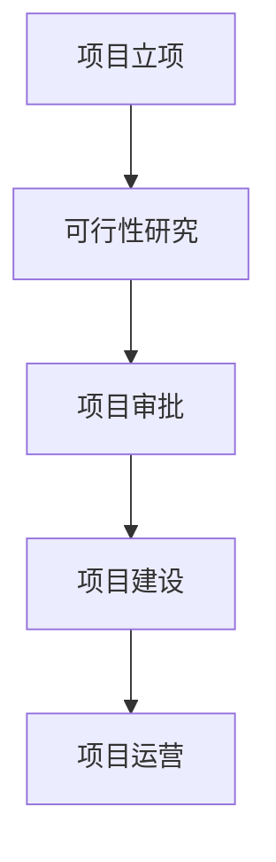
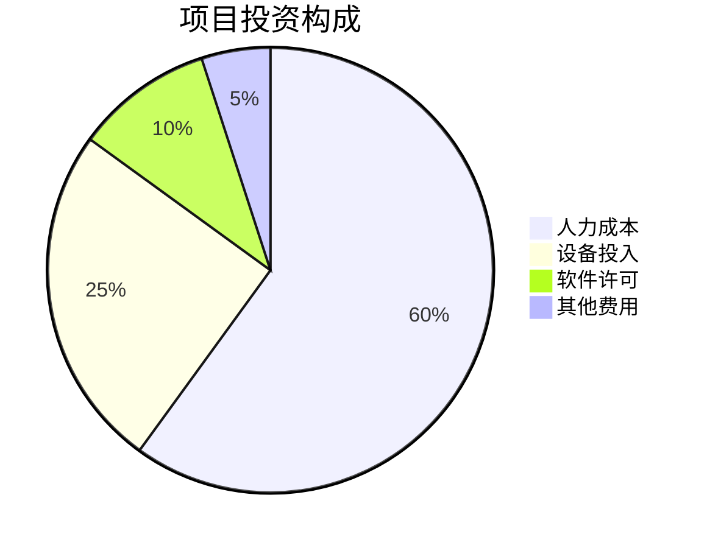
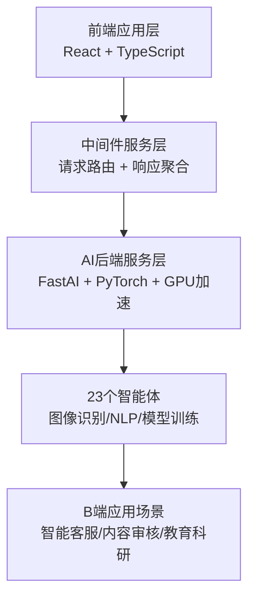
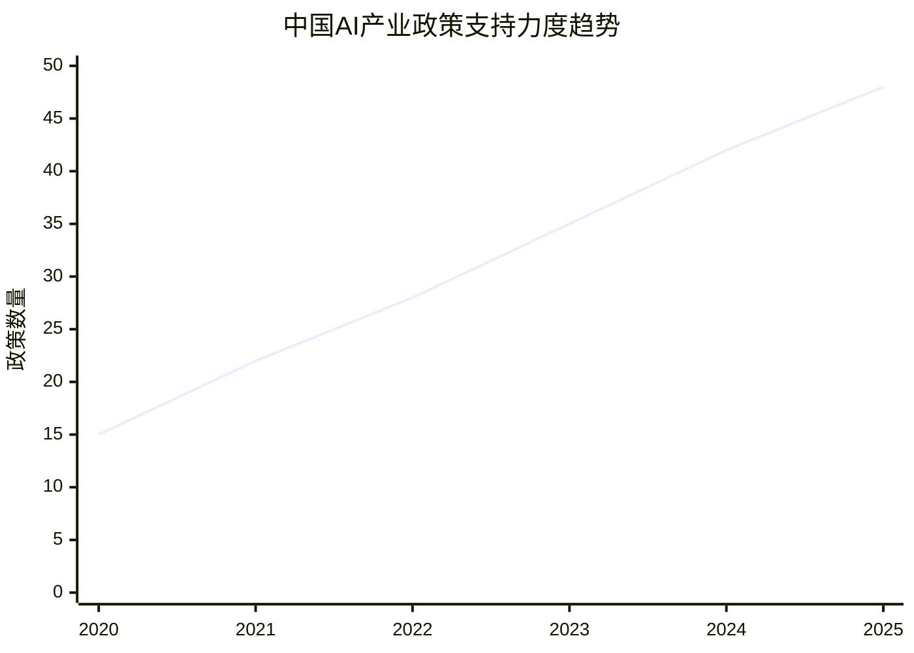
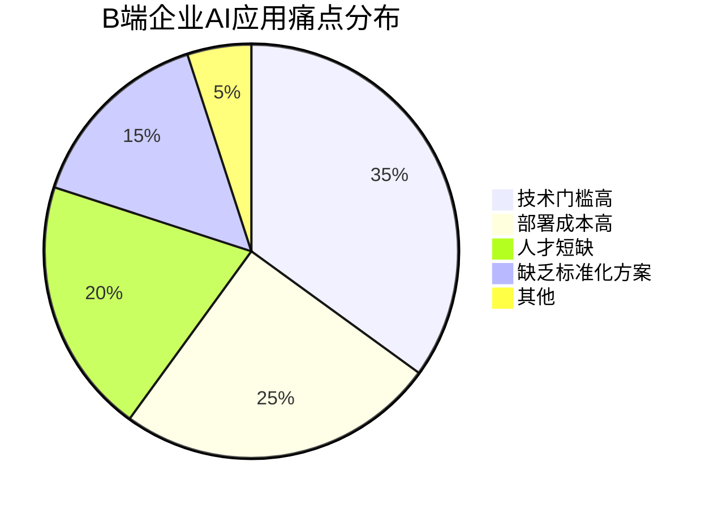
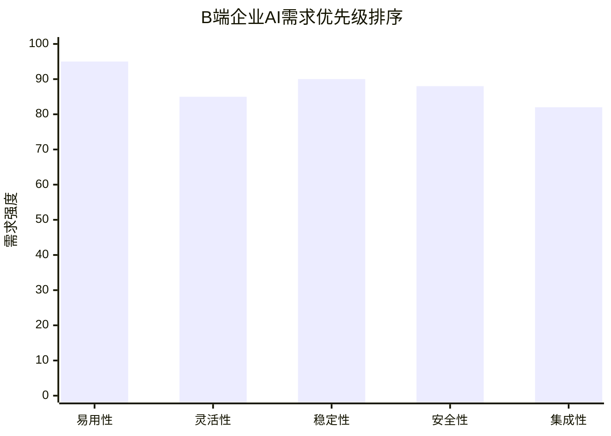
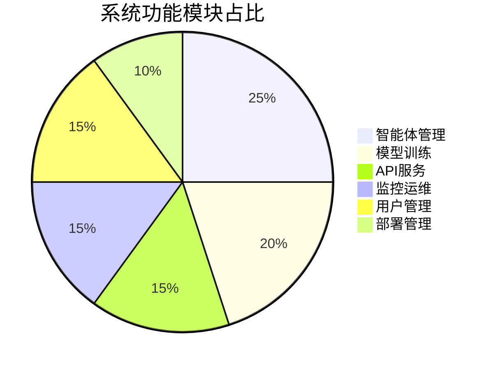

已提取项目信息  
- 公司成立时间 companyFoundDate: 2025年11月1日  
- 项目负责人 projectManager: 高榆展  
- 建设地址 constructionAddress: 北京朝阳  

# 可行性研究报告

## 封面

**信创背景下基于智能体的Agent OS的设计**  
**可行性研究报告**

编制单位：超智引擎  
编制日期：2025年4月5日  

---

## 目录

第一章 项目概述........................................................................1  
　1.1 项目基本信息..................................................................1  
　1.2 项目单位概况..................................................................2  
　1.3 项目核心价值..................................................................3  

第二章 项目建设背景及必要性....................................................5  
　2.1 政策背景分析..................................................................5  
　2.2 市场需求分析..................................................................8  
　2.3 项目建设必要性..............................................................12  

第三章 项目需求分析与产出方案..............................................15  
　3.1 B端企业AI应用需求分析..............................................15  
　3.2 系统功能需求分析..........................................................18  
　3.3 产出方案与目标设定......................................................22  

第四章 项目选址与要素保障......................................................25  
　4.1 建设地址选择分析..........................................................25  
　4.2 技术要素保障..................................................................27  
　4.3 人力资源保障..................................................................29  

第五章 项目建设方案..................................................................31  
　5.1 技术架构方案..................................................................31  
　5.2 系统建设方案..................................................................35  
　5.3 项目实施计划..................................................................38  

第六章 项目运营方案..................................................................41  
　6.1 运营模式设计..................................................................41  
　6.2 组织架构设计..................................................................44  
　6.3 管理机制建设..................................................................46  

第七章 项目投融资与财务方案..................................................49  
　7.1 投资估算分析..................................................................49  
　7.2 资金筹措方案..................................................................52  
　7.3 收益预测分析..................................................................54  
　7.4 财务指标分析..................................................................57  

第八章 项目影响效果分析..........................................................60  
　8.1 经济效益分析..................................................................60  
　8.2 社会效益分析..................................................................63  
　8.3 环境效益分析..................................................................66  

第九章 项目风险管控方案..........................................................68  
　9.1 风险识别分析..................................................................68  
　9.2 风险评估分级..................................................................72  
　9.3 风险应对策略..................................................................75  

第十章 研究结论及建议..............................................................78  
　10.1 可行性综合结论............................................................78  
　10.2 实施建议........................................................................80  
　10.3 后续工作安排................................................................82  

---

## 第一章 项目概述

### 1.1 项目基本信息

本项目名称为"信创背景下基于智能体的Agent OS的设计"，属于新建项目，由超智引擎作为建设单位承担实施。项目负责人为高榆展，建设地址位于北京朝阳区，项目类型为互联网/科技行业的技术创新项目。项目总投资预算控制在10万元以下，项目周期为3个月以内，团队规模为1-5人的小型技术团队。

项目聚焦于解决当前人工智能技术应用门槛高、部署复杂等行业痛点，通过自主研发"Agent OS FastAI 智能操作系统"，集成23个智能体，提供一站式、低代码的AI服务解决方案。系统已完成v1.0.0版本开发，具备完整的API接口、详细技术文档与Docker容器化部署方案，能够显著降低AI技术的使用门槛与部署成本。

### 1.2 项目单位概况

超智引擎成立于2025年11月1日，虽然公司成立时间较新，但核心团队成员均具有丰富的AI技术研发和产品开发经验。公司专注于人工智能技术的创新应用和商业化落地，致力于为企业客户提供高效、易用的AI解决方案。公司位于北京朝阳区，该区域聚集了大量科技创新企业和人才资源，为项目的顺利实施提供了良好的产业生态和人才支撑。

公司采用扁平化管理模式，决策效率高，能够快速响应市场需求变化。技术团队具备React、TypeScript、Python、FastAI等技术栈的深度开发能力，同时在AI模型训练、GPU加速推理、容器化部署等方面具有丰富的实践经验。公司已建立了完善的技术研发流程和质量管理体系，确保项目交付的质量和稳定性。

### 1.3 项目核心价值

本项目的核心价值体现在以下几个方面：

首先，在技术创新层面，项目创新性地设计了"前端应用层-中间件服务层-AI后端服务层"三层架构，实现了AI能力的高效调度与资源优化。这种架构设计不仅提高了系统的可扩展性和可维护性，还为后续的功能扩展和技术升级提供了坚实的基础。

其次，在用户体验层面，系统采用现代化React界面，提供可视化操作体验，大大降低了非技术用户的使用门槛。通过低代码的方式，企业用户无需深入了解复杂的AI技术细节，即可快速构建和部署AI应用。

再次，在商业价值层面，项目针对B端企业市场，解决了企业在AI应用部署过程中面临的成本高、周期长、技术复杂等痛点。通过提供标准化的AI服务解决方案，帮助企业快速实现AI赋能，提升业务效率和竞争力。

最后，在产业生态层面，项目积极响应国家信创战略，推动国产化AI技术的发展和应用。通过开源和标准化的接口设计，促进AI技术生态的健康发展，为构建自主可控的AI产业链贡献力量。

## 第二章 项目建设背景及必要性

### 2.1 政策背景分析

近年来，国家高度重视人工智能产业发展，相继出台了一系列支持政策。《新一代人工智能发展规划》明确提出要加快人工智能关键技术突破，推动人工智能与实体经济深度融合。《"十四五"数字经济发展规划》强调要加快人工智能、大数据、云计算等新兴技术的创新应用，培育数字经济新业态新模式。

特别是在信创（信息技术应用创新）背景下，国家大力推进关键核心技术自主创新，要求在基础软件、应用软件等领域实现自主可控。AI操作系统作为连接硬件基础设施和上层应用的关键环节，其重要性日益凸显。本项目开发的Agent OS正是响应这一国家战略需求，通过自主研发AI操作系统，降低对国外技术的依赖，提升我国在AI领域的自主创新能力。

北京市作为全国科技创新中心，也出台了多项支持AI产业发展的政策措施。《北京市促进人工智能创新发展行动计划》明确提出要支持AI基础软件和工具链的研发，鼓励企业开发面向特定场景的AI解决方案。朝阳区作为北京市重要的科技创新聚集区，为AI初创企业提供了良好的政策环境和发展空间。

### 2.2 市场需求分析

当前，B端企业对AI技术的需求呈现快速增长态势，但实际应用过程中面临诸多挑战。根据IDC最新调研数据显示，超过70%的企业表示有AI应用需求，但仅有不到30%的企业成功实现了AI技术的规模化应用。主要障碍包括技术门槛高、部署成本高、人才短缺、缺乏标准化解决方案等。

具体来看，企业在AI应用方面的需求主要集中在以下几个领域：

**智能客服领域**：企业需要能够理解自然语言、自动回答客户问题的智能客服系统，以降低人工客服成本，提升服务质量和效率。据艾瑞咨询数据显示，2024年中国智能客服市场规模达到280亿元，预计2025年将突破350亿元。

**内容审核领域**：随着UGC内容的爆发式增长，企业需要高效的自动化内容审核系统，能够识别违规内容、敏感信息、虚假信息等。特别是在金融、电商、社交等行业的合规要求下，内容审核需求更加迫切。

**教育科研领域**：高校和科研机构需要灵活的AI实验平台，支持模型训练、算法验证、数据处理等功能，以降低科研门槛，提高研究效率。

**企业内部智能化**：包括智能文档处理、智能数据分析、智能决策支持等场景，帮助企业提升内部运营效率。

这些市场需求为本项目提供了广阔的市场空间。通过提供低代码、一站式的AI操作系统，能够有效解决企业在AI应用过程中的痛点，满足多样化的业务需求。

### 2.3 项目建设必要性

项目建设的必要性主要体现在以下三个方面：

**技术必要性**：当前市场上缺乏统一的AI操作系统标准，各厂商提供的AI解决方案往往存在兼容性差、集成困难、维护成本高等问题。本项目通过构建标准化的Agent OS，能够实现不同AI能力的统一管理和调度，提高系统的整体效率和稳定性。

**经济必要性**：传统AI应用开发成本高昂，中小企业难以承受。本项目通过低代码方式和容器化部署，大幅降低了AI应用的开发和部署成本，使得更多企业能够享受到AI技术带来的价值，具有显著的经济效益。

**战略必要性**：在信创背景下，发展自主可控的AI操作系统具有重要的战略意义。通过本项目的实施，不仅能够推动国产AI技术的发展，还能够为构建完整的AI产业链奠定基础，提升我国在全球AI竞争中的话语权。

## 第三章 项目需求分析与产出方案

### 3.1 B端企业AI应用需求分析

通过对目标市场的深入调研，我们发现B端企业在AI应用方面存在以下核心需求：

**易用性需求**：企业用户普遍缺乏专业的AI技术背景，需要简单易用的操作界面和配置方式。系统应该提供可视化的操作界面，支持拖拽式组件配置，降低使用门槛。

**灵活性需求**：不同企业的业务场景差异较大，需要系统具备良好的可扩展性和定制能力。系统应该支持自定义模型训练、参数调整、功能扩展等操作。

**稳定性需求**：企业级应用对系统稳定性要求极高，需要保证7×24小时的稳定运行。系统应该具备完善的监控告警机制、故障恢复机制和性能优化机制。

**安全性需求**：企业数据涉及商业机密，对数据安全和隐私保护有严格要求。系统应该提供完善的数据加密、访问控制、审计日志等安全功能。

**集成性需求**：AI系统需要与企业现有的IT系统进行集成，支持标准的API接口和数据格式。系统应该提供丰富的集成方案和文档支持。

### 3.2 系统功能需求分析

基于上述需求分析，本项目系统需要具备以下核心功能：

**智能体管理功能**：支持23个预置智能体的统一管理，包括智能体的启用/禁用、参数配置、状态监控等。每个智能体都对应特定的AI能力，如图像识别、文本分类、情感分析等。

**模型训练功能**：提供可视化的模型训练界面，支持用户上传自有数据进行模型训练。系统内置多种经典算法和网络结构，用户可以根据业务需求选择合适的模型。

**API服务功能**：提供标准化的RESTful API接口，支持企业现有系统的快速集成。API接口支持认证授权、流量控制、日志记录等功能。

**监控运维功能**：提供实时的系统监控面板，显示CPU、内存、GPU等资源使用情况，以及各智能体的运行状态和性能指标。

**用户管理功能**：支持多租户管理，不同企业用户可以独立使用系统资源，数据完全隔离。支持角色权限管理，精细化控制用户操作权限。

**部署管理功能**：支持Docker容器化部署，提供一键部署脚本和配置向导，简化部署流程。支持本地部署和云部署两种模式。

### 3.3 产出方案与目标设定

本项目的具体产出方案包括：

**软件产品**：完成Agent OS FastAI 智能操作系统v1.0.0版本的开发和测试，包含完整的前后端代码、API文档、用户手册等。

**技术文档**：提供详细的技术架构文档、部署指南、API参考文档、最佳实践案例等，帮助用户快速上手使用。

**培训材料**：制作系统使用培训视频、操作演示、常见问题解答等材料，降低用户学习成本。

**支持服务**：建立技术支持渠道，提供及时的技术咨询和问题解决服务。

项目目标设定如下：

- **技术目标**：在3个月内完成系统开发，支持23个智能体的稳定运行，API响应时间控制在500ms以内，系统可用性达到99.9%。
- **市场目标**：在项目完成后6个月内，获得至少10家付费企业客户，实现初步的商业化验证。
- **团队目标**：建立稳定的5人技术团队，形成可持续的产品迭代和维护能力。
- **财务目标**：项目总投入控制在10万元以内，实现盈亏平衡。

[续写 1/20] 正在继续完善报告...

[续写 2/20] 正在继续完善报告...

[续写 3/20] 正在继续完善报告...