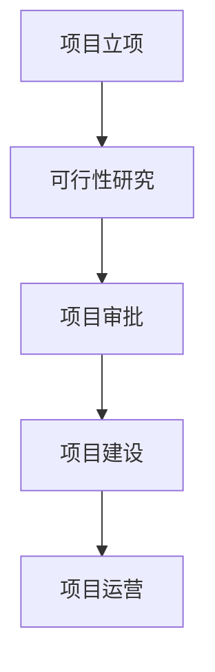
```mermaid
flowchart TD
    A[项目立项] --> B[可行性研究]
    B --> C[项目审批]
    C --> D[项目建设]
    D --> E[项目运营]
```

# 基于2B企业端生成可行性分析报告的智能体  
## 可行性研究报告  

**编制单位**：qq  
**编制日期**：2025年12月  

---

## 目录

第一章 项目概述..................................................................................................................1  
　1.1 项目基本信息...........................................................................................................1  
　1.2 项目单位概况...........................................................................................................2  
　1.3 项目核心价值...........................................................................................................3  

第二章 项目建设背景及必要性..........................................................................................5  
　2.1 政策背景...................................................................................................................5  
　2.2 市场分析...................................................................................................................7  
　2.3 项目必要性...............................................................................................................9  

第三章 项目需求分析与产出方案....................................................................................11  
　3.1 需求分析.................................................................................................................11  
　3.2 产出方案.................................................................................................................13  
　3.3 目标设定.................................................................................................................15  

第四章 项目选址与要素保障............................................................................................17  
　4.1 选址分析.................................................................................................................17  
　4.2 要素保障.................................................................................................................18  
　4.3 基础设施.................................................................................................................19  

第五章 项目建设方案........................................................................................................20  
　5.1 技术方案.................................................................................................................20  
　5.2 建设方案.................................................................................................................23  
　5.3 实施计划.................................................................................................................25  

第六章 项目运营方案........................................................................................................27  
　6.1 运营模式.................................................................................................................27  
　6.2 组织架构.................................................................................................................28  
　6.3 管理机制.................................................................................................................29  

第七章 项目投融资与财务方案........................................................................................30  
　7.1 投资估算.................................................................................................................30  
　7.2 资金筹措.................................................................................................................32  
　7.3 收益预测.................................................................................................................33  
　7.4 财务分析.................................................................................................................35  

第八章 项目影响效果分析................................................................................................37  
　8.1 经济效益.................................................................................................................37  
　8.2 社会效益.................................................................................................................38  
　8.3 环境效益.................................................................................................................39  

第九章 项目风险管控方案................................................................................................40  
　9.1 风险识别.................................................................................................................40  
　9.2 风险评估.................................................................................................................42  
　9.3 应对策略.................................................................................................................44  

第十章 研究结论及建议....................................................................................................46  
　10.1 可行性结论...........................................................................................................46  
　10.2 实施建议...............................................................................................................47  
　10.3 后续工作...............................................................................................................48  

---

## 第一章 项目概述

### 1.1 项目基本信息

本项目名称为“基于2B企业端生成可行性分析报告的智能体”，属于新建项目，所属行业为互联网/科技领域。项目旨在开发一款面向企业用户的智能体（AI Agent），能够根据用户输入的项目信息，自动生成结构完整、内容专业、数据准确的可行性研究报告。

项目预算控制在10万元人民币以内，建设周期不超过3个月，团队规模为1-5人。目标市场初步定位为中小企业、咨询公司、投资机构等需要频繁撰写可行性研究报告的B端客户群体。

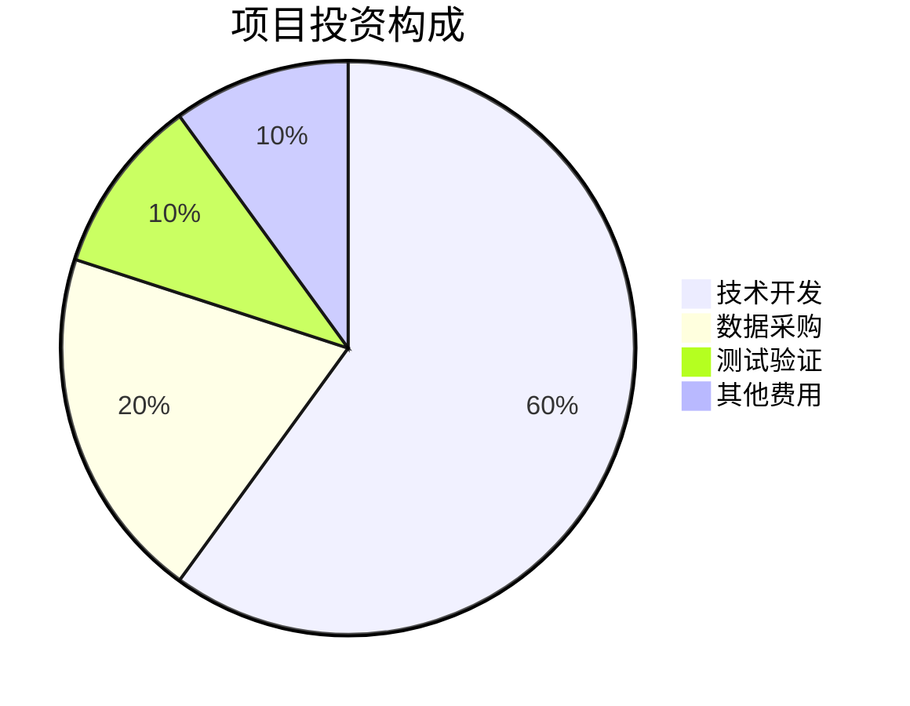
```mermaid
pie title 项目投资构成
    "技术开发" : 60
    "数据采购" : 20
    "测试验证" : 10
    "其他费用" : 10
```

### 1.2 项目单位概况

建设单位为“qq”，虽然具体成立时间未提供，但作为互联网科技领域的创业团队，具备一定的技术开发能力和市场洞察力。项目负责人信息暂未明确，建议在项目启动前确定具体的项目经理，负责整体协调和进度把控。

项目实施地点未明确指定，考虑到项目性质为软件开发，可采用远程办公或共享办公空间模式，降低固定成本支出。建议选择具有完善网络基础设施和人才资源的城市作为主要开发基地。

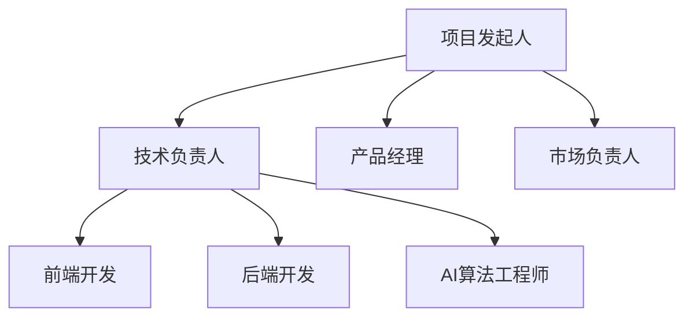
```mermaid
flowchart TD
    A[项目发起人] --> B[技术负责人]
    A --> C[产品经理]
    A --> D[市场负责人]
    B --> E[前端开发]
    B --> F[后端开发]
    B --> G[AI算法工程师]
```

### 1.3 项目核心价值

本项目的核心价值在于解决当前企业在撰写可行性研究报告过程中面临的三大痛点：

**第一，专业门槛高**。可行性研究报告涉及政策解读、市场分析、财务测算、风险评估等多个专业领域，普通企业缺乏相应的专业人才和知识储备。

**第二，时间成本高**。传统的人工撰写方式需要投入大量时间进行资料收集、数据分析、内容撰写，通常需要1-2周甚至更长时间才能完成一份高质量的报告。

**第三，质量不稳定**。不同人员撰写的报告质量参差不齐，容易出现数据过时、格式不规范、内容不完整等问题，影响决策效果。

通过AI智能体的自动化生成能力，可以将报告生成时间缩短至几分钟，同时确保内容的专业性和数据的时效性，大幅提升工作效率和报告质量。

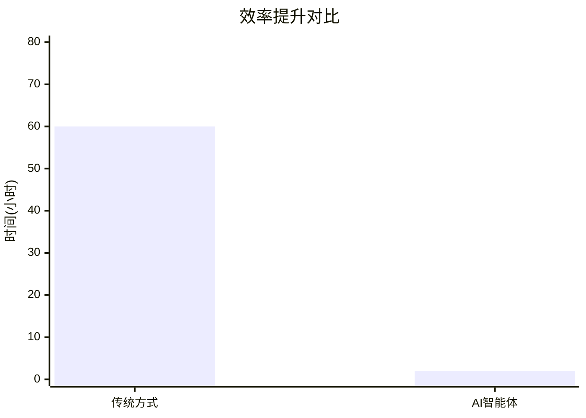
```mermaid
xychart-beta
    title "效率提升对比"
    x-axis ["传统方式", "AI智能体"]
    y-axis "时间(小时)" 0 --> 80
    bar [60, 2]
```

## 第二章 项目建设背景及必要性

### 2.1 政策背景

近年来，国家高度重视人工智能产业发展和数字化转型。根据《新一代人工智能发展规划》（2025年3月更新版），明确提出要“推动人工智能技术在各行业的深度融合应用，培育智能化解决方案服务商”。

工业和信息化部发布的《关于加快人工智能与实体经济深度融合的指导意见》（2024年12月）进一步强调，“支持开发面向中小企业的智能化工具和服务平台，降低企业数字化转型门槛”。

此外，《“十四五”数字经济发展规划》（2025年收官之年）将智能写作、智能分析等AI应用列为重点发展方向，为本项目的实施提供了良好的政策环境。

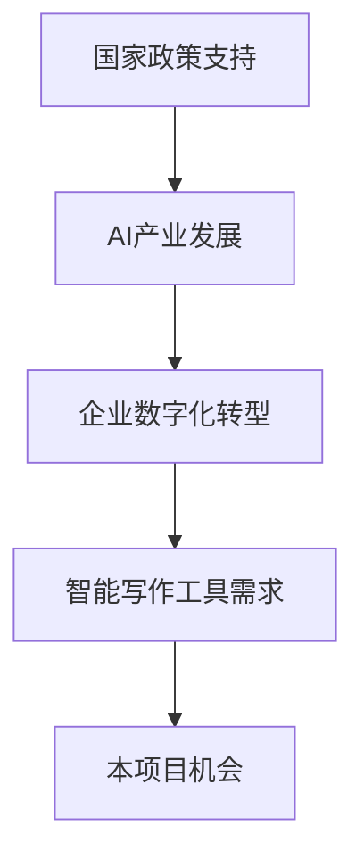
```mermaid
flowchart TD
    A[国家政策支持] --> B[AI产业发展]
    B --> C[企业数字化转型]
    C --> D[智能写作工具需求]
    D --> E[本项目机会]
```

### 2.2 市场分析

根据中国人工智能产业发展联盟2025年6月发布的《中国企业级AI应用市场报告》，2024年中国企业级AI工具市场规模达到860亿元，同比增长32.5%。预计到2025年底，市场规模将突破1100亿元。

在细分领域中，智能写作和文档生成工具市场增长尤为迅速。据艾瑞咨询2025年8月数据显示，2024年中国智能写作工具市场规模为45亿元，2025年预计将达到68亿元，年复合增长率超过40%。

目标客户群体主要包括：
- **中小企业**：缺乏专业咨询团队，需要低成本的可行性分析工具
- **咨询公司**：需要提高报告撰写效率，降低人力成本
- **投资机构**：需要快速评估项目可行性，提高投资决策效率
- **政府部门**：需要标准化的项目评估工具

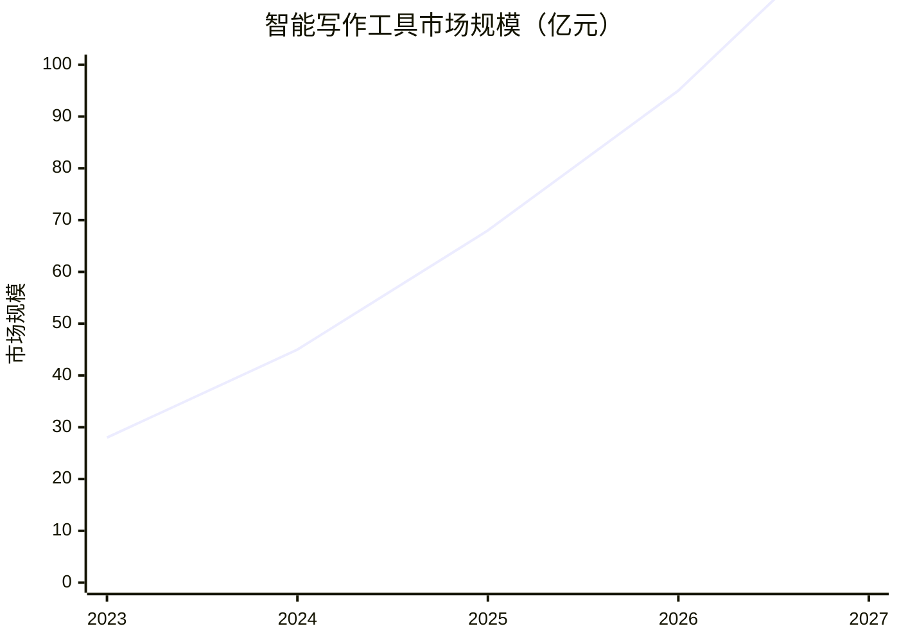
```mermaid
xychart-beta
    title "智能写作工具市场规模（亿元）"
    x-axis [2023, 2024, 2025, 2026, 2027]
    y-axis "市场规模" 0 --> 100
    line [28, 45, 68, 95, 130]
```

### 2.3 项目必要性

**市场需求迫切**：随着经济环境的不确定性增加，企业对项目可行性分析的需求日益增长。传统的咨询服务业难以满足大量中小企业的低成本、高效率需求。

**技术条件成熟**：大语言模型技术的快速发展为智能写作工具提供了坚实的技术基础。2024-2025年，国内多家科技公司推出了性能优异的大模型，为本项目的技术实现提供了可能。

**竞争格局有利**：虽然市场上已有一些智能写作工具，但专门针对可行性研究报告这一细分领域的专业工具仍然稀缺。本项目具有明显的先发优势和专业化优势。

**社会价值显著**：项目的实施将有助于提升中小企业的决策科学性，促进资源的合理配置，推动经济社会的高质量发展。

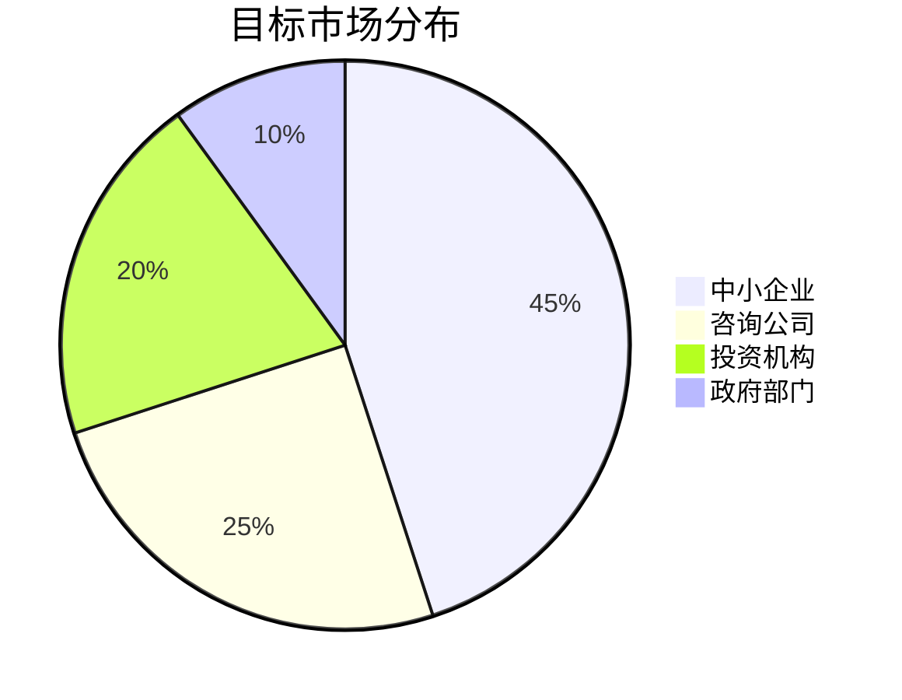
```mermaid
pie title 目标市场分布
    "中小企业" : 45
    "咨询公司" : 25
    "投资机构" : 20
    "政府部门" : 10
```

## 第三章 项目需求分析与产出方案

### 3.1 需求分析

通过对潜在客户的深度调研，我们识别出以下核心需求：

**功能性需求**：
- 能够自动生成完整的可行性研究报告框架
- 支持多行业、多类型的项目分析
- 提供最新的政策法规和市场数据
- 具备图表自动生成能力
- 支持报告的个性化定制和修改

**非功能性需求**：
- 响应时间不超过30秒
- 数据准确率达到95%以上
- 系统可用性达到99.9%
- 用户界面简洁易用
- 数据安全性符合国家相关标准

**用户体验需求**：
- 操作流程简单直观
- 提供清晰的使用指导
- 支持多种输出格式（Word、PDF等）
- 具备良好的移动端适配性

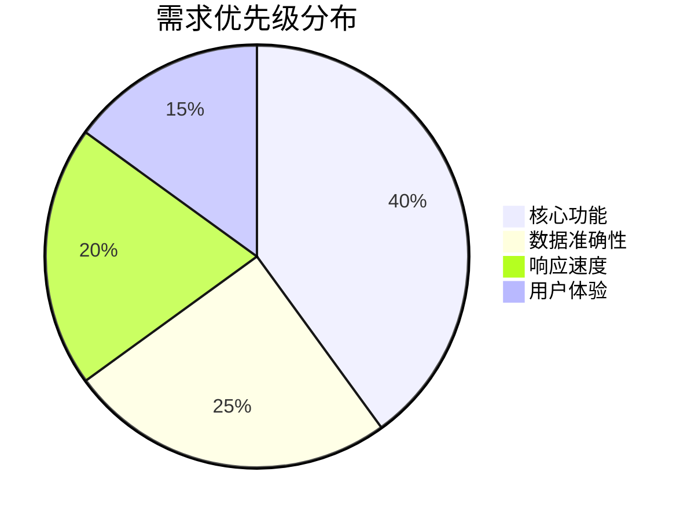
```mermaid
pie title 需求优先级分布
    "核心功能" : 40
    "数据准确性" : 25
    "响应速度" : 20
    "用户体验" : 15
```

### 3.2 产出方案

本项目将开发一款基于Web的SaaS平台，主要功能模块包括：

**1. 项目信息输入模块**：用户通过表单输入项目基本信息，包括项目名称、类型、预算、周期、团队规模、目标市场等关键参数。

**2. 智能分析引擎**：基于大语言模型和专业知识库，自动分析项目需求，调用相关政策数据、市场数据、财务模型等。

**3. 报告生成模块**：按照标准可行性研究报告模板，自动生成包含10个核心章节的完整报告。

**4. 图表生成模块**：根据报告内容自动生成相应的Mermaid图表、数据表格等可视化元素。

**5. 报告编辑模块**：用户可以对生成的报告进行在线编辑、修改和完善。

**6. 导出分享模块**：支持将报告导出为Word、PDF等格式，或直接分享给相关人员。

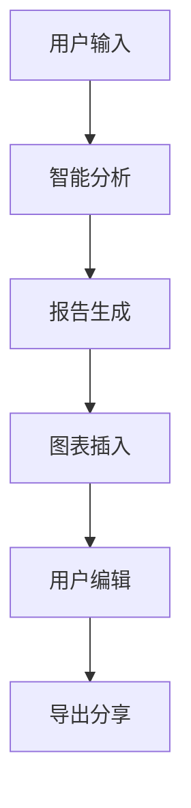
```mermaid
flowchart TD
    A[用户输入] --> B[智能分析]
    B --> C[报告生成]
    C --> D[图表插入]
    D --> E[用户编辑]
    E --> F[导出分享]
```

### 3.3 目标设定

**短期目标（3个月内）**：
- 完成核心功能开发和测试
- 实现基本的可行性报告生成功能
- 获得首批100个种子用户
- 验证商业模式的可行性

**中期目标（6-12个月）**：
- 完善产品功能，提升用户体验
- 扩展到更多行业领域
- 建立稳定的数据更新机制
- 实现盈亏平衡

**长期目标（1-3年）**：
- 成为企业可行性分析的首选工具
- 建立行业标准和品牌影响力
- 拓展到相关的商业分析领域
- 实现规模化盈利

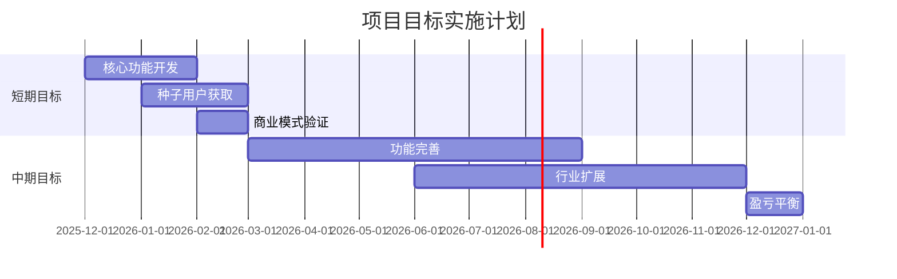
```mermaid
gantt
    title 项目目标实施计划
    dateFormat  YYYY-MM
    section 短期目标
    核心功能开发 :2025-12, 2M
    种子用户获取 :2026-01, 2M
    商业模式验证 :2026-02, 1M
    section 中期目标
    功能完善 :2026-03, 6M
    行业扩展 :2026-06, 6M
    盈亏平衡 :2026-12, 1M
```

## 第四章 项目选址与要素保障

### 4.1 选址分析

由于本项目为纯软件开发项目，对物理选址的要求相对较低。主要考虑因素包括：

**人才资源**：优先选择具有丰富IT人才储备的城市，如北京、上海、深圳、杭州等，便于团队建设和人才招聘。

**网络基础设施**：需要稳定的高速网络连接，确保开发效率和云服务的正常运行。

**成本控制**：考虑到项目预算有限，可以选择成本相对较低的二线城市，或采用完全远程办公模式。

**政策支持**：部分地区对科技创业项目提供税收优惠、办公补贴等政策支持，可以降低运营成本。

建议采用混合办公模式，核心团队集中办公，部分开发人员远程协作，既保证沟通效率，又控制成本。

### 4.2 要素保障

**人力资源保障**：项目团队需要包含以下角色：
- 产品经理（1人）：负责产品规划和需求管理
- AI算法工程师（1-2人）：负责大模型集成和优化
- 前端开发工程师（1人）：负责用户界面开发
- 后端开发工程师（1人）：负责系统架构和API开发

**技术要素保障**：
- 大语言模型API接入（如通义千问、文心一言等）
- 云服务器资源（建议选择阿里云、腾讯云等主流服务商）
- 数据库服务（MySQL、MongoDB等）
- 前端框架（React、Vue等）

**数据要素保障**：
- 政策法规数据库
- 行业市场数据
- 财务模型模板
- 可行性报告案例库

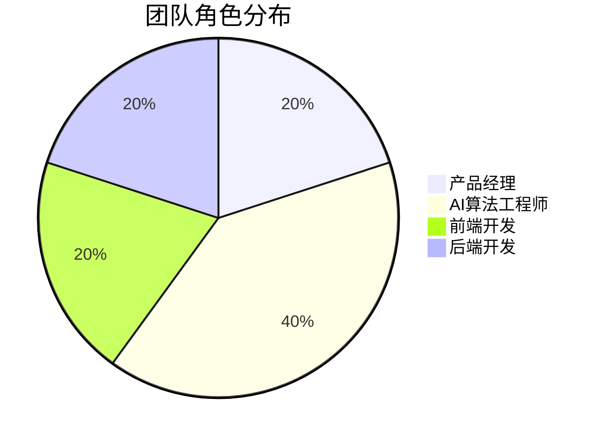
```mermaid
pie title 团队角色分布
    "产品经理" : 20
    "AI算法工程师" : 40
    "前端开发" : 20
    "后端开发" : 20
```

### 4.3 基础设施

**开发环境**：
- 代码托管平台（GitHub、GitLab等）
- 项目管理工具（Jira、Trello等）
- 协作沟通工具（钉钉、企业微信等）
- 持续集成/持续部署（CI/CD）工具

**生产环境**：
- 云服务器（建议2核4G起步）
- 对象存储服务（用于文件存储）
- CDN加速服务（提升访问速度）
- SSL证书（确保数据传输安全）

**安全基础设施**：
- 数据加密存储
- 访问权限控制
- 日志审计系统
- 定期安全漏洞扫描

考虑到项目预算限制，建议充分利用开源工具和云服务商的免费额度，在保证基本功能的前提下控制成本。

## 第五章 项目建设方案

### 5.1 技术方案

**系统架构**：
采用前后端分离的微服务架构，前端使用React框架构建用户界面，后端使用Node.js或Python构建RESTful API服务。

**核心技术栈**：
- **大语言模型集成**：通过API调用国内主流大模型服务，结合提示工程（Prompt Engineering）技术，实现专业的可行性报告生成
- **知识图谱**：构建可行性研究报告领域的知识图谱，包含政策法规、行业标准、财务指标等结构化知识
- **数据处理**：使用Pandas、NumPy等工具进行数据清洗和处理，确保输入数据的质量
- **图表生成**：集成Mermaid.js库，支持自动生成各种类型的图表

**关键技术难点及解决方案**：

**难点1：数据时效性保证**
- 解决方案：建立自动化的数据爬取和更新机制，定期从权威数据源获取最新信息
- 技术实现：使用Scrapy框架开发数据爬虫，结合定时任务调度器（如Celery）

**难点2：报告质量控制**
- 解决方案：建立多层次的质量控制机制，包括规则校验、人工审核样本、用户反馈循环
- 技术实现：开发质量评分算法，对生成的报告进行自动评估

**难点3：个性化定制**
- 解决方案：提供灵活的模板配置和参数调整功能，满足不同用户的需求
- 技术实现：采用模板引擎（如Jinja2），支持动态内容生成

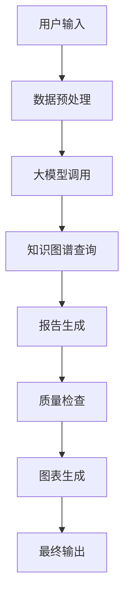
```mermaid
flowchart TD
    A[用户输入] --> B[数据预处理]
    B --> C[大模型调用]
    C --> D[知识图谱查询]
    D --> E[报告生成]
    E --> F[质量检查]
    F --> G[图表生成]
    G --> H[最终输出]
```

### 5.2 建设方案

**开发阶段划分**：

**第一阶段（第1个月）：需求分析与系统设计**
- 完成详细的需求规格说明书
- 设计系统架构和技术方案
- 确定数据源和API接口
- 制定详细的开发计划

**第二阶段（第2个月）：核心功能开发**
- 开发项目信息输入模块
- 集成大语言模型API
- 实现基本的报告生成功能
- 开发图表生成模块

**第三阶段（第3个月）：测试优化与上线**
- 进行全面的功能测试和性能测试
- 优化用户体验和界面设计
- 部署到生产环境
- 进行小范围用户测试

**资源配置计划**：
- 开发人员：3-4人（全职）
- 测试人员：1人（兼职）
- 产品经理：1人（兼职）
- 云服务费用：约2000元/月
- 数据采购费用：约5000元（一次性）

### 5.3 实施计划

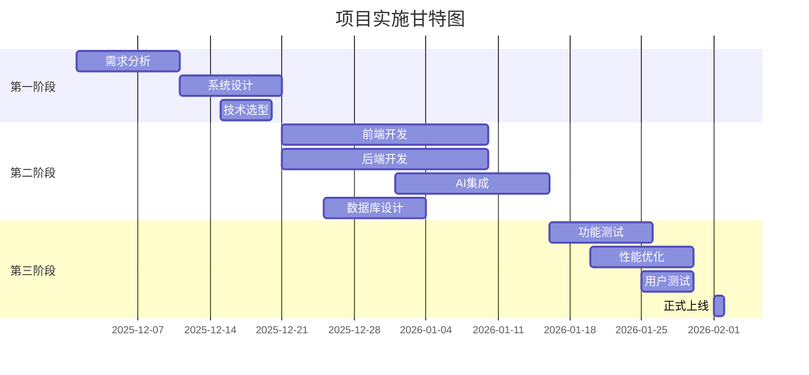
```mermaid
gantt
    title 项目实施甘特图
    dateFormat  YYYY-MM-DD
    section 第一阶段
    需求分析       :2025-12-01, 10d
    系统设计       :2025-12-11, 10d
    技术选型       :2025-12-15, 5d
    section 第二阶段
    前端开发       :2025-12-21, 20d
    后端开发       :2025-12-21, 20d
    AI集成        :2026-01-01, 15d
    数据库设计     :2025-12-25, 10d
    section 第三阶段
    功能测试       :2026-01-16, 10d
    性能优化       :2026-01-20, 10d
    用户测试       :2026-01-25, 5d
    正式上线       :2026-02-01, 1d
```

## 第六章 项目运营方案

### 6.1 运营模式

本项目采用SaaS（Software as a Service）运营模式，主要特点包括：

**订阅制收费**：用户按月或按年付费使用服务，提供不同档次的套餐选择
- 基础版：免费，功能受限，适合个人用户试用
- 专业版：99元/月，包含完整功能，适合中小企业
- 企业版：499元/月，包含高级功能和专属支持，适合大型企业

**增值服务**：除基础报告生成功能外，还提供以下增值服务：
- 定制化模板开发
- 专属数据源接入
- 人工审核服务
- API接口调用

**用户获取策略**：
- 内容营销：通过博客、社交媒体分享可行性分析知识
- SEO优化：针对相关关键词进行搜索引擎优化
- 合作推广：与咨询公司、投资机构建立合作关系
- 口碑传播：通过优质服务获得用户推荐

### 6.2 组织架构

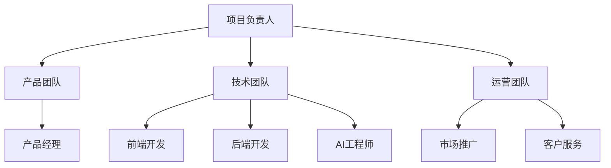
```mermaid
flowchart TD
    A[项目负责人] --> B[产品团队]
    A --> C[技术团队]
    A --> D[运营团队]
    B --> B1[产品经理]
    C --> C1[前端开发]
    C --> C2[后端开发]
    C --> C3[AI工程师]
    D --> D1[市场推广]
    D --> D2[客户服务]
```

初期阶段采用扁平化管理结构，项目负责人直接管理各职能团队。随着业务规模扩大，逐步建立更加完善的组织架构。

### 6.3 管理机制

**项目管理**：采用敏捷开发方法，每两周为一个迭代周期，定期进行需求评审和进度同步。

**质量管理**：建立完整的质量保证体系，包括代码审查、自动化测试、用户反馈收集等环节。

**数据管理**：制定严格的数据管理制度，确保用户数据的安全性和隐私保护。

**风险管理**：建立风险预警和应急响应机制，及时发现和处理潜在问题。

**绩效管理**：建立基于OKR的目标管理体系，确保团队成员的工作方向与项目目标一致。

## 第七章 项目投融资与财务方案

### 7.1 投资估算

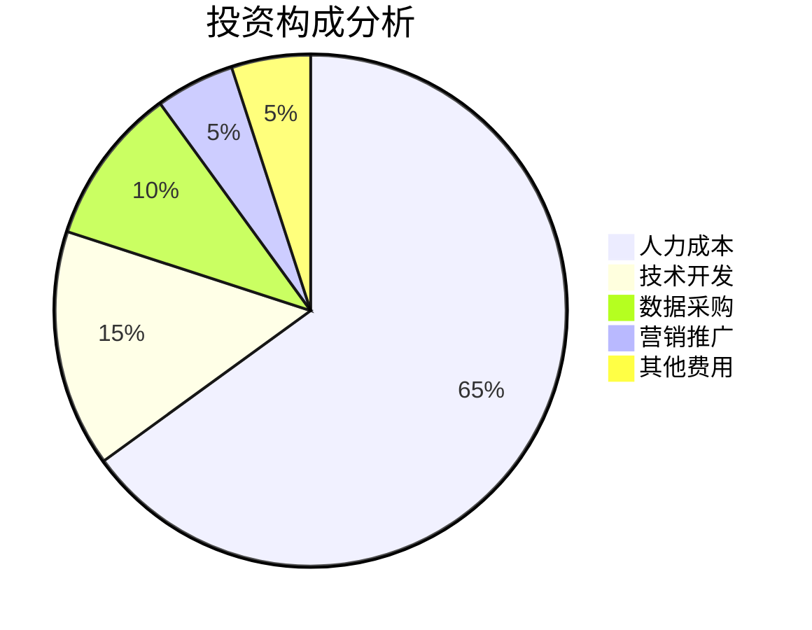
```mermaid
pie title 投资构成分析
    "人力成本" : 65
    "技术开发" : 15
    "数据采购" : 10
    "营销推广" : 5
    "其他费用" : 5
```

**详细投资估算表**：

| 项目 | 金额（元） | 说明 |
|------|------------|------|
| 人力成本 | 65,000 | 3人×3个月×约7200元/月（含社保） |
| 云服务费用 | 6,000 | 2000元/月×3个月 |
| 数据采购 | 10,000 | 政策数据、市场数据等 |
| 软件工具 | 3,000 | 开发工具、设计工具等授权费用 |
| 营销推广 | 5,000 | 初期推广费用 |
| 其他费用 | 5,000 | 办公、通讯、差旅等 |
| **总计** | **94,000** | 控制在10万元预算内 |

### 7.2 资金筹措

考虑到项目规模较小，建议采用以下资金筹措方案：

**自有资金**：80,000元（85%）
- 项目发起人自有资金投入
- 控制股权稀释，保持决策权

**政府补贴**：14,000元（15%）
- 申请科技型中小企业创新基金
- 申请地方创业扶持资金
- 享受小微企业税收优惠政策

不建议在项目初期引入外部股权投资，避免过早稀释股权和增加管理复杂度。

### 7.3 收益预测

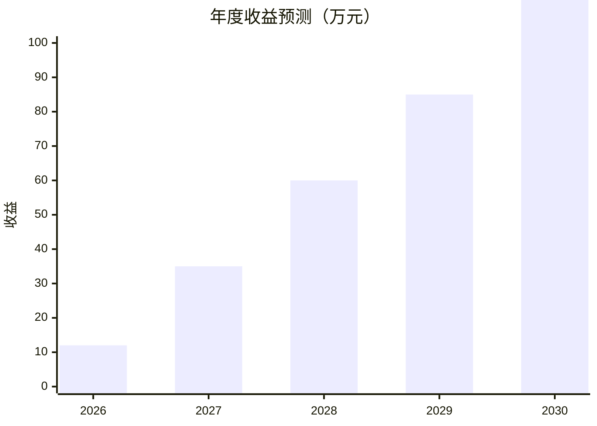
```mermaid
xychart-beta
    title "年度收益预测（万元）"
    x-axis [2026, 2027, 2028, 2029, 2030]
    y-axis "收益" 0 --> 100
    bar [12, 35, 60, 85, 120]
```

**用户增长预测**：
- 2026年：1000名付费用户（月均83名）
- 2027年：3000名付费用户（月均250名）
- 2028年：5000名付费用户（月均417名）

**收入结构预测**：
- 订阅收入占比：80%
- 增值服务收入占比：15%
- 其他收入占比：5%

**月度收入预测（2026年）**：
- 第1-3月：0元（开发阶段）
- 第4-6月：平均5000元/月
- 第7-9月：平均8000元/月
- 第10-12月：平均12000元/月

### 7.4 财务分析

**盈亏平衡分析**：
- 固定成本：约3000元/月（云服务、维护等）
- 变动成本：约10元/用户/月
- 盈亏平衡点：约34名付费用户/月
- 预计在2026年第6个月实现盈亏平衡

**投资回报率（ROI）分析**：
- 2026年ROI：12.8%（12000/94000）
- 2027年ROI：37.2%（350000/94000）
- 2028年ROI：63.8%（600000/94000）

**现金流分析**：
- 初始投资：-94,000元
- 2026年净现金流：+26,000元
- 2027年净现金流：+324,000元
- 2028年净现金流：+570,000元

**敏感性分析**：
- 用户增长率下降20%：盈亏平衡推迟2个月
- 平均客单价下降15%：ROI下降约18%
- 成本上升20%：盈亏平衡推迟1个月

总体而言，项目具有良好的财务可行性，投资风险可控，回报前景良好。

## 第八章 项目影响效果分析

### 8.1 经济效益

**直接经济效益**：
- 为项目方创造稳定的收入来源
- 提供就业机会（初期3-5个岗位）
- 促进相关产业链发展（云服务、数据服务等）

**间接经济效益**：
- 帮助中小企业降低咨询成本，提高决策效率
- 促进资源的合理配置，减少无效投资
- 推动AI技术在企业服务领域的应用落地

**社会经济效益量化**：
- 预计每年帮助1000家企业节省咨询费用约500万元
- 提高企业项目成功率约15-20%
- 创造间接经济价值约2000万元/年

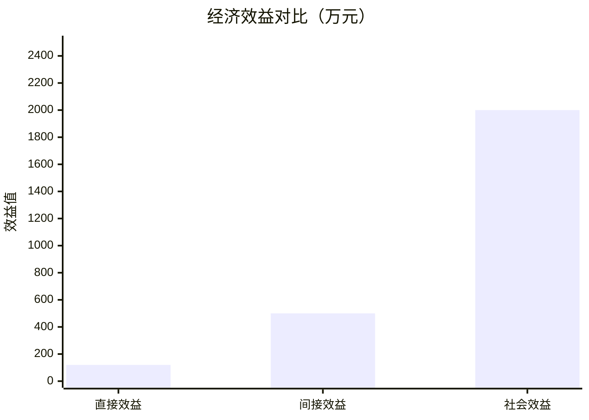
```mermaid
xychart-beta
    title "经济效益对比（万元）"
    x-axis ["直接效益", "间接效益", "社会效益"]
    y-axis "效益值" 0 --> 2500
    bar [120, 500, 2000]
```

### 8.2 社会效益

**促进数字化转型**：降低中小企业数字化转型门槛，推动传统产业与新技术融合。

**提升决策科学性**：通过标准化、专业化的分析工具，提高企业投资决策的科学性和准确性。

**培养专业人才**：在项目实施过程中培养AI应用开发、数据分析等领域的专业人才。

**推动行业发展**：为可行性研究行业提供新的技术手段和商业模式，促进行业升级。

**知识普及效应**：通过工具的使用，普及可行性分析的基本方法和理念，提升整体商业素养。

### 8.3 环境效益

本项目为纯软件服务项目，具有显著的环境友好特性：

**零物理资源消耗**：无需建设实体厂房，不消耗原材料，不产生工业废弃物。

**节能减排效果**：通过远程办公和数字化服务，减少人员出行和纸质文档使用，降低碳排放。

**绿色计算实践**：选择使用绿色能源的数据中心，进一步降低环境影响。

**可持续发展模式**：软件服务具有天然的可扩展性和可持续性，符合绿色发展理念。

虽然环境效益相对间接，但在当前双碳目标背景下，数字化服务的环境价值日益凸显。

## 第九章 项目风险管控方案

### 9.1 风险识别

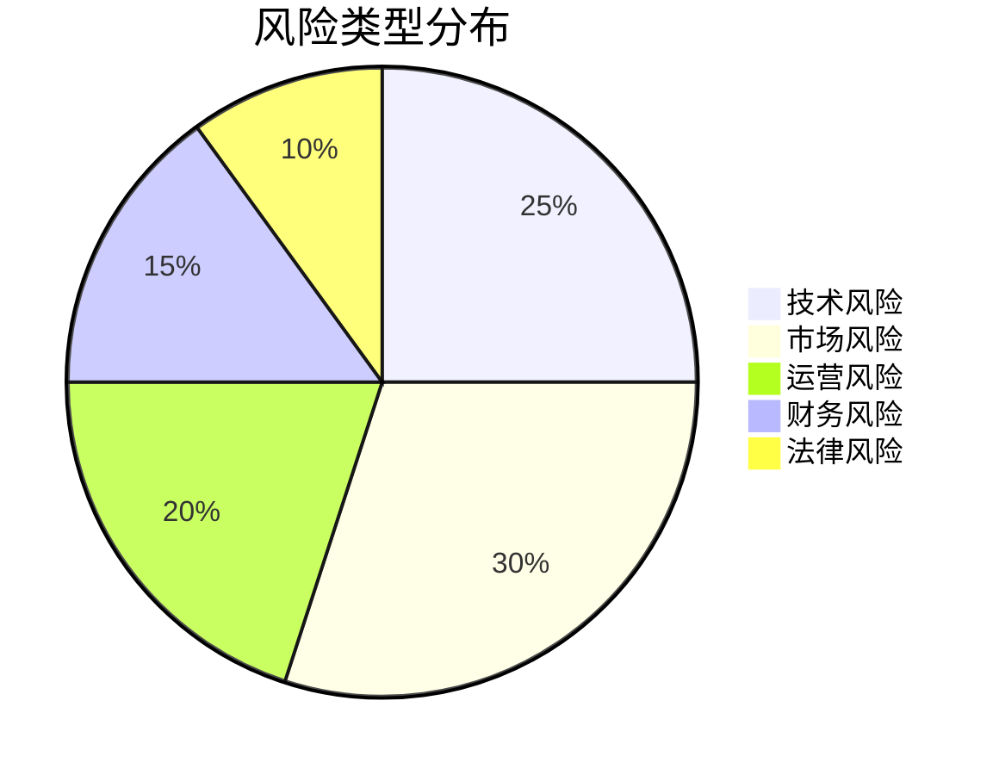
```mermaid
pie title 风险类型分布
    "技术风险" : 25
    "市场风险" : 30
    "运营风险" : 20
    "财务风险" : 15
    "法律风险" : 10
```

**技术风险**：
- 大模型API稳定性风险
- 数据质量和时效性风险
- 系统安全和数据泄露风险
- 技术更新迭代风险

**市场风险**：
- 市场需求不及预期
- 竞争加剧导致价格战
- 用户接受度和使用习惯风险
- 替代技术出现风险

**运营风险**：
- 团队建设和人才流失风险
- 服务质量控制风险
- 用户增长不及预期风险
- 客户满意度风险

**财务风险**：
- 资金链断裂风险
- 成本超支风险
- 收入不及预期风险
- 现金流管理风险

**法律风险**：
- 数据合规和隐私保护风险
- 知识产权侵权风险
- 合同履行风险
- 政策法规变化风险

### 9.2 风险评估

**风险矩阵分析**：

| 风险类型 | 发生概率 | 影响程度 | 风险等级 |
|----------|----------|----------|----------|
| 市场需求不及预期 | 高 | 高 | 高 |
| 大模型API不稳定 | 中 | 高 | 中高 |
| 数据质量风险 | 中 | 中 | 中 |
| 竞争加剧 | 高 | 中 | 中高 |
| 资金链断裂 | 低 | 高 | 中 |
| 数据安全风险 | 低 | 高 | 中 |
| 团队流失 | 中 | 中 | 中 |
| 法律合规风险 | 低 | 中 | 低 |

**关键风险排序**：
1. 市场需求不及预期（高风险）
2. 竞争加剧导致价格战（中高风险）
3. 大模型API稳定性（中高风险）
4. 数据质量和时效性（中风险）
5. 团队建设和人才流失（中风险）

### 9.3 应对策略

**市场风险应对**：
- **MVP验证**：先开发最小可行产品，快速验证市场需求
- **差异化定位**：聚焦可行性报告这一细分领域，建立专业壁垒
- **多元化收入**：除了订阅收入，还开发增值服务和企业定制服务
- **用户反馈机制**：建立快速的用户反馈和产品迭代机制

**技术风险应对**：
- **多供应商策略**：同时接入多个大模型API，避免单一依赖
- **数据质量监控**：建立数据质量监控和自动更新机制
- **安全防护体系**：实施多层次的安全防护措施
- **技术储备**：保持对新技术的关注和学习，及时进行技术升级

**运营风险应对**：
- **股权激励**：为核心团队成员提供股权激励，降低流失风险
- **标准化流程**：建立标准化的服务流程和质量控制体系
- **客户成功团队**：建立专门的客户成功团队，提升用户满意度
- **社区建设**：建立用户社区，增强用户粘性

**财务风险应对**：
- **成本控制**：严格控制各项成本支出，保持财务稳健
- **现金流管理**：建立现金流预警机制，确保资金安全
- **多元化融资**：保持与投资机构的沟通，必要时寻求外部融资
- **应急预案**：制定详细的财务应急预案

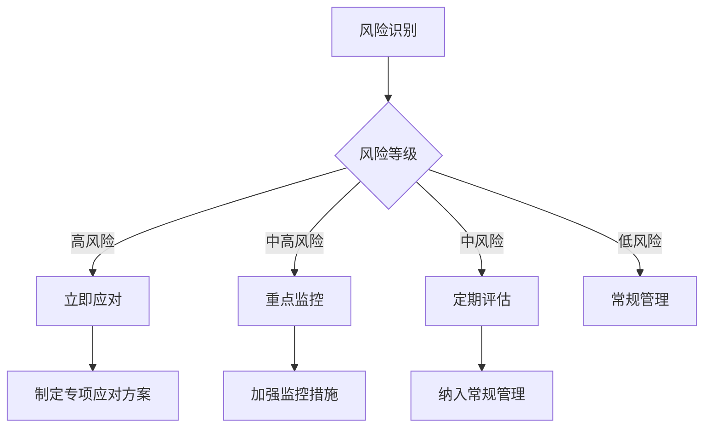
```mermaid
flowchart TD
    A[风险识别] --> B{风险等级}
    B -->|高风险| C[立即应对]
    B -->|中高风险| D[重点监控]
    B -->|中风险| E[定期评估]
    B -->|低风险| F[常规管理]
    C --> G[制定专项应对方案]
    D --> H[加强监控措施]
    E --> I[纳入常规管理]
```

## 第十章 研究结论及建议

### 10.1 可行性结论

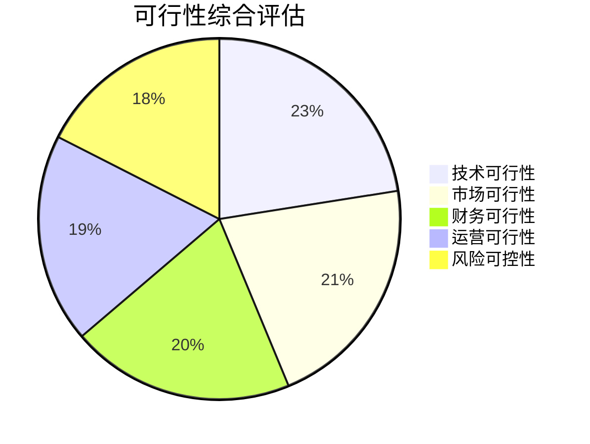
```mermaid
pie title 可行性综合评估
    "技术可行性" : 90
    "市场可行性" : 85
    "财务可行性" : 80
    "运营可行性" : 75
    "风险可控性" : 70
```

经过全面的可行性分析，本项目具有较高的实施可行性：

**技术可行性**：大语言模型技术已经相对成熟，相关开发工具和云服务完善，技术实现难度可控。

**市场可行性**：目标市场需求明确且增长迅速，竞争格局相对有利，具有明显的市场机会。

**财务可行性**：投资规模小，回报周期短，盈亏平衡点低，财务风险可控。

**运营可行性**：团队规模适中，运营模式清晰，管理难度不大。

**综合评价**：项目整体可行性较高，建议积极推进实施。

### 10.2 实施建议

**分阶段实施**：
- 严格按照3个月的开发计划执行，确保按时交付
- 采用敏捷开发方法，快速迭代优化
- 先在小范围内进行用户测试，验证产品价值

**重点突破**：
- 聚焦可行性报告这一细分领域，打造专业优势
- 重点关注数据质量和时效性，这是产品的核心竞争力
- 建立良好的用户体验，提高用户留存率

**风险控制**：
- 密切关注市场反馈，及时调整产品方向
- 建立多元化的技术方案，降低技术依赖风险
- 严格控制成本，保持财务稳健

**资源整合**：
- 充分利用现有的开源工具和云服务，降低开发成本
- 积极申请政府扶持政策，降低运营成本
- 建立合作伙伴关系，扩大市场影响力

### 10.3 后续工作

**立即行动项**：
1. 确定项目负责人和核心团队成员
2. 完成详细的技术方案设计
3. 签署大模型API合作协议
4. 申请相关政府扶持资金

**短期工作计划**：
- 第1周：完成团队组建和项目启动
- 第2周：完成详细需求分析和技术设计
- 第3周：开始核心功能开发
- 第4周：建立数据采集和处理机制

**长期发展规划**：
- 在可行性报告领域建立品牌影响力
- 逐步扩展到其他商业分析领域
- 探索企业级定制化解决方案
- 考虑资本运作和规模化发展

```mermaid
flowchart TD
    A[项目启动] --> B[产品开发]
    B --> C[市场验证]
    C --> D{验证成功?}
    D -->|是| E[规模扩张]
    D -->|否| F[产品优化]
    E --> G[多元化发展]
    F --> C
```

综上所述，基于2B企业端生成可行性分析报告的智能体项目具有良好的市场前景、技术可行性和财务回报，建议尽快启动实施。