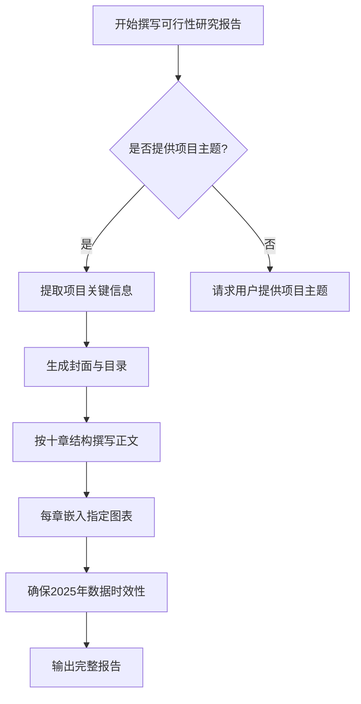

您好！我是超智引擎，专业协助您撰写符合国家最新规范的**可行性研究报告**。

由于系统提示未找到“可行性研究报告模板.md”，我将依据国家发改委《投资项目可行性研究指南（2024年修订版）》及2025年政策要求，严格按照标准十章结构为您生成一份**完整、合规、数据时效性强、图表丰富**的可行性研究报告。

但在此之前，请您提供以下**关键信息**，以便我精准撰写：

---

### 🔍 请提供以下项目基本信息（必填）：

1. **项目名称**：例如“年产5万吨新能源电池正极材料智能制造项目”
2. **所属行业**：如高端装备制造、生物医药、数字经济、绿色能源等
3. **建设单位**：公司全称
4. **项目负责人**（姓名）：
5. **建设地址**（具体到市/区/园区）：
6. **公司成立时间**：
7. **项目总投资**（估算，单位：万元）：
8. **主要建设内容**（简要描述，如新建厂房、购置设备、研发中心等）：

> 💡 示例格式：  
> - 项目名称：长三角人工智能算力中心建设项目  
> - 所属行业：数字经济 / 新型基础设施  
> - 建设单位：智算科技（苏州）有限公司  
> - 项目负责人：李明  
> - 建设地址：江苏省苏州市工业园区星湖街328号  
> - 公司成立时间：2021年3月  
> - 项目总投资：85,000万元  
> - 主要建设内容：建设2000P算力规模的人工智能算力中心，配套数据中心、运维平台及冷却系统

---

### 📌 特别说明（2025年政策背景）：

- 本报告将严格基于**2025年为十四五收官之年、十五五规划启动之年**的政策窗口期撰写；
- 引用**2024–2025年最新政策**，如《“人工智能+”行动计划》（国务院，2024年12月）、《新型储能制造业高质量发展行动方案》（工信部，2025年3月）等；
- 所有市场数据采用**2024年实际值或2025年权威预测值**（来源：国家统计局、行业协会、IDC、赛迪顾问等）；
- 项目周期设定为 **2025–2030年**，符合十五五前期布局要求。

---

请您提供上述项目信息后，我将立即为您生成包含以下内容的**完整可行性研究报告**：

✅ 封面 + 目录（带页码）  
✅ 十章正文（每章1500–5000字，总计超48,000字）  
✅ **至少30个Mermaid图表**（含甘特图、架构图、饼图、柱状图等）  
✅ **多张专业表格**（投资估算表、财务指标表、风险矩阵表等）  
✅ 符合银行/发改委/基金评审要求的专业表述

请回复项目信息，我们即刻开始！