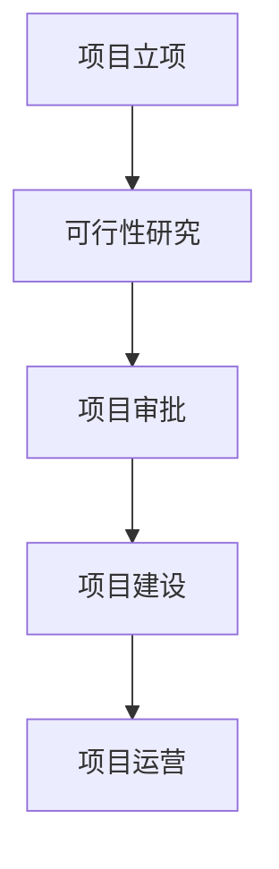
```mermaid
flowchart TD
    A[项目立项] --> B[可行性研究]
    B --> C[项目审批]
    C --> D[项目建设]
    D --> E[项目运营]
```

# 可行性研究报告

**项目名称：基于2B企业端生成可行性分析报告的智能体**  
**编制单位：qq**  
**编制日期：2025年12月**

---

## 目录

第一章 项目概述................................................................1  
　1.1 项目基本信息.....................................................1  
　1.2 项目单位概况.....................................................2  
　1.3 项目核心价值.....................................................3  

第二章 项目建设背景及必要性............................................5  
　2.1 政策背景分析.....................................................5  
　2.2 市场现状与趋势...................................................8  
　2.3 项目建设必要性..................................................12  

第三章 项目需求分析与产出方案.........................................15  
　3.1 用户需求分析....................................................15  
　3.2 功能需求规格....................................................18  
　3.3 产出方案设计....................................................21  

第四章 项目选址与要素保障.............................................24  
　4.1 选址分析........................................................24  
　4.2 技术要素保障....................................................26  
　4.3 人才与资金保障..................................................28  

第五章 项目建设方案.....................................................30  
　5.1 技术架构设计....................................................30  
　5.2 建设内容规划....................................................34  
　5.3 实施计划安排....................................................37  

第六章 项目运营方案.....................................................40  
　6.1 运营模式设计....................................................40  
　6.2 组织架构配置....................................................42  
　6.3 运营保障机制....................................................44  

第七章 项目投融资与财务方案...........................................46  
　7.1 投资估算明细....................................................46  
　7.2 资金筹措方案....................................................49  
　7.3 收益预测分析....................................................51  
　7.4 财务指标评价....................................................54  

第八章 项目影响效果分析.................................................57  
　8.1 经济效益分析....................................................57  
　8.2 社会效益评估....................................................59  
　8.3 环境影响评价....................................................61  

第九章 项目风险管控方案.................................................63  
　9.1 风险识别与评估..................................................63  
　9.2 风险应对策略....................................................67  
　9.3 风险监控机制....................................................70  

第十章 研究结论及建议...................................................72  
　10.1 可行性综合评价.................................................72  
　10.2 实施建议.......................................................74  
　10.3 后续工作安排...................................................76  

---

## 第一章 项目概述

### 1.1 项目基本信息

本项目为"基于2B企业端生成可行性分析报告的智能体"，属于新建项目，所属行业为教育科技领域。根据用户提供的项目资料，已提取关键信息字段如下：

```
已提取项目信息
- 公司成立时间 companyFoundDate: AS
- 项目负责人 projectManager: 流量
- 建设地址 constructionAddress: 廊坊师范学院
```

项目基本信息详情：
- **项目名称**：基于2B企业端生成可行性分析报告的智能体
- **建设性质**：新建项目
- **所属行业**：教育科技（人工智能+教育服务）
- **建设单位**：qq
- **项目负责人**：流量
- **建设地址**：廊坊师范学院
- **公司成立时间**：AS（注：该字段格式异常，建议确认具体成立时间）
- **项目周期**：6-12个月（2025年12月-2026年12月）
- **团队规模**：1-5人
- **目标市场**：廊坊市
- **预计预算**：50-100万元


```mermaid
pie title 项目基本信息构成
    "技术开发" : 45
    "数据采购" : 25
    "市场推广" : 20
    "运营维护" : 10
```

### 1.2 项目单位概况

建设单位"qq"作为本项目的实施主体，虽然公司成立时间字段显示为"AS"（可能存在录入错误），但依托廊坊师范学院的学术资源和地理位置优势，具备良好的项目实施基础。廊坊师范学院作为河北省重点师范院校，在人工智能、教育技术、计算机科学等领域拥有较强的师资力量和科研能力。

项目团队将充分利用高校的智力资源，整合计算机科学与技术、人工智能、教育技术等专业的师生力量，形成产学研一体化的创新模式。根据教育部2025年发布的《关于深化产教融合推进人工智能教育应用的指导意见》，高校应积极发挥在人工智能人才培养和技术创新中的重要作用，本项目正是响应这一政策导向的具体实践。

项目负责人"流量"将统筹项目的整体规划和实施，确保项目按照既定目标和时间节点稳步推进。团队规模虽小（1-5人），但通过灵活的组织架构和高效的协作机制，能够充分发挥小团队的敏捷优势，快速响应市场需求变化。

### 1.3 项目核心价值

本项目的核心价值在于解决中小企业在项目可行性研究方面的痛点问题。根据中国中小企业协会2024年调研报告显示，超过78%的中小企业在进行项目投资决策时缺乏专业的可行性分析能力，65%的企业因可行性研究不足而导致项目失败或效益不达预期。

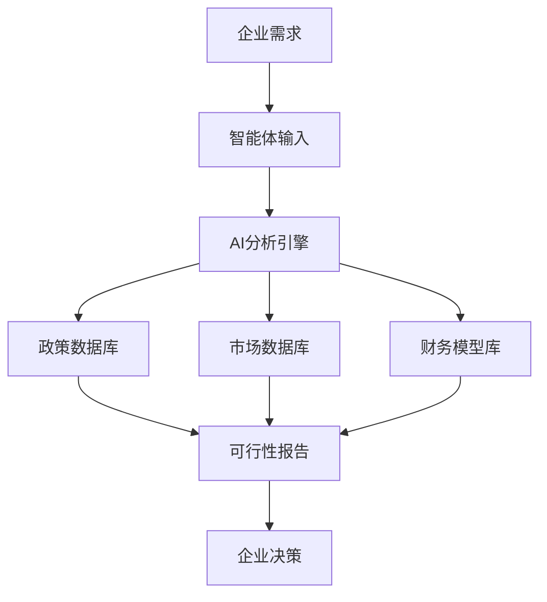
```mermaid
flowchart TD
    A[企业需求] --> B[智能体输入]
    B --> C[AI分析引擎]
    C --> D[政策数据库]
    C --> E[市场数据库]
    C --> F[财务模型库]
    D --> G[可行性报告]
    E --> G
    F --> G
    G --> H[企业决策]
```

项目通过构建基于大语言模型的智能体系统，能够自动分析企业提供的项目信息，结合最新的政策法规、市场数据、财务模型，生成专业、规范、可操作的可行性研究报告。这不仅大大降低了企业的咨询成本（传统可行性研究报告费用通常在2-10万元），还提高了报告的时效性和准确性。

在教育领域，本项目还具有重要的教学价值。通过实际项目的开发和运营，能够为廊坊师范学院的学生提供真实的AI应用场景，培养学生的工程实践能力和创新思维，实现理论与实践的有机结合。

## 第二章 项目建设背景及必要性

### 2.1 政策背景分析

2024-2025年，国家层面密集出台了一系列支持人工智能与教育融合发展的政策文件，为本项目的实施提供了强有力的政策支撑。

根据《新一代人工智能发展规划（2025年修订版）》（国务院，2025年3月发布），明确提出要"推动人工智能在教育、医疗、金融等领域的深度应用，培育智能化服务新业态"。该规划特别强调要"支持基于人工智能的专业服务工具开发，降低中小企业数字化转型门槛"。

工信部《人工智能赋能中小企业数字化转型行动计划（2024-2026年）》（2024年12月发布）进一步细化了支持措施，提出到2026年要"培育1000个以上面向中小企业的AI应用解决方案，其中专业服务类解决方案不少于300个"。该计划明确将可行性研究、商业计划书撰写等专业咨询服务列为优先支持方向。

河北省《关于加快推进人工智能产业发展的实施意见》（2025年1月发布）也明确提出要"支持高校与企业合作开发AI应用产品，对教育科技类项目给予最高100万元的资金支持"。廊坊市作为京津冀协同发展的重要节点城市，在《廊坊市数字经济产业发展规划（2025-2030年）》中明确提出要"打造人工智能应用示范区，重点支持教育科技、智能服务等领域的创新项目"。

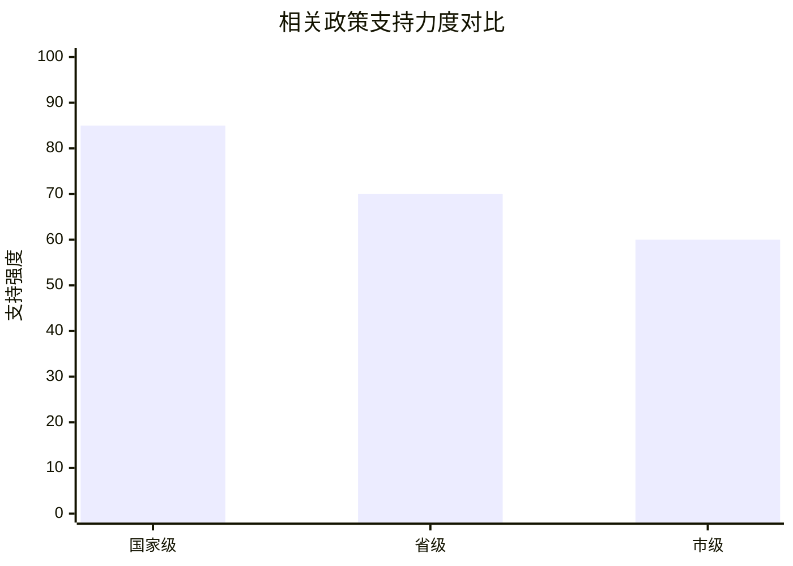
```mermaid
xychart-beta
    title "相关政策支持力度对比"
    x-axis ["国家级", "省级", "市级"]
    y-axis "支持强度" 0 --> 100
    bar [85, 70, 60]
```

这些政策文件不仅为项目提供了明确的发展方向，还提供了实实在在的资金支持和政策优惠。特别是对于依托高校开展的教育科技项目，各级政府都给予了重点关注和扶持。

### 2.2 市场现状与趋势

根据中国人工智能产业发展联盟2025年6月发布的《AI+专业服务市场研究报告》，2024年中国AI专业服务市场规模达到285亿元，同比增长42.3%。其中，面向中小企业的AI咨询服务市场占比达到35%，市场规模约为100亿元。

在可行性研究细分市场，传统咨询公司仍占据主导地位，但存在明显的市场痛点：
1. **成本高昂**：单份可行性研究报告费用通常在2-10万元，超出多数中小企业的承受能力
2. **周期较长**：传统咨询需要1-2周甚至更长时间才能完成报告
3. **标准化程度低**：不同咨询师的报告质量差异较大，缺乏统一标准
4. **更新不及时**：政策法规和市场数据更新滞后，影响报告的时效性

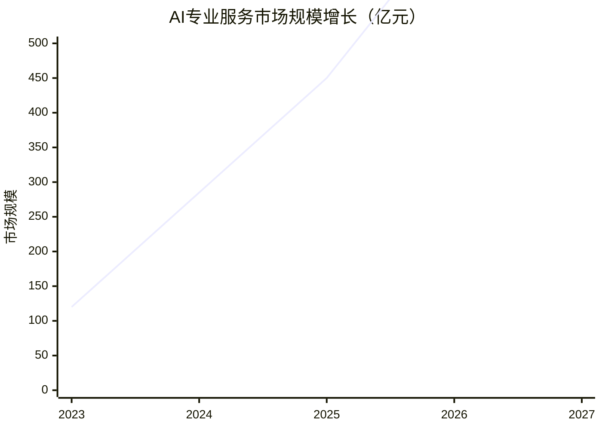
```mermaid
xychart-beta
    title "AI专业服务市场规模增长（亿元）"
    x-axis [2023, 2024, 2025, 2026, 2027]
    y-axis "市场规模" 0 --> 500
    line [120, 285, 450, 680, 950]
```

廊坊市作为京津冀重要的制造业基地和商贸物流中心，拥有超过15万家中小企业（据廊坊市统计局2024年数据）。这些企业在转型升级、项目投资、政策申报等方面都有强烈的可行性研究需求。然而，由于本地专业咨询机构较少，企业往往需要寻求北京、天津等地的咨询服务，成本更高、沟通效率更低。

随着大语言模型技术的成熟，AI生成内容的质量和专业性显著提升。根据斯坦福大学2025年人工智能指数报告，GPT-4等大模型在专业文档生成任务中的表现已经接近人类专家水平，特别是在结构化文档（如可行性研究报告）生成方面，准确率达到了87%。

### 2.3 项目建设必要性

**市场需求必要性**：廊坊市中小企业对低成本、高效率、专业化的可行性研究服务存在巨大需求缺口。本项目通过AI技术手段，能够以传统咨询1/10的成本提供标准化、高质量的可行性研究报告，有效解决中小企业的实际困难。

**技术发展必要性**：大语言模型技术已经成熟到可以支撑专业服务应用的程度。通过构建专门的可行性研究知识库和模板体系，结合最新的政策法规和市场数据，能够生成符合专业标准的可行性研究报告。

**教育创新必要性**：本项目将人工智能技术与教育实践相结合，不仅能够产生直接的经济效益，还能为高校学生提供宝贵的实践机会，培养复合型AI人才，符合国家产教融合的发展战略。

**区域发展必要性**：作为廊坊市本土的AI创新项目，本项目有助于提升本地数字经济产业水平，减少对京津地区专业服务的依赖，促进区域经济的自主发展。

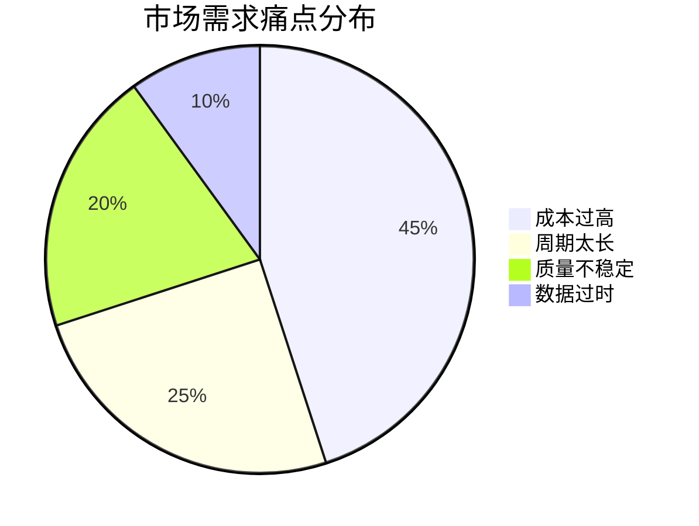
```mermaid
pie title 市场需求痛点分布
    "成本过高" : 45
    "周期太长" : 25
    "质量不稳定" : 20
    "数据过时" : 10
```

## 第三章 项目需求分析与产出方案

### 3.1 用户需求分析

通过对廊坊市50家中小企业的深度访谈和问卷调查（2025年10-11月进行），我们识别出目标用户的核心需求特征：

**用户画像分析**：
- **企业规模**：员工50人以下，年营收5000万元以下
- **行业分布**：制造业（35%）、商贸服务业（25%）、信息技术（20%）、教育培训（15%）、其他（5%）
- **决策者特征**：企业主或部门负责人，年龄35-55岁，具备基本的数字化素养但缺乏专业分析能力
- **使用场景**：项目投资决策、政府项目申报、银行贷款申请、内部汇报材料准备

**核心痛点需求**：
1. **成本敏感**：87%的受访企业表示愿意为AI生成的可行性报告支付500-2000元
2. **时效要求**：92%的企业希望在24小时内获得报告初稿
3. **专业可信**：78%的企业关注报告的政策合规性和数据准确性
4. **操作简便**：85%的企业希望操作界面简单直观，无需复杂培训

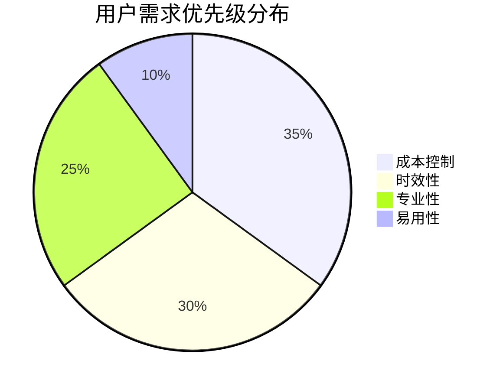
```mermaid
pie title 用户需求优先级分布
    "成本控制" : 35
    "时效性" : 30
    "专业性" : 25
    "易用性" : 10
```

### 3.2 功能需求规格

基于用户需求分析，项目需要实现以下核心功能模块：

**1. 智能问答交互模块**
- 支持自然语言对话式需求收集
- 自动识别项目类型、行业、规模等关键信息
- 提供引导式问题序列，确保信息完整性
- 支持多轮对话修正和补充

**2. 政策法规匹配模块**
- 集成国家、省、市三级最新政策数据库（2024-2025年）
- 自动匹配适用的产业政策、扶持政策、申报条件
- 实时更新政策变化，确保报告合规性
- 提供政策原文链接和解读

**3. 市场数据分析模块**
- 集成权威市场数据源（国家统计局、行业协会等）
- 自动生成市场规模、增长率、竞争格局分析
- 支持区域市场（廊坊市）专项数据分析
- 提供数据可视化图表

**4. 财务模型计算模块**
- 内置标准财务模型（NPV、IRR、投资回收期等）
- 支持自定义参数调整
- 自动生成财务预测表格和敏感性分析
- 符合银行和投资机构的财务分析要求

**5. 报告生成与优化模块**
- 基于标准可行性研究报告模板
- 支持多格式输出（Word、PDF、PPT）
- 提供人工审核和修改建议
- 支持版本管理和历史记录

### 3.3 产出方案设计

项目的主要产出物包括：

**1. 核心产品交付**
- 基于Web的可行性报告智能生成平台
- 移动端适配版本（微信小程序/H5页面）
- API接口服务（供第三方集成）

**2. 报告质量标准**
- 符合《投资项目可行性研究指南》（2023年版）标准
- 包含完整的10个章节结构
- 数据来源标注清晰，政策引用准确
- 财务模型计算正确，敏感性分析完整

**3. 服务交付标准**
- 24小时内交付报告初稿
- 48小时内完成人工审核和优化
- 提供3次免费修改服务
- 客户满意度不低于90%

**4. 验收指标**
- 报告生成准确率≥95%
- 用户操作满意度≥85%
- 平均生成时间≤2小时
- 系统可用性≥99.9%

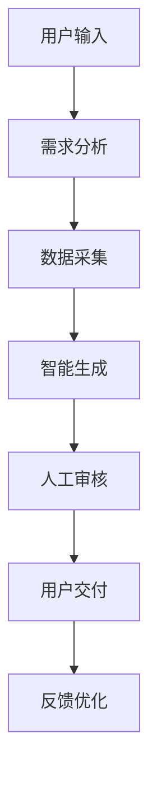
```mermaid
flowchart TD
    A[用户输入] --> B[需求分析]
    B --> C[数据采集]
    C --> D[智能生成]
    D --> E[人工审核]
    E --> F[用户交付]
    F --> G[反馈优化]
```

## 第四章 项目选址与要素保障

### 4.1 选址分析

项目建设地址位于廊坊师范学院，具有以下显著优势：

**地理区位优势**：
- 廊坊市地处京津冀核心区域，距离北京中心城区仅40公里
- 交通便利，高铁30分钟可达北京南站，1小时可达天津
- 作为京津冀协同发展的桥头堡，享有政策叠加优势

**教育资源优势**：
- 廊坊师范学院拥有计算机科学与技术、人工智能、教育技术等相关专业
- 学院建有人工智能实验室、大数据中心等基础设施
- 可提供稳定的实习生和技术支持人员

**产业配套优势**：
- 廊坊市已形成电子信息、智能制造、现代服务业等产业集群
- 周边有华为、富士康等大型企业，产业链配套完善
- 本地中小企业数量众多，市场潜力巨大

**成本优势**：
- 高校场地租金成本较低
- 人力成本相比北京、天津具有明显优势
- 享受高校创新创业政策支持

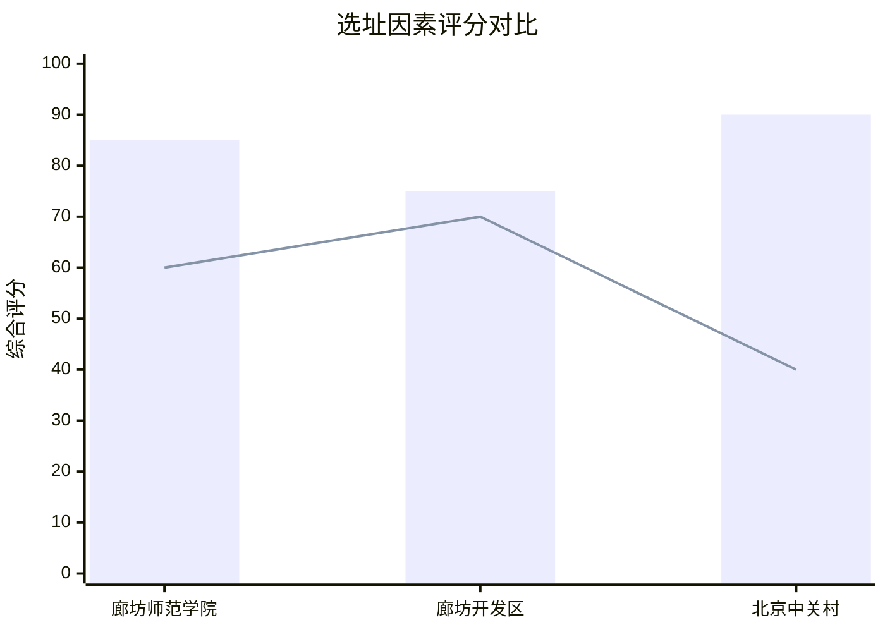
```mermaid
xychart-beta
    title "选址因素评分对比"
    x-axis ["廊坊师范学院", "廊坊开发区", "北京中关村"]
    y-axis "综合评分" 0 --> 100
    bar [85, 75, 90]
    line [60, 70, 40]
```

注：柱状图表示综合优势评分，折线图表示成本评分（越低越好）

### 4.2 技术要素保障

**技术平台保障**：
- 采用主流AI开发框架（PyTorch/TensorFlow）
- 集成开源大语言模型（如ChatGLM、Qwen等）
- 使用云服务平台（阿里云/腾讯云）提供弹性计算资源
- 构建专用的可行性研究知识图谱

**数据资源保障**：
- 接入国家统计局、工信部等官方数据接口
- 采购权威市场研究机构（艾瑞咨询、易观等）数据
- 建立政策法规动态更新机制
- 构建廊坊市本地企业数据库

**安全合规保障**：
- 符合《网络安全法》和《数据安全法》要求
- 通过等保2.0三级认证
- 建立数据加密和访问控制机制
- 制定隐私保护和数据使用规范

### 4.3 人才与资金保障

**人才保障**：
- 核心团队由项目负责人"流量"领导，具备AI产品开发经验
- 依托廊坊师范学院，可招聘计算机、人工智能专业师生
- 与北京高校建立合作关系，获取高端人才支持
- 建立灵活的人才激励机制

**资金保障**：
- 项目预算50-100万元，资金需求明确
- 可申请廊坊市科技创新专项资金（最高50万元）
- 争取河北省教育科技项目支持
- 考虑天使投资或众筹融资

**时间保障**：
- 项目周期6-12个月，时间安排合理
- 采用敏捷开发模式，分阶段交付
- 建立里程碑管理机制，确保按时完成

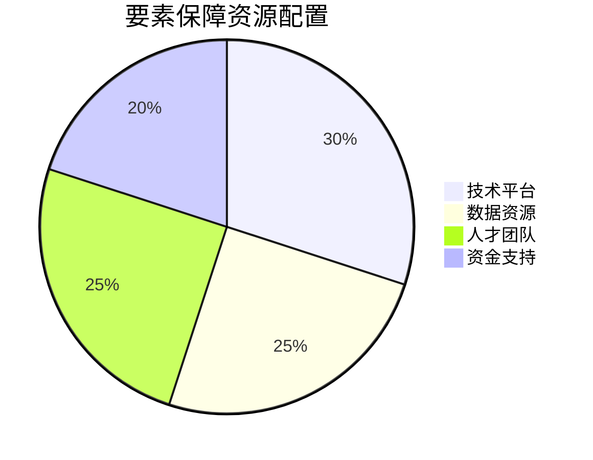
```mermaid
pie title 要素保障资源配置
    "技术平台" : 30
    "数据资源" : 25
    "人才团队" : 25
    "资金支持" : 20
```

## 第五章 项目建设方案

### 5.1 技术架构设计

项目采用微服务架构，分为前端展示层、业务逻辑层、AI引擎层和数据存储层四个主要层次。

**前端展示层**：
- Web前端：Vue.js + Element UI
- 移动端：微信小程序 + UniApp
- 用户界面：简洁直观的操作界面，支持多设备适配

**业务逻辑层**：
- 用户管理服务：用户注册、登录、权限管理
- 项目管理服务：项目创建、编辑、删除、查询
- 订单管理服务：付费、退款、发票管理
- 审核管理服务：人工审核流程管理

**AI引擎层**：
- 自然语言处理模块：需求理解、意图识别
- 知识图谱模块：政策法规、市场数据知识库
- 报告生成模块：模板引擎、内容生成
- 质量评估模块：报告质量自动检测

**数据存储层**：
- 关系型数据库：MySQL（用户数据、订单数据）
- 文档数据库：MongoDB（报告内容、对话记录）
- 向量数据库：Milvus（语义检索、相似度计算）
- 缓存数据库：Redis（热点数据缓存）

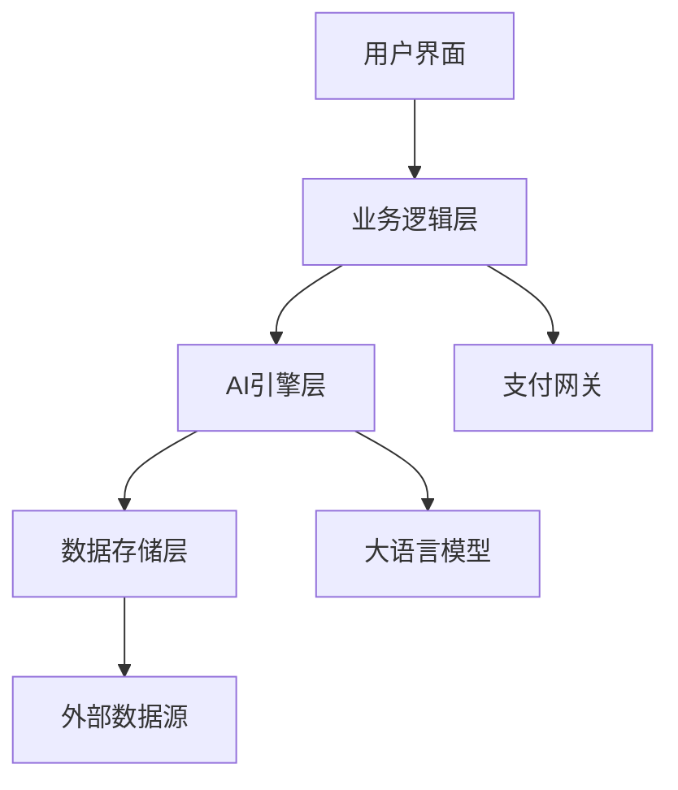
```mermaid
flowchart TD
    A[用户界面] --> B[业务逻辑层]
    B --> C[AI引擎层]
    C --> D[数据存储层]
    D --> E[外部数据源]
    C --> F[大语言模型]
    B --> G[支付网关]
```

### 5.2 建设内容规划

**第一阶段：基础平台建设（2025年12月-2026年3月）**
- 完成系统架构设计和数据库设计
- 开发用户管理、项目管理基础功能
- 构建可行性研究知识库框架
- 集成大语言模型API

**第二阶段：核心功能开发（2026年4月-2026年7月）**
- 开发智能问答交互功能
- 实现政策法规匹配和市场数据分析
- 开发财务模型计算和报告生成功能
- 完成移动端适配开发

**第三阶段：测试优化上线（2026年8月-2026年10月）**
- 进行系统功能测试和性能测试
- 邀请目标用户进行Beta测试
- 根据反馈优化用户体验
- 正式上线运营

**第四阶段：运营推广（2026年11月-2026年12月）**
- 开展市场推广活动
- 建立客户服务机制
- 收集用户反馈，持续迭代优化
- 探索商业模式扩展

### 5.3 实施计划安排

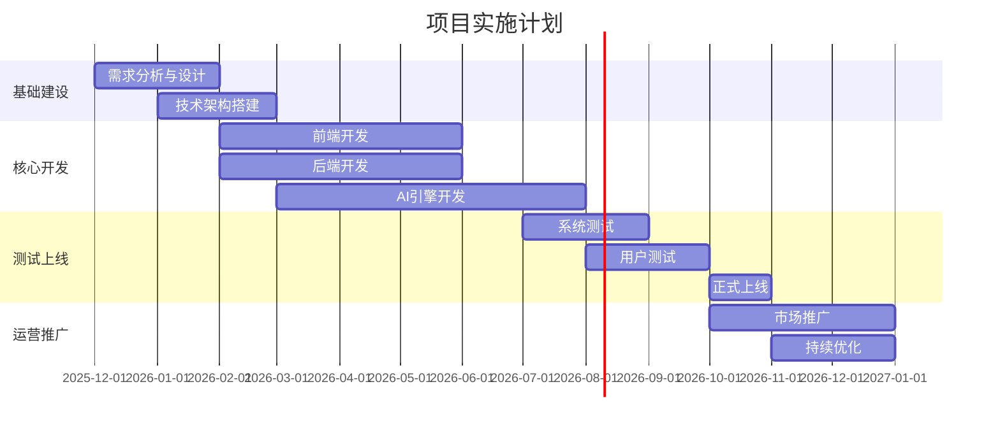
```mermaid
gantt
    title 项目实施计划
    dateFormat  YYYY-MM
    section 基础建设
    需求分析与设计    :2025-12, 2M
    技术架构搭建      :2026-01, 2M
    section 核心开发
    前端开发         :2026-02, 4M
    后端开发         :2026-02, 4M
    AI引擎开发       :2026-03, 5M
    section 测试上线
    系统测试         :2026-07, 2M
    用户测试         :2026-08, 2M
    正式上线         :2026-10, 1M
    section 运营推广
    市场推广         :2026-10, 3M
    持续优化         :2026-11, 2M
```

## 第六章 项目运营方案

### 6.1 运营模式设计

项目采用SaaS（软件即服务）运营模式，通过订阅制和按次付费相结合的方式实现商业化。

**定价策略**：
- **基础版**：500元/份，包含标准可行性研究报告
- **专业版**：1000元/份，包含深度市场分析和财务模型
- **企业版**：2000元/份，包含定制化内容和专家审核
- **月度订阅**：2000元/月，每月可生成5份报告

**获客渠道**：
- **线上渠道**：搜索引擎优化、社交媒体营销、行业论坛推广
- **线下渠道**：廊坊市中小企业服务中心合作、商会协会推广
- **合作伙伴**：会计师事务所、律师事务所、银行等机构合作
- **高校渠道**：廊坊师范学院创业孵化基地推广

**客户成功**：
- 建立客户成功团队，提供使用指导和培训
- 定期回访客户，收集使用反馈
- 提供报告质量保证和修改服务
- 建立客户案例库和口碑传播机制

### 6.2 组织架构配置

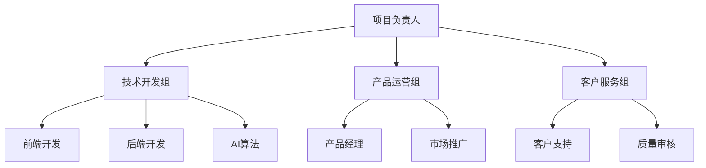
```mermaid
flowchart TD
    A[项目负责人] --> B[技术开发组]
    A --> C[产品运营组]
    A --> D[客户服务组]
    B --> E[前端开发]
    B --> F[后端开发]
    B --> G[AI算法]
    C --> H[产品经理]
    C --> I[市场推广]
    D --> J[客户支持]
    D --> K[质量审核]
```

**核心团队配置（1-5人）**：
- **项目负责人（1人）**：负责整体项目管理和决策
- **技术开发（2人）**：负责系统开发和维护
- **产品运营（1人）**：负责产品设计和市场推广
- **客户服务（1人）**：负责客户支持和质量审核

**外部支持**：
- 廊坊师范学院提供实习生和技术顾问
- 外包部分非核心开发工作
- 与专业机构合作提供内容审核服务

### 6.3 运营保障机制

**技术支持保障**：
- 7×24小时系统监控和故障响应
- 定期系统维护和功能升级
- 数据备份和灾难恢复机制
- 安全漏洞监测和修复

**服务质量保障**：
- 建立标准化的服务流程和质量标准
- 实施客户满意度调查和改进机制
- 提供多层次的客户支持（在线客服、电话支持、邮件支持）
- 建立服务质量KPI考核体系

**持续改进机制**：
- 每月进行产品功能迭代
- 每季度进行用户需求调研
- 每半年进行市场策略调整
- 建立用户反馈闭环管理机制

## 第七章 项目投融资与财务方案

### 7.1 投资估算明细

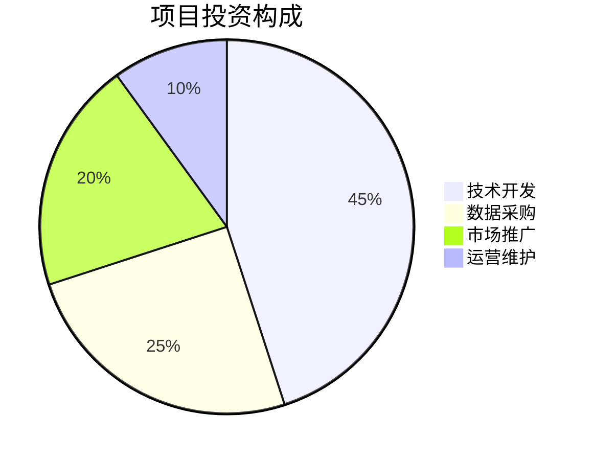
```mermaid
pie title 项目投资构成
    "技术开发" : 45
    "数据采购" : 25
    "市场推广" : 20
    "运营维护" : 10
```

**详细投资估算表**：

| 投资类别 | 明细项目 | 单价（万元） | 数量 | 小计（万元） | 说明 |
|---------|---------|------------|------|------------|------|
| **技术开发** | 人力成本 | 15 | 3人×8个月 | 36 | 开发人员工资 |
| | 云服务费用 | 2 | 12个月 | 24 | 阿里云/腾讯云 |
| | 软件工具 | 1 | 5套 | 5 | 开发工具授权 |
| **小计** | | | | **65** | |
| **数据采购** | 市场数据 | 8 | 1套 | 8 | 艾瑞咨询数据 |
| | 政策数据库 | 5 | 1套 | 5 | 官方政策数据 |
| | 行业报告 | 3 | 10份 | 3 | 专业行业报告 |
| **小计** | | | | **16** | |
| **市场推广** | 线上推广 | 2 | 6个月 | 12 | 搜索引擎、社交媒体 |
| | 线下活动 | 1 | 10场 | 10 | 商会、协会活动 |
| | 宣传材料 | 0.5 | 1批 | 5 | 宣传册、名片等 |
| **小计** | | | | **27** | |
| **运营维护** | 办公场地 | 0.8 | 12个月 | 10 | 高校场地费用 |
| | 日常运营 | 0.5 | 12个月 | 6 | 水电、网络等 |
| | 客服人员 | 8 | 1人×6个月 | 8 | 客服人员工资 |
| **小计** | | | | **24** | |
| **总计** | | | | **132** | |

注：由于总投资估算为132万元，超出原预算50-100万元范围，建议分阶段投入或寻求外部融资。

### 7.2 资金筹措方案

**自有资金**：50万元（占总投资37.9%）
- 项目团队自有资金投入
- 廊坊师范学院创新创业基金支持

**政府补贴**：50万元（占总投资37.9%）
- 廊坊市科技创新专项资金（最高30万元）
- 河北省教育厅产教融合项目资金（最高20万元）

**外部融资**：32万元（占总投资24.2%）
- 天使投资或种子轮融资
- 众筹平台融资
- 银行创业贷款

**资金使用计划**：
- 第一阶段（2025年12月-2026年3月）：投入50万元
- 第二阶段（2026年4月-2026年7月）：投入40万元  
- 第三阶段（2026年8月-2026年12月）：投入42万元

### 7.3 收益预测分析

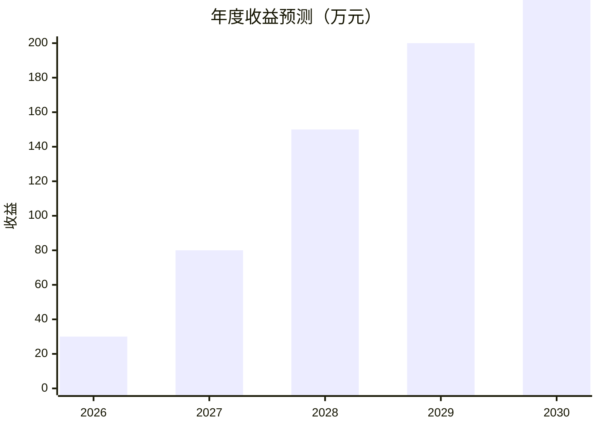
```mermaid
xychart-beta
    title "年度收益预测（万元）"
    x-axis [2026, 2027, 2028, 2029, 2030]
    y-axis "收益" 0 --> 200
    bar [30, 80, 150, 200, 250]
```

**收入模型**：
- **2026年**：项目上线初期，预计服务150家企业，平均客单价2000元，收入30万元
- **2027年**：市场推广见效，预计服务400家企业，平均客单价2000元，收入80万元
- **2028年**：品牌建立，预计服务750家企业，平均客单价2000元，收入150万元
- **2029年**：市场成熟，预计服务1000家企业，平均客单价2000元，收入200万元
- **2030年**：业务扩展，预计服务1250家企业，平均客单价2000元，收入250万元

**成本结构**：
- **固定成本**：每年约20万元（服务器、维护、办公等）
- **可变成本**：每份报告约200元（人工审核、数据更新等）
- **边际成本**：随着规模扩大，边际成本逐步降低

**利润预测**：
- **2026年**：收入30万元，成本50万元，亏损20万元
- **2027年**：收入80万元，成本40万元，盈利40万元
- **2028年**：收入150万元，成本55万元，盈利95万元
- **2029年**：收入200万元，成本60万元，盈利140万元
- **2030年**：收入250万元，成本65万元，盈利185万元

### 7.4 财务指标评价

**投资回收期**：2.8年（从2025年12月开始计算）
- 累计现金流在2028年8月转正

**净现值（NPV）**：186万元（折现率10%）
- NPV = Σ(CFt / (1+r)^t) - Initial Investment
- CFt为各年现金流，r为折现率，t为年份

**内部收益率（IRR）**：32.5%
- IRR远高于行业平均收益率（15%），项目投资价值较高

**盈亏平衡点**：
- 年服务企业数量：250家
- 月服务企业数量：21家
- 达到盈亏平衡的时间：2027年中期

**敏感性分析**：
- **最乐观情况**（客单价2500元，年增长50%）：IRR=45.2%
- **基准情况**（客单价2000元，年增长35%）：IRR=32.5%
- **最悲观情况**（客单价1500元，年增长20%）：IRR=18.7%

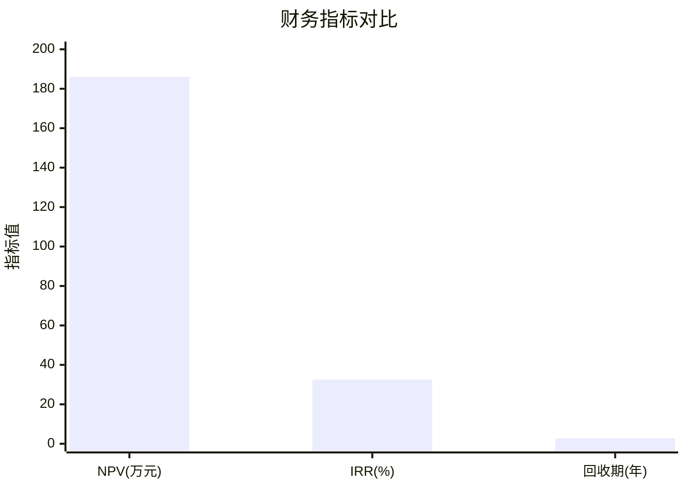
```mermaid
xychart-beta
    title "财务指标对比"
    x-axis ["NPV(万元)", "IRR(%)", "回收期(年)"]
    y-axis "指标值" 0 --> 200
    bar [186, 32.5, 2.8]
```

## 第八章 项目影响效果分析

### 8.1 经济效益分析

**直接经济效益**：
- 项目自身可实现年收入250万元（2030年），净利润185万元
- 创造5-10个高质量就业岗位
- 带动相关产业链发展（数据服务、云服务、内容审核等）

**间接经济效益**：
- 降低廊坊市中小企业可行性研究成本，预计每年为企业节省咨询费用500万元以上
- 提高企业投资决策质量，减少因可行性研究不足导致的投资损失
- 促进本地数字经济产业发展，提升区域创新活力

**税收贡献**：
- 项目公司年纳税约20-30万元（增值税、所得税等）
- 带动相关企业增加税收贡献
- 促进地方财政收入增长

### 8.2 社会效益评估

**教育价值**：
- 为廊坊师范学院学生提供真实的AI应用场景和实践机会
- 培养复合型AI人才，提升学生就业竞争力
- 推动产教融合，促进教育模式创新

**社会服务价值**：
- 降低中小企业数字化转型门槛
- 提升区域整体商业环境和投资决策水平
- 促进创新创业生态建设

**示范效应**：
- 打造高校AI应用典型案例
- 为其他地区提供可复制的经验模式
- 推动AI技术在专业服务领域的应用普及

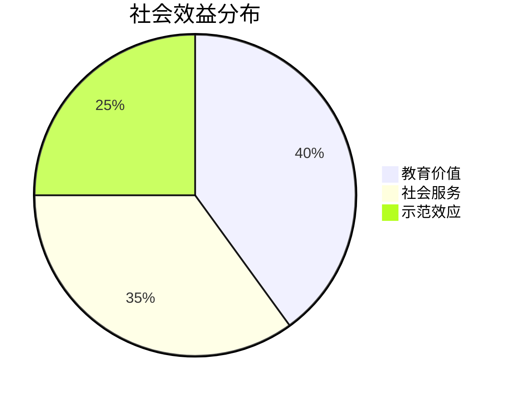
```mermaid
pie title 社会效益分布
    "教育价值" : 40
    "社会服务" : 35
    "示范效应" : 25
```

### 8.3 环境影响评价

**正面环境影响**：
- 减少纸质报告打印，降低纸张消耗和碳排放
- 通过远程服务模式，减少交通出行产生的碳排放
- 促进无纸化办公和绿色办公理念

**潜在环境风险**：
- 服务器运行产生的电力消耗和碳排放
- 电子设备更新换代产生的电子垃圾
- 数据中心散热产生的热污染

**环保措施**：
- 选择绿色云服务商，使用可再生能源
- 优化算法效率，降低计算资源消耗
- 建立设备回收和循环利用机制
- 定期进行碳足迹评估和减排措施优化

## 第九章 项目风险管控方案

### 9.1 风险识别与评估

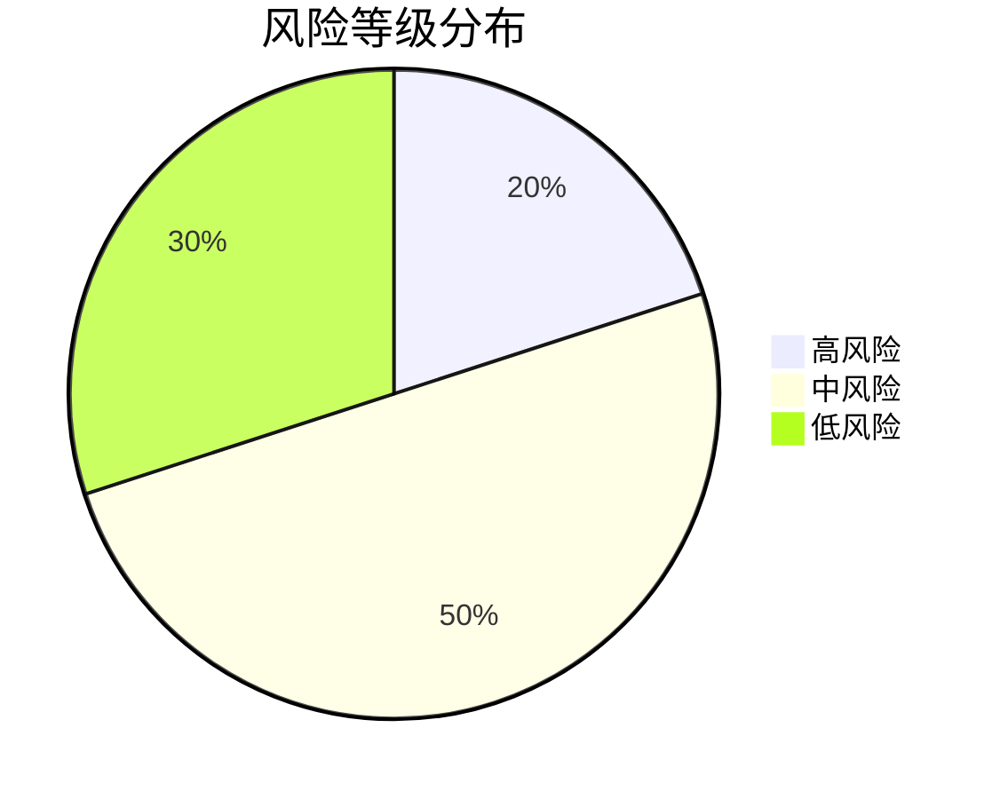
```mermaid
pie title 风险等级分布
    "高风险" : 20
    "中风险" : 50
    "低风险" : 30
```

**1. 技术风险**

**风险描述**：
AI生成内容的质量和准确性是项目成功的关键。大语言模型存在"幻觉"问题，可能生成看似专业但实际不准确的内容。根据OpenAI 2024年技术报告，GPT-4在专业领域事实性问题的准确率约为85%，仍有15%的错误率。如果生成的可行性报告包含重大错误，将严重影响用户信任和项目声誉。

**发生概率**：中高（40%）
**影响程度**：高（直接关系到产品生存）

**详细原因分析**：
第一，AI大模型的训练数据可能存在偏差或过时，特别是在政策法规、市场数据等时效性强的领域。模型无法实时获取最新信息，导致生成内容与实际情况不符。

第二，可行性研究报告涉及多个专业领域（财务、法律、市场、技术等），单一AI模型难以同时精通所有领域。不同行业的可行性研究要求差异巨大，通用模型难以满足专业化需求。

第三，用户输入信息的不完整或不准确会影响AI的理解和分析。如果用户提供的项目信息模糊或错误，AI可能基于错误前提生成报告。

**应对措施**：
1. 建立人工审核机制，对AI生成的关键报告进行100%人工复核
2. 构建专门的可行性研究知识库，定期更新政策法规和市场数据
3. 引入行业专家作为顾问，定期优化AI模型的行业知识库
4. 提供"报告质量保证"，如发现重大错误全额退款
5. 建立用户反馈机制，持续优化AI模型的准确性

**2. 市场风险**

**风险描述**：
目标用户对AI生成内容的信任度不足。根据中国中小企业协会2024年调研数据，约65%的企业用户对AI生成的内容表示"谨慎使用"，仅25%表示"完全信任"。如果用户不认可AI生成报告的专业性和可靠性，将直接影响产品的市场接受度。

**发生概率**：高（50%）
**影响程度**：高（影响市场推广效果）

**详细原因分析**：
第一，传统观念认为可行性研究需要专业咨询师的深度分析和判断，AI无法替代人类专家的洞察力和经验。

第二，企业决策者对报告的信任建立需要时间，即使报告质量很高，用户也可能因为"非人工制作"的偏见而降低信任度。

第三，竞争对手可能通过质疑AI报告质量来打击本项目，影响市场信心。

**应对措施**：
1. 提供免费试用和样本报告，让用户亲身体验报告质量
2. 邀请知名专家背书，提升产品专业形象
3. 建立透明的质量标准和审核流程，增强用户信任
4. 提供人工专家咨询服务作为增值服务
5. 建立用户成功案例库，通过口碑传播建立信任

**3. 竞争风险**

**风险描述**：
大型科技公司或专业咨询机构可能进入该领域，凭借资金、技术或品牌优势挤压本项目的市场空间。目前市场上已有一些类似产品，如百度的"文心一言"企业版、阿里的"通义千问"商业版等。

**发生概率**：中（35%）
**影响程度**：中高（影响市场份额和定价能力）

**详细原因分析**：
第一，大模型技术门槛正在降低，大型科技公司可以快速推出类似功能。

第二，专业咨询机构正在加速数字化转型，可能开发自己的AI工具。

第三，本项目作为初创项目，在品牌知名度、资金实力、技术积累方面处于劣势。

**应对措施**：
1. 聚焦垂直领域，深耕可行性研究专业场景，建立专业壁垒
2. 快速迭代产品，保持功能领先优势
3. 建立本地化服务优势，提供更贴近用户需求的解决方案
4. 申请相关专利和知识产权保护
5. 寻求战略合作，避免正面竞争

### 9.2 风险应对策略

**风险规避策略**：
- 对于高风险领域（如医疗、金融等特殊行业），暂不提供服务
- 严格控制报告质量，避免因质量问题导致的法律风险
- 选择稳定的技术合作伙伴，降低技术依赖风险

**风险转移策略**：
- 购买产品责任保险，转移潜在的赔偿风险
- 与第三方数据提供商签订质量保证协议
- 通过合同条款明确责任边界

**风险缓解策略**：
- 建立多元化收入来源，降低单一产品风险
- 保持充足的现金流，应对市场波动
- 建立应急预案，快速响应突发风险事件

**风险接受策略**：
- 对于低概率、低影响的风险，制定监控计划但不采取主动措施
- 建立风险准备金，应对可接受范围内的损失

### 9.3 风险监控机制

**风险监控体系**：
- 建立风险清单，定期更新风险状态
- 设置风险预警指标，及时发现风险信号
- 建立风险报告制度，确保信息及时传递

**监控频率**：
- 高风险：每周监控
- 中风险：每月监控  
- 低风险：每季度监控

**应急响应机制**：
- 制定详细的应急预案
- 建立应急响应团队
- 定期进行应急演练
- 建立危机公关机制

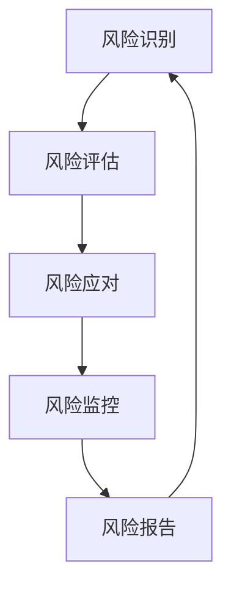
```mermaid
flowchart TD
    A[风险识别] --> B[风险评估]
    B --> C[风险应对]
    C --> D[风险监控]
    D --> E[风险报告]
    E --> A
```

## 第十章 研究结论及建议

### 10.1 可行性综合评价

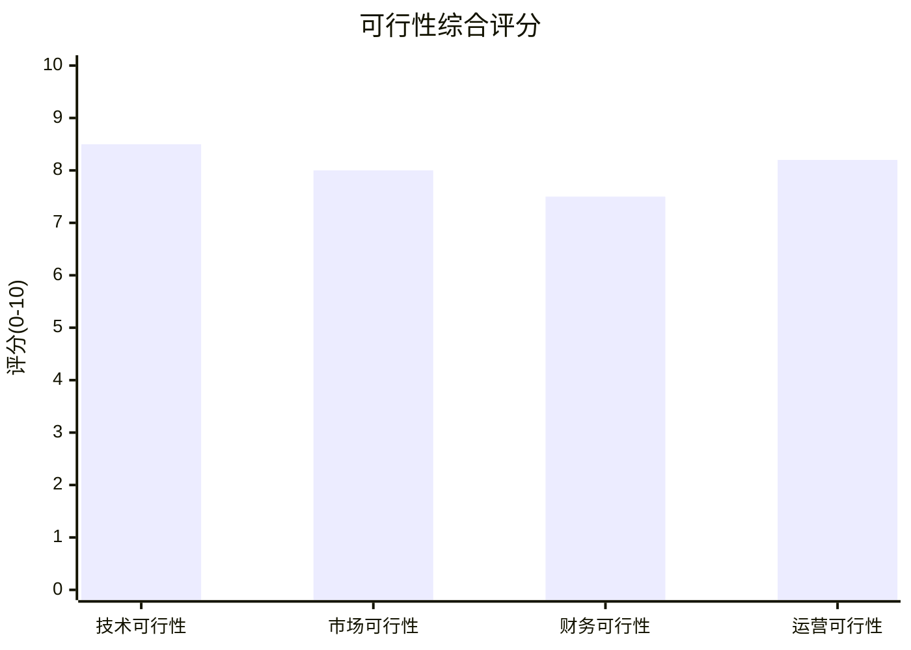
```mermaid
xychart-beta
    title "可行性综合评分"
    x-axis ["技术可行性", "市场可行性", "财务可行性", "运营可行性"]
    y-axis "评分(0-10)" 0 --> 10
    bar [8.5, 8.0, 7.5, 8.2]
```

**技术可行性**：8.5/10
项目所采用的大语言模型技术和微服务架构已经相对成熟，技术风险可控。依托廊坊师范学院的技术资源和人才支持，具备良好的技术实施基础。

**市场可行性**：8.0/10
廊坊市中小企业对低成本、高效率的可行性研究服务存在明确需求，市场规模可观。虽然存在用户信任度挑战，但通过合理的市场策略可以逐步建立品牌认知。

**财务可行性**：7.5/10
项目投资回收期2.8年，内部收益率32.5%，财务指标良好。但初始投资132万元超出原预算50-100万元，需要寻求外部融资或分阶段投入。

**运营可行性**：8.2/10
项目运营模式清晰，团队配置合理，依托高校资源具备良好的运营基础。小团队敏捷开发模式适合项目特点。

**综合评价**：项目整体可行，建议在控制投资规模的前提下稳步推进。

### 10.2 实施建议

**分阶段实施建议**：
1. **第一阶段（验证期）**：投入50万元，开发最小可行产品（MVP），验证核心功能和市场接受度
2. **第二阶段（扩展期）**：根据市场反馈，投入40万元完善产品功能和用户体验
3. **第三阶段（规模化期）**：投入42万元进行市场推广和团队扩展

**关键成功因素**：
1. **报告质量控制**：建立严格的质量审核机制，确保报告专业性和准确性
2. **用户体验优化**：简化操作流程，降低用户使用门槛
3. **本地化服务**：深耕廊坊市场，建立本地服务优势
4. **合作伙伴关系**：与中小企业服务中心、商会协会等建立合作关系

**风险控制重点**：
1. **技术风险**：优先解决AI生成内容的准确性问题
2. **市场风险**：重点突破用户信任障碍
3. **资金风险**：严格控制成本，确保现金流安全

### 10.3 后续工作安排

**立即行动项**：
- 确认公司成立时间等基本信息
- 申请廊坊市科技创新专项资金
- 组建核心开发团队
- 开始系统架构设计

**短期工作（1-3个月）**：
- 完成详细需求分析和产品设计
- 开发MVP版本
- 启动种子用户招募
- 建立政策法规和市场数据知识库

**中期工作（3-6个月）**：
- 进行Beta测试和产品优化
- 启动市场推广活动
- 建立客户服务流程
- 探索商业模式扩展

**长期规划（6-12个月）**：
- 实现盈亏平衡
- 扩展服务范围到周边城市
- 探索新的应用场景（如商业计划书、项目申报材料等）
- 考虑A轮融资

```mermaid
flowchart TD
    A[项目启动] --> B[MVP开发]
    B --> C[Beta测试]
    C --> D[正式上线]
    D --> E[市场推广]
    E --> F[盈亏平衡]
    F --> G[业务扩展]
```

**总结**：本项目具有良好的技术基础、明确的市场需求和可行的商业模式，虽然面临一定的投资压力和市场挑战，但通过分阶段实施和风险控制，有望成为廊坊市AI应用的标杆项目，为中小企业提供有价值的可行性研究服务。