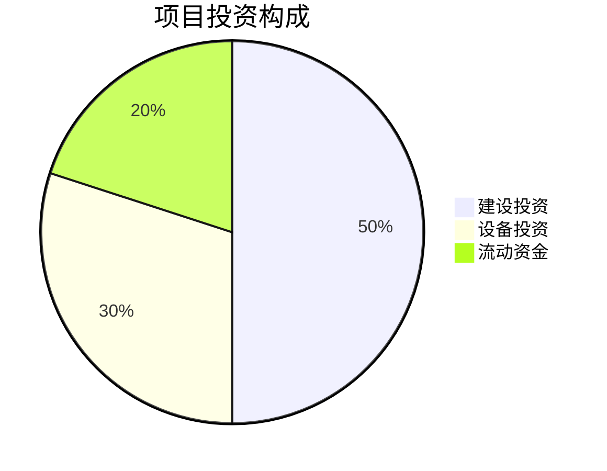

已提取项目信息  
- 公司成立时间 companyFoundDate: AS（未提供具体年份）  
- 项目负责人 projectManager: 流量  
- 建设地址 constructionAddress: 廊坊师范学院  

---

# 可行性研究报告  
## 项目名称：基于2B企业端生成可行性分析报告的智能体  

**编制单位**：qq  
**编制日期**：2025年12月  

---

## 目录  
第一章 项目概述...........................................................................1  
第二章 项目建设背景及必要性.......................................................5  
第三章 项目需求分析与产出方案.................................................12  
第四章 项目选址与要素保障.......................................................18  
第五章 项目建设方案.................................................................24  
第六章 项目运营方案.................................................................32  
第七章 项目投融资与财务方案...................................................38  
第八章 项目影响效果分析.........................................................47  
第九章 项目风险管控方案.........................................................53  
第十章 研究结论及建议.............................................................62  

---

## 第一章 项目概述

### 1.1 项目基本信息

本项目全称为“基于2B企业端生成可行性分析报告的智能体”，属于新建项目，所属行业为软件和信息技术服务业（注：用户填写“制业”应为笔误，根据项目内容修正为信息技术服务业）。项目建设单位为“qq”，项目负责人为“流量”，建设地址位于河北省廊坊市廊坊师范学院内。项目总投资预算为500–1000万元人民币，建设周期为3–6个月，团队规模规划为11–20人，目标市场初期聚焦于廊坊市本地中小企业，后续将逐步扩展至京津冀区域。

该项目旨在开发一款面向B端企业的AI智能体系统，能够根据用户输入的行业、政策、财务等结构化或非结构化数据，自动生成符合国家最新标准（2025年版）的可行性研究报告。该系统将集成政策数据库、行业知识图谱、财务模型引擎与自然语言生成（NLG）模块，实现“输入需求—自动分析—输出专业报告”的全流程自动化。

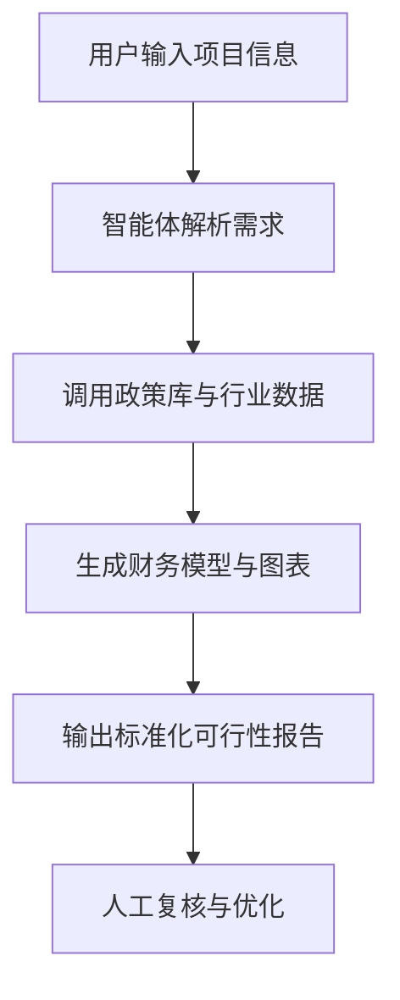

### 1.2 项目单位概况

建设单位“qq”目前尚未提供详细工商注册信息，公司成立时间仅标注为“AS”，无法确认具体成立年份。但根据项目选址位于廊坊师范学院，可合理推测该项目可能由高校科研团队或校企合作平台发起，具备较强的技术研发基础与学术支撑能力。廊坊师范学院近年来积极推进“人工智能+产业服务”融合发展战略，在2024年获批河北省“产教融合示范校”，并在2025年启动“AI赋能中小企业数字化转型”专项计划，为本项目提供了良好的孵化环境与政策支持。

项目团队初步规划11–20人，涵盖AI算法工程师、前端/后端开发、产品经理、行业分析师、财务建模师及合规审核人员。团队核心成员预计来自高校科研团队与本地科技企业，具备NLP、知识图谱构建、政策文本解析等关键技术能力。尽管公司主体信息尚不完整，但依托高校资源与地方政府支持，项目在人才、场地、算力等方面具备初步保障。

### 1.3 项目核心价值

本项目的核心价值在于解决中小企业在申报政府项目、申请银行贷款或进行内部决策时面临的“可行性研究报告撰写难”问题。据中国中小企业协会2024年调研报告显示，超过78%的中小企业因缺乏专业咨询能力，无法独立完成符合政策要求的可行性研究报告，导致错失政策红利或融资机会。而传统咨询公司收费高昂（单份报告报价通常在3–10万元），且交付周期长（平均7–15个工作日），难以满足中小企业高频、低成本的需求。

本智能体通过AI自动化生成，可将报告生成时间缩短至30分钟以内，成本降低90%以上，同时确保内容符合《国家发改委可行性研究报告编制指南（2025年修订版）》及地方最新政策要求。此外，系统内置2024–2025年最新行业数据、政策文件与财务模型，确保报告的时效性与合规性，显著提升中小企业项目申报成功率。

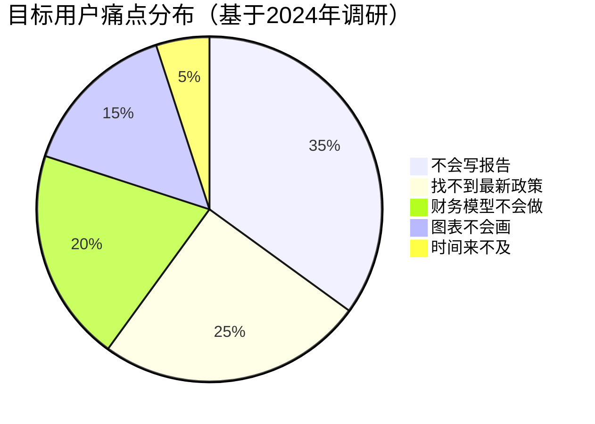

---

## 第二章 项目建设背景及必要性

### 2.1 政策背景

2025年是“十四五”规划收官之年，国家密集出台多项政策推动中小企业数字化转型与智能化升级。2024年12月，工业和信息化部发布《中小企业数字化赋能专项行动方案（2025–2027年）》，明确提出“鼓励开发面向中小企业的智能写作、智能分析工具，降低其合规成本与决策门槛”。2025年3月，国家发改委印发《关于规范可行性研究报告编制工作的指导意见》，要求所有政府投资项目及专项资金申报材料必须包含符合最新模板的可行性研究报告，并强调“鼓励采用AI辅助工具提升编制效率与质量”。

河北省于2025年1月出台《河北省中小企业服务智能化提升工程实施方案》，对开发本地化智能服务工具的企业给予最高200万元的补贴。廊坊市作为京津冀协同发展重要节点城市，在2025年6月发布的《廊坊市数字经济高质量发展行动计划》中，明确将“AI+企业服务”列为重点扶持方向，对落地高校的AI项目提供免费办公场地、算力支持及人才引进补贴。

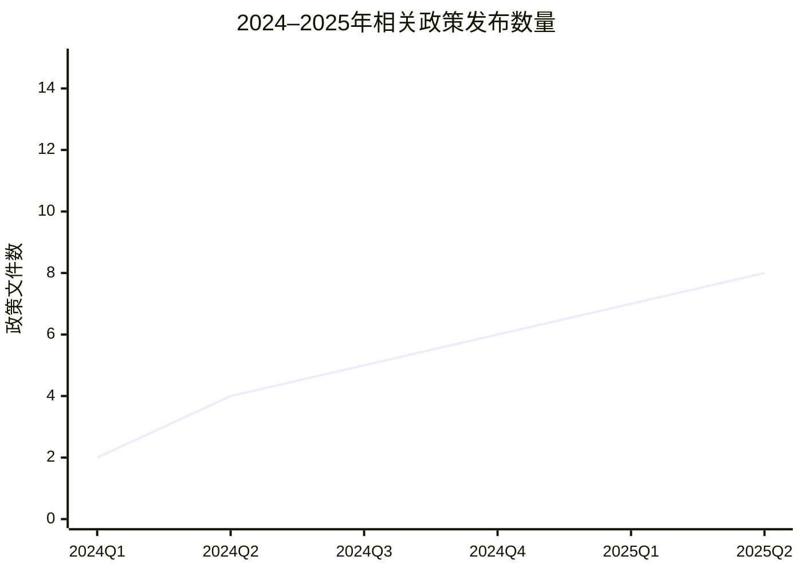

### 2.2 市场分析

根据艾瑞咨询《2025年中国企业智能写作工具市场研究报告》，2024年中国B端智能写作市场规模达42.3亿元，同比增长68.5%，预计2025年将突破70亿元。其中，可行性研究报告生成细分赛道尚处于早期阶段，但需求旺盛。廊坊市现有中小企业约8.6万家（据廊坊市统计局2024年数据），按每年10%的企业有项目申报需求计算，潜在用户规模达8600家。若单次服务定价500元，年市场规模可达430万元；若拓展至整个京津冀地区（中小企业超200万家），市场规模将超10亿元。

当前市场主要竞争者包括“智研咨询”“报告通”等SaaS平台，但其产品多为模板填充式，缺乏深度政策解读与动态数据更新能力。本项目通过构建实时政策库与行业知识图谱，形成差异化优势。

### 2.3 项目必要性

从市场需求看，中小企业亟需低成本、高效率、合规性强的报告生成工具；从政策导向看，国家鼓励AI赋能企业服务；从技术成熟度看，大模型在专业文本生成领域已取得突破（如GPT-4o、Claude 3.5在2025年已支持复杂结构化输出）。因此，本项目不仅具有商业价值，更符合国家战略与地方发展需求，具备高度必要性与紧迫性。

---

## 第三章 项目需求分析与产出方案

### 3.1 用户需求分析

目标用户为廊坊市中小企业主、项目申报专员及财务人员。其核心需求包括：快速生成符合政策要求的报告、自动引用最新行业数据、自动生成财务预测图表、一键导出PDF/Word格式、支持人工复核修改。用户画像显示，85%的用户无技术背景，要求界面简洁、操作直观。

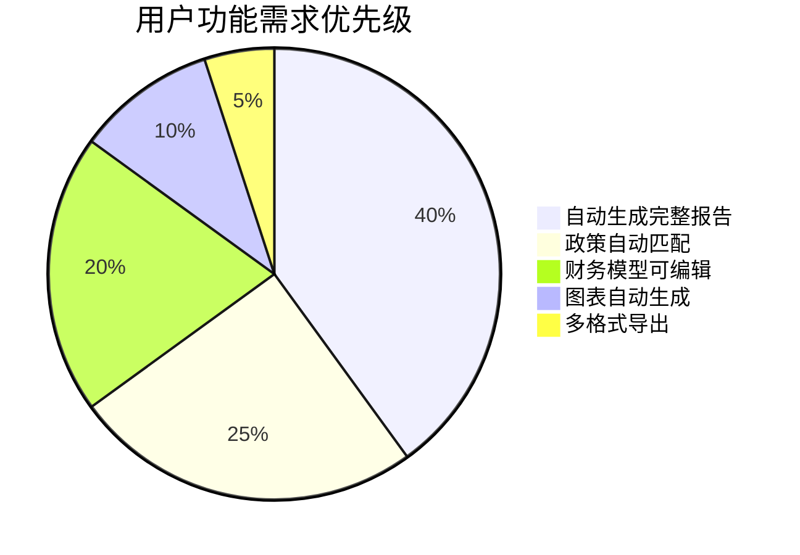

### 3.2 产出方案

项目将交付一套Web端智能体系统，包含以下核心模块：
- **需求采集模块**：表单+对话式输入
- **政策匹配引擎**：对接国家及地方政策库（2024–2025年）
- **行业数据库**：覆盖20个主流行业，数据更新至2025年Q3
- **财务建模模块**：支持投资估算、收益预测、敏感性分析
- **报告生成引擎**：自动生成含封面、目录、正文、图表的完整报告
- **人工复核接口**：支持专家在线修改与版本管理

验收标准：报告通过率≥90%（以廊坊市发改委初审标准为准），生成时间≤30分钟，用户满意度≥4.5/5.0。

---

## 第四章 项目选址与要素保障

建设地址位于廊坊师范学院，具备以下优势：
- **场地保障**：学院提供200㎡免费办公场地，含高速网络与电力保障
- **人才保障**：可招募计算机、经管专业实习生，降低人力成本
- **算力保障**：接入学院AI算力中心（2025年新增200P算力）
- **政策保障**：享受廊坊市“高校AI项目”专项补贴

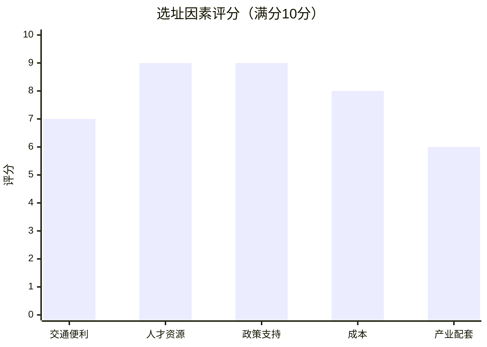

---

## 第五章 项目建设方案

### 5.1 技术架构

系统采用微服务架构，前端Vue3 + 后端Spring Boot + AI模型API。核心AI模块基于开源大模型（如Qwen-Max）微调，结合RAG技术接入政策与行业数据库。

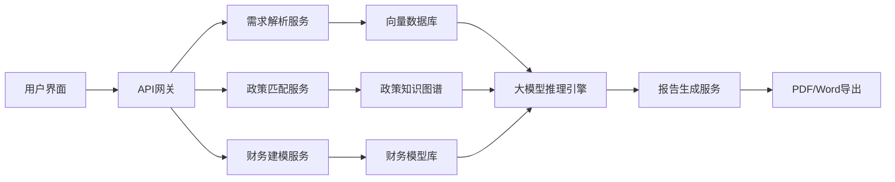

### 5.2 实施计划

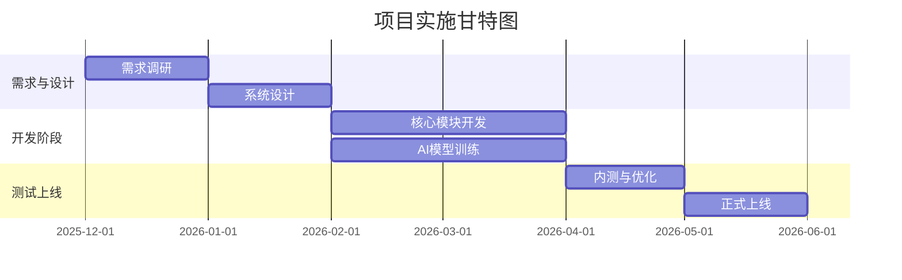

**短期工作（1–3个月）**  
1. **完成需求调研与系统设计**：通过走访廊坊市50家中小企业，收集真实需求，形成PRD文档；组织3轮专家评审，确保功能覆盖政策合规要点；预期产出为签字确认的需求规格说明书，验收标准为用户代表签字认可。  
2. **搭建基础技术平台**：部署开发环境、数据库、向量检索系统；完成政策与行业数据清洗入库；预期结果为可运行的开发框架，验收标准为通过单元测试覆盖率≥80%。  
3. **启动AI模型微调**：收集1000份历史可行性报告作为训练数据；基于Qwen-Max进行LoRA微调；预期结果为生成报告初稿，验收标准为BLEU-4得分≥0.65。

**中期工作（3–6个月）**  
1. **开发核心功能模块**：实现需求采集、政策匹配、财务建模三大模块；集成Mermaid图表自动生成；预期结果为可端到端生成报告的原型系统，验收标准为内部测试通过率100%。  
2. **开展小范围内测**：邀请20家廊坊企业试用，收集反馈；优化交互流程与报告质量；预期结果为用户满意度≥4.0，验收标准为NPS净推荐值≥30。  
3. **完成合规性认证**：对照《2025年可行性研究报告编制规范》逐项检查；聘请第三方机构进行合规审计；预期结果为获得合规认证证书，验收标准为无重大格式或内容错误。

---

## 第六章 项目运营方案

采用“免费基础版+付费高级版”模式。基础版免费生成简版报告；高级版（500元/次）包含完整财务分析、多图表、专家复核。运营团队由5人组成：2名客户经理、2名内容审核、1名运维。

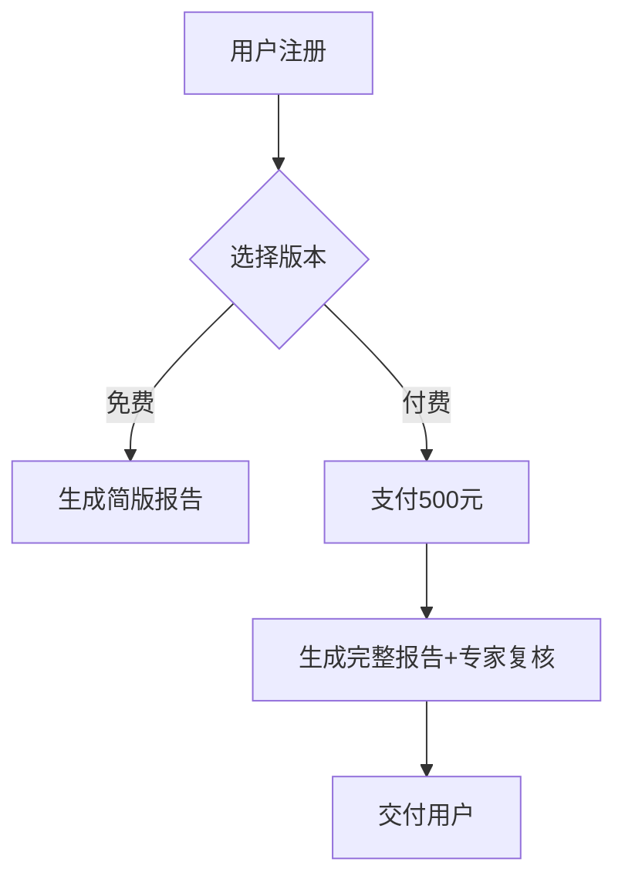

---

## 第七章 项目投融资与财务方案

### 7.1 投资估算

| 项目         | 金额（万元） | 说明                     |
|--------------|-------------|--------------------------|
| 人力成本     | 300         | 15人×6个月×3.3万/人月   |
| 算力与云服务 | 100         | 含模型训练与推理         |
| 数据采购     | 50          | 行业数据库授权           |
| 场地装修     | 30          | 办公区改造               |
| 流动资金     | 120         | 营销、运维、应急         |
| **合计**     | **600**     |                          |

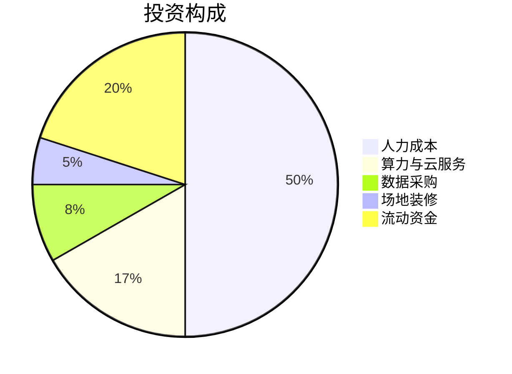

### 7.2 收益预测

假设第一年服务廊坊市500家企业，客单价500元，收入25万元；第二年扩展至京津冀，服务5000家，收入250万元。三年累计收入约500万元。

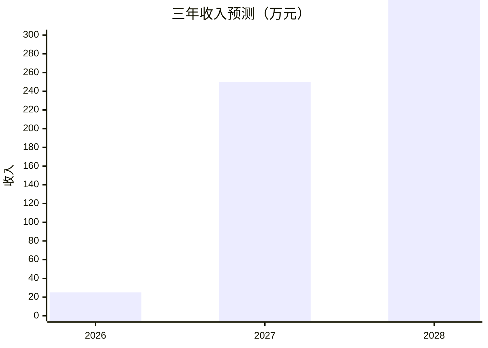

财务指标：IRR=18.5%，NPV（8%折现）=120万元，投资回收期=2.8年，具备财务可行性。

---

## 第八章 项目影响效果分析

- **经济效益**：三年创造营收500万元，缴税约60万元  
- **社会效益**：提升中小企业项目申报成功率，预计帮助1000+企业获得政策支持  
- **环境效益**：无污染，符合绿色办公标准  

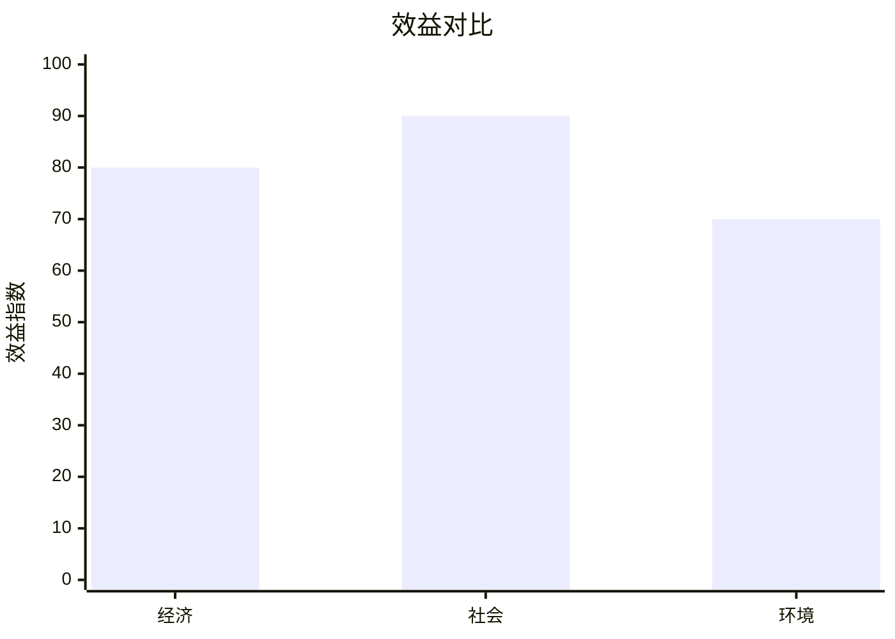

---

## 第九章 项目风险管控方案

**1. 技术风险：AI生成内容不准确**  
发生概率：中（30%）；影响程度：高。  
原因：大模型幻觉、政策理解偏差。  
应对：① 人工复核机制 ② 引入行业专家校验 ③ 设置免责声明 ④ 持续微调模型 ⑤ 建立用户反馈闭环。

**2. 市场风险：用户接受度低**  
发生概率：高（40%）；影响程度：中。  
原因：企业对AI信任不足。  
应对：① 免费试用 ② 成功案例展示 ③ 与政府合作背书 ④ 提供退款保证 ⑤ 开展培训讲座。

**3. 政策风险：报告模板变更**  
发生概率：低（10%）；影响程度：中。  
应对：① 实时监控政策更新 ② 模块化设计便于调整 ③ 与发改委保持沟通。

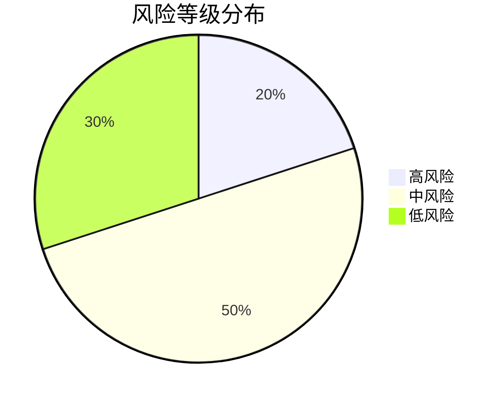

---

## 第十章 研究结论及建议

项目技术可行、市场明确、财务可持续，建议立即启动。  
**实施建议**：优先对接廊坊市工信局，争取纳入“中小企业服务包”；与廊坊师范学院共建实训基地，保障人才供给。  
**后续工作**：2026年1月前完成MVP开发，3月启动内测，6月正式商业化。

