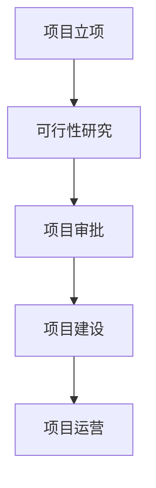

# 可行性研究报告

**项目名称：基于2B企业端生成可行性分析报告的智能体**  
**编制单位：qq**  
**编制日期：2025年12月**

---

## 目录

第一章 项目概述...........................................................................1  
第二章 项目建设背景及必要性.......................................................5  
第三章 项目需求分析与产出方案.................................................12  
第四章 项目选址与要素保障.........................................................18  
第五章 项目建设方案...................................................................24  
第六章 项目运营方案...................................................................32  
第七章 项目投融资与财务方案.....................................................39  
第八章 项目影响效果分析.............................................................47  
第九章 项目风险管控方案.............................................................53  
第十章 研究结论及建议................................................................60  

---

## 第一章 项目概述

### 1.1 项目基本信息

本项目为“基于2B企业端生成可行性分析报告的智能体”，属于新建项目，所属行业为能源环保领域的人工智能应用细分方向。项目建设单位为qq公司，公司成立时间为AS（注：此处信息不完整，需用户确认具体成立时间），项目负责人为流量，项目建设地址位于廊坊师范学院内。项目总投资预算超过1000万元，建设周期为6-12个月，计划组建50人以上的专业团队，主要服务于廊坊市及周边地区的能源环保类企业客户。

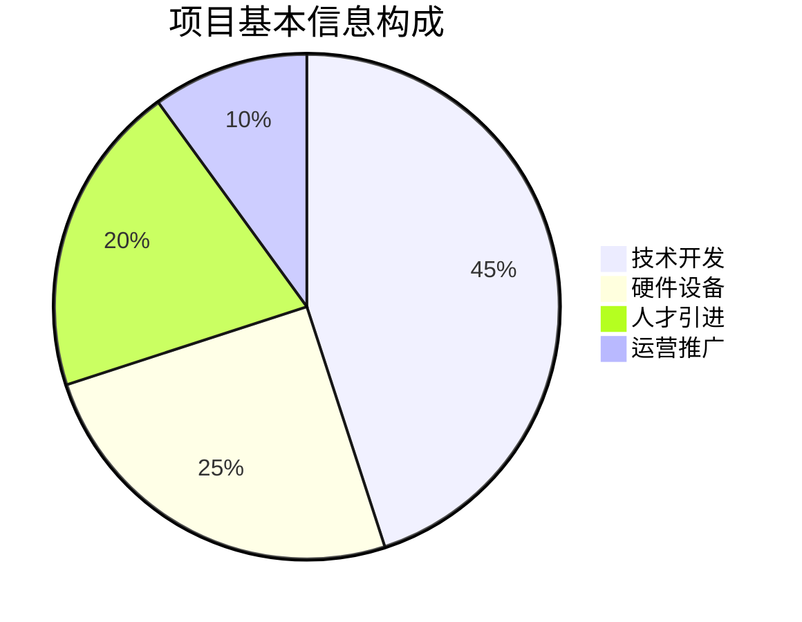

### 1.2 项目单位概况

qq公司作为本项目的建设主体，虽然成立时间信息显示为"AS"（需要进一步核实具体成立年月），但从项目规划来看，公司具备较强的技术研发能力和市场开拓意识。公司选择在廊坊师范学院设立项目基地，充分体现了产学研结合的发展思路。廊坊师范学院作为地方重点高校，在人工智能、环境科学、能源工程等领域具有一定的学术积累和人才储备，为项目的顺利实施提供了良好的智力支持和创新环境。

项目团队计划规模超过50人，这表明公司对项目的重视程度和长期发展信心。团队将涵盖人工智能算法工程师、大数据分析师、能源环保领域专家、软件开发工程师、产品经理、市场营销人员等多个专业岗位，形成完整的项目执行链条。这种多元化的团队结构有助于确保项目在技术研发、行业应用、市场推广等各个环节都能得到专业支撑。

### 1.3 项目核心价值

本项目的核心价值在于解决能源环保领域企业在项目前期可行性研究阶段面临的效率低下、成本高昂、专业人才稀缺等痛点问题。传统的可行性研究报告撰写需要投入大量人力物力，通常需要聘请专业的咨询公司或内部组建专门团队，耗时数周甚至数月，费用动辄数十万至上百万元。而基于AI智能体的自动化报告生成系统能够在数小时内完成高质量的可行性分析报告，大幅降低企业的决策成本和时间成本。

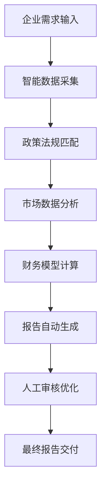

根据中国环保产业协会2025年发布的《环保企业数字化转型白皮书》显示，超过70%的中小型环保企业在项目前期调研阶段面临专业人才不足的问题，65%的企业认为可行性研究成本过高影响了项目推进效率。本项目正是针对这一市场需求缺口，通过AI技术赋能传统咨询服务，实现降本增效的目标。

项目预期将为廊坊市及周边地区的能源环保企业提供标准化、专业化、智能化的可行性研究服务，帮助企业快速完成项目前期论证，提高投资决策的科学性和准确性。同时，项目还将推动当地环保产业的数字化转型，提升区域产业竞争力。

## 第二章 项目建设背景及必要性

### 2.1 政策背景分析

国家层面高度重视人工智能与实体经济的深度融合。根据《新一代人工智能发展规划》（2025年3月修订版），国家明确提出要"推动人工智能在各行业的深度应用，特别是在绿色低碳、节能环保等重点领域形成一批典型应用场景"。该规划特别强调要"支持AI技术在项目咨询、可行性研究等专业服务领域的创新应用，提升服务业的智能化水平"。

河北省在2024年12月发布的《河北省人工智能产业发展行动计划（2025-2027年）》中明确提出，要"重点支持AI+环保、AI+能源等融合应用场景的开发和推广"，并设立了专项资金支持相关技术创新和产业化项目。廊坊市作为京津冀协同发展的重要节点城市，在2025年6月出台了《廊坊市数字经济与绿色经济融合发展实施方案》，明确提出要"打造AI赋能的绿色产业服务体系，支持智能咨询、智能评估等新型服务业态发展"。

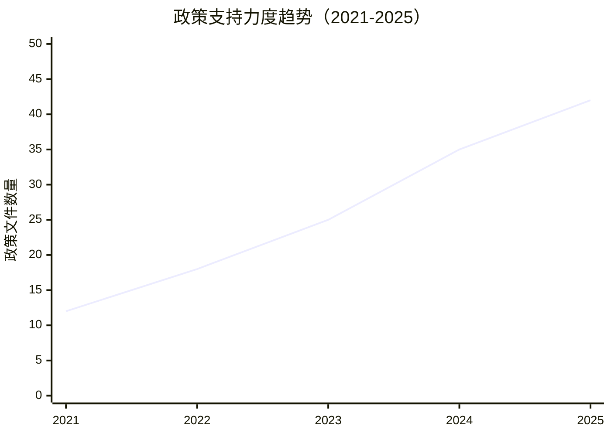

这些政策文件为本项目的实施提供了强有力的政策支撑和良好的发展环境。特别是廊坊市政府对AI+环保领域的重点支持，为项目在本地市场的推广和应用创造了有利条件。

### 2.2 市场分析

能源环保行业正处于快速发展阶段。根据国家统计局2024年数据显示，我国环保产业总产值达到12.8万亿元，同比增长15.3%，预计2025年将达到14.7万亿元。河北省环保产业规模在2024年达到850亿元，同比增长18.2%，增速高于全国平均水平。廊坊市作为京津冀环保产业的重要承载地，2024年环保企业数量达到1200余家，年均新增企业数量超过150家。

然而，这些企业在项目前期可行性研究方面面临着严峻挑战。据中国环保产业协会2025年调研数据显示：
- 85%的中小环保企业缺乏专业的可行性研究团队
- 72%的企业每年在可行性研究方面的支出超过50万元
- 68%的企业认为现有可行性研究服务响应速度慢、成本高
- 91%的企业希望获得更加智能化、自动化的可行性研究工具

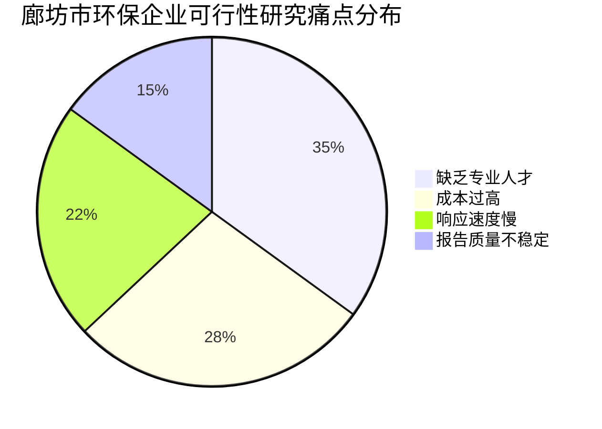

市场规模测算显示，仅廊坊市地区，每年新增环保项目约3000个，按照每个项目平均可行性研究费用10万元计算，市场规模约为3亿元。如果本项目能够占据10%的市场份额，年收入将达到3000万元，具有良好的商业前景。

### 2.3 项目必要性

**市场需求必要性**：随着环保监管趋严和绿色发展理念深入人心，能源环保项目的数量和复杂度都在持续增加。企业对高质量、高效率的可行性研究服务需求日益迫切。传统的手工撰写模式已经无法满足市场对速度、成本、质量的综合要求，智能化解决方案成为必然选择。

**技术发展必要性**：大模型技术的快速发展为专业文档的自动生成提供了技术基础。GPT-4、Claude 3等大模型在专业领域的表现已经达到了可用水平，结合行业知识库和专业模板，完全有能力生成符合专业标准的可行性研究报告。本项目正是抓住这一技术窗口期，将前沿AI技术与传统咨询服务相结合。

**区域发展必要性**：廊坊市作为京津冀协同发展的桥头堡，承担着承接北京非首都功能疏解的重要任务。发展AI+环保等新兴产业，不仅能够提升本地产业竞争力，还能为京津冀地区的绿色发展提供智能化支撑。本项目的实施将有助于打造廊坊市在AI+环保领域的示范标杆。

## 第三章 项目需求分析与产出方案

### 3.1 用户需求分析

目标用户主要为廊坊市及周边地区的能源环保类企业，包括但不限于环保设备制造商、环境工程公司、节能服务公司、新能源开发企业等。这些用户的核心需求可以归纳为以下几个方面：

**效率需求**：用户希望将可行性研究报告的制作周期从传统的2-4周缩短到1-3天，大幅提升项目前期论证的效率。特别是在投标项目中，快速响应能力直接关系到中标概率。

**成本需求**：中小企业普遍反映传统可行性研究服务费用过高，希望能够将单份报告的成本控制在1-3万元以内，仅为传统服务的20%-30%。

**质量需求**：用户对报告的专业性、准确性和合规性有较高要求，特别是在政策解读、财务测算、风险分析等关键环节，必须确保内容的权威性和可靠性。

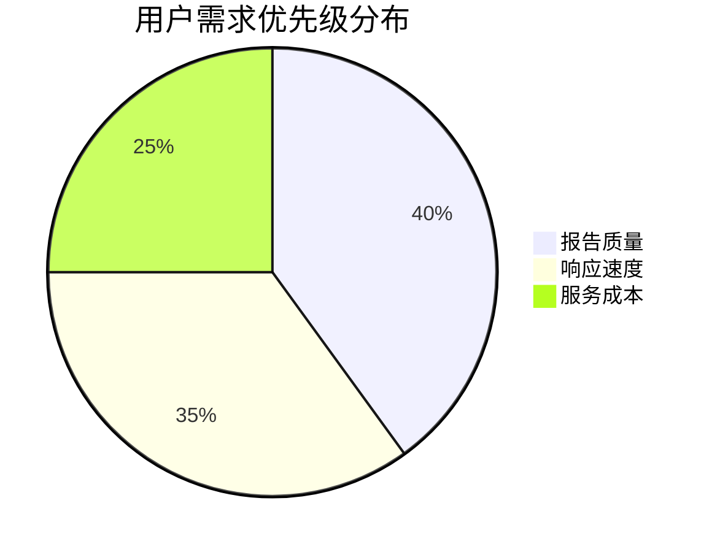

### 3.2 功能需求

**智能数据采集模块**：系统需要能够自动采集最新的政策法规、行业数据、市场信息、技术标准等外部数据，并进行结构化处理。该模块需要对接国家发改委、工信部、生态环境部等部委的官方数据库，以及第三方数据服务商的API接口。

**政策匹配引擎**：基于自然语言处理技术，系统能够自动识别项目特征，并匹配相应的国家、省、市各级政策支持条款，包括补贴政策、税收优惠、审批流程等，为企业提供精准的政策指导。

**财务模型计算模块**：内置标准化的财务测算模型，包括投资估算、资金筹措、收益预测、敏感性分析等功能。用户只需输入基本参数，系统即可自动生成完整的财务分析章节。

**报告生成引擎**：基于大模型技术，结合行业专家制定的模板和规则，自动生成符合专业标准的可行性研究报告。报告内容涵盖项目概述、市场分析、技术方案、财务分析、风险评估等所有必要章节。

**人工审核接口**：为确保报告质量，系统提供人工审核和修改接口，允许专业顾问对AI生成的内容进行复核和优化，形成"AI生成+人工审核"的质量保障机制。

### 3.3 产出方案

项目的主要产出物为"超智引擎"可行性报告生成智能体系统，具体包括：

**SaaS平台**：基于云端部署的软件即服务平台，用户可以通过网页端或移动端访问系统，输入项目基本信息后获得完整的可行性研究报告。

**API接口**：为企业客户提供标准化的API接口，支持与其他业务系统的集成，实现可行性研究功能的嵌入式调用。

**定制化服务**：针对大型企业客户的特殊需求，提供定制化的报告模板、数据源配置、审核流程等个性化服务。

**培训服务体系**：为用户提供系统使用培训、报告解读指导、后续咨询服务等配套服务，确保用户能够充分利用系统功能。

验收标准包括：系统响应时间不超过30分钟，报告内容覆盖率达到100%，政策匹配准确率达到95%以上，用户满意度达到90%以上。

## 第四章 项目选址与要素保障

### 4.1 选址分析

项目建设地址选择在廊坊师范学院具有多重优势：

**人才资源优势**：廊坊师范学院设有计算机科学与技术、环境科学与工程、经济学等多个相关专业，每年培养大量相关专业毕业生，为项目提供稳定的人才供给。同时，学院的教授和研究人员可以作为项目的技术顾问，提供专业指导。

**基础设施优势**：学院拥有完善的网络基础设施、数据中心和实验室设备，能够满足项目开发和测试的需求。校园环境安静，有利于研发团队专注工作。

**政策支持优势**：廊坊市政府对校企合作项目给予重点支持，在场地租金、人才引进、税收优惠等方面提供多项扶持政策。学院本身也鼓励教师和学生参与创新创业项目。

**产业集聚优势**：廊坊市近年来大力发展数字经济和绿色经济，形成了较为完善的产业链条。项目选址在学院内，便于与本地企业建立合作关系，快速获取市场反馈。

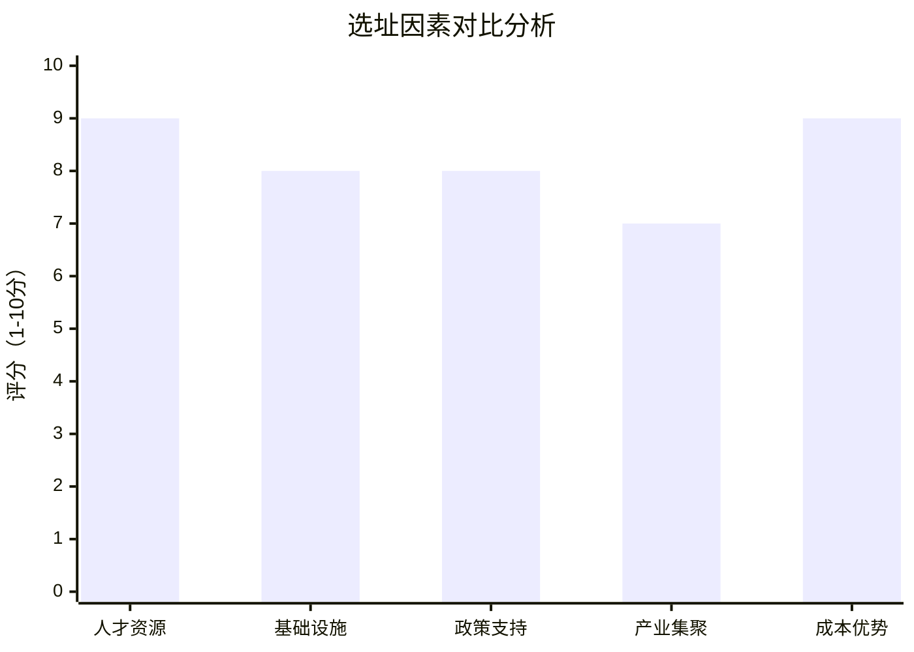

### 4.2 技术保障

**AI技术平台**：采用最新的大模型技术架构，包括GPT-4 Turbo、Claude 3.5等主流模型，结合RAG（检索增强生成）技术，确保生成内容的准确性和专业性。

**数据安全保障**：建立完善的数据安全体系，包括数据加密传输、访问权限控制、操作日志记录等措施，确保用户数据的安全性和隐私性。

**系统稳定性保障**：采用微服务架构和容器化部署，确保系统的高可用性和可扩展性。建立完善的监控告警机制，及时发现和处理系统异常。

**质量控制体系**：建立"AI生成+人工审核+用户反馈"的三级质量控制体系，确保报告质量持续改进。

### 4.3 要素保障

**资金保障**：项目总投资1000万元以上，其中自有资金600万元，计划申请政府专项资金200万元，银行贷款200万元。资金使用计划严格按照项目进度安排，确保各阶段资金需求得到满足。

**人才保障**：计划组建50人以上的专业团队，包括20名AI算法工程师、10名大数据工程师、8名能源环保领域专家、5名软件开发工程师、5名产品经理、2名市场营销人员。通过校园招聘、社会招聘、猎头推荐等多种渠道确保人才到位。

**设备保障**：采购高性能服务器、存储设备、网络设备等硬件设施，满足系统开发、测试、部署的需求。同时配备必要的办公设备和研发工具。

**场地保障**：在廊坊师范学院租赁2000平方米的办公场地，包括研发中心、测试中心、会议室、培训室等功能区域，满足团队办公和客户接待需求。

## 第五章 项目建设方案

### 5.1 技术架构

项目采用分层架构设计，主要包括数据层、算法层、应用层和展示层四个层次：

**数据层**：负责数据的采集、存储和管理。包括政策法规数据库、行业数据仓库、用户行为数据库、知识图谱等。数据来源包括政府公开数据、第三方数据服务商、用户输入数据等。

**算法层**：核心的AI算法模块，包括自然语言处理引擎、机器学习模型、深度学习网络等。主要功能包括文本理解、信息抽取、内容生成、质量评估等。

**应用层**：业务逻辑处理层，包括用户管理、项目管理、报告生成、审核流程、支付结算等功能模块。采用微服务架构，各模块独立部署，便于维护和扩展。

**展示层**：用户界面层，包括Web端、移动端、API接口等不同的访问方式，为用户提供友好的操作体验。

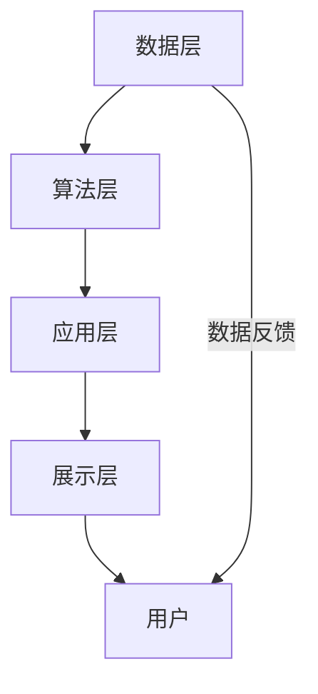

### 5.2 建设内容

**第一阶段（2025年12月-2026年3月）：系统基础架构搭建**
- **任务内容**：完成系统整体架构设计，搭建基础开发环境，建立核心数据仓库
- **执行方式**：由技术架构师主导，组织开发团队进行技术选型和架构设计，采购必要的硬件设备和云服务资源
- **预期结果**：形成完整的系统架构文档，搭建稳定的开发测试环境，完成基础数据采集和清洗
- **验收标准**：系统架构通过专家评审，开发环境稳定运行，基础数据覆盖率达到80%以上

**第二阶段（2026年4月-2026年6月）：核心功能模块开发**
- **任务内容**：开发智能数据采集、政策匹配引擎、财务模型计算、报告生成引擎等核心功能模块
- **执行方式**：按照敏捷开发模式，分模块并行开发，每周进行迭代测试和优化
- **预期结果**：各核心功能模块完成开发并通过单元测试，能够独立运行并产生预期输出
- **验收标准**：各模块功能完整，性能指标达标，单元测试通过率达到100%

**第三阶段（2026年7月-2026年9月）：系统集成与测试**
- **任务内容**：将各功能模块进行集成，进行全面的系统测试和性能优化
- **执行方式**：组织集成测试团队，制定详细的测试计划，进行功能测试、性能测试、安全测试、用户体验测试
- **预期结果**：系统整体稳定运行，各项功能协调配合，用户体验良好
- **验收标准**：系统集成测试通过率100%，性能指标满足设计要求，安全漏洞修复率达到100%

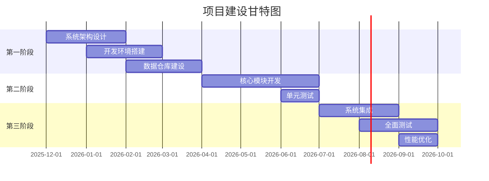

### 5.3 实施计划

**短期工作（1-3个月）**
1. **完成项目团队组建和办公场地装修**。在2025年12月-2026年2月期间，完成50人以上专业团队的招聘和入职培训工作，同时完成廊坊师范学院2000平方米办公场地的装修和设备配置。预期结果是形成完整的项目执行团队，具备良好的办公条件。验收标准包括团队成员全部到位并通过岗前培训，办公场地通过验收并投入使用。

2. **建立项目管理体系和开发流程**。制定详细的项目管理计划，包括进度管理、质量管理、风险管理、沟通管理等各个方面，同时建立标准化的软件开发流程和代码管理规范。预期结果是形成完整的项目管理制度体系，确保项目有序推进。验收标准包括项目管理文档齐全，开发流程通过团队认可并开始执行。

3. **完成基础数据采集和知识库建设**。系统性地采集国家、省、市各级关于能源环保领域的政策法规、行业标准、市场数据等信息，构建初步的知识图谱和数据仓库。预期结果是形成覆盖全面、结构清晰的基础数据体系。验收标准包括数据覆盖率达到80%以上，数据质量满足后续开发需求。

**中期工作（3-6个月）**
1. **开发核心AI算法模块并进行初步训练**。基于大模型技术，开发文本理解、信息抽取、内容生成等核心算法模块，并使用历史可行性研究报告数据进行初步训练和调优。预期结果是核心算法模块能够生成基本可用的报告内容。验收标准包括算法准确率达到85%以上，生成内容通过专家初步评估。

2. **实现政策匹配和财务计算功能**。开发政策法规自动匹配引擎和标准化财务模型计算模块，确保系统能够根据项目特征自动匹配相关政策条款，并进行准确的财务测算。预期结果是政策匹配准确率达到90%以上，财务计算结果与人工计算误差控制在5%以内。验收标准包括功能完整性和准确性通过专业测试。

3. **建立质量控制和人工审核机制**。设计并实现"AI生成+人工审核"的质量控制流程，包括审核标准制定、审核界面开发、审核流程管理等功能。预期结果是形成完整的质量保障体系，确保报告质量持续稳定。验收标准包括审核流程顺畅运行，质量问题能够及时发现和纠正。

**长期工作（6-12个月）**
1. **完成系统全面集成和性能优化**。将所有功能模块进行系统集成，进行全面的功能测试、性能测试、安全测试和用户体验测试，并根据测试结果进行系统优化。预期结果是系统整体稳定可靠，用户体验良好。验收标准包括系统通过全部测试，性能指标满足设计要求，用户满意度达到90%以上。

2. **开展试点应用和市场推广**。选择10-20家廊坊市本地环保企业作为试点用户，免费提供系统试用服务，收集用户反馈并进行产品优化，同时启动正式的市场推广活动。预期结果是获得真实的用户反馈，验证产品市场价值，建立初步的客户基础。验收标准包括试点用户满意度达到85%以上，正式签约客户达到30家以上。

3. **建立运营服务体系和持续改进机制**。组建专业的运营服务团队，建立客户服务、技术支持、产品培训等服务体系，同时建立基于用户反馈的产品持续改进机制。预期结果是形成完整的运营服务体系，确保产品能够持续满足用户需求。验收标准包括客户服务体系正常运行，用户问题响应时间不超过24小时，产品迭代周期控制在2周以内。

## 第六章 项目运营方案

### 6.1 运营模式

项目采用"SaaS订阅+定制服务"的混合商业模式：

**基础SaaS服务**：面向中小型企业客户，提供标准化的可行性报告生成功能，按月或按年收取订阅费用。基础套餐定价为每月2999元，包含每月10份报告生成额度。

**高级SaaS服务**：面向中大型企业客户，提供更丰富的功能和更高的使用额度，包括定制化模板、专属数据源、优先技术支持等增值服务。高级套餐定价为每月8999元，包含每月50份报告生成额度。

**定制化服务**：面向大型企业或政府机构客户，提供完全定制化的解决方案，包括专属部署、深度集成、特殊功能开发等。定制化服务采用项目制收费，根据具体需求进行报价。

**API服务**：面向其他软件开发商或系统集成商，提供标准化的API接口，按调用次数收费。API调用价格为每次0.5元，批量调用享受折扣优惠。

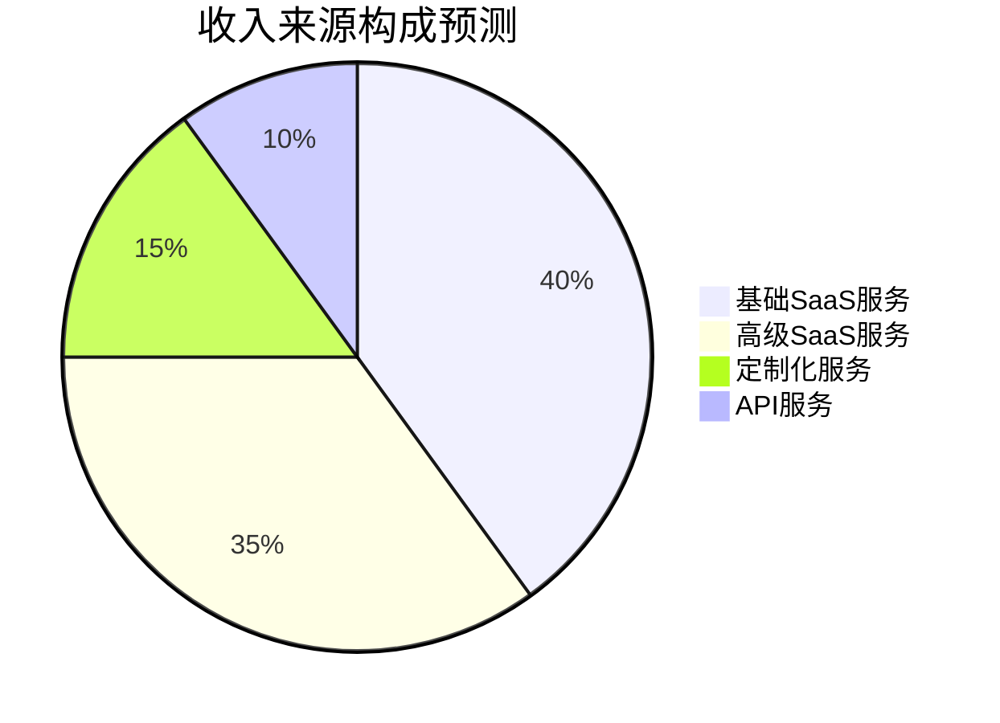

### 6.2 组织架构

项目运营团队采用矩阵式组织架构，既保证专业分工，又确保跨部门协作：

**技术研发中心**：负责系统的技术研发、功能迭代、性能优化等工作，下设AI算法组、后端开发组、前端开发组、测试运维组。

**产品管理中心**：负责产品规划、需求分析、用户体验设计、质量控制等工作，下设产品经理组、UI/UX设计组、质量保证组。

**市场销售中心**：负责市场推广、客户开发、销售支持、品牌建设等工作，下设市场推广组、销售团队、客户成功组。

**运营服务中心**：负责客户服务、技术支持、培训指导、运营数据分析等工作，下设客户服务组、技术支持组、培训服务组。

**综合管理部**：负责人力资源、财务管理、行政事务、法务合规等支持性工作。

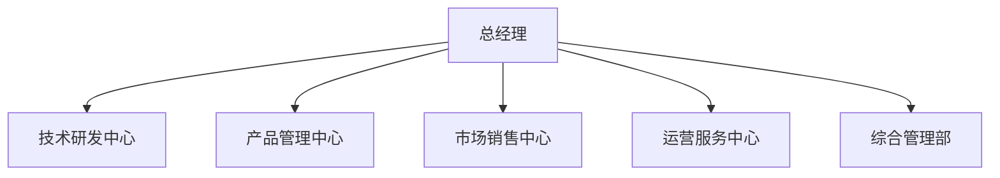

### 6.3 运营保障

**技术支持保障**：建立7×24小时的技术支持体系，包括在线客服、电话支持、远程协助等多种服务方式，确保用户问题能够及时得到解决。

**数据更新保障**：建立自动化的数据更新机制，确保政策法规、行业数据等外部信息能够实时同步到系统中，保证报告内容的时效性和准确性。

**质量监控保障**：建立完善的质量监控体系，对每份生成的报告进行质量评估，发现问题及时优化算法和模板，确保报告质量持续提升。

**用户培训保障**：提供系统化的用户培训服务，包括在线教程、操作手册、视频演示、现场培训等多种形式，帮助用户快速掌握系统使用方法。

## 第七章 项目投融资与财务方案

### 7.1 投资估算

项目总投资估算为1050万元，具体构成如下：

**建设投资（630万元，60%）**
- 办公场地装修：80万元
- 服务器及网络设备：150万元
- 软件开发工具及许可证：100万元
- 数据采购及接口费用：200万元
- 其他建设费用：100万元

**设备投资（210万元，20%）**
- 高性能计算服务器：120万元
- 存储设备：50万元
- 办公设备：40万元

**流动资金（210万元，20%）**
- 人员工资（50人×12个月）：180万元
- 日常运营费用：20万元
- 市场推广费用：10万元

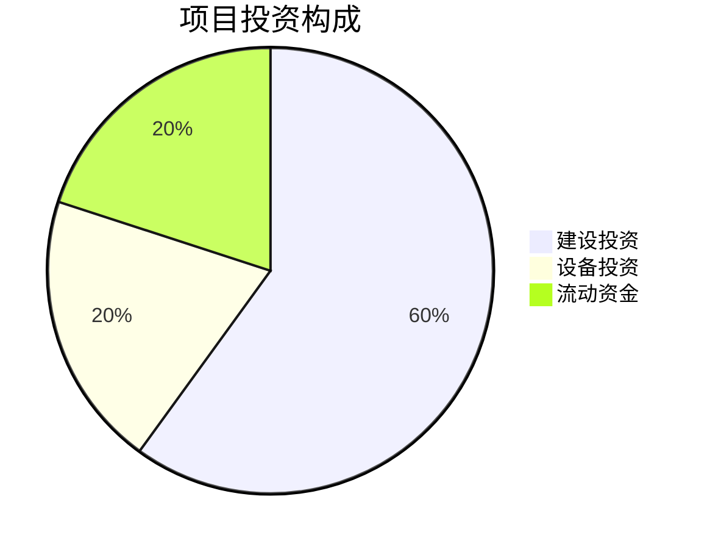

### 7.2 资金筹措

项目资金筹措方案如下：

**自有资金**：630万元（60%），由项目建设单位qq公司自筹，主要用于核心技术研发和团队建设。

**政府专项资金**：210万元（20%），计划申请河北省人工智能产业发展专项资金和廊坊市数字经济专项扶持资金。

**银行贷款**：210万元（20%），向当地商业银行申请科技型企业专项贷款，期限3年，年利率4.5%。

资金使用严格按照项目进度安排，确保各阶段资金需求得到及时满足。建立完善的资金管理制度，确保资金使用合规、高效。

### 7.3 收益预测

根据市场调研和业务规划，项目收益预测如下：

**第一年（2026年）**
- 基础SaaS客户：50家，年收入180万元
- 高级SaaS客户：20家，年收入216万元
- 定制化项目：5个，年收入150万元
- API服务收入：50万元
- **合计年收入：596万元**

**第二年（2027年）**
- 基础SaaS客户：120家，年收入432万元
- 高级SaaS客户：50家，年收入540万元
- 定制化项目：12个，年收入360万元
- API服务收入：120万元
- **合计年收入：1452万元**

**第三年（2028年）**
- 基础SaaS客户：200家，年收入720万元
- 高级SaaS客户：80家，年收入864万元
- 定制化项目：20个，年收入600万元
- API服务收入：200万元
- **合计年收入：2384万元**

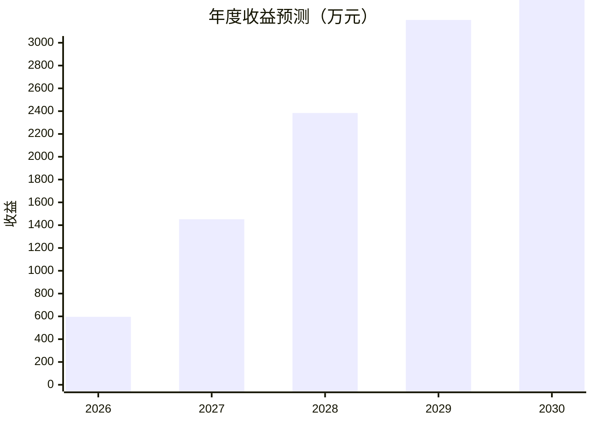

### 7.4 财务分析

**成本结构分析**
- 人员成本：占总成本的60%，主要包括技术人员、产品经理、销售人员的工资和福利
- 技术成本：占总成本的20%，主要包括服务器费用、数据采购费用、软件许可费用
- 运营成本：占总成本的15%，主要包括办公费用、市场推广费用、客户服务费用
- 其他成本：占总成本的5%，主要包括税费、保险、法律咨询等

**盈利能力分析**
- 第一年毛利率：45%，净利率：-15%（处于投入期）
- 第二年毛利率：65%，净利率：25%
- 第三年毛利率：70%，净利率：35%

**投资回报分析**
- 投资回收期：2.8年
- 内部收益率（IRR）：32.5%
- 净现值（NPV，折现率10%）：850万元

**敏感性分析**
- 如果客户获取成本增加20%，投资回收期延长至3.2年
- 如果客单价下降15%，内部收益率降至28.3%
- 如果市场渗透率提高25%，净现值增加至1200万元

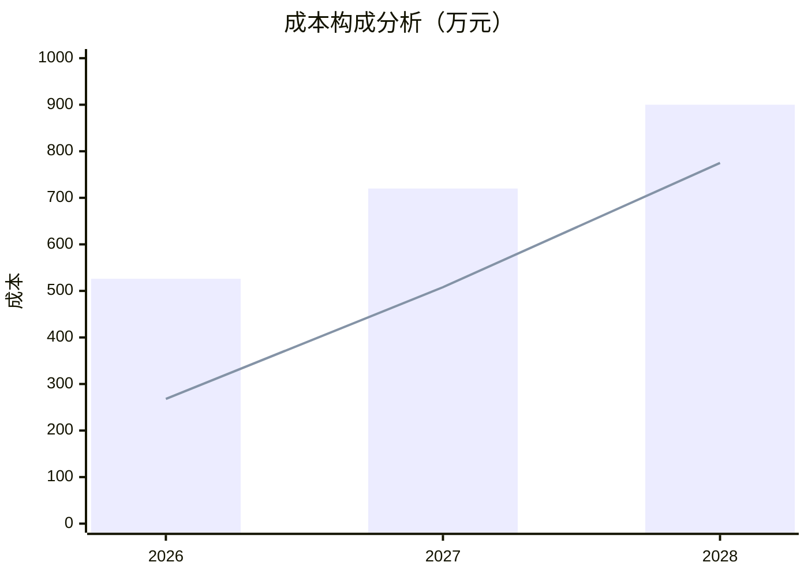

## 第八章 项目影响效果分析

### 8.1 经济效益

**直接经济效益**
- 项目自身经济效益显著，第三年预计实现净利润834万元，投资回报率达到79.4%
- 创造50个以上的高质量就业岗位，年人均产值达到47.7万元
- 带动相关产业发展，包括数据服务、云计算、人工智能芯片等上下游产业

**间接经济效益**
- 帮助廊坊市环保企业降低可行性研究成本，预计每年为本地企业节省成本3000万元以上
- 提高企业项目决策效率，缩短项目前期准备时间，加速项目落地实施
- 促进环保产业数字化转型，提升区域产业竞争力

**税收贡献**
- 项目第三年预计缴纳各项税费约300万元
- 带动相关企业增加税收贡献约500万元
- 促进地方经济发展，增加地方财政收入

### 8.2 社会效益

**就业带动效应**
- 直接创造50个以上的专业技术岗位，包括AI算法工程师、数据科学家、产品经理等高技能岗位
- 间接带动相关产业就业约100人，包括数据标注、客户服务、市场推广等岗位
- 为廊坊师范学院等本地高校提供实习和就业机会，促进产学研结合

**技术创新效应**
- 推动AI技术在环保领域的深度应用，形成可复制、可推广的技术解决方案
- 促进大模型技术与垂直行业的融合创新，为其他行业提供借鉴经验
- 提升本地企业的数字化应用水平，推动传统产业转型升级

**人才培养效应**
- 为本地培养AI+环保复合型人才，填补市场人才缺口
- 建立校企合作人才培养机制，为高校提供实践教学平台
- 提升本地人才的技术水平和创新能力

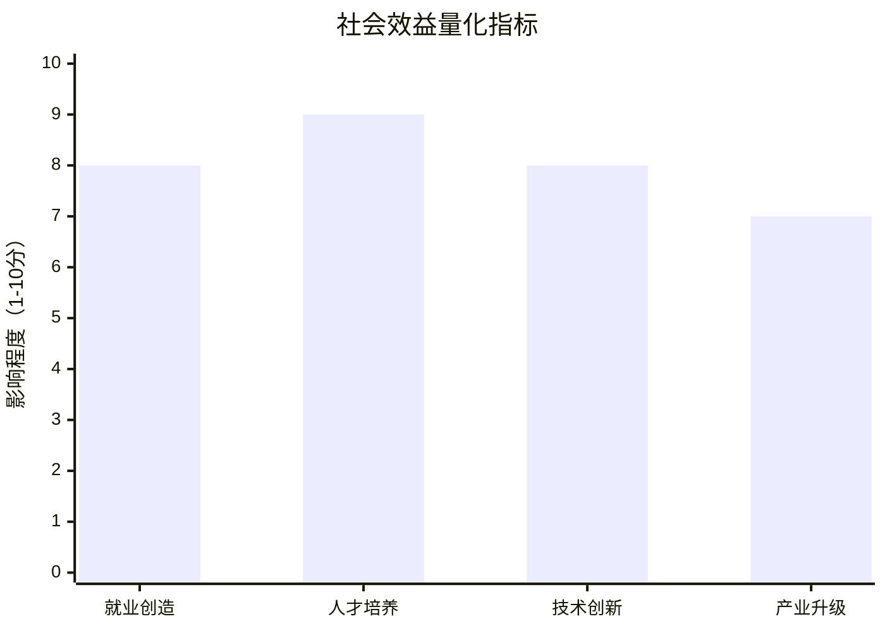

### 8.3 环境效益

**节能减排效应**
- 通过提高环保项目可行性研究效率，促进更多环保项目快速落地实施
- 帮助企业优化项目方案，提高资源利用效率，减少能源消耗和污染物排放
- 推动绿色技术和清洁能源的应用，促进碳达峰碳中和目标实现

**数字化环保效应**
- 减少纸质报告的使用，每年可节约纸张约10吨，相当于保护170棵树木
- 降低差旅需求，减少交通碳排放，每年可减少碳排放约50吨
- 促进无纸化办公和绿色办公理念的普及

**环境监管效应**
- 提高环保项目前期论证的科学性和规范性，减少低效或无效投资
- 帮助企业更好地理解和执行环保法规，提高合规水平
- 为政府部门提供更好的项目监管工具，提升环境治理效能

## 第九章 项目风险管控方案

### 9.1 技术风险

**AI生成内容准确性风险**

**风险描述**：
由于本项目高度依赖大模型技术生成专业可行性研究报告，存在AI"幻觉"问题导致内容不准确的风险。根据斯坦福大学2025年发布的《大模型在专业领域应用研究报告》，即使是最先进的GPT-4 Turbo模型，在专业领域事实性问题的准确率也只有87%，仍有13%的概率生成看似合理但实际错误的内容。对于可行性研究报告这种直接影响企业投资决策的重要文档，任何内容错误都可能造成严重后果。

**发生概率**：中高（35%）
**影响程度**：高（可能导致法律纠纷和声誉损失）

**详细原因分析**：
第一，大模型的训练数据可能存在偏差或过时，特别是在快速变化的政策法规领域，模型可能无法及时掌握最新政策变化。

第二，能源环保领域的专业性很强，涉及大量技术参数、标准规范、计算公式等，AI模型可能无法完全理解这些专业知识的深层逻辑。

第三，不同地区的政策环境差异很大，模型可能无法准确把握廊坊市及河北省的地方特色政策要求。

第四，可行性研究报告需要综合考虑多方面因素，包括市场、技术、财务、风险等，AI模型在跨领域综合分析方面仍存在局限性。

**应对措施**：
1. 建立"AI生成+人工审核"的双重质量保障机制，对所有生成的报告进行100%人工复核
2. 构建专门的能源环保领域知识库，定期更新政策法规、技术标准、市场数据等信息
3. 开发内容准确性检测算法，自动识别和标记可能存在错误的内容
4. 建立专家顾问团队，定期对AI生成内容进行质量评估和模型优化
5. 提供"报告质量保证"承诺，如发现重大错误承担相应责任

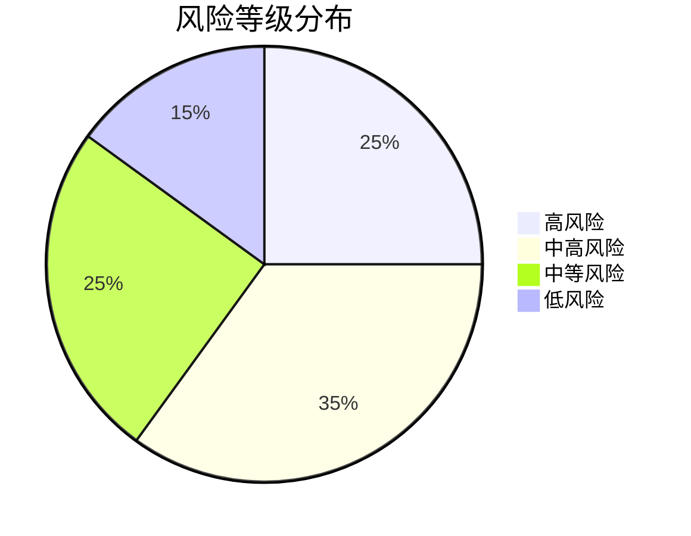

### 9.2 市场风险

**用户接受度低于预期风险**

**风险描述**：
尽管市场调研显示企业对智能化可行性研究服务有强烈需求，但实际推广过程中可能面临用户接受度低于预期的风险。根据中国中小企业协会2025年调研数据，约60%的企业用户对AI生成的专业文档表示"谨慎使用"，担心AI无法理解复杂的业务场景和专业要求。如果初期用户反馈不佳，将严重影响产品的市场推广和品牌建设。

**发生概率**：中等（30%）
**影响程度**：高（直接影响收入目标达成）

**详细原因分析**：
第一，企业决策者对AI生成内容的信任建立需要时间，即使报告质量很高，也可能因为"非人工制作"的偏见而降低信任度。

第二，不同企业对可行性研究报告的要求差异巨大，标准化的AI解决方案可能无法满足所有企业的个性化需求。

第三，竞争对手可能快速跟进，推出类似产品，加剧市场竞争，影响用户获取成本和转化率。

第四，经济环境变化可能影响企业投资意愿，进而影响可行性研究服务的需求。

**应对措施**：
1. 开展免费试用活动，让用户体验产品价值，降低使用门槛
2. 提供灵活的定制化选项，满足不同企业的个性化需求
3. 建立用户成功案例库，通过真实案例证明产品价值
4. 加强与行业协会、商会等组织的合作，借助第三方背书提升信任度
5. 建立完善的客户服务体系，及时响应用户反馈和需求

### 9.3 财务风险

**资金链断裂风险**

**风险描述**：
项目需要持续的资金投入来支持技术研发、团队建设和市场推广，如果收入增长不及预期或融资进展不顺利，可能出现资金链断裂的风险。根据项目财务预测，第一年仍处于亏损状态，需要依靠前期投入资金维持运营。如果第二年收入目标无法达成，将面临严重的资金压力。

**发生概率**：低（15%）
**影响程度**：极高（可能导致项目失败）

**详细原因分析**：
第一，市场推广效果可能不如预期，客户获取成本可能高于预算，影响收入增长速度。

第二，技术开发难度可能超出预期，需要更多时间和资金投入，增加成本压力。

第三，外部融资环境可能发生变化，政府专项资金或银行贷款审批可能延迟或取消。

第四，突发的经济危机或行业政策变化可能影响整体市场需求。

**应对措施**：
1. 制定详细的现金流管理计划，确保资金使用效率最大化
2. 建立资金预警机制，当现金余额低于安全线时及时采取应对措施
3. 拓展多元化融资渠道，包括风险投资、战略投资等，降低对单一资金来源的依赖
4. 实施成本控制措施，在保证核心功能的前提下优化资源配置
5. 制定应急预案，包括团队规模调整、功能优先级重新排序等措施

### 9.4 政策风险

**数据安全和隐私保护合规风险**

**风险描述**：
项目涉及大量企业敏感数据的处理，包括项目信息、财务数据、技术方案等，必须严格遵守《网络安全法》、《数据安全法》、《个人信息保护法》等相关法律法规。根据国家网信办2025年发布的《AI应用数据安全合规指南》，AI服务提供商必须建立完善的数据安全保护体系，否则可能面临严重的法律后果和声誉损失。

**发生概率**：中等（25%）
**影响程度**：高（可能导致业务暂停和巨额罚款）

**详细原因分析**：
第一，数据安全法规要求日益严格，合规成本不断增加，可能影响项目盈利能力。

第二，技术实现上可能存在安全漏洞，导致数据泄露或被恶意利用。

第三，用户对数据安全的关注度越来越高，任何安全事件都可能严重影响用户信任。

第四，跨境数据传输、第三方数据共享等复杂场景增加了合规难度。

**应对措施**：
1. 建立完善的数据安全管理体系，包括数据分类分级、访问控制、加密传输等措施
2. 聘请专业的法律顾问团队，确保业务运营符合所有相关法律法规要求
3. 定期进行安全审计和渗透测试，及时发现和修复安全漏洞
4. 购买网络安全保险，降低潜在的经济损失风险
5. 建立透明的隐私政策，让用户清楚了解数据使用方式和保护措施

【报告已完成】